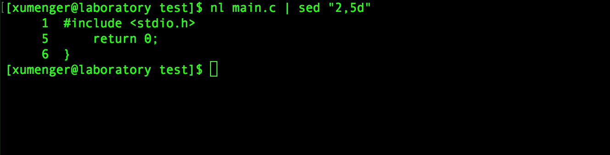

sed本身是一个管道命令，可以分析standard input，而且sed还有将数据进行替换、删除、新增、选取特定行的功能

`nl main.c | sed "2,5d"` 将main.c的内容输出并打印行号，同时将2~5行删除

结合重定向可以修改文件，比如`cat main.c | sed "2,5d" > main.new` 将对main.c删除2~5行后的结果输出到main.new文件中
