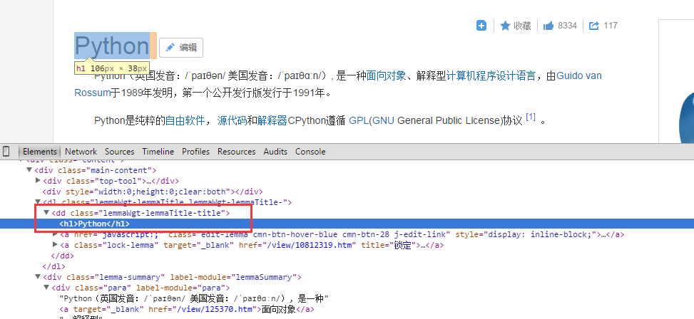
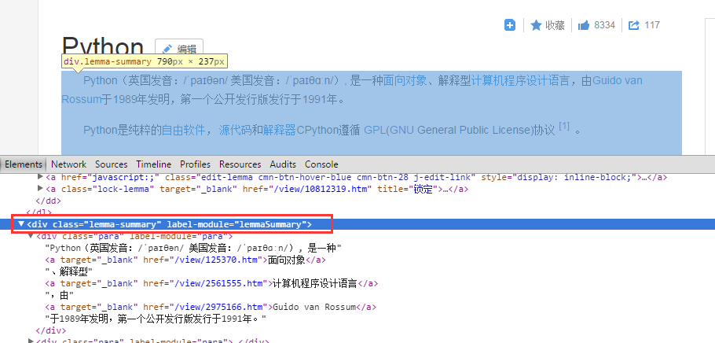
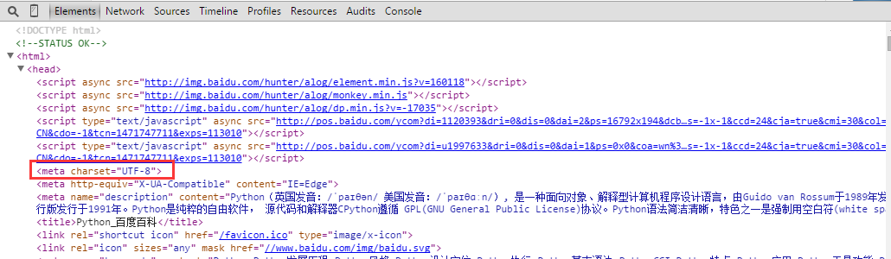

## 说明

* 对应参考[《Python开发简单爬虫》](http://www.imooc.com/learn/563)
* 之前整理过文章[《Python网络爬虫简单架构》](http://www.xumenger.com/python-spider-20160608/)
* 本次练习实现的目标是：抓取百度百科Python词条相关1000个页面的标题和简介数据

## 如何开发一个爬虫

* 首先确定抓取的目标，也就是确定抓取哪些网站的哪些网页的哪部分数据，本实例确定抓取百度百科Python词条页面，以及相关词条界面的词条页面的标题和简介
* 然后分析目标，制定抓取这些网站数据的策略，这部分是重中之重
  * 分析要抓取的目标页面的URL格式，用来限定我们要抓取的页面的范围，如果没有这层思考的话，开发出来的爬虫就可能抓取好多互联网上不相干的网页，造成资源的浪费
  * 分析要抓取的数据的格式，对于本实例就是分析词条页面中，标题和简介这两个数据所在的html标签的格式
  * 分析页面的编码，在爬虫代码的解析器的部分，需要指定网页的编码，然后才能进行正确的分析
* 然后开始编写代码，这部分就需要用到上面分析得到的结论
* 执行爬虫进行数据的爬虫

## 分析抓取策略

* 现在的时间是2016-08-21，后续的页面格式可能会和现在略有出入
* URL的格式类似：http://baike.baidu.com/view/21087.htm
  * 然后再看这个页面上其他的url词条相关的链接，格式比如：http://baike.baidu.com/view/20965.htm
  * 所以百度词条的url格式是：http://baike.baidu.com/view/[数字].htm
* 再来看要抓取的标题和简介在HTML中的标签格式，假如使用的是Chrome浏览器，可以在该词条页面：右键-->审查元素
* 如下图，可以看到标题内容在html的`<dd class="lemmaWgt-lemmaTitle">`标签的`<h1>`子标签内容中

* 如下图，可以看到简介内容是在html的`<div class="lemma-summary" label-module="lemmaSummary"></div>`这个标签中

* 如下图，可以看到这个html页面的编码格式是utf-8


## 分析目标

* 然后就可以针对以上分析的抓取策略进行编码抓取了
* 目标：百度百科Python词条相关网页 -- 标题和简介
* 入口页：http://baike.baidu.com/view/21087.htm
* 相关网页的URL格式：/view/数字.htm
* 数据格式
  * 标题：在html的`<dd class="lemmaWgt-lemmaTitle">`标签的`<h1>`子标签内容中
  * 简介：在html的`<div class="lemma-summary" label-module="lemmaSummary"></div>`这个标签中
* 页面的编码格式是：utf-8

>重点说明: 每个互联网的网站都会不停的升级它的格式，作为一个定向爬虫的程序，如果目标网站的格式发生了升级，那对应的抓取策略也要随之升级；本次练习对应的代码在后续如果运行出错的话，可能是对应的目标页面的格式出现了升级，需要打开目标网站重新进行分析，指定新的抓取策略，修改代码后才能运行

## 开发和测试过程

* 开发完成代码
* `python spider_main.py`，在我的网络环境下，大概爬取1000个url需要耗时7min
* 双击打开output.html即可使用浏览器查看输出结果

## 好的编程实践

* 编程架构
  * 编码的过程中，思路是先实现调度程序，再去实现具体模块的方法，也就是先把架构写好，再去填充每一个具体的方法实现
  * 而不是一开始就陷入具体的实现，而导致自己看不清整个项目的大架构！
  * 通过先总体设计，完成架构代码，再去具体实现的顺序，让自己时时刻刻都对整个程序的架构有一个很好的把控，而不至于迷失在具体的细节之中，最后才发现离整体的架构逻辑越来越远
* 断点调试
  * 虽然是直接跟着教程，模仿程序，但是还是会遇到很多问题
  * 使用pdb进行断点调试，跟踪到具体是在那一行，是因为哪个变量、哪个逻辑导致的问题
  * 再去进行针对性的排查，这样才是最有效的
* 而且将调度程序、下载器、解析器、url管理器、输出器的代码分模块管理，也是很好的工程化的思想

## 关于Python的知识

* 本次练习主要涉及的知识点包括
  * 正则表达式
  * urllib
  * BeautifulSoup
  * 如何优化网络，所以需要对于网络、TCP/IP、HTTP进行深入的学习
  * 如何分析HTML页面的结构，所以需要对HTML、CSS、JavaScript在接下来也逐步进行学习
* 开发中可能遇到的问题是：使用编辑器打开output.html是正确的，但是使用浏览器打开之后中文全部是乱码，针对这个问题，是在html_outputer.py中输出html的时候加上，两个地方的编码设置缺一不可
```
fout.write("<head>")
fout.write('<meta charset="utf-8"></meta>')
fout.write("</head>")
...
fout.write("<td>%s</td> % data['title'].decode("utf-8"))
...
```
* 相比于前两个小练习，这次的练习过程中对于Python的语法，尤其是面向对象的语法有了更深入的理解，这就是大量练习的效果！

## 这只是一个最简单的爬虫

* 这里做的只是一个最简单的爬虫，用来初步了解爬虫的语法、运行逻辑
  * 如果了解的深入，会遇到需要登录、验证码、Ajax加载、服务器防爬虫、多线程、分布式等各种问题
  * 如何优化网络，所以需要对于网络、TCP/IP、HTTP进行深入的学习
  * 如何分析HTML页面的结构，所以需要对HTML、CSS、JavaScript在接下来也逐步进行学习
  * 所以学好爬虫的路还长着呢
* 本次练习只是展示一个简单的示例，可以根据自己的需要在网络上抓取需要的数据，基于这些数据甚至可以开发出一个产品出来
* 简单列举几个可以完善的方向
  * 对其其中的输出器部分，可以是输出到一个文件，也可以实现为存储到MySQL数据库中，可以结合上一个关于MySQL的练习进行完善
  * 使用多线程或者多进程完善爬虫程序
  * 优化对于带宽的利用率
