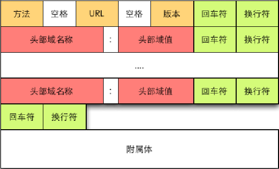

## 说明

实现一个简单的客户端、服务端通信的程序

## Python编写Server的步骤

**第一步**：创建socket对象，调用socket构造函数，如：
```
socket = socket.socket(family, type)
```

* Address Family表示家族地址
  * AF\_INET（用于 Internet 进程间通信）
  * AF\_UNIX（用于同一台机器进程间通信）
* Type：套接字类型
  * SOCKET\_STREAM（流式套接字，主要用于 TCP 协议）
  * SOCKET\_DGRAM（数据报套接字，主要用于 UDP 协议）

**第二步**：将socket绑定到指定地址，通过socket对象的bind方法实现：

```
socket.bind(address)
```

* 由AF\_INET所创建的套接字，address地址必须是一个双元素元组，格式是`(host, port)`
  * host代表主机
  * port代表端口号
* 如果端口号正在使用、主机名不正确或端口已被保留，bind方法将引发socket.error异常

**第三步**：使用socket套接字的listen方法接收链接请求

```
socket.listen(backlog)
```

* backlog指定最多允许多少个客户端连接到服务器
* backlog的值至少是1
* 收到链接请求后，这些请求需要排队，如果队列满，则拒绝请求

**第四步**：服务器套接字通过socket的accept方法等待客户请求一个连接

```
connection, address = socket.accept()
```

* 调用accept方法时，socket会进入“waiting”状态
* 客户请求连接时，方法建立连接并返回服务器
* accept方法返回两个元素的元组(connection, address)
* connection是一个新的socket对象，服务器必须使用它与客户端通信
* address是客户的Internet地址，它的格式是(host, port)

**第五步**：处理阶段，服务器和客户端通过send和recv方法通信（传输数据）

* 服务器调用send，并采用字符串形式向客户发送请求
  * send方法返回已发送的字符个数
* 服务器使用recv方法从客户接收数据
  * 调用recv时，服务器必须指定一个整数
  * 它对应于通过本次方法调用来接收的最大数据量
  * recv方法在接收数据时会进入“blocked”状态
  * 最后返回一个字符串，表示收到的数据
  * 如果发送的数据量超过recv所允许的，数据会被截断
  * 多余的数据将缓冲于接收端
  * 以后调用recv时，多余的数据会从缓冲区删除（以及上次调用recv以来，客户可能发送的其他任何数据）

**第六步**：服务器调用socket的close方法关闭连接

## Python编写client的步骤

**第一步**：创建一个socket以连接服务器

```
socket = socket.socket(family, type)
```

**第二步**：使用socket的connect方法连接服务器，对于AF_INET家族，连接格式如下：

```
socket.connect((host, port))
```

* host代表服务器主机名或IP
* port代表服务器进程所绑定的端口号、
* 如果连接成功，客户就可通过套接字与服务器通信
* 如果连接失败，会引发socket.error异常

**第三步**：处理阶段，客户和服务器通过send方法和recv方法通信

**第四步**：客户通过调用socket的close方法关闭连接

## client.py和server.py的演示步骤

* 先打开终端1，启动服务器：`python server.py`
* 然后打开终端2，启动客户端：`python client.py`
* 在客户端输入信息，回车即可发送
* 在客户端输入`q`则客户端退出发送循环

## 顺便研究一下HTTP

打开终端1，启动服务器：`python server.py`

然后在浏览器(Ubuntu的Chromium浏览器)地址栏输入：`http://localhost:10000/`

结果看到服务器的终端输出信息如下：

```
[127.0.0.1:40370] send a message to server: GET /favicon.ico HTTP/1.1
Host: localhost:10000
Connection: keep-alive
User-Agent: Mozilla/5.0 (X11; Linux x86_64) AppleWebKit/537.36 (KHTML, like Gecko) Ubuntu Chromium/51.0.2704.79 Chrome/51.0.2704.79 Safari/537.36
Accept: */*
Referer: http://localhost:10000/
Accept-Encoding: gzip, deflate, sdch
Accept-Language: en-US,en;q=0.8

```

对于HTTP的请求头，在所有头部字段之后，HTTP请求必须包含一个空行，以标识头部字段的结束

在浏览器上有输出如下图，可以看到正是服务端`connection.send('server recv success')`所返回的数据


**趁此可以了解Web的工作原理**

在服务器端有打印浏览器的请求报文：

```
GET /favicon.ico HTTP/1.1
Host: localhost:10000
Connection: keep-alive
User-Agent: Mozilla/5.0 (X11; Linux x86_64) AppleWebKit/537.36 (KHTML, like Gecko) Ubuntu Chromium/51.0.2704.79 Chrome/51.0.2704.79 Safari/537.36
Accept: */*
Referer: http://localhost:10000/
Accept-Encoding: gzip, deflate, sdch
Accept-Language: en-US,en;q=0.8

```

结合下面HTTP中请求报文的结构，可以分析出这个请求报文的信息：

* 方法是：GET
* URL是：/favicon.ico
* 版本是：HTTP/1.1
* Host字段：表示接收请求的服务器地址，可以是IP:端口号，也可以是域名
* Connection字段：指定与链接相关的属性
* User-Agent字段：发送请求的应用程序名称
* Accept
* Referer
* Accept-Encoding字段：通知服务端可以发送的数据压缩格式
* Accept-Language字段：通知服务端可以发送的语言

这里只是简单的做了介绍，关于IP、TCP、HTTP等网络协议，必须持续研究

HTTP请求报文结构



HTTP响应报文结构


之前在[20160818-python-webserver](https://github.com/xumenger/xumenger.github.code/tree/master/20160818-python-webserver)实现的Web服务器是使用Python的BaseHTTPServer模块实现的，而不是使用最原始的套接字

其实完全可以使用socket实现一个Web服务器：

* 浏览器的地址栏中输入对应的地址、端口即可访问
* 服务器收到HTTP的请求报文，按照HTTP的协议规范对其解析
* 然后根据请求的内容生成响应信息，即可对其响应
  * 比如最简单的HTML网页响应
  * 服务器根据请求动态生成HTML
  * 然后按照HTTP的响应报文结构打包HTTP响应信息
  * 最后在服务器端的`connection.send('??')`方法中给客户端发回HTTP响应报文
* 下面给一个HTTP响应报文的例子，HTTP响应的Body就是HTML源码

```
HTTP/1.1 200 OK
Date: Sat, 31 Dec 2005 23:59:59 GMT
Content-Type: text/html;charset=ISO-8859-1
Content-Length: 122

<html>
<head>
<title>Wrox Homepage</title>
</head>
<body>
<!-- body goes here -->
</body>
</html>
```
