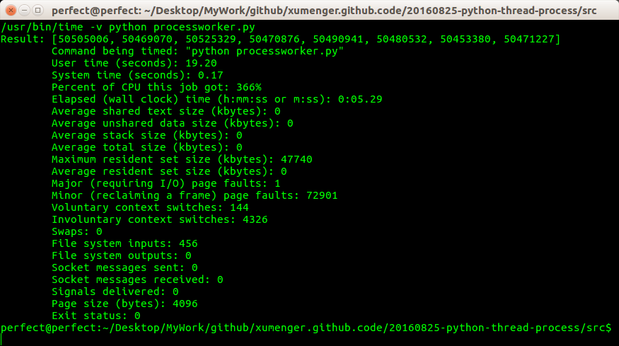

## CPython多线程的局限

GIL是指Python全局解释锁(Global Interpreter Lock)，当CPython每次要执行字节码的时候都要先申请这个锁。但是这意味着，如果试图通过多线程扩展应用程序，将总是被这个全局锁所限制

所以尽管多线程看上去是一个理想的解决方案，但实际上大多数应用程序都很难获得150%的CPU占用率，也就是1.5个核

考虑到现如今计算节点通常至少有2或4个核，这是很没有面子的，这都归咎于CIL

目前没有任何工作试图从CPython中移除GIL，因为考虑到实现和维护的难度大家都觉得不值得这么做

因为CIL的问题，多线程并非是好的可扩展性解决方案。更好的方案是Python中提供的multiprocessing包。它提供了类似multithreading模块中的接口，区别在于它会启动一个新的进程（通过fork(2)），而不是一个新的系统线程

本例中分别展示用多线程和多进程实现一个程序，对比其运行效果

例子内容：计算100万个随机整数的和8次，同时将其分散到8个线程/或8个进程中

## 查看当前机器的配置

执行下面的命令查看当前有几个CPU（我的机器是1）

```
more /proc/cpuinfo |grep "physical id"|uniq|wc -l
```

执行下面的命令查看每个CPU是几核的，假设每个CPU的配置相同（我的机器是4）

```
more /proc/cpuinfo |grep "physical id"|grep "0"|wc -l
```

## 多线程实现

**threadworker.py**

```
import random
import threading

results= []

# sum可以计算一个链表中整数的和：sum([1, 2, 3])得到的结果是6
def compute():
    results.append(sum(
        [random.randint(1, 100) for i in range(1000000)]))

# 创建多线程的同时，将多个线程放在一个list中进行管理
workers = [threading.Thread(target=compute) for x in range(8)]
for worker in workers:
    worker.start()
for worker in workers:
    worker.join()

print("Result: %s" % results)
```

执行`/usr/bin/time -v python threadworker.py`，得到的统计结果如下


这个程序运行在4核的CPU上，这意味着Python最多可以利用有400%的CPU能力，但是看上面的输出，CPU利用率才只到了120%

即使并行运行8个线程，它仍然卡在120%左右，所以Python的多线程只能利用到CPU资源的120%，剩下的280%都浪费掉了

## 多进程实现

**processworker.py**

```
import random
import multiprocessing

def compute(n):
    return sum(
        [random.randint(1, 100) for i in range(1000000)])

# Start 8 workers
pool = multiprocessing.Pool(8)
print("Results: %s" % pool.map(compute, range(8)))
```

执行`/usr/bin/time -v python processworker.py`，得到的统计结果如下



执行时间明显降低，而且CPU的利用率达到了366%

此外，multiprocessing模块不仅可以有效的将负载分散到多个本地处理器上，而且可以通过它的multiprocessing.managers对象在网络中负载。它还提供了双向传输，以使进程间可以彼此交换信息

每次考虑在一定的时间内并行处理一些工作时，最好是依靠多进程创建(fork)多个作业，以便能够在多个CPU核之间分散负载
