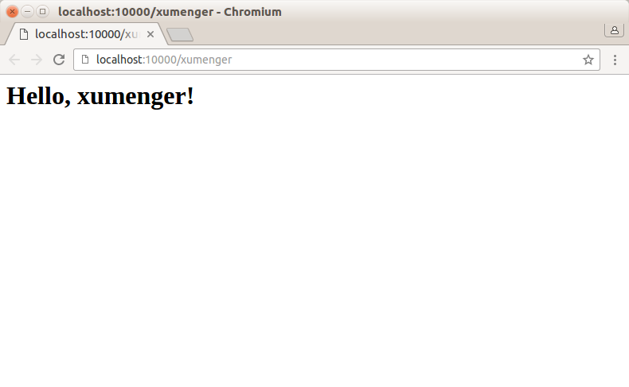
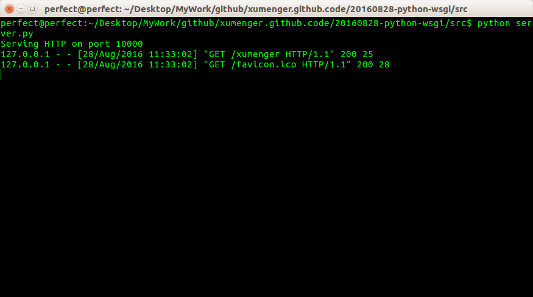

## 说明

对应可以参考

* https://github.com/xumenger/xumenger.github.code/tree/master/20160818-python-webserver
* [《Web开发》](http://www.liaoxuefeng.com/wiki/0014316089557264a6b348958f449949df42a6d3a2e542c000/0014320118765877e93ecea4e6449acb157e9efae8b40b6000)
* [《HTTP协议简介》](http://www.liaoxuefeng.com/wiki/0014316089557264a6b348958f449949df42a6d3a2e542c000/001432011939547478fd5482deb47b08716557cc99764e0000)
* [《WSGI接口》](http://www.liaoxuefeng.com/wiki/0014316089557264a6b348958f449949df42a6d3a2e542c000/001432012393132788f71e0edad4676a3f76ac7776f3a16000)

## Web开发

Web应用开发可以说是目前软件开发中最重要的部分。Web开发也经历了好几个阶段：

* 静态Web页面：由文本编辑器直接编辑生成静态的HTML页面，如果要修改Web页面的内容，就需要再次编辑HTML源文件，早期的互联网Web页面就是静态的
* CGI：由于静态Web页面无法与用户交互，比如用户填写了一个注册表单，静态Web页面就无法处理。要处理用户发送的动态数据，出现了Common Gateway Interface，简称CGI，用C/C++编写
* ASP/JSP/PHP：由于Web应用特点是频繁修改，用C/C+这样的低级语言非常不适合Web开发，而脚本语言由于开发效率高，与HTML结合紧密，因此迅速替代了CGI模式。ASP是微软推出的用VBScript脚本编程的Web开发技术，而JSP用Java来编写脚本，PHP本身则是开源的脚本语言。
* MVC：为了解决直接用脚本语言嵌入HTML导致的可维护性差的问题，Web应用也引入了Model-View-Controller的模式，来简化Web开发。ASP发展为ASP.Net，JSP和PHP也有一大堆MVC框架。

## HTTP请求

* 浏览器首先向服务器发送HTTP请求，请求包括：
  * GET还是POST，GET仅请求资源，POST会附带用户数据；
  * 路径：/full/url/path；
  * 域名：由Host头指定：Host: www.sina.com.cn
  * 以及其他相关的Header；
  * 如果是POST，那么请求还包括一个Body，包含用户数据。
* 服务器向浏览器返回一个HTP响应，响应包括：
  * 响应代码：200表示成功，3xx表示重定向，4xx表示客户端发送的请求有错误，5xx表示服务器端处理时发生了错误；
  * 响应类型：由Content-Type指定；
  * 以及其他相关的Header；
  * 通常服务器的HTTP响应会携带内容，也就是有一个Body，包含响应的内容，网页的HTML源码就在Body中。
* 如果浏览器还需要继续向服务器请求其他资源，比如图片，就再次发出HTTP请求，重复步骤1、2：

Web采用的HTTP协议采用了非常简单的请求-响应模式，从而大大简化了开发。当我们编写一个页面时，我们只需要在HTTP请求中把HTML发送出去，不需要考虑如何附带图片、视频等，浏览器如果需要请求图片和视频，它会发送另一个HTTP请求，因此一个HTTP请求只处理一个资源。

HTTP协议同时具备极强的扩展性，虽然浏览器请求的是`http://www.sina.com.cn/`的首页，但新浪在HTML中可以链入其他服务器的资源，比如``，从而将请求压力分散到各个服务器上，并且，一个站点可以链接到其他站点，无数站点互相链接起来，就形成了World Wide Web，简称WWW。

## WSGI接口

了解了HTTP协议和HTML文档，我们其实就明白了一个Web应用的本质就是：

* 浏览器发送一个HTTP请求
* 服务器收到请求，生成一个HTML文档
* 服务器把HTML文档作为HTTP响应的Body发送给浏览器
* 浏览器收到HTTP响应，从HTTP Body中取出HTML文档并显示

所以，最简单的Web应用就是先把HTML用文件保存好，用一个现成的HTTP服务器软件，接收用户请求，从文件中读取HTML，返回。Apache、Nginx、Lighttpd等这些常见的静态服务器就是干这件事情的。

如果要动态生成HTML，就需要把上述步骤自己来实现。不过，接受HTTP请求、解析HTTP请求、发送HTTP响应都是苦力活，如果我们自己来写这些底层代码，还没开始写动态HTML呢，就得花个把月去读HTTP规范。

正确的做法是底层代码由专门的服务器软件实现，我们用Python专注于生成HTML文档。因为我们不希望接触到TCP连接、HTTP原始请求和响应格式，所以，需要一个统一的接口，让我们专心用Python编写Web业务。

这个接口就是WSGI：Web Server Gateway Interface。

WSGI接口定义非常简单，它只要求Web开发这实现一个函数，就可以响应HTTP请求

Python内置了一个WSGI服务器，这个模块叫wsgiref，它是用纯Python编写的WSGI服务器的参考实现。所谓“参考实现”是指该实现完全符合WSGI标准，但是不考虑任何运行效率，仅供开发和测试使用。

在对应的src部分展示用WSGI实现一个简单的小程序，详细的关于WSGI的使用规范，参见代码注释

## 运行本例子

* 首先启动服务器：`python server.py`
* 然后在浏览器输入`http://localhost:10000/xumenger`，回车
* 浏览器会显示

* 命令行显示信息如下

