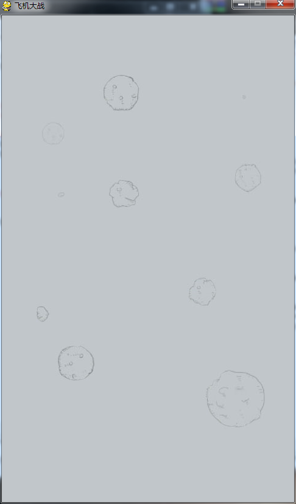
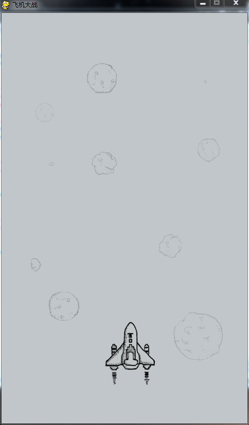
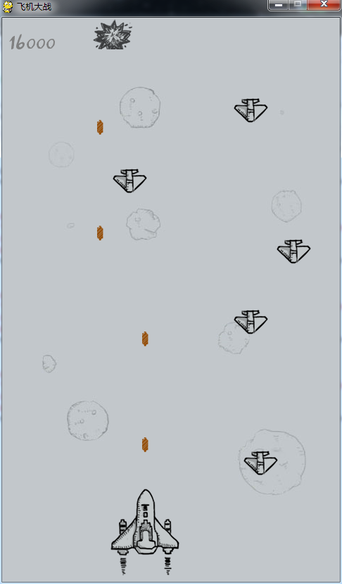

## 说明

参考文章[《使用Pygame制作微信打飞机游戏PC版》](http://www.cnblogs.com/dukeleo/p/3339780.html)

环境搭建过程如下

* `virtualenv venv`创建虚拟环境
* `source venv/bin/activate`进入虚拟环境
* `pip install pygame`安装pygame模块
* 本练习使用的Python版本是python2.7

下面就开始正式练习了

## 背景

作者的话：

>前一阵子看了一篇文章：《青少年如何使用Python开始游戏开发》。看完照葫芦画瓢写了一个，觉得挺好玩儿，相当于简单学了下Pygame库。这篇文章是个12岁小孩儿写的，国外小孩儿真心NB，想我12岁的时候会干嘛？只会打星际。。。

>为了复习一下准备自己做一个小游戏。想到微信上的飞机大战很火，就决定做一个PC版的。首先去下了个微信的APK，把里面的飞机大战的资源文件提取出来了。然后写游戏时有问题可以访问 Pygame在线文档 ，遇到的问题都可以在其中找到答案。资源准备好后我们就可以开始编写游戏了。

## 正式记录练习步骤

### 第一步，显示背景

我们先来显示出飞机大战游戏的背景图。

```
# -*- coding: utf-8 -*-

import pygame
from pygame.locals import *
from sys import exit

SCREEN_WIDTH = 480
SCREEN_HEIGHT = 800

# 初始化游戏
pygame.init()
screen = pygame.display.set_mode((SCREEN_WIDTH, SCREEN_HEIGHT))
pygame.display.set_caption('飞机大战')

# 载入背景图
background = pygame.image.load('resources/image/background.png')

while True:
    # 绘制背景
    screen.fill(0)
    screen.blit(background, (0, 0))

    # 更新屏幕
    pygame.display.update()

    # 处理游戏退出
    for event in pygame.event.get():
        if event.type == pygame.QUIT:
            pygame.quit()
            exit()
```

我们来分析这段代码：

* 导入Pygame库及需要的库；
* 初始化游戏，并根据设置好的大小生成游戏窗口；
* 载入背景图片；
* 进入游戏主循环。在主循环中，我们进行了以下工作：
  * 清空屏幕
  * 绘制背景
  * 更新屏幕
  * 处理游戏退出事件

运行后效果如下：

 

### 第二步，显示飞机

我们打开resources/image/，发现所有的飞机都在 shoot.png 一张图片中。我们在背景上显示的元素（包括飞机、子弹等）在Pygame中都是一个surface，这时可以利用pygame提供的subsurface方法，首先load一张大图，然后调用subsurface方法选取其中的一小部分生成一个新的surface。而这个小图在大图中的位置在image文件夹中shoot.pack文件里。

我们需要做的是在上述代码载入背景图后载入飞机图片，然后生成飞机的surbsurface并初始化飞机开始的位置：

```
# 载入飞机图片
plane_img = pygame.image.load('resources/image/shoot.png')

# 选择飞机在大图片中的位置，并生成subsurface，然后初始化飞机开始的位置
player_rect = pygame.Rect(0, 99, 102, 126)
player = plane_img.subsurface(player_rect)
player_pos = [200, 600]
```

然后在主循环中绘制背景之后插入绘制飞机的代码：

```
# 绘制飞机
screen.blit(player, player_pos)
```

运行后就能看见玩家操作的战机了：



### 第三步，让飞机动起来

让飞机动起来即是让游戏在主循环中响应键盘事件。上面的代码中我们知道 screen.blit(player, player\_pos) 这一句代码绘制出了飞机，这个player\_pos就是每次循环中绘制出的飞机的位置，响应键盘事件时，我们只需要改变这个位置就能移动飞机了。在主循环中加入响应键盘事件的代码：

```
# 监听键盘事件
key_pressed = pygame.key.get_pressed()
if key_pressed[K_UP]:
    player_pos[1] -= 3
if key_pressed[K_DOWN]:
    player_pos[1] += 3
if key_pressed[K_LEFT]:
    player_pos[0] -= 3
if key_pressed[K_RIGHT]:
    player_pos[0] += 3
```

每当一个方向键按下时，我们只需要改变一个飞机位置的坐标，就可以让飞机动起来~

这样我们知道了制作一个2D游戏的基本的原理：游戏进入主循环后，每一次循环在相应的位置绘制出图片，改变位置或者图片就可以出现动画效果；然后通过判断两张图片的矩形区域是否相交来检测碰撞。简单吧？

接下来的步骤还有显示子弹、随机生成敌机、检测碰撞、判断游戏结束、计分等。我想介绍了这些，大家应该能自己完成接下来的任务了吧？

当然，玩家、子弹、敌机都可以写成一个类，继承pygame的sprite类，实现一些动画效果，以及检测碰撞，这样使用起来更简单。给大家看一下我写的类代码：

```
# 子弹类
class Bullet(pygame.sprite.Sprite):
    def __init__(self, bullet_img, init_pos):
        pygame.sprite.Sprite.__init__(self)
        self.image = bullet_img
        self.rect = self.image.get_rect()
        self.rect.midbottom = init_pos
        self.speed = 10

    def move(self):
        self.rect.top -= self.speed

# 玩家类
class Player(pygame.sprite.Sprite):
    def __init__(self, plane_img, player_rect, init_pos):
        pygame.sprite.Sprite.__init__(self)
        self.image = []                                 # 用来存储玩家对象精灵图片的列表
        for i in range(len(player_rect)):
            self.image.append(plane_img.subsurface(player_rect[i]).convert_alpha())
        self.rect = player_rect[0]                      # 初始化图片所在的矩形
        self.rect.topleft = init_pos                    # 初始化矩形的左上角坐标
        self.speed = 8                                  # 初始化玩家速度，这里是一个确定的值
        self.bullets = pygame.sprite.Group()            # 玩家飞机所发射的子弹的集合
        self.img_index = 0                              # 玩家精灵图片索引
        self.is_hit = False                             # 玩家是否被击中

    def shoot(self, bullet_img):
        bullet = Bullet(bullet_img, self.rect.midtop)
        self.bullets.add(bullet)

    def moveUp(self):
        if self.rect.top <= 0:
            self.rect.top = 0
        else:
            self.rect.top -= self.speed

    def moveDown(self):
        if self.rect.top >= SCREEN_HEIGHT - self.rect.height:
            self.rect.top = SCREEN_HEIGHT - self.rect.height
        else:
            self.rect.top += self.speed

    def moveLeft(self):
        if self.rect.left <= 0:
            self.rect.left = 0
        else:
            self.rect.left -= self.speed

    def moveRight(self):
        if self.rect.left >= SCREEN_WIDTH - self.rect.width:
            self.rect.left = SCREEN_WIDTH - self.rect.width
        else:
            self.rect.left += self.speed

# 敌人类
class Enemy(pygame.sprite.Sprite):
    def __init__(self, enemy_img, enemy_down_imgs, init_pos):
       pygame.sprite.Sprite.__init__(self)
       self.image = enemy_img
       self.rect = self.image.get_rect()
       self.rect.topleft = init_pos
       self.down_imgs = enemy_down_imgs
       self.speed = 2
       self.down_index = 0

    def move(self):
        self.rect.top += self.speed
```

目前我基本实现了玩家移动并发射子弹、随机生成小飞机、击中小飞机并爆炸、玩家被击毁、背景音乐及音效、游戏结束并显示分数这几项功能，已经是一个简单可玩的游戏。整个游戏实现不到300行代码，也可以看出Python代码的简洁。我把代码分享到了GitHub上，感兴趣的同学可以去下载下来继续完成生成中飞机、大飞机，改变飞机速度，双排子弹和炸弹等功能。GitHub链接： [PyShootGame](https://github.com/Kill-Console/PythonShootGame) 。

游戏截图:



## 简单总结

完成这个练习，发现做一个游戏的代码逻辑并不难，pygame已经提供了所有处理图片、声音的API，只要去简单的调用即可

这个练习中涉及到的pygame的API大概有下面这几个方面

* pygame提供的API来加载图片、加载声音等资源
* pygame还提供了API来截取某个大图片中的某一区域的小图片
* pygame提供了API来处理字体，并将字体嵌入到图片中
* python提供了创建矩形区域对象的API，可以用于再结合其他方法截取大图片中的某个像素区间的小图片

### 本练习的大致思路

大致的思路就是这样的

* 调用pygame提供的API来加载图片、声音等资源
* 截取图片中的某一块小图片也可以来创建一些可视化的对象
* 制定各种可视化对象的移动策略，并封装成方法
  * 其实就是指定可视化对象在屏幕上像素位置的变化
  * 然后每隔多久调用这个方法
  * 注意调用`pygame.display.update()`以将变化后的位置对应显示在屏幕上
* 根据像素值判断各个对象之间是不是有接触了
  * 如果子弹和敌机有接触，那么敌机就被击毁
  * 如果敌机和玩家的飞机有接触了，那么玩家的飞机就被击毁
* 敌机被击毁、或者玩家的飞机被击毁，那么对应的就要产生变化
  * 具体展示在屏幕上就是敌机/飞机爆炸
  * 其实这个爆炸效果实现起来很简单：就是迅速用一张爆炸的图片替换原来正常的图片
  * 因为替换后会在屏幕上迅速的将这个过程渲染出来，所以看到的效果就类似一个动画过程

### 游戏开发的真正难点

但下面才是游戏开发的真正的难点：

* 如果制作出漂亮的资源文件：图形、音效……
* 关键是能想到一个不落俗套的创意、游戏规则
* 怎么能吸引玩家来玩

### 深入运用Python

本练习中只是简单的实现了一个小游戏，但还有一些点是在这个游戏中没有深入考虑的

* 内存管理
* 是不是占用了太多的CPU资源
* 等等
