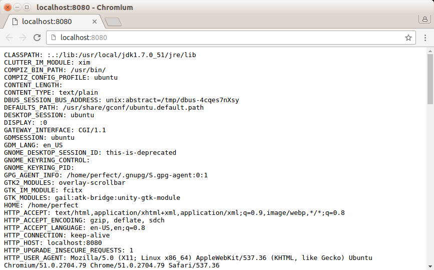
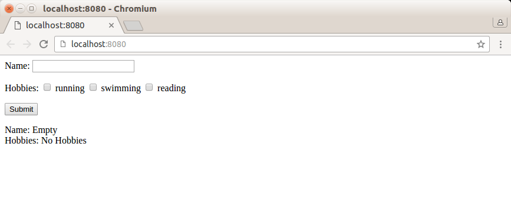
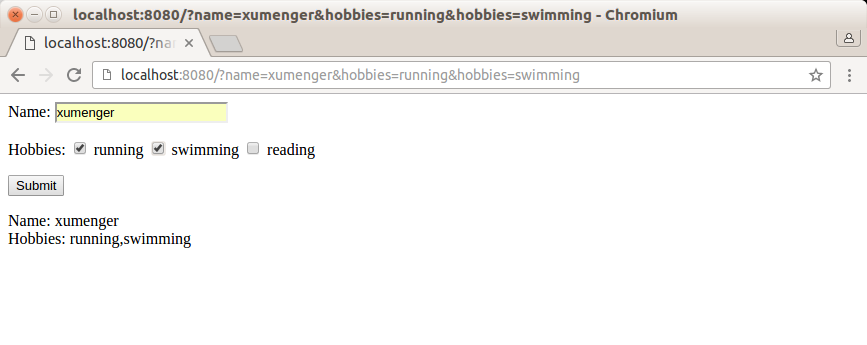
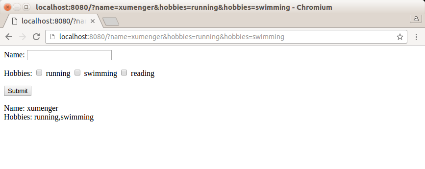
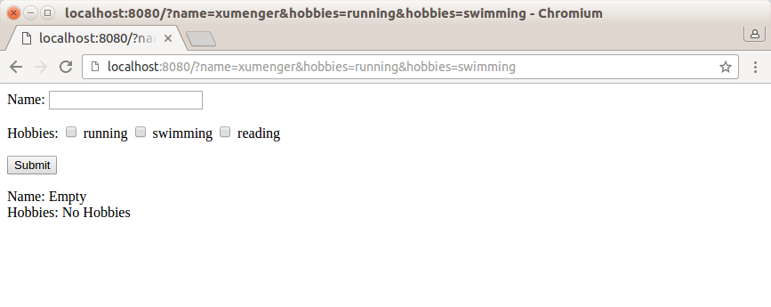
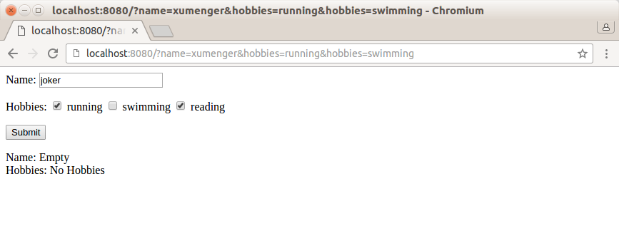
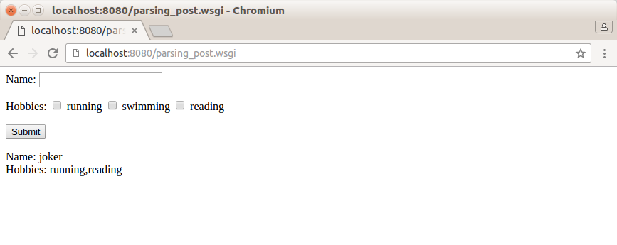

## WSGI简介

参考[《WSGI简介》](http://www.cnblogs.com/wilber2013/p/4763067.html)

推荐相关文章[《WSGI 简介》](http://blog.csdn.net/on_1y/article/details/18803563)和[《wsgiref 源代码分析》](http://blog.csdn.net/on_1y/article/details/18818081)

当我们实现一个Web应用(application)的时候，通常不会考虑如何接受HTTP请求、解析HTTP请求、发送HTTP响应等等，我们只关心处理逻辑，而不用去关心HTTP规范的细节。

之所以有这层透明，是因为Web Server和Web Application之间有一套规范的接口，这套接口帮我们隐藏了很多HTTP相关的细节。这套接口规范就是WSGI(Web Server Gateway Interface)。


Web Server和Web Application都实现WSGI规范，然后各司其职：

* Web Server：接受来自客户端的HTTP，然后将请求交给Web Application
* Web Application：根据请求来调用相应的处理逻辑，生成response，通过Web Server把response发送给客户端

## Application Interface

上面了解到，Web Server和Web Application端都要遵守WSGI规范。对于实现WSGI的Web Application端，必须是一个callable的对象(类、函数、方法等，实现__call__魔术方法的对象)。

这个callable对象需要满足下面的条件：

* 包含两个参数：
  * 一个dict对象，Web Server会将HTTP请求相关的信息添加到这个字典中，供Web Application使用
  * 一个callable函数，Web Application通过这个函数将HTTP status code 和headers发送给Web Server
* 以字符串的形式返回response，并且包含在可迭代的list中

下面就是实现一个Application Interface的一个application函数：

```
def application(environ, start_response):
	response_body = 'The request method was %s' % environ['REQUEST_METHOD']
	status = '200 OK'
	response_headers = [('Content-Type', 'text/plain'), ('Content-Length', str(len(response_body)))]
	start_response(status, response_headers)

	#以字符串的方式返回response，并且包含在可迭代的list中
	#return的内容会作为body展示在浏览器上
	return [response_body]
```

## 看看Environment dict

在Python中就有一个WSGI Server，我们可以直接使用

对应我们实现练习1-environ_dict.py

这个练习中，WSGI Server监听"localhost:8080"，并绑定了一个支持WSGI规范的application对象

application对象就会处理来自8080的请求，并将"Environment dict"的内容生产response传给WSGI Server

对应的程序源码，参见environ_dict.py

`python environ_dict.py`启动服务器，然后打开浏览器，在地址栏输入`localhost:8080`即可看到下面的输出



## 处理GET请求

当我们执行如下的GET请求：

```
http://127.0.0.1:8080/?name=wilber&hobbies=software
```

QUERY_STRING(URL中"?"之后的部分)和REQUEST_METHOD这些信息会包含在"Environment dict"中，从application中可以很方便的得到这些信息

在application中，可以使用cgi模块中的parse_qs函数得到一个有QUERY_STRIN生成的字典，方便我们取出请求的变量信息

同时为了避免客户端的输入可能存在的脚本注入，可以使用cgi模块中的escape函数对输入进行一次过滤

对应的程序源码，参见get_method.py

`python get_method.py`启动服务器，然后打开浏览器，在地址栏输入`localhost:8080`即可看到下面的输出



输入Name，选择`running`、`swimming`



后点击Submit，浏览器的界面截图如下



## 处理POST请求

当执行一个POST请求时，query string是不会出现在URL中的，而是会包含在request body中

对于WSGI Server，request body存放在"Environment dict"中(environ['wsgi.input'])，environ['wsgi.input']对应的是一个file object，可以通过读取文件的方式读取request body。同时，environ.get('CONETENT_LENGTH', 0)中存放着request body的size，我们可以根据这个值来读取适当长度的request body

对应的程序源码，参见post_method.py

`python post_method.py`启动服务器，然后打开浏览器，在地址栏输入`localhost:8080`即可看到下面的输出



输入Name，选择`running`、`reading`



后点击Submit，浏览器的界面截图如下



