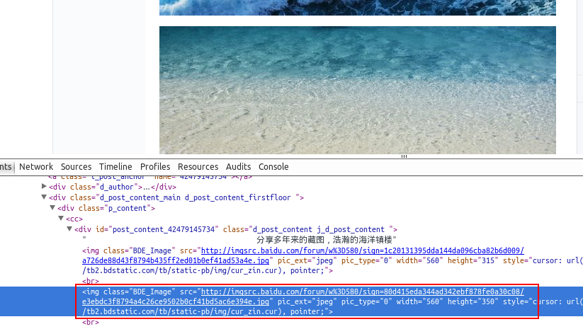
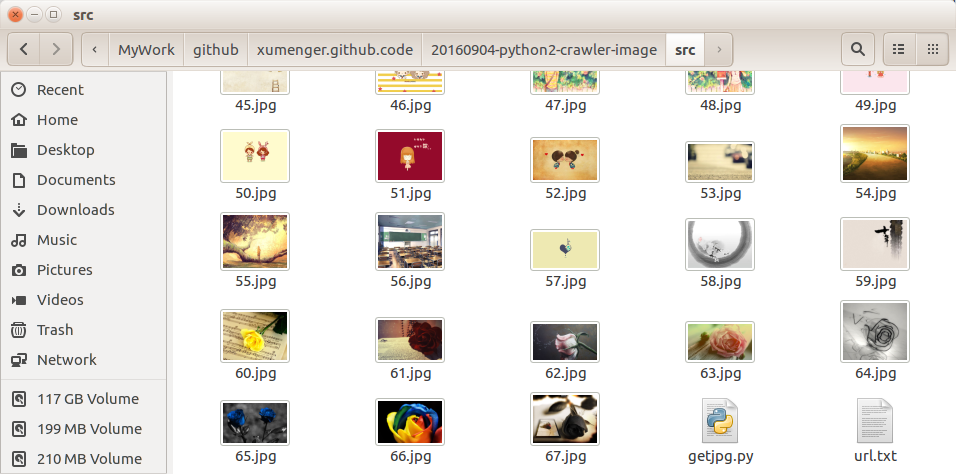

## 简介

参考[《Python实现简单爬虫》](http://www.cnblogs.com/fnng/p/3576154.html)

在我们日常上网浏览网页的时候，经常会看到一些好看的图片，我们就希望把这些图片保存下载，或者用户用来做桌面壁纸，或者用来做设计的素材

我们最常规的做法就是通过鼠标右键，选择另存为。但有些图片鼠标右键的时候没有另存为选项，还有办法就是通过截图工具截取下来，但这样就降低了图片的清晰度。好吧！其实你很厉害的，右键查看页面源代码

我们可以通过Python来实现一个简单的爬虫功能，把我们想要的代码爬取到本地

## 获取整个页面数据

首先我们可以先获取要下载图片的整个页面信息

```
#coding=utf-8
import urllib

def getHtml(url):
    page = urllib.urlopen(url)
    html = page.read()
    return html

html = getHtml("http://tieba.baidu.com/p/2738151262")

print html
```

Urllib 模块提供了读取web页面数据的接口，我们可以像读取本地文件一样读取www和ftp上的数据。首先，我们定义了一个getHtml()函数:

urllib.urlopen()方法用于打开一个URL地址。

read()方法用于读取URL上的数据，向getHtml()函数传递一个网址，并把整个页面下载下来。执行程序就会把整个网页打印输出。

## 筛选页面中想要的数据

Python 提供了非常强大的正则表达式，我们需要先要了解一点python 正则表达式的知识才行。http://www.cnblogs.com/fnng/archive/2013/05/20/3089816.html

假如我们百度贴吧找到了几张漂亮的壁纸，通过到前段查看工具。找到了图片的地址，如：src=”http://imgsrc.baidu.com/forum......jpg”pic_ext=”jpeg”



修改代码如下

```
import re
import urllib

def getHtml(url):
    page = urllib.urlopen(url)
    html = page.read()
    return html

def getImg(html):
    reg = r'src="(.+?\.jpg)" pic_ext'
    imgre = re.compile(reg)
    imglist = re.findall(imgre,html)
    return imglist      
   
html = getHtml("http://tieba.baidu.com/p/2460150866")
print getImg(html)
```

我们又创建了getImg()函数，用于在获取的整个页面中筛选需要的图片连接。re模块主要包含了正则表达式：

re.compile() 可以把正则表达式编译成一个正则表达式对象.

re.findall() 方法读取html 中包含 imgre（正则表达式）的数据。

运行脚本将得到整个页面中包含图片的URL地址。

## 将页面筛选的数据保存到本地

把筛选的图片地址通过for循环遍历并保存到本地，并且将图片的URL保存到一个文件中，代码如下：

```
#coding=utf-8

#urllib模块提供了读取Web页面数据的接口，可以像读取本地文件一样读取www和ftp上的数据
import urllib

#re是正则表达式处理模块
import re


#向getHtml()传入一个URL地址，把该URL对应的页面下载下来
def getHtml(url):
    page = urllib.urlopen(url)  #打开一个URL
    html = page.read()          #下载URL上对应的HTML数据
    return html

#getImg()用于在获取的整个页面中山选需要的图片链接并下载
def getImg(html):
    reg = r'src="(.+?\.jpg)" pic_ext'       #该URL中对应的图片链接的正则表达式格式
    imgre = re.compile(reg)                 #re.compile()可以把正则表达式编译成一个正则表达式对象
    imglist = re.findall(imgre,html)        #读取HTML中包含imgre(正则表达式)的数据
    x = 0
    #循环把筛选的图片地址下载并保存到本地
    for imgurl in imglist:
        #urllib.urlretrieve()用于将远程数据下载到本地
        #第一个参数指定远程数据的url地址
        #第二个参数指定下载到本地后保存的地址、名称
        urllib.urlretrieve(imgurl, './%s.jpg' % x)     
        x+=1
    return imglist


if __name__ == '__main__':
    html = getHtml("http://tieba.baidu.com/p/2460150866")
    imageList = getImg(html)

    #以追加方式打开'rul.txt'文件，如果该文件不存在则自动创建
    fp = open('url.txt', 'w+')
    for imageUrl in imageList:
        #循环将所有图片的URL信息写到url.txt文件中
        fp.write(imageUrl + '\n')
    fp.close()
```

这里的核心是用到了urllib.urlretrieve()方法，直接将远程数据下载到本地。

通过一个for循环对获取的图片连接进行遍历，为了使图片的文件名看上去更规范，对其进行重命名，命名规则通过x变量加1。保存的位置默认为程序的存放目录。

`python getjpg.py`程序运行完成，将在目录下看到下载到本地的文件以及生成的用以保存图片URL的文本文件。


