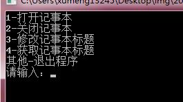
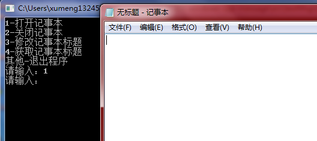
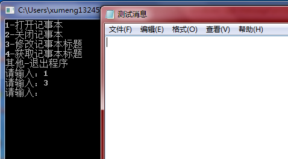
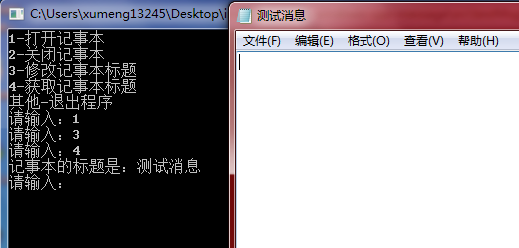
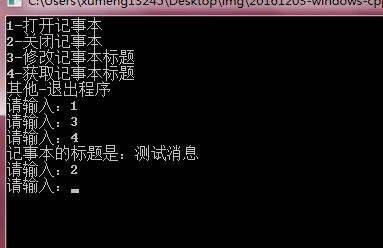

>开发环境：Windows 7 64位、Visual C++ 6.0

本例展示通过消息在cmd命令行控制记事本程序

## 程序运行效果

程序打开后界面如下：



输入“1”后，打开记事本程序



输入“3”后，修改记事本程序



输入“4”后，获取记事本程序的标题



输入“2”后，关闭记事本程序



## API解释

本文主要应用的WinAPI是：FindWindow、SendMessage

**FindWindow函数**

其用法示例：

```
HWND hWnd = FindWindow("Notepad", NULL);

//或者

HWND hWnd = FindWindow(NULL, "无标题 - 记事本");
```

通过制定的窗口类名(第一个参数)，或者窗口标题(第二个参数)查找到匹配的窗口，并返回**最上层**的窗口句柄

**SendMessage函数**

其用法示例：

```
SendMessage(hWnd, WM_SETTEXT, (WPARAM)0, (LPARAM)pCaption);
```

第一个参数是要发送消息到的句柄；第二个参数是消息类型；第三个WPARAM和第四个参数LPARAM是消息的两个附加参数

本例通过发送消息实现关闭记事本程序、修改记事本程序窗体标题、获取记事本程序窗体标题

WM_CLOSE：收到该消息的窗体或应用程序将要关闭，不需要附加参数，所以wParam和lParam都为NULL

WM_SETTEXT：应用程序发送WM_SETTEXT消息对窗体的文本进行设置。需要附加参数，wParam未被使用，但必须指定为0；lParam参数是一个以NULL结尾的字符串数组，存储的是新的标题名

WM_GETTEXT：应用程序发送WM_GETTEXT消息，将对应窗口的文本复制到调用者的缓冲区中。该消息也需要附加参数，wParam指定要复制的字符数量，lParam是接收文本的缓冲区

发送消息既可以使用SendMessage，还可以使用PostMessage

* SendMessage，把消息放入消息队列，并等待消息处理完成后才返回
* POSTMessage，将消息放入消息队列后立即返回，不管该消息到底有没有被处理

## Windows消息机制

上面的例子中展示了Windows的消息机制，也看到了可以跨进程发送消息。当然，你也可以定义自己的消息，同时定义lParam、wParam用于附加什么消息！

但如果想使用消息来实现进程间通信还是有一个问题：必须是Windows下的窗体应用程序，而不能是DOS程序，因为我们可以看到SendMessage函数的第一个参数就是窗体句柄，而DOS程序并没有窗体，所以无法**收到消息**

**DOS程序**

什么是DOS程序？我们使用C/C++编写main函数实现的程序就是DOS程序，DOS程序的流程是按照代码的顺序和流程依次执行的。大致的步骤为：

* DOS程序从main()主函数开始执行（其实程序真正的入口并不是main函数）
* 执行的过程中按照代码编写流程依次调用各个子程序
* 在执行的过程中会等待用户的输入等操作
* 当各个子程序执行完成后，最终会返回main()主函数，执行主函数的return语句后，程序退出（其实程序真正的出口也不是main函数的return语句）

**Windows窗口程序**

DOS程序的执行流程比较简单，但Windows窗口程序的执行流程就比较复杂了

DOS是单任务的操作系统，在DOS中，通过输入命令，DOS操作系统会将控制权由Command.com转交给DOS程序从而执行；而Windows是多任务的操作系统，在Windows下同时会运行若干个应用程序，那么Windows就无法把控制权完全交给一个应用程序

在实际开发Windows应用程序时，需要关注的部分主要是“主程序”和“窗口过程”两部分。但主程序和窗口过程没有直接的调用关系，而在主程序和窗口过程之间有一个“系统程序模块”。“主程序”的功能是用来注册窗口类、获取消息和分发消息。而“窗口过程”中定义了需要处理的消息，会根据不同的消息执行不同的动作，而不需要程序处理的消息则会交给默认的系统过程进行处理

* 在“主程序”中，RegisterClassEx()函数会注册一个窗口类，窗口类中的字段包含了“窗口过程”的地址信息，也就是把“窗口类”的信息（包括“窗口过程的地址信息”）告诉操作系统
* 然后“主程序”不断调用GetMessage()函数获取消息，在交由DispatchMessage()函数来分发消息
* 消息分发后并没有直接调用“窗口过程”让其处理消息，而是由系统模块查找该窗指定的窗口类，通过窗口类再找到窗口过程的地址
* 最后将消息送给该窗口过程
