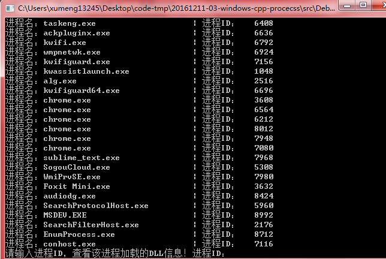
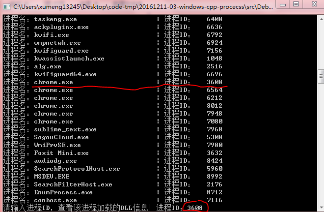
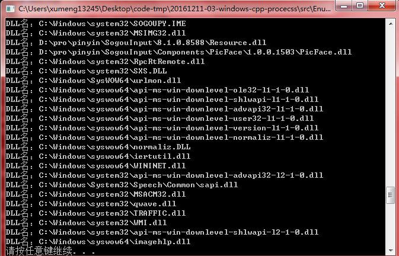

>测试环境：Windows 7、Visual C++ 6.0

在Windows系统中，没事每个都有不同的线程在运行着。当Windows的桌面启动时，“Explorer.exe”就会出现在进程列表中。为了更充分地利用CPU资源，作为资源容器的进程中可能会创建多个线程在“同时”执行着

当运行一个程序的时候，操作系统就会将这个程序装入内存，分配各种运行程序锁需要的资源，创建主线程等一系列的工作，进程是运行当中的程序，进程是向操作系统申请资源的基本单位。运行一个记事本程序时，操作系统就会创建一个记事本的进程。当关闭记事本时，记事本进程也随即结束。对进程感性上的认知，这么多也就够了

任何一个计算机文件都是二进制文件。对于可执行程序来说，它的二进制数据是可以被CPU执行的。程序是一个静态的概念，本身只是存在于硬盘上的二进制文件。当鼠标双击某个可执行程序以后，这个程序被加载到内存中，这时候就产生了一个进程。操作系统通过装载器将程序装入内存时，会为其分配各个进程所需的各种资源，并产生一个主线程，主线程会拥有CPU的执行时间，占用进程申请的内存……

在编程的时候也经常需要动态创建一个进程，当然Windows也提供了对应的API

## 控制台程序和Windows程序

通常在编写C语言的程序是，如果是控制台下的程序，那么编写程序的入口函数是main()，也就是通常所说的主函数

如果编写一个Windows下程序，那么入口函数是WinMain()。即使使用MFC进行开发，其实也是有WinMain()函数的，只不过被庞大的MFC框架隐藏了

>那么程序真的是从main()或WinMain()函数开始执行的吗？在写控制台程序时，如果需要给程序提供参数，那么这个参数是从哪里来的？主函数为什么会有返回值，它会返回哪里呢？

main()函数只是程序员编程时的入口函数，程序的启动并不是从main()函数开始，在执行main()函数前，操作系统及C语言的启动代码已经为程序做了很多工作

## 进程的枚举

进程的枚举就是把所有的进程都显示出来。当然需要用特殊手段刻意隐藏的进程无法通过常规的枚举方式枚举得到的。这里只是介绍应用层的进程枚举方法。在应用层枚举进程有很多方法，这里只介绍相对常见的进程枚举方法

无论是枚举进程还是枚举进程中的DLL文件，方法都是相同的，都是通过创建指定的相关快照，再通过循环逐条获取快照的内容。类似的枚举线程、枚举堆都是相同的方法，差别只是在创建快照时参数不同，在逐条获得快照内容时的API函数不同而已

## 开发实例

本次练习开发一个小程序：

* 首先枚举所有的进程
* 然后根据用户的输入选择枚举某个进程的所有线程或DLL

打开程序后，先枚举了所有进程（当然有些刻意隐藏的进程无法枚举到）

输入一个进程号

可以看到这个进程加载的DLL信息如下：

