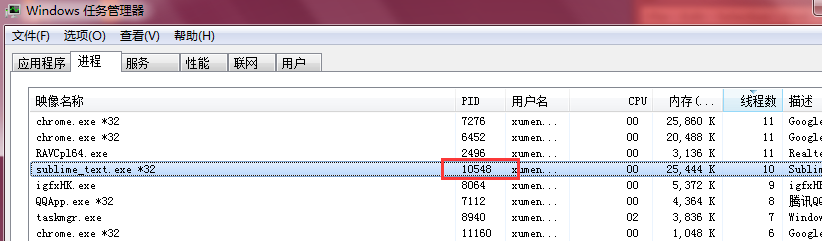
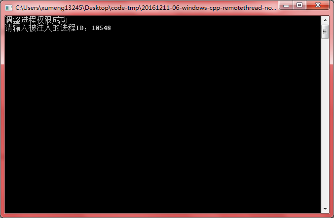
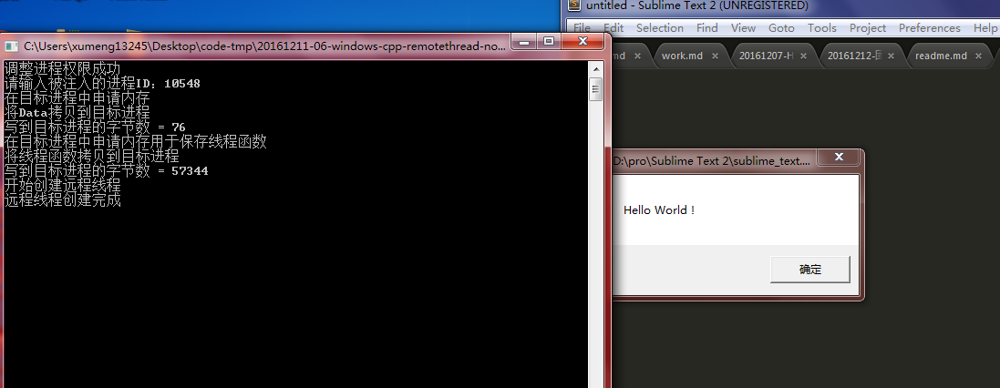
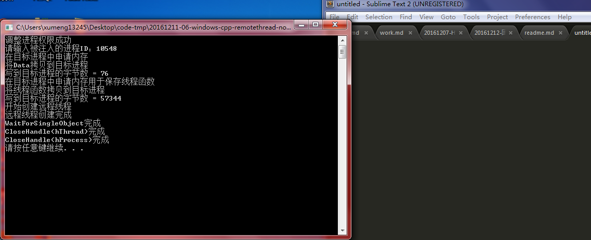

>测试环境：Windows 7、Visual C++ 6.0

>技术点：远程线程、线程注入、编译模式、函数指令内存拷贝、内存管理、进程权限

上一个练习中讲到了带DLL的线程远程线程加载DLL、卸载DLL。其实就是让远程线程执行一次LoadLibraryA()和FreeLibrary()。远程线程装载了一个DLL文件，通过DllMain()调用DLL中的具体功能代码，这样注入DLL就可以让DLL做很多事情了

当然也可以不依赖DLL直接向目标进程写入要执行的代码

要在目标进程中挖后才能一定的功能，就需要使用相关的API函数，不同的API函数实现在不同的DLL中。Kernel32.dll文件在每个进程中的地址是相同的，但并不代表其他DLL文件在每个进程中的地址都是一样的。这样在目标进程中调用API函数时，必须使用LoadLibrary()、GetProcAddress()函数动态调用用到的每个API函数

把想要使用的API函数以及API函数所在的DLL文件都封装在一个结构体中，直接写入目标进程的空间中。直接把要远程执行的代码页写到目标进程的内存空间中，最后调用CreateRemoteThread()函数即可将其运行

本次练习实现一个简单的例子让远程线程弹出提示对话框，但不借助于DLL

>本例并不借助DLL实现线程的注入，但讲到了如何在远程线程中加载DLL、调用DLL的导出方法，来让线程能够在被注入进程内部实现特定的功能！比如本例的远程线程在被注入线程内部加载user32.dll，并调用弹框方法

## 编译模式

VC6默认编译时Debug版本，这样会加入很多调试信息。而某些调试信息并不存在于代码中，而是在其他DLL模块中。这样，当执行到调试相关的代码时访问不存在的DLL模块中的代码，就导致了报错

所以需要将其修改为Release方式进行编译连接

## 运行效果

打开sublime，其进程号是10548

在程序中输入目标进程号

回车

可以看到弹出框

点击弹出框的【确定】后，发现输出更多信息，这就是`WaitForSingleObject(hThread, INFINITE);`的作用

