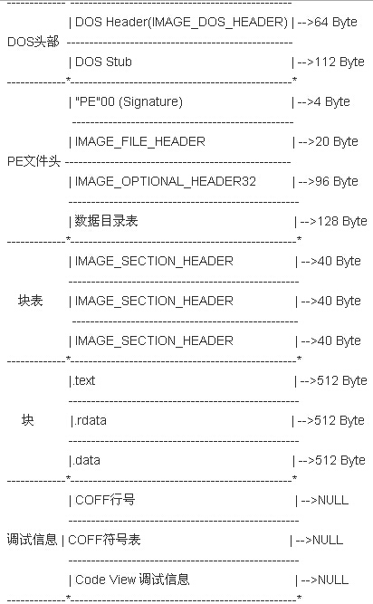
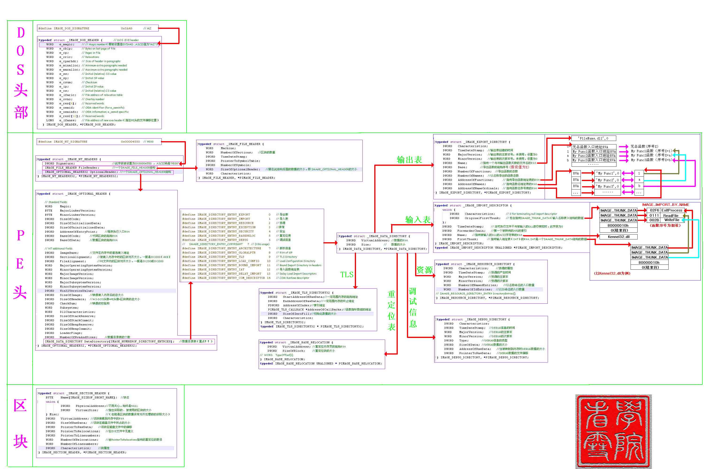

## PE文件结构全貌

加密与解密，简单来说，主要就是逆向与调试

PE结构是Windows下可执行文件的标准结构，可执行文件的装载、内存分布、执行等都依赖于PE结构，而在逆向分析软件时，为了有目的、更高效地了解程序，必须掌握PE结构

要掌握反病毒、免杀、反调试、壳、PEDIY等相关知识，PE结构更是重中之重！

在Windows平台（包括Win9x、Win NT、Win CE……）下，所有的可执行文件（包括EXE文件、DLL文件、SYS文件、OCX文件、COM文件……）均使用PE文件结构

Windows系统下的可执行文件中包含着各种数据，包括代码、数据、资源等。虽然Windows系统下的可执行文件中包含着如此众多类型的数据，但是其存放的都是有序的、结构化的，这完全依赖于PE文件结构对各种数据的管理。同样，PE结构是由若干复杂的结构体组合而成的，不是单单的一个结构体那么简单的，它的结构就像文件系统的结构是由多个结构体组成的

PE结构包含的结构体有DOS头、PE标识、文件头、可选头、目录结构、节表等。要掌握PE结构必须对PE结构有一个整体上的认识，要知道PE结构分为哪些部分，这些部分大概是起什么作用。有了宏观上的概念后，就可以深入地对PE结构的各个结构体进行细致的学习了

先给出一张PE的结构图

PE结构主要分为5个部分，其中每个部分又进行了细分，存在若干个小的部分。从数据管理的角度来看，可以把PE文件大致分为两个部分：DOS头、PE头和节表（即块表）属于PE文件的数据管理结构或数据组织结构部分，而节表数据（块）才是PE文件真正的数据部分，其中包含着代码、数据、资源等内容

逆向分析时对代码、数据、资源等具体数据进行分析，也就是分析节表数据（块）部分

看到这里，想到了之前对于DBF文件结构的研究[《深入理解DBF文件格式》](http://www.xumenger.com/dbf-20160703/)，只是DBF的二进制结构相比于PE文件简单了许多

## DOS头

DOS头分为两个部分，分别是“MZ头部”和“DOS存根（DOS残留）”。MZ头部是真正的DOS头部，由于其开始处的两个字节是“MS”，因此DOS头也可以叫作MZ头。该部分用于程序在DOS系统下加载，它的结构被定义为IMAGE\_DOS\_HEADER

DOS残留是一段简单的程序，主要用于输出“This program cannot be run in DOS mode”类似的提示字符串

为什么PE结构的最开始位置有这样一段DOS头部呢？关键是为了该可执行程序可以兼容DOS程序。通常情况下，Win32下的PE程序不能在DOS下运行，因此保留了这样的一个简单的DOS程序用于提示“不能运行于DOS模式下”。不过该DOS存根是可以通过连接参数进行修改的

## PE头

PE头部保存着Windows系统加载可执行文件的重要信息。PE头部由IMAGE\_NT\_HEADERS定义。从该结构体的定义名称可以看出，IMAGE\_NT\_HEADERS由多个结构体组合而成，包括IMAGE\_NT\_SIGNATURE、IMAGE\_FILE\_HEADER和IMAGE\_OPTIONAL\_HEADER三部分

PE头部在PE文件的位置不是固定不变的，PE头部的位置由DOS头部的某个字段给出

## 节表（块表）

程序的组织按照各属性的不同而被保存在不同的节中，在PE头部之后就是一个数组结构的节表。描述节表的结构体是IMAGE\_SECTION\_HEADER，如果PE文件中有N个节（块），那么节表就是由N个IMAGE\_SECTION\_HEADER组成的数组

节表中存储了各个节的属性、文件位置、内存位置等相关的信息

## 节表数据（块）

PE文件的真正程序部分就保存在节数据中

在PE结构中，有几个节表，就对应有几个节表的数据。根据节表的属性、地址等信息，程序的数据就分布在节表指定的位置中

----

最后给出一张详细的PE文件结构的图

