>[《从堆里寻找丢失的数据》](http://advdbg.org/blogs/advdbg_system/articles/3413.aspx)

另外关于堆内存建议阅读[《汇编与逆向基础：VC++6.0 调试模式下探究Win32进程堆内存模型》](http://www.xumenger.com/windows-vcpp-debug-20161203/)

---

这篇文章中，作者使用网页编辑器写的内容，因为没有保存到本地，又在点击发送的时候出现了服务器宕机的情况，导致数据丢失

其实自己之前也是有遇到过这种情况的，但完全是束手无策，只能放弃自己花了心血整理出来的文章

看到这篇文章之后，有挺大的震动的，所以自己想模拟这样的场景，然后跟着作者的方法调试一遍

## 模拟数据丢失的场景

作者是在浏览器的网页版编辑器中出现的问题，我这边则尝试在notepad++上模拟这样的情况，然后找回数据

在notepad++中创建一个新的文件，然后写入如下的内容

```
从堆里寻找丢失的数据

使用WinDbg调试进程

调试之剑

深入理解计算机组成原理

深入理解操作系统原理

深入理解进程内存模型
```

将其保存到"test.txt"中，然后在notepad++中关闭这个文件tab页，注意不要关闭notepad++整个进程

接下来假设数据还在内存中，这样就可以通过搜索内存的方式找到内存中的数据，找到了就可以找办法恢复成可读的模式

## 开始找数据

关于WinDbg的命令可以参见：

* [20170426-milestone-windbg-vs-gdb](https://github.com/xumenger/xumenger.github.crack/tree/master/20170426-milestone-windbg-vs-gdb)
* [20170228-windbg-delphi](https://github.com/xumenger/xumenger.github.crack/tree/master/20170228-windbg-delphi)
* [20170130~20170222-windbg](https://github.com/xumenger/xumenger.github.crack/tree/master/20170130~20170222-windbg)

先列出该进程所加载的模块：[lmf]。可以查看当前进程加载的所有模块（exe、dll）主要是其在内存中的开始和结束地址（经过对于进程内存模型的理解，结合平时自己Windows下dll程序的开发经验，这个信息的重要性已经不需要再进行强调了）

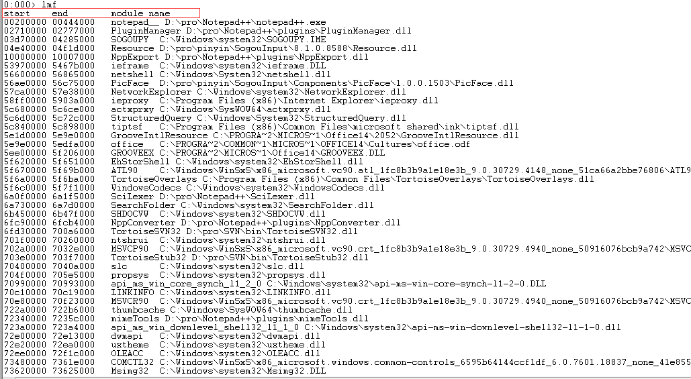

再去查看当前进程的所有线程信息：[~*]

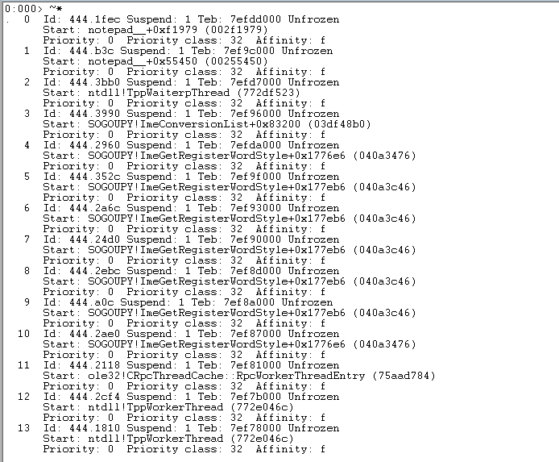

然后可以使用[kv]查看当前线程的栈回溯信息。或者使用[~*kv]查看所有线程的栈回溯信息

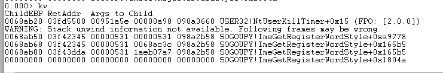

执行[!heap]查看当前进程的堆信息

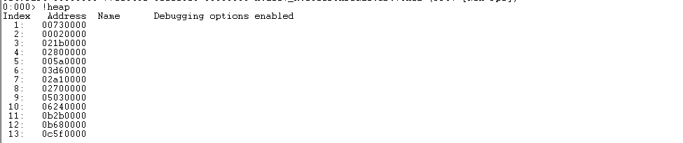

现在对当前进程的大体信息有了了解，然后开始搜索一下内存

[s -u 10000 L80000 "使用WinDbg调试进程"]没有搜索到内容；[s -u 10000 L80000000 "使用WinDbg调试进程"]搜索超过内存地址空间，所以搜不到；[s -u 10000 L8000000 "使用WinDbg调试进程"]搜索到内容

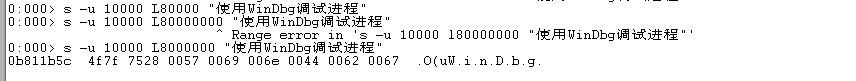

再去搜索文本中其他的关键内容，都是可以搜索到的（注意：WinDbg内存显示的时候无法显示中文）

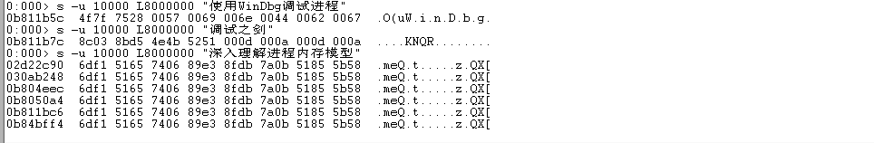

仔细观察上面的截图

* "使用WinDbg调试进程"，在地址0b811b5c
* "调试之剑"，在地址0b811b7c
* "深入理解进程内存模型"，在内存中搜索到多个
	* 但是明显有一个0b811bc6和上面几个地址接近
	* 所以这个地址应该是比较靠谱的

使用!address命令查看这三个堆地址的信息


>说实话，现在关于堆内存的结构，如何存储数据还是不够清晰，也是后续需要重点补充的点

接下来是将数据从内存堆保存到文件，刚才查到"使用WinDbg调试进程"在内存中的地址是0b811b5c，所以我们再往前一些地址（0b811b00）开始拷贝

执行[.writemem D:\heap.txt 0b811b00 L2000]，在D盘下生成了一个heap.txt文件

使用sublime打开文件看到的是这样的

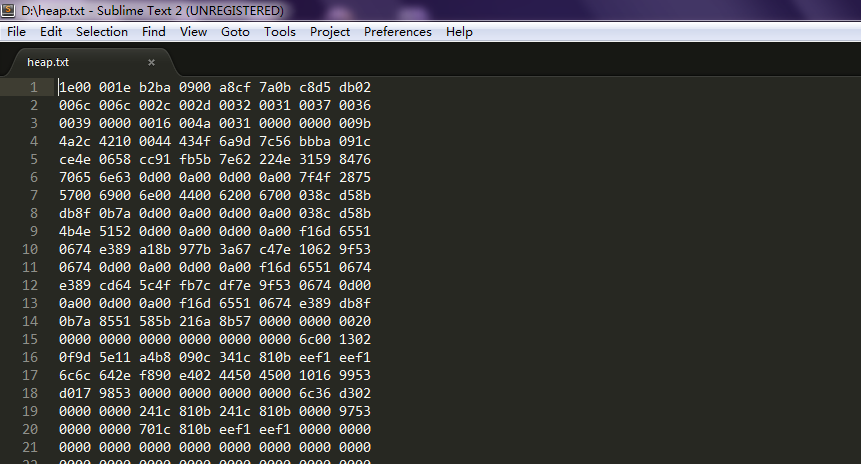

使用notepad打开看到的内容是这样的（乱码）

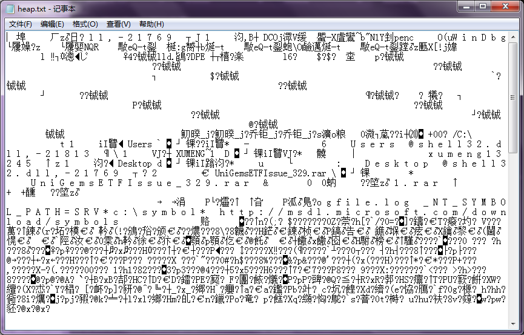

虽然是乱码，但是解决了乱码问题就基本可以找回丢失的内容了。看起来像是Unicode编码的

怎么让编辑器程序按中文显示呢？方法很简单，对于文本文件，只要在文件开头加入Unicode文件的两个标识字符就行了，也就是0xFF FE

使用VC打开后，文件为

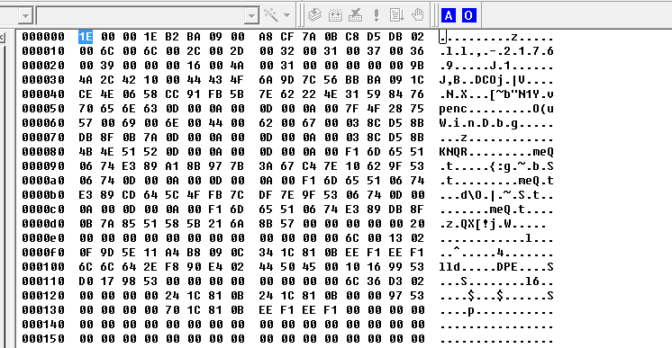

然后将开始的两个字节修改为0xFF FE即可（直接在VC上将光标定位到第一个字节，输入字符FF FE即可完成修改）

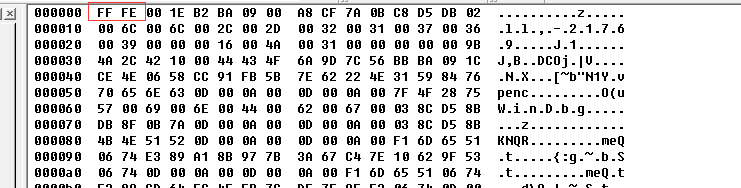

然后使用notepad打开文件，果然数据找回来了

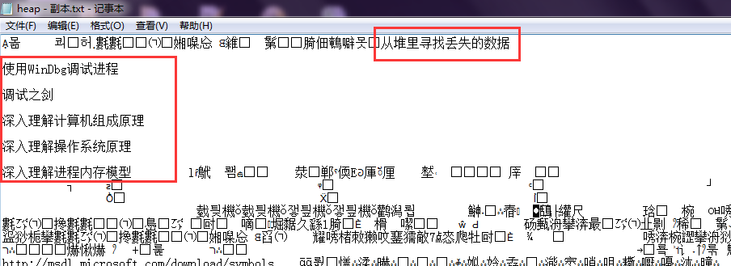

或者用Sublime打开该文件

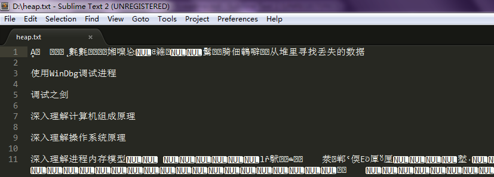

## 总结

以上的过程依赖于你对于进程内存结构的理解，才知道该到哪里去找数据

当然也还是有一些运气成分在里面的，假如存放数据的那块内存后面又被重新利用了，现在这里的数据就被其他数据覆盖掉了！

>有意思

关于WinDbg的调试技巧还是要大量练习；更底层的进程内存模型、操作系统原理、进程运行原理、线程、内存、汇编更是必不可少！

还想多说一句，从去年5-1第一次接触到WinDbg软件调试，到现在，整整一年了，从刚开始的震惊于其功能之强大，到学习过程中有各种困惑，到现在有了拨云见日的酣畅感。学习的过程中有几点让我感触很深

一方面是刚接触一个全新的领域，学起来极其吃力，但是依然没有放弃，就算有困惑、有困难，也一直硬着头皮上

另一方面，自己也不是一个傻子，鸡蛋碰石头，在正面对抗的同时，也发散思维，想想与之相关的领域，所以去阅读大量关于调试的书、找大量关于调试的教程，尤其是最近开始学习汇编，虽然目前只学习了一半，但明显这几天再回过头去学习调试有了完全不一样的感觉

这种学习带来的知识跃变真的是好爽好爽！

这也是我在学习过程中体验到的一些心理感受，以及总结的可以应用到以后各个领域的学习中的好的实践

