## code c0000005错误

StackOverFlow上有一个相关的问题：[《why get “first/second chance not available” in the core dump》](http://stackoverflow.com/questions/14978914/why-get-first-second-chance-not-available-in-the-core-dump)、[《Exception Error c0000005 in VC++》](http://stackoverflow.com/questions/17168982/exception-error-c0000005-in-vc)

另外在高端调试上找到了类似的问题链接：http://advdbg.org/forums/6166/ShowPost.aspx

code c0000005的错误90%是访问数据及内存违例造成的，具体大概有以下这些可能：

* 对象删除或释放后，但再次访问这块内存空间
* 多线程对同一内存（同对象或变量）同时操作造成数据混乱
* 等其他情况

## 简单分析程序异常

WinDbg打开[dump文件](./dump/dump-file.kz)后，会显示一些基础信息。可以看到生成该dump的时间为10:03:52（目前我们的程序会在进程崩溃的时候自动对其转储，所以进程崩溃的时间是10:03:52）

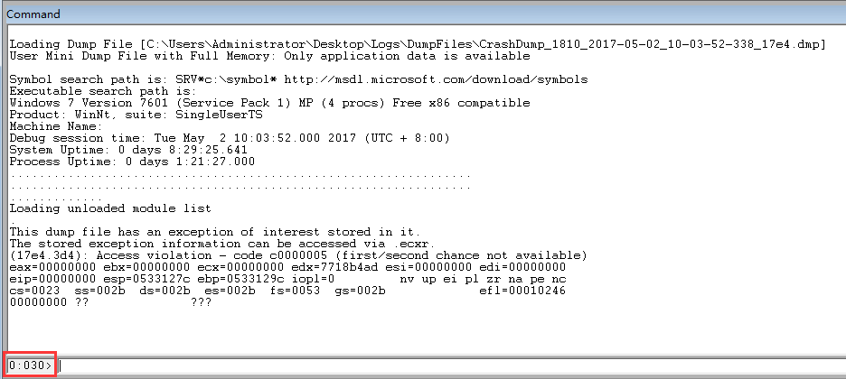

>而且第一次打开dump文件就发现下面的线程号是30，基本就说明是30号线程出现问题导致进程崩溃的（目前我们的程序支持在进程崩溃的时候自动转储dump文件）

后面分析之前，先参考[《WinDbg配置Symbol(符号)》](http://www.xumenger.com/windbg-symbol-20160521/)设置好符号文件

`!analyze -v`即可对当前dump文件的当前线程进行简单分析，获取分析结果

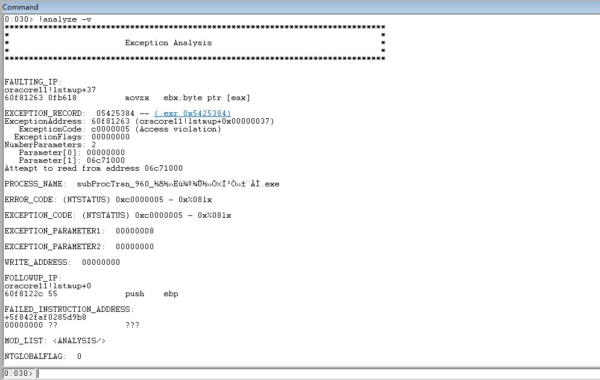

输出结果中看到错误信息大概如下

```
异常地址：60f81263 (oracore11!lstmup+0x00000037)
异常代码：c0000005 (Access violation)
异常原因：Attempt to read from address 06c71000
进程名称：PROCESS_NAME:  subProcTran_960_?e???ù?o????ò×í3ò?±¨?ì.exe
```

使用`.exr 异常编号`可以查看异常信息

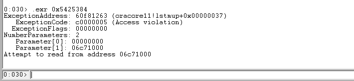

可以对异常地址处的指令进行反汇编查看对应的指令内容`u 60f81263 60f81263+40`

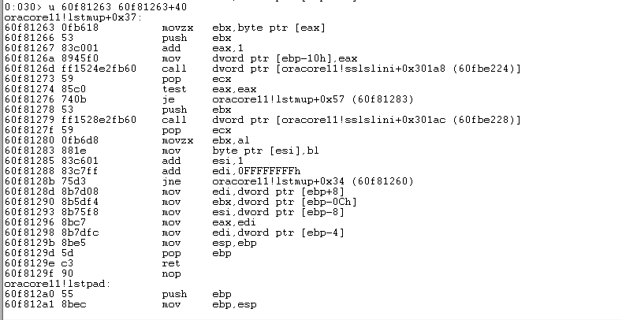

这个地址是执行oracore11.dll内部的汇编指令

## 初步分析线程

`~`查看线程ID、线程teb信息等

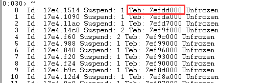

`!teb 线程块编号`查看LastError等信息

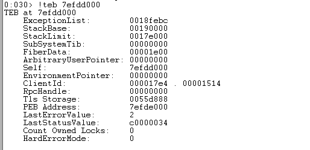

`~ 线程号 kv`可以查看线程的调用栈信息

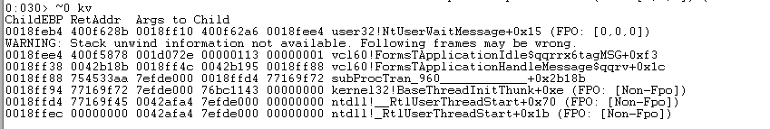

`~ 线程号 r`可以查看当前线程的寄存器内容，以及接下来要执行的指令地址、指令内容等

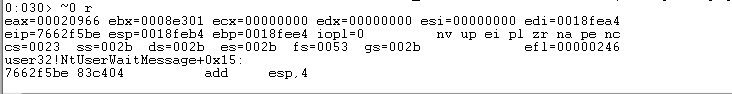

上面看到针对30号线程分析了其异常，然后去看一下这个线程的调用栈、寄存器内容

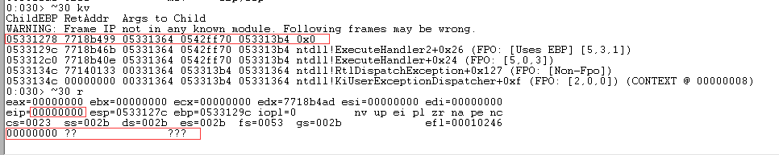

执行`!analyze -v`看到运行到`60f81263 (oracore11!lstmup+0x00000037)`地址处出现了异常，是在`Attempt to read from address 06c71000`出现的异常。

>还可以执行`!address 地址`查看这块地址的更多信息

但是这里查看30号线程的调用栈和寄存器，eip寄存器的值竟然是0、调用栈也是乱的。这他妈就不好查了

## 重点分析30号线程

当前dump文件中一共有37(0~36)条线程


是30号线程导致进程崩溃的，`.ttime`命令查看30号线程的创建时间、内核态时间、用户态时间

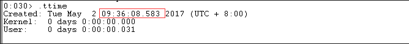

结合业务本身分析，23号线程是我自己创建的工作线程，我是知道这个23号线程是具体做什么工作的（这个和具体的业务代码实现有关，我在此就不多说），但是30号线程具体是做什么的，我却不清楚，可能很多基础的API、DLL内部会创建线程

切换到23号线程，查看23号线程的创建时间、内核态时间、用户态时间

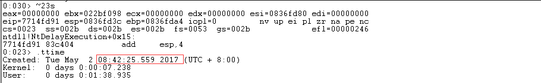

>23号线程的创建时间为08:42:25，基本就是这个进程的启动时间，但是30号线程的创建时间是09:26:08，所以很明显，30号线程创建的时间很异常

>而且运行时间也很短，很异常

再去分析另几个典型线程

28号线程是第三方API说明书中提到的工作线程。其创建时间和23号我自己程序中的工作线程差不多

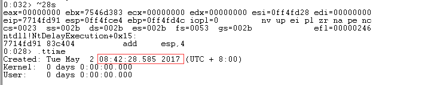

再去看30号线程前后几个线程：29、31、32、33。可以看到其创建都远远晚于进程的创建时间，而且内核态、用户态工作时间都很少


现在30号线程的寄存器和调用栈确实是坏掉了，在只有dump文件的情况下没有办法通过实际运行进程来获取更多信息。那么只能找到和30号线程类似的线程来进行分析

## 分析类似线程

选择29、31号线程

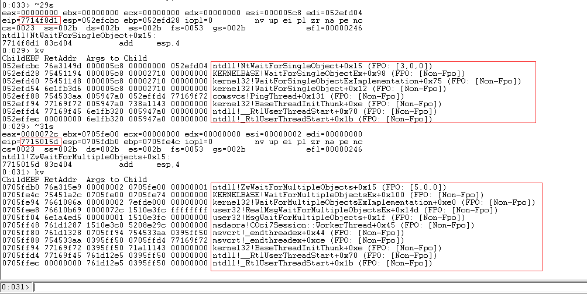

在29号线程的调用栈分析中，看到了比较异常的dll和函数`comsvcs!PingThread`，在31号线程的调用栈分析中，看到了比较异常的dll和函数`msvcrt!_endthreadex`以及`msdaora!COci7Session::WorkerThread`

因为这些dll是我这个程序没有直接用到的东西，也不是我熟悉的dll，所以我要去查一下这几个dll是干嘛的

先看comsvcs，根据其路径基本可以判断其是系统级别的dll，对应我也在我的Win7相应目录找到了这个dll文件

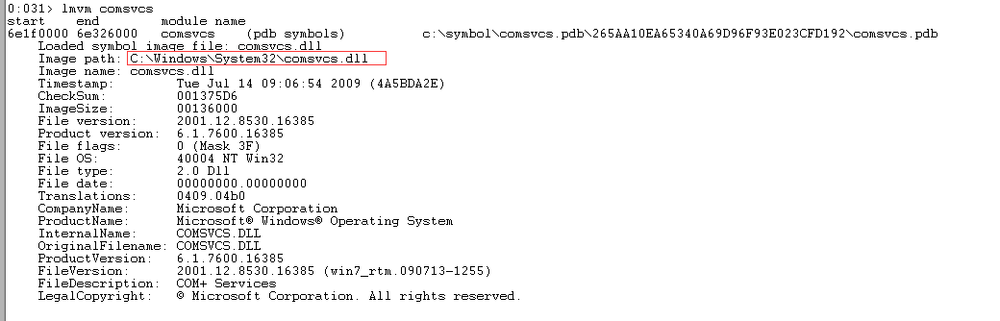

>补充：comsvcs.dll用于COM+服务

再去看msdaora。看到其目录中的Ole DB，大概可以猜到其与数据库相关

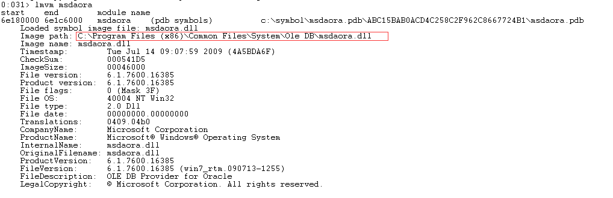

>补充：该dll和数据库管理有关系

再看msvcrt

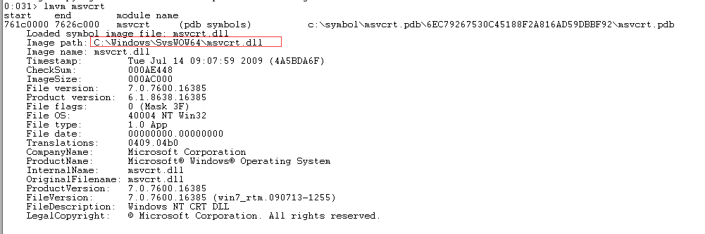

>补充：msvcrt.dll是微软在Windows操作系统中提供的C语言运行库执行文件。其中提供了printf、malloc、strcpy等C语言库函数的具体运行实现，并为使用C/C++(VC)编译的程序提供了初始化（如获取命令行参数）以及退出等功能

猜测：这些都是和数据库相关的，而且之前的30号线程虽然堆栈乱了，但是在`!analyze -v`的时候，错误是和`oracore11!lstmup`相关的！！

## 为什么会创建这几个线程？

上面猜测29、30、31都是和数据库相关的线程，那么

* 为什么会创建这几个线程？
* 为什么创建这几个线程的时间远晚于进程创建时间？
* 到底是谁创建的这几个线程？

这几个问题是继续排查这个问题的关键！但是到目前为止这几个问题都很难回答

>后面公司技术专家说这几个线程是Oracle客户端线程

>疑问：这些线程到底是不是Oracle客户端线程？如果是Oracle客户端线程，那么是谁创建的？如果是Oracle客户端线程，那么这个线程是做什么工作的？如果是是Oracle客户端线程，那么这个线程在什么情况下会被创建？

## 对比dump

崩溃出现多次，也产生多个dump文件，对比一下

### 2017-05-02 10:03:52

30号线程导致崩溃

```
0:030> kv
ChildEBP RetAddr  Args to Child              
WARNING: Frame IP not in any known module. Following frames may be wrong.
05331278 7718b499 05331364 0542ff70 053313b4 0x0
0533129c 7718b46b 05331364 0542ff70 053313b4 ntdll!ExecuteHandler2+0x26 (FPO: [Uses EBP] [5,3,1])
053312c0 7718b40e 05331364 0542ff70 053313b4 ntdll!ExecuteHandler+0x24 (FPO: [5,0,3])
0533134c 77140133 00331364 053313b4 05331364 ntdll!RtlDispatchException+0x127 (FPO: [Non-Fpo])
0533134c 00000000 00331364 053313b4 05331364 ntdll!KiUserExceptionDispatcher+0xf (FPO: [2,0,0]) (CONTEXT @ 00000008)

0:030> .ttime
Created: Tue May  2 09:36:08.583 2017 (UTC + 8:00)
Kernel:  0 days 0:00:00.000
User:    0 days 0:00:00.031
```

`!analyze -v`分析为oracore11.dll内部地址报错

分析日志：09:36:08，取委托InPara在下行打印，直到崩溃时（10:03:52）也没有输出

取委托线程堆栈

```
0:012> kv
ChildEBP RetAddr  Args to Child              
071aeff8 76a3149d 00000710 00000000 00000000 ntdll!NtWaitForSingleObject+0x15 (FPO: [3,0,0])
071af064 75451194 00000710 ffffffff 00000000 KERNELBASE!WaitForSingleObjectEx+0x98 (FPO: [Non-Fpo])
071af07c 75451148 00000710 ffffffff 00000000 kernel32!WaitForSingleObjectExImplementation+0x75 (FPO: [Non-Fpo])
071af090 6e1a3ffd 00000710 ffffffff 05055e30 kernel32!WaitForSingleObject+0x12 (FPO: [Non-Fpo])
071af0ac 6e1a4543 00000016 00000009 071af0c8 msdaora!COci7Session::OCI7Call+0x5d (FPO: [Non-Fpo])
071af11c 6e1a4b2b 05055e30 15083658 00000016 msdaora!COci::OCI7Call+0x43 (FPO: [Non-Fpo])
071af198 6e1a515b 05055e30 15083658 1510a510 msdaora!COci::olog+0xdb (FPO: [Non-Fpo])
071af1d4 6e1b353f 15083658 00000001 1506ede0 msdaora!COci7Session::Connect+0xeb (FPO: [Non-Fpo])
071af230 6e3662a3 00000004 52790428 15152a4c msdaora!CDataSource::Initialize+0x1af (FPO: [Non-Fpo])
071af264 6e36691f 15ba79bc 527904d4 15ca749c oledb32!CDBInitialize::DoInitialize+0x4c (FPO: [Non-Fpo])
071af298 6e35c18e 15152a4c 52790518 152b0fcc oledb32!CDBInitialize::Initialize+0xc7 (FPO: [Non-Fpo])
071af354 6e1f967b 150c8934 071af404 071af428 oledb32!CDCMPool::CreateResource+0x49d (FPO: [Non-Fpo])
071af394 6e1fb09b 152b0fcc 071af404 071af428 comsvcs!CHolder::SafeDispenserDriver::CreateResource+0x25 (FPO: [Non-Fpo])
071af3e4 6e35d350 00000000 071af404 071af428 comsvcs!CHolder::AllocResource+0x301 (FPO: [Non-Fpo])
071af430 6e36817c 150dac28 15ca7490 15ca7444 oledb32!CDCMPool::DrawResource+0x1eb (FPO: [Non-Fpo])
071af4a0 6e35d06b 150dac28 15ca7490 00000017 oledb32!CDCMPoolManager::DrawResource+0x51c (FPO: [Non-Fpo])
071af534 6e461cda 15ca74a0 52744707 15104188 oledb32!CDPO::Initialize+0x2c9 (FPO: [Non-Fpo])
WARNING: Stack unwind information not available. Following frames may be wrong.
071af654 6e461bdf 15104188 00040eda 15103f10 msado15!DllGetClassObject+0x2e5b
071af668 6e460e41 15104188 00000000 1515c390 msado15!DllGetClassObject+0x2d60
071af868 6e4bad56 00103f10 00000000 00000000 msado15!DllGetClassObject+0x1fc2
071af8c8 6e4bbebf 071af900 00000007 00b38280 msado15!DllGetClassObject+0x5bed7
071af90c 04799405 1515c390 00000008 00000000 msado15!DllGetClassObject+0x5d040
071af950 04799361 00000000 005dc21c 04792d40 goldtransfer_960+0x29405
071af9a8 04799a86 071af9c0 0000712b 005dc21c goldtransfer_960+0x29361
071af9c0 04799ad6 005dc21c 0865c7a0 0479f682 goldtransfer_960+0x29a86
071af9ec 047a1888 071afa28 047a18a6 071afa0c goldtransfer_960+0x29ad6
071afa0c 4002e53c 178a0764 4002ea31 4002d394 goldtransfer_960+0x31888
071afa40 047aa8ec 071afa54 047ac550 071afd24 rtl60!ClassesTStringListChanged$qqrv+0x18
071afd24 047c82e7 071afd50 047c84f3 071afd48 goldtransfer_960+0x3a8ec
071afd48 0228129e 071afd7c 02281335 071afd70 goldtransfer_960!InterfaceFunction+0x177
071afd70 022c862a 071afe18 071afd9c 022c8642 unigemstask+0x4129e
071afd94 022c1c40 071afda8 022c1e87 071afe28 unigemstask!RunUniGemsTrade+0x890e
071afe28 022c0472 00000001 00000000 00b8e6a1 unigemstask!RunUniGemsTrade+0x1f24
071afe9c 022bfd2d 071afeec 0040d950 03c2a920 unigemstask!RunUniGemsTrade+0x756
071afea4 0040d950 03c2a920 00000001 071afec0 unigemstask!RunUniGemsTrade+0x11
071afeec 0034450d 071aff4c 00344517 071aff44 subProcTran_960____________+0xd950
071aff44 400375af 071aff58 400375b9 071aff74 hsexception!SetLogPath+0x47c61
071aff74 400067ce 071affc4 40006148 071aff88 rtl60!ClassesCheckSynchronize$qqrv+0x163
071aff88 754533aa 00b95930 071affd4 77169f72 rtl60!SystemAssert$qqrx17SystemAnsiStringt1i+0x4a
071aff94 77169f72 00b95930 71be1143 00000000 kernel32!BaseThreadInitThunk+0xe (FPO: [Non-Fpo])
071affd4 77169f45 400067a4 00b95930 00000000 ntdll!__RtlUserThreadStart+0x70 (FPO: [Non-Fpo])
071affec 00000000 400067a4 00b95930 00000000 ntdll!_RtlUserThreadStart+0x1b (FPO: [Non-Fpo])
```

### 2017-05-03 21:44:47

框架日志报错

```
133[警告]2017-05-03 21:43:43:<金交所竞价交易统一报盘>[ErrCode=6]-刷新竞价交易行情线程出现异常：Access violation at address 6E429867 in module 'MSDART.DLL'. Read of address 00000008
134[警告]2017-05-03 21:43:43:<金交所竞价交易统一报盘>[ErrCode=6]-刷新竞价交易行情线程出现异常：Access violation at address 6E429867 in module 'MSDART.DLL'. Read of address 00000008
135[警告]2017-05-03 21:43:43:<金交所竞价交易统一报盘>[ErrCode=6]-刷新竞价交易行情线程出现异常：Access violation at address 6E429867 in module 'MSDART.DLL'. Read of address 00000008
136[警告]2017-05-03 21:43:43:<金交所竞价交易统一报盘>[ErrCode=6]-刷新竞价交易行情线程出现异常：Access violation at address 6E429867 in module 'MSDART.DLL'. Read of address 00000008
137[警告]2017-05-03 21:43:43:<金交所竞价交易统一报盘>[ErrCode=6]-刷新竞价交易行情线程出现异常：Access violation at address 7715E3BE in module 'ntdll.dll'. Read of address 38643812
138[警告]2017-05-03 21:43:43:<金交所竞价交易统一报盘>[ErrCode=6]-刷新竞价交易行情线程出现异常：Access violation at address 6E429867 in module 'MSDART.DLL'. Read of address 00000008
139[警告]2017-05-03 21:43:43:<金交所竞价交易统一报盘>[ErrCode=6]-刷新竞价交易行情线程出现异常：Access violation at address 6E429867 in module 'MSDART.DLL'. Read of address 00000008
140[警告]2017-05-03 21:43:43:<金交所竞价交易统一报盘>[ErrCode=6]-刷新竞价交易行情线程出现异常：Access violation at address 771C2DC2 in module 'ntdll.dll'. Read of address 2DD92E9E
141[警告]2017-05-03 21:43:43:<金交所竞价交易统一报盘>[ErrCode=6]-刷新竞价交易行情线程出现异常：Access violation at address 6E429867 in module 'MSDART.DLL'. Read of address 000002C5
142[警告]2017-05-03 21:43:43:<金交所竞价交易统一报盘>[ErrCode=6]-刷新竞价交易行情线程出现异常：Access violation at address 6E429867 in module 'MSDART.DLL'. Read of address 00000008
143[警告]2017-05-03 21:43:43:<金交所竞价交易统一报盘>[ErrCode=6]-刷新竞价交易行情线程出现异常：Access violation at address 771C2DC2 in module 'ntdll.dll'. Read of address 2DD92DC4
144[警告]2017-05-03 21:43:43:<金交所竞价交易统一报盘>[ErrCode=6]-刷新竞价交易行情线程出现异常：Access violation at address 7715E41B in module 'ntdll.dll'. Write of address 00000000
145[警告]2017-05-03 21:43:43:<金交所竞价交易统一报盘>[ErrCode=6]-刷新竞价交易行情线程出现异常：Access violation at address 6E429867 in module 'MSDART.DLL'. Read of address 00000008
146[警告]2017-05-03 21:43:43:<金交所竞价交易统一报盘>[ErrCode=6]-刷新竞价交易行情线程出现异常：Access violation at address 76393D52 in module 'ole32.dll'. Read of address 00000200
147[警告]2017-05-03 21:43:43:<金交所竞价交易统一报盘>[ErrCode=6]-刷新竞价交易行情线程出现异常：Access violation at address 6E429867 in module 'MSDART.DLL'. Read of address 000002B0
148[警告]2017-05-03 21:43:43:<金交所竞价交易统一报盘>[ErrCode=6]-刷新竞价交易行情线程出现异常：Access violation at address 6E429867 in module 'MSDART.DLL'. Read of address 00000304
149[警告]2017-05-03 21:43:43:<金交所竞价交易统一报盘>[ErrCode=6]-刷新竞价交易行情线程出现异常：Access violation at address 771679ED in module 'ntdll.dll'. Write of address 150040A8
150[警告]2017-05-03 21:43:43:<金交所竞价交易统一报盘>[ErrCode=6]-刷新竞价交易行情线程出现异常：Access violation at address 6E429867 in module 'MSDART.DLL'. Read of address 2DD92F50
151[警告]2017-05-03 21:43:43:<金交所竞价交易统一报盘>[ErrCode=6]-刷新竞价交易行情线程出现异常：Access violation at address 77163FCB in module 'ntdll.dll'. Read of address 00000000
152[警告]2017-05-03 21:43:43:<金交所竞价交易统一报盘>[ErrCode=6]-刷新竞价交易行情线程出现异常：Access violation at address 6E429867 in module 'MSDART.DLL'. Read of address 00000008
153[警告]2017-05-03 21:43:43:<金交所竞价交易统一报盘>[ErrCode=6]-刷新竞价交易行情线程出现异常：Access violation at address 6E429867 in module 'MSDART.DLL'. Read of address 000002EF
154[警告]2017-05-03 21:43:43:<金交所竞价交易统一报盘>[ErrCode=6]-刷新竞价交易行情线程出现异常：Access violation at address 77163FA9 in module 'ntdll.dll'. Read of address FFFFFFF8
155[警告]2017-05-03 21:43:43:<金交所竞价交易统一报盘>[ErrCode=6]-刷新竞价交易行情线程出现异常：Access violation at address 77163FA9 in module 'ntdll.dll'. Read of address FFFFFFF8
156[警告]2017-05-03 21:43:43:<金交所竞价交易统一报盘>[ErrCode=6]-刷新竞价交易行情线程出现异常：Access violation at address 77163FA9 in module 'ntdll.dll'. Read of address FFFFFFF8
157[警告]2017-05-03 21:43:44:<金交所竞价交易统一报盘>[ErrCode=6]-刷新竞价交易行情线程出现异常：存储空间不足，无法完成此操作。
158[警告]2017-05-03 21:43:44:<金交所竞价交易统一报盘>[ErrCode=6]-刷新竞价交易行情线程出现异常：存储空间不足，无法完成此操作。
159[警告]2017-05-03 21:43:44:<金交所竞价交易统一报盘>[ErrCode=6]-刷新竞价交易行情线程出现异常：存储空间不足，无法完成此操作。
160[警告]2017-05-03 21:43:44:<金交所竞价交易统一报盘>[ErrCode=6]-刷新竞价交易行情线程出现异常：存储空间不足，无法完成此操作。
161[警告]2017-05-03 21:43:44:<金交所竞价交易统一报盘>[ErrCode=6]-刷新竞价交易行情线程出现异常：存储空间不足，无法完成此操作。
162[警告]2017-05-03 21:43:44:<金交所竞价交易统一报盘>[ErrCode=6]-刷新竞价交易行情线程出现异常：存储空间不足，无法完成此操作。
163[警告]2017-05-03 21:43:44:<金交所竞价交易统一报盘>[ErrCode=6]-刷新竞价交易行情线程出现异常：存储空间不足，无法完成此操作。
164[警告]2017-05-03 21:43:44:<金交所竞价交易统一报盘>[ErrCode=6]-刷新竞价交易行情线程出现异常：存储空间不足，无法完成此操作。
165[警告]2017-05-03 21:43:44:<金交所竞价交易统一报盘>[ErrCode=6]-刷新竞价交易行情线程出现异常：存储空间不足，无法完成此操作。
166[警告]2017-05-03 21:43:44:<金交所竞价交易统一报盘>[ErrCode=6]-刷新竞价交易行情线程出现异常：存储空间不足，无法完成此操作。
167[警告]2017-05-03 21:43:44:<金交所竞价交易统一报盘>[ErrCode=6]-刷新竞价交易行情线程出现异常：存储空间不足，无法完成此操作。
168[警告]2017-05-03 21:43:44:<金交所竞价交易统一报盘>[ErrCode=6]-刷新竞价交易行情线程出现异常：存储空间不足，无法完成此操作。
169[警告]2017-05-03 21:43:44:<金交所竞价交易统一报盘>[ErrCode=6]-刷新竞价交易行情线程出现异常：存储空间不足，无法完成此操作。
170[警告]2017-05-03 21:43:44:<金交所竞价交易统一报盘>[ErrCode=6]-刷新竞价交易行情线程出现异常：存储空间不足，无法完成此操作。
171[警告]2017-05-03 21:43:44:<金交所竞价交易统一报盘>[ErrCode=6]-刷新竞价交易行情线程出现异常：存储空间不足，无法完成此操作。
172[警告]2017-05-03 21:43:44:<金交所竞价交易统一报盘>[ErrCode=6]-刷新竞价交易行情线程出现异常：存储空间不足，无法完成此操作。
173[警告]2017-05-03 21:43:44:<金交所竞价交易统一报盘>[ErrCode=6]-刷新竞价交易行情线程出现异常：存储空间不足，无法完成此操作。
174[警告]2017-05-03 21:43:44:<金交所竞价交易统一报盘>[ErrCode=6]-刷新竞价交易行情线程出现异常：存储空间不足，无法完成此操作。
175[警告]2017-05-03 21:43:44:<金交所竞价交易统一报盘>[ErrCode=6]-刷新竞价交易行情线程出现异常：存储空间不足，无法完成此操作。
176[警告]2017-05-03 21:43:44:<金交所竞价交易统一报盘>[ErrCode=6]-刷新竞价交易行情线程出现异常：存储空间不足，无法完成此操作。
177[警告]2017-05-03 21:43:44:<金交所竞价交易统一报盘>[ErrCode=6]-刷新竞价交易行情线程出现异常：存储空间不足，无法完成此操作。
178[警告]2017-05-03 21:43:44:<金交所竞价交易统一报盘>[ErrCode=6]-刷新竞价交易行情线程出现异常：存储空间不足，无法完成此操作。
179[警告]2017-05-03 21:43:44:<金交所竞价交易统一报盘>[ErrCode=6]-刷新竞价交易行情线程出现异常：存储空间不足，无法完成此操作。
180[警告]2017-05-03 21:43:44:<金交所竞价交易统一报盘>[ErrCode=6]-刷新竞价交易行情线程出现异常：存储空间不足，无法完成此操作。
181[警告]2017-05-03 21:43:44:<金交所竞价交易统一报盘>[ErrCode=6]-刷新竞价交易行情线程出现异常：存储空间不足，无法完成此操作。
182[警告]2017-05-03 21:43:44:<金交所竞价交易统一报盘>[ErrCode=6]-刷新竞价交易行情线程出现异常：存储空间不足，无法完成此操作。
183[警告]2017-05-03 21:43:44:<金交所竞价交易统一报盘>[ErrCode=6]-刷新竞价交易行情线程出现异常：存储空间不足，无法完成此操作。
184[警告]2017-05-03 21:43:44:<金交所竞价交易统一报盘>[ErrCode=6]-刷新竞价交易行情线程出现异常：存储空间不足，无法完成此操作。
185[警告]2017-05-03 21:43:44:<金交所竞价交易统一报盘>[ErrCode=6]-刷新竞价交易行情线程出现异常：存储空间不足，无法完成此操作。
186[警告]2017-05-03 21:43:44:<金交所竞价交易统一报盘>[ErrCode=6]-刷新竞价交易行情线程出现异常：存储空间不足，无法完成此操作。
187[警告]2017-05-03 21:43:44:<金交所竞价交易统一报盘>[ErrCode=6]-刷新竞价交易行情线程出现异常：存储空间不足，无法完成此操作。
188[警告]2017-05-03 21:43:44:<金交所竞价交易统一报盘>[ErrCode=6]-刷新竞价交易行情线程出现异常：存储空间不足，无法完成此操作。
189[警告]2017-05-03 21:43:44:<金交所竞价交易统一报盘>[ErrCode=6]-刷新竞价交易行情线程出现异常：存储空间不足，无法完成此操作。
190[警告]2017-05-03 21:43:44:<金交所竞价交易统一报盘>[ErrCode=6]-刷新竞价交易行情线程出现异常：存储空间不足，无法完成此操作。
191[警告]2017-05-03 21:43:44:<金交所竞价交易统一报盘>[ErrCode=6]-刷新竞价交易行情线程出现异常：存储空间不足，无法完成此操作。
192[警告]2017-05-03 21:43:44:<金交所竞价交易统一报盘>[ErrCode=6]-刷新竞价交易行情线程出现异常：存储空间不足，无法完成此操作。
193[警告]2017-05-03 21:43:44:<金交所竞价交易统一报盘>[ErrCode=6]-刷新竞价交易行情线程出现异常：存储空间不足，无法完成此操作。
194[警告]2017-05-03 21:43:44:<金交所竞价交易统一报盘>[ErrCode=6]-刷新竞价交易行情线程出现异常：存储空间不足，无法完成此操作。
195[警告]2017-05-03 21:43:44:<金交所竞价交易统一报盘>[ErrCode=6]-刷新竞价交易行情线程出现异常：存储空间不足，无法完成此操作。
196[警告]2017-05-03 21:43:44:<金交所竞价交易统一报盘>[ErrCode=6]-刷新竞价交易行情线程出现异常：存储空间不足，无法完成此操作。
197[警告]2017-05-03 21:43:44:<金交所竞价交易统一报盘>[ErrCode=6]-刷新竞价交易行情线程出现异常：存储空间不足，无法完成此操作。
198[警告]2017-05-03 21:43:44:<金交所竞价交易统一报盘>[ErrCode=6]-刷新竞价交易行情线程出现异常：存储空间不足，无法完成此操作。
199[警告]2017-05-03 21:43:45:<金交所竞价交易统一报盘>[ErrCode=6]-刷新竞价交易行情线程出现异常：存储空间不足，无法完成此操作。
200[警告]2017-05-03 21:43:45:<金交所竞价交易统一报盘>[ErrCode=6]-刷新竞价交易行情线程出现异常：存储空间不足，无法完成此操作。
201[警告]2017-05-03 21:43:45:<金交所竞价交易统一报盘>[ErrCode=6]-刷新竞价交易行情线程出现异常：存储空间不足，无法完成此操作。
202[警告]2017-05-03 21:43:45:<金交所竞价交易统一报盘>[ErrCode=6]-刷新竞价交易行情线程出现异常：存储空间不足，无法完成此操作。
203[警告]2017-05-03 21:43:45:<金交所竞价交易统一报盘>[ErrCode=6]-刷新竞价交易行情线程出现异常：存储空间不足，无法完成此操作。
204[警告]2017-05-03 21:43:45:<金交所竞价交易统一报盘>[ErrCode=6]-刷新竞价交易行情线程出现异常：存储空间不足，无法完成此操作。
205[警告]2017-05-03 21:43:45:<金交所竞价交易统一报盘>[ErrCode=6]-刷新竞价交易行情线程出现异常：存储空间不足，无法完成此操作。
206[警告]2017-05-03 21:43:45:<金交所竞价交易统一报盘>[ErrCode=6]-刷新竞价交易行情线程出现异常：存储空间不足，无法完成此操作。
207[警告]2017-05-03 21:43:45:<金交所竞价交易统一报盘>[ErrCode=6]-刷新竞价交易行情线程出现异常：存储空间不足，无法完成此操作。
208[警告]2017-05-03 21:43:45:<金交所竞价交易统一报盘>[ErrCode=6]-刷新竞价交易行情线程出现异常：存储空间不足，无法完成此操作。
209[警告]2017-05-03 21:43:45:<金交所竞价交易统一报盘>[ErrCode=6]-刷新竞价交易行情线程出现异常：存储空间不足，无法完成此操作。
210[警告]2017-05-03 21:43:45:<金交所竞价交易统一报盘>[ErrCode=6]-刷新竞价交易行情线程出现异常：存储空间不足，无法完成此操作。
211[警告]2017-05-03 21:43:45:<金交所竞价交易统一报盘>[ErrCode=6]-刷新竞价交易行情线程出现异常：存储空间不足，无法完成此操作。
212[警告]2017-05-03 21:43:45:<金交所竞价交易统一报盘>[ErrCode=6]-刷新竞价交易行情线程出现异常：存储空间不足，无法完成此操作。
213[警告]2017-05-03 21:43:45:<金交所竞价交易统一报盘>[ErrCode=6]-刷新竞价交易行情线程出现异常：存储空间不足，无法完成此操作。
214[警告]2017-05-03 21:43:45:<金交所竞价交易统一报盘>[ErrCode=6]-刷新竞价交易行情线程出现异常：存储空间不足，无法完成此操作。
215[警告]2017-05-03 21:43:45:<金交所竞价交易统一报盘>[ErrCode=6]-刷新竞价交易行情线程出现异常：存储空间不足，无法完成此操作。
216[警告]2017-05-03 21:43:45:<金交所竞价交易统一报盘>[ErrCode=6]-刷新竞价交易行情线程出现异常：存储空间不足，无法完成此操作。
217[警告]2017-05-03 21:43:45:<金交所竞价交易统一报盘>[ErrCode=6]-刷新竞价交易行情线程出现异常：存储空间不足，无法完成此操作。
218[警告]2017-05-03 21:43:45:<金交所竞价交易统一报盘>[ErrCode=6]-刷新竞价交易行情线程出现异常：存储空间不足，无法完成此操作。
219[警告]2017-05-03 21:43:45:<金交所竞价交易统一报盘>[ErrCode=6]-刷新竞价交易行情线程出现异常：存储空间不足，无法完成此操作。
220[警告]2017-05-03 21:43:45:<金交所竞价交易统一报盘>[ErrCode=6]-刷新竞价交易行情线程出现异常：存储空间不足，无法完成此操作。
221[警告]2017-05-03 21:43:45:<金交所竞价交易统一报盘>[ErrCode=6]-刷新竞价交易行情线程出现异常：存储空间不足，无法完成此操作。
222[警告]2017-05-03 21:43:45:<金交所竞价交易统一报盘>[ErrCode=6]-刷新竞价交易行情线程出现异常：存储空间不足，无法完成此操作。
223[警告]2017-05-03 21:43:45:<金交所竞价交易统一报盘>[ErrCode=6]-刷新竞价交易行情线程出现异常：存储空间不足，无法完成此操作。
224[警告]2017-05-03 21:43:45:<金交所竞价交易统一报盘>[ErrCode=6]-刷新竞价交易行情线程出现异常：存储空间不足，无法完成此操作。
225[警告]2017-05-03 21:43:45:<金交所竞价交易统一报盘>[ErrCode=6]-刷新竞价交易行情线程出现异常：存储空间不足，无法完成此操作。
226[警告]2017-05-03 21:43:45:<金交所竞价交易统一报盘>[ErrCode=6]-刷新竞价交易行情线程出现异常：存储空间不足，无法完成此操作。
227[警告]2017-05-03 21:43:45:<金交所竞价交易统一报盘>[ErrCode=6]-刷新竞价交易行情线程出现异常：存储空间不足，无法完成此操作。
228[警告]2017-05-03 21:43:45:<金交所竞价交易统一报盘>[ErrCode=6]-刷新竞价交易行情线程出现异常：存储空间不足，无法完成此操作。
229[警告]2017-05-03 21:43:45:<金交所竞价交易统一报盘>[ErrCode=6]-刷新竞价交易行情线程出现异常：存储空间不足，无法完成此操作。
230[警告]2017-05-03 21:43:45:<金交所竞价交易统一报盘>[ErrCode=6]-刷新竞价交易行情线程出现异常：存储空间不足，无法完成此操作。
231[警告]2017-05-03 21:43:45:<金交所竞价交易统一报盘>[ErrCode=6]-刷新竞价交易行情线程出现异常：存储空间不足，无法完成此操作。
232[警告]2017-05-03 21:43:45:<金交所竞价交易统一报盘>[ErrCode=6]-刷新竞价交易行情线程出现异常：存储空间不足，无法完成此操作。
233[警告]2017-05-03 21:43:45:<金交所竞价交易统一报盘>[ErrCode=6]-刷新竞价交易行情线程出现异常：存储空间不足，无法完成此操作。
234[警告]2017-05-03 21:43:45:<金交所竞价交易统一报盘>[ErrCode=6]-刷新竞价交易行情线程出现异常：存储空间不足，无法完成此操作。
235[警告]2017-05-03 21:43:45:<金交所竞价交易统一报盘>[ErrCode=6]-刷新竞价交易行情线程出现异常：存储空间不足，无法完成此操作。
236[警告]2017-05-03 21:43:45:<金交所竞价交易统一报盘>[ErrCode=6]-刷新竞价交易行情线程出现异常：存储空间不足，无法完成此操作。
237[警告]2017-05-03 21:43:45:<金交所竞价交易统一报盘>[ErrCode=6]-刷新竞价交易行情线程出现异常：存储空间不足，无法完成此操作。
238[警告]2017-05-03 21:43:45:<金交所竞价交易统一报盘>[ErrCode=6]-刷新竞价交易行情线程出现异常：存储空间不足，无法完成此操作。
239[警告]2017-05-03 21:43:45:<金交所竞价交易统一报盘>[ErrCode=6]-刷新竞价交易行情线程出现异常：存储空间不足，无法完成此操作。
240[警告]2017-05-03 21:43:45:<金交所竞价交易统一报盘>[ErrCode=6]-刷新竞价交易行情线程出现异常：存储空间不足，无法完成此操作。
241[警告]2017-05-03 21:43:45:<金交所竞价交易统一报盘>[ErrCode=6]-刷新竞价交易行情线程出现异常：存储空间不足，无法完成此操作。
242[警告]2017-05-03 21:43:45:<金交所竞价交易统一报盘>[ErrCode=6]-刷新竞价交易行情线程出现异常：存储空间不足，无法完成此操作。
243[警告]2017-05-03 21:43:45:<金交所竞价交易统一报盘>[ErrCode=6]-刷新竞价交易行情线程出现异常：存储空间不足，无法完成此操作。
244[警告]2017-05-03 21:43:45:<金交所竞价交易统一报盘>[ErrCode=6]-刷新竞价交易行情线程出现异常：存储空间不足，无法完成此操作。
245[警告]2017-05-03 21:43:45:<金交所竞价交易统一报盘>[ErrCode=6]-刷新竞价交易行情线程出现异常：存储空间不足，无法完成此操作。
246[警告]2017-05-03 21:43:45:<金交所竞价交易统一报盘>[ErrCode=6]-刷新竞价交易行情线程出现异常：存储空间不足，无法完成此操作。
247[警告]2017-05-03 21:43:45:<金交所竞价交易统一报盘>[ErrCode=6]-刷新竞价交易行情线程出现异常：存储空间不足，无法完成此操作。
248[警告]2017-05-03 21:43:45:<金交所竞价交易统一报盘>[ErrCode=6]-刷新竞价交易行情线程出现异常：存储空间不足，无法完成此操作。
249[警告]2017-05-03 21:43:45:<金交所竞价交易统一报盘>[ErrCode=6]-刷新竞价交易行情线程出现异常：存储空间不足，无法完成此操作。
250[警告]2017-05-03 21:43:45:<金交所竞价交易统一报盘>[ErrCode=6]-刷新竞价交易行情线程出现异常：存储空间不足，无法完成此操作。
251[警告]2017-05-03 21:43:45:<金交所竞价交易统一报盘>[ErrCode=6]-刷新竞价交易行情线程出现异常：存储空间不足，无法完成此操作。
252[警告]2017-05-03 21:43:45:<金交所竞价交易统一报盘>[ErrCode=6]-刷新竞价交易行情线程出现异常：存储空间不足，无法完成此操作。
253[警告]2017-05-03 21:43:45:<金交所竞价交易统一报盘>[ErrCode=6]-刷新竞价交易行情线程出现异常：存储空间不足，无法完成此操作。
254[警告]2017-05-03 21:43:45:<金交所竞价交易统一报盘>[ErrCode=6]-刷新竞价交易行情线程出现异常：存储空间不足，无法完成此操作。
255[警告]2017-05-03 21:43:45:<金交所竞价交易统一报盘>[ErrCode=6]-刷新竞价交易行情线程出现异常：存储空间不足，无法完成此操作。
256[警告]2017-05-03 21:43:45:<金交所竞价交易统一报盘>[ErrCode=6]-刷新竞价交易行情线程出现异常：存储空间不足，无法完成此操作。
257[错误]2017-05-03 21:43:50:<金交所竞价交易统一报盘>当前任务出现异常，子进程意外停止运行，现在尝试重新启动它
```

当时框架记录该任务进程的内存在250MB左右，排除内存占用过高导致的原因

这次崩溃的线程不是“异常”线程，而是行情刷新线程，其在发生上面的报错后，然后就出现了崩溃。查看其调用栈

```
0:024> kv
ChildEBP RetAddr  Args to Child              
0838f25c 7715e023 1508d4b8 00000000 1508d458 ntdll!RtlpLowFragHeapFree+0xc5 (FPO: [Non-Fpo])
0838f274 754514dd 04f40000 00000000 1508d4b8 ntdll!RtlFreeHeap+0x105 (FPO: [Non-Fpo])
0838f288 6e4212ae 04f40000 00000000 1508d4b8 kernel32!HeapFree+0x14 (FPO: [Non-Fpo])
0838f2a8 6e144b43 04f40000 1508d4b8 0d61cfb2 msdart!MpHeapFree+0x2e (FPO: [Non-Fpo])
0838f2f8 6e14515b 04f65e30 04f651d8 04f64d70 msdaora!COci::olog+0xf3 (FPO: [Non-Fpo])
0838f334 6e15353f 04f651d8 00000001 15046100 msdaora!COci7Session::Connect+0xeb (FPO: [Non-Fpo])
0838f390 6dfc62a3 00000004 0d61e108 1582a82c msdaora!CDataSource::Initialize+0x1af (FPO: [Non-Fpo])
0838f3c4 6dfc691f 150d5234 0d61e134 150021ac oledb32!CDBInitialize::DoInitialize+0x4c (FPO: [Non-Fpo])
0838f3f8 6dfbc18e 1582a82c 0d61e678 1573277c oledb32!CDBInitialize::Initialize+0xc7 (FPO: [Non-Fpo])
0838f4b4 6dd6967b 15000a54 0838f564 0838f588 oledb32!CDCMPool::CreateResource+0x49d (FPO: [Non-Fpo])
0838f4f4 6dd6b09b 1573277c 0838f564 0838f588 comsvcs!CHolder::SafeDispenserDriver::CreateResource+0x25 (FPO: [Non-Fpo])
0838f544 6dfbd350 00000000 0838f564 0838f588 comsvcs!CHolder::AllocResource+0x301 (FPO: [Non-Fpo])
0838f590 6dfc817c 04f6d9f0 150021a0 04f70b2c oledb32!CDCMPool::DrawResource+0x1eb (FPO: [Non-Fpo])
0838f600 6dfbd06b 04f6d9f0 150021a0 00000017 oledb32!CDCMPoolManager::DrawResource+0x51c (FPO: [Non-Fpo])
*** ERROR: Symbol file could not be found.  Defaulted to export symbols for msado15.dll - 
0838f694 6e451cda 150021b0 0d62e1be 04f79a10 oledb32!CDPO::Initialize+0x2c9 (FPO: [Non-Fpo])
WARNING: Stack unwind information not available. Following frames may be wrong.
0838f7b4 6e451bdf 04f79a10 00040eda 04f79798 msado15!DllGetClassObject+0x2e5b
0838f7c8 6e450e41 04f79a10 00000014 00000fb5 msado15!DllGetClassObject+0x2d60
*** WARNING: Unable to verify checksum for goldtransfer_960.dll
*** ERROR: Symbol file could not be found.  Defaulted to export symbols for goldtransfer_960.dll - 
0838f9c8 04525cdd 00f79798 00000000 00000000 msado15!DllGetClassObject+0x1fc2
0838f9f8 0450ee15 0838fe04 0138fe04 00980050 goldtransfer_960+0x25cdd
0838fa0c 045459a8 0838fa20 0454663d 0838fd34 goldtransfer_960+0xee15
0838fd34 0455835d 0838fd60 04558503 0838fd58 goldtransfer_960+0x459a8
*** ERROR: Symbol file could not be found.  Defaulted to export symbols for unigemstask.dll - 
0838fd58 0427129e 0838fd8c 04271335 0838fd80 goldtransfer_960!InterfaceFunction+0x1dd
0838fd80 042b8a78 0838fe04 0838fdc0 042b8aba unigemstask+0x4129e
0838fdb8 042b5262 0838fdcc 042b52d7 0838fe1c unigemstask!RunUniGemsTrade+0x8d5c
0838fe1c 042b070c 0000000c 00000000 009fe909 unigemstask!RunUniGemsTrade+0x5546
0838fe9c 042afd2d 0838feec 0040d950 03aca920 unigemstask!RunUniGemsTrade+0x9f0
*** ERROR: Module load completed but symbols could not be loaded for subProcTran_960_金交所竞价交易统一报盘.exe
0838fea4 0040d950 03aca920 0000000c 0838fec0 unigemstask!RunUniGemsTrade+0x11
*** WARNING: Unable to verify checksum for hsexception.dll
*** ERROR: Symbol file could not be found.  Defaulted to export symbols for hsexception.dll - 
0838feec 00a8450d 0838ff4c 00a84517 0838ff44 subProcTran_960____________+0xd950
*** WARNING: Unable to verify checksum for rtl60.bpl
*** ERROR: Symbol file could not be found.  Defaulted to export symbols for rtl60.bpl - 
0838ff44 400375af 0838ff58 400375b9 0838ff74 hsexception!SetLogPath+0x47c61
0838ff74 400067ce 0838ffc4 40006148 0838ff88 rtl60!ClassesCheckSynchronize$qqrv+0x163
0838ff88 754533aa 00a05cd0 0838ffd4 77169f72 rtl60!SystemAssert$qqrx17SystemAnsiStringt1i+0x4a
0838ff94 77169f72 00a05cd0 766b9c3b 00000000 kernel32!BaseThreadInitThunk+0xe (FPO: [Non-Fpo])
0838ffd4 77169f45 400067a4 00a05cd0 00000000 ntdll!__RtlUserThreadStart+0x70 (FPO: [Non-Fpo])
0838ffec 00000000 400067a4 00a05cd0 00000000 ntdll!_RtlUserThreadStart+0x1b (FPO: [Non-Fpo])
```

### 2017-05-05 21:58:31

框架报错

```
336[提示]2017-05-05 21:29:14:<金交所竞价交易统一报盘>交易员pny01028登录成功
337[提示]2017-05-05 21:29:16:<金交所竞价交易统一报盘>压缩文件完成
338[错误]2017-05-05 21:57:29:<金交所竞价交易统一报盘>取委托线程发生异常：数据源接口报错[GetNewOrder]：[err_no=4008]没有为命令对象设置命令。
339[错误]2017-05-05 21:57:33:<金交所竞价交易统一报盘>当前任务出现异常，子进程意外停止运行，现在尝试重新启动它
```

出问题的是21号线程，查看其调用堆栈、运行时间

```
0:021> kv
ChildEBP RetAddr  Args to Child              
WARNING: Stack unwind information not available. Following frames may be wrong.
07fc5728 066a35ac 07fc573c 06b43a70 ffffffff oracore11!lstmup+0x37
07fc5760 515ca7d8 80000000 54530056 00544500 oran11!ztvulp+0x16040
07fc5764 80000000 54530056 00544500 515ca7de 0x515ca7d8
07fc5768 54530056 00544500 515ca7de 80000000 0x80000000
07fc576c 00544500 515ca7de 80000000 54530050 0x54530056
07fc5770 515ca7de 80000000 54530050 00544500 0x544500
07fc5774 80000000 54530050 00544500 515ca7dc 0x515ca7de
07fc5778 54530050 00544500 515ca7dc 80000000 0x80000000
07fc577c 00544500 515ca7dc 80000000 54530046 0x54530050
07fc5780 515ca7dc 80000000 54530046 00544500 0x544500
07fc5784 80000000 54530046 00544500 515ca7d2 0x515ca7dc
07fc5788 54530046 00544500 515ca7d2 80000000 0x80000000
07fc578c 00544500 515ca7d2 80000000 52440010 0x54530046
07fc5790 515ca7d2 80000000 52440010 00535345 0x544500
07fc5794 80000000 52440010 00535345 515ca7d0 0x515ca7d2
07fc5798 52440010 00535345 515ca7d0 80000000 0x80000000
07fc579c 00535345 515ca7d0 80000000 474f000a 0x52440010
07fc57a0 515ca7d0 80000000 474f000a 004d4152 0x535345
07fc57a4 80000000 474f000a 004d4152 515ca7d6 0x515ca7d0
07fc57a8 474f000a 004d4152 515ca7d6 88000000 0x80000000
07fc57ac 004d4152 515ca7d6 88000000 000005b8 0x474f000a
07fc57b0 515ca7d6 88000000 000005b8 00544500 0x4d4152
07fc57b4 88000000 000005b8 00544500 515ca7d4 0x515ca7d6
07fc57b8 00000000 00544500 515ca7d4 80000000 0x88000000

0:021> .ttime
Created: Fri May  5 21:30:14.958 2017 (UTC + 8:00)
Kernel:  0 days 0:00:16.052
User:    0 days 0:01:19.139
```

### 2017-05-08 14:44:23

之前一直是竞价任务出现崩溃，其他几个金交所的任务都没有问题，但是5月8号ETF发行端任务也出现了崩溃问题

```
0:012> kv
ChildEBP RetAddr  Args to Child              
WARNING: Stack unwind information not available. Following frames may be wrong.
075255c8 065535ac 075255dc 06b03a70 ffffffff oracore11!lstmup+0x57
07525600 534b2ec6 80000000 3132005a 00000000 oran11!ztvulp+0x16040
07525604 80000000 3132005a 00000000 534b2ec0 0x534b2ec6
07525608 3132005a 00000000 534b2ec0 80000000 0x80000000
0752560c 00000000 534b2ec0 80000000 31320056 0x3132005a

0:012> .ttime
Created: Mon May  8 08:51:08.831 2017 (UTC + 8:00)
Kernel:  0 days 0:09:31.026
User:    0 days 0:19:16.061
```

不过其在用户态和内核态运行时间更长些

另外，报错地址不同，ETF发行端是oracore11!lstmup+0x00000057，竞价是oracore11!lstmup+0x00000037（后面分析更多dump，竞价也有在oracore11!lstmup+0x00000057崩溃的）

## 换成全新的ADO管理策略

>2017-05-10修改成新的方案后，在客户生产环境上进行验证

根据上面的分析（公司内部很多技术人员都参与了这个问题的分析），怀疑是不合理使用ADO造成的问题。但是依然无法根据dump文件、报错信息找到根本原因，那就只能去根据目前分析产生的怀疑去验证了

改用新的ADO管理方式：

* 我们的程序是多线程程序，几乎每个线程都会使用ADO和Oracle进行增删改查交互
* 目前的方式是，每个函数内部的ADOQuery、ADOConnection都是局部变量
	* 每次函数调用的时候都在函数内部创建ADOQuery、ADOConnection
	* 按理来说，这样的函数局部变量可以保证在多线程调用函数时是线程安全的
* 但是依然怀疑哪些地方使用的不合理导致线程安全问题，或者其他问题
* 所以改用新的ADO管理策略，保证线程安全
	* 使用一个线程安全的链表管理ADOConnection
	* 使用一个线程安全的链表管理ADOQuery
	* 每个链表的主键是线程ID
	* ADOConnection链表是每个线程对应一个ADOConnection对象
	* ADOQuery链表是每个线程对应一个链表，链表内部再有多个ADOQuery对象
	* 其中每个线程的所有ADOQuery共享这个线程的ADOConnection
	* 如此保证每个线程的ADOQuery是绝对线程安全的

改用成新的ADO管理策略后，在客户的生产环境上运行验证，从早上9点左右持续运行到下午3点40，持续运行6个多小时没有出现问题，基本可以证明新的ADO管理方式是有效的（当然还不能100%确定，接下来更多的的交易日都没有问题才敢确定确实没有问题了）

>所以这个后续还需要继续观察

## 在针对源码分析验证

突然发现自己之前转载过这样一篇文章[《Delphi多线程下的ADO编程》](http://www.xumenger.com/delphi-thread-ado-20151217/)，其中也讲到了一个关于多线程下ADO管理不合理导致的线程安全问题

再去看我们程序中使用ADO和数据库交互的代码，其中有两种使用ADO的方式

第一种：函数内部局部ADOQuery，同时创建对应的局部ADOConnection

```
function GetEntrust(InPara: string; var OutPara: string): Integer;
var
  qry: TADOQuery;
  conn: TADOConnection;
begin
  ...

  conn := TADOConnection.Create(nil);
  conn.ConnectionString := 'Provider=OraOLEDB.Oracle.1;Persist Security Info=False;User ID=trade;Password=trade;Data Source=MINE';
  conn.LoginPrompt := False;
  conn.Connected := True;

  qry := TADOQuery.Create(nil);
  qry.Connection := conn;

  qry.Close;
  qry.SQL.Clear;
  qry.SQL.Add('select * from tentrusts');
  qry.ExecSQL;

  ...
end;
```

第二种：函数内部局部ADOQuery，然后对其ConnectionString赋值

>基本所有的函数实现都是采用这种方式！第一种方式比较少

```
function GetEntrust(InPara: string; var OutPara: string): Integer;
var
  qry: TADOQuery;
begin
  ...

  ary := TADOQuery.Create(nil);
  qry.ConnectionString := 'Provider=OraOLEDB.Oracle.1;Persist Security Info=False;User ID=trade;Password=trade;Data Source=MINE';

  qry.Close;
  qry.SQL.Clear;
  qry.SQL.Add('select * from tentrusts');
  qry.ExecSQL;

  ...
end;
```

怀疑是第二种方式会导致线程安全问题，先去看了ADODB、DB单元的源码，也没有看出来什么头绪。实践是检验真理的唯一标准，所以就实现一个测试程序去试一下！

编写一个测试程序，测试这些情况。下面展示多线程模式下TADOQuery直接给ConnectionString赋值来建立连接

执行下面的SQL可以查看testADO进程和Oracle建立了多少连接

```
select count(*) from v$session t where t.PROGRAM like '%testADO%'
```

第一次打开程序，不做任何操作，查看连接数、线程数。只有主线程1个，而且此时还未和数据库建立连接

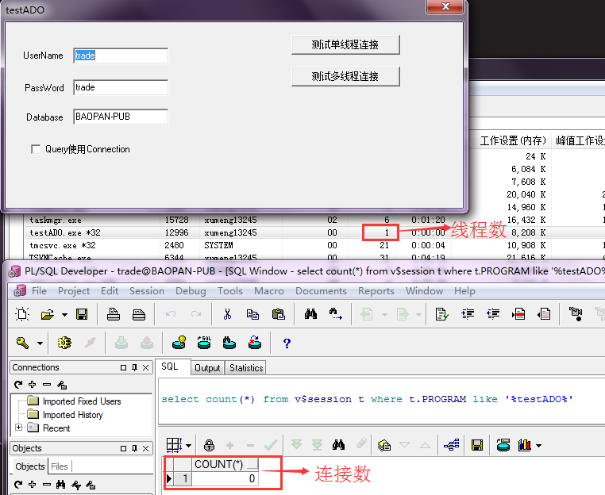

点击【测试多线程连接】按钮，创建3条线程持续和数据库建立连接

数据库连接是3，这个很好理解；线程数却不是4，而是12，所以多出来的8条线程就是Oracle客户端又多创建的线程，这也就解释了我们之前抓dump看到的那些所谓的异常线程

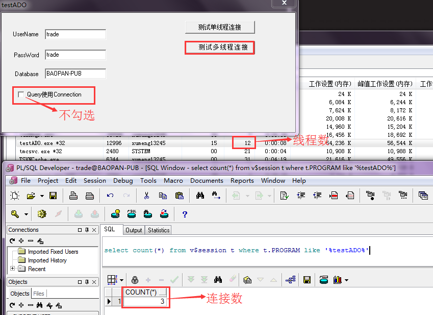

看能不能尝试复现这个问题，创建30个线程（直接修改代码，最终github上的代码也是写死30条线程的代码），使用ConnectionString方式，一直创建ADOQuery、释放ADOQuery，持续运行

但是感觉3条线程压力不够大，试着增加到30条线程看一下（直接修改代码）

刚运行时其线程数、连接数是这样的

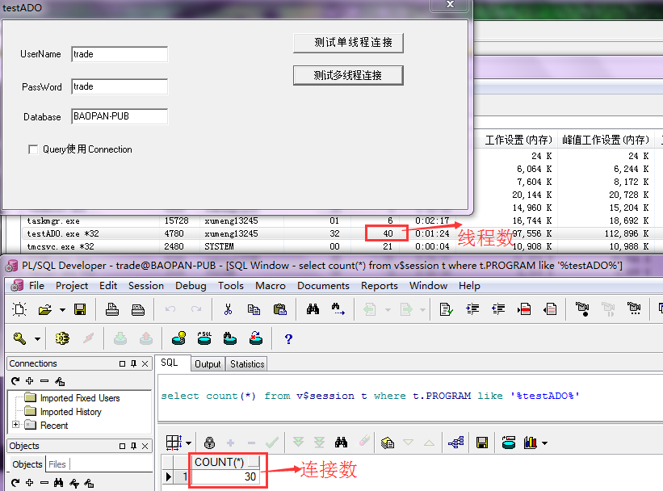

运行几分钟后，其线程数从40降到36，说明Oracle客户端创建的线程是动态变化的

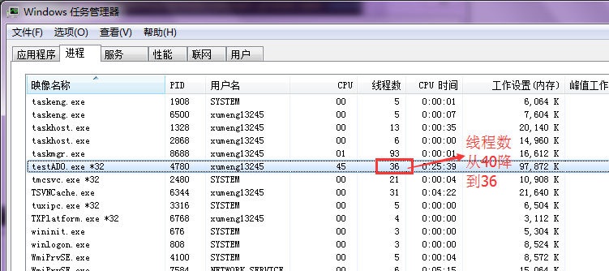

>同时可以看到，虽然起了30个线程、一直循环查询数据库，但是CPU（4核）占用率也才到45左右，说明数据库查询本身是IO操作（通过网络和磁盘进行IO，所以既涉及到网络IO，又涉及到磁盘IO），所以对CPU的占用并没有十分高！

>持续运行了2个多小时没有出现问题。可能运行的时间太短，后续继续加上时间再压力测试！另外也怀疑出问题的程序还是比较复杂，上面实现的测试程序还是太简单，并不能真正模拟出问题的程序，所以也就无法复现问题（所以这类问题确实很难排查啊）

2017-05-11继续排查这个问题，从早上9点开始运行。这时候再去看30条ADO查询线程，CPU占用率达到90%

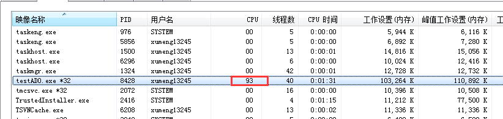

为什么昨天的才只有45%左右，而今天却达到了90%。很简单，因为两天运行的环境不同，昨天是在上海通过VPN连接到杭州公司的服务器，而今天就在杭州，所以可以看到网络IO对程序性能的影响！

从早上9点持续运行到下午2点，一共5个小时也没有出现任何问题。估计这个测试程序太简单，没有办法真正模拟有问题的程序！

## 简单总结

这个问题是我在第一家公司开发的黄金交易所项目时遇到的一个头疼的问题

去年五一去深圳前海开源出差，遇到了一个线程无法Suspend的诡异问题，第一次接触到软件调试这项技术（当然最后是公司技术专家使用WinDbg分析出来是因为进程的兼容性设置问题导致的），今年五一上线黄金交易项目又遇到了这个诡异的崩溃问题，也算是我在技术上的一种缘分似的经历吧

虽然像WinDbg、GDB这种调试、逆向工具十分强大，但不要过分迷信这些工具。像这次进程崩溃的问题排查过程中，我就是一直想着使用WinDbg去分析Dump文件，而忽略了去分析进程的日志，所以日志中的很多重要信息就被浪费了，比如一个功能号只打印了入参而没有打印出参（也就是说明对应的线程在这个功能号的处理中卡死了）的这个重要信息就一直被忽略了（相对于之前使用WinDbg分析dump获知某个异常的线程突然崩溃，现在通过日志本身又知道了自己创建的某个工作线程卡住了，所以明显两者相互结合获取了更多的有助于这个问题排查的信息，更有助于对于这个问题的进一步排查）

>所以不要过分迷信所谓强大的工具，更重要的是个人灵活应变的能力，能从各种资料中获取信息、能利用任何有用的资源……这才是最厉害的，而不是死抱着一种“工具”就以为自己天下无敌了

>强大的工具固然是重要，更重要的是使用它的人如何发挥它的厉害之处

>既能用绝世好剑斩杀对手，也能拿着树枝一击致命
