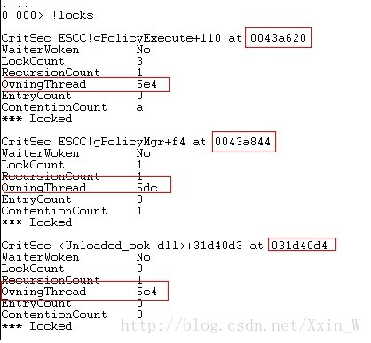
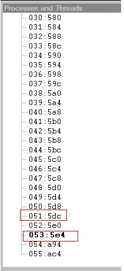
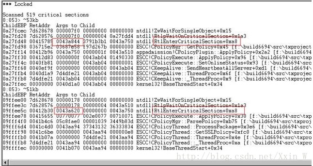

>转载自[《windbg定位死锁》](http://blog.csdn.net/xxin_w/article/details/8449855)

---

所谓死锁：是指两个或两个以上的进行在执行过程中，因争夺资源而造成的一种互相等待的现象，若无外力作用，它们都将无法推进下去

那么为什么会产生死锁呢？

* 因为系统资源不足
* 进程运行推进的顺序不合适
* 资源分配不当

而产生死锁的条件有四个：

* 互斥条件：所谓互斥条件就是进程在某一时间内独占资源
* 请求和保持条件：一个进程因请求资源而阻塞时，对已获得的资源保持不妨
* 不剥夺条件：进程已获取资源，在未使用完之前，不能强行剥夺
* 循环等待条件：若干线程之间形成一种头尾相接的循环等待资源关系

1.先用`!locks`查看所有线程占用的锁

这里可以看到有三个线程正在等待三个锁，第一个线程等待的锁是0043a620，但被5e4这条线程占用；第二个线程等待的锁是0043a844，但被5dc线程占用；第三个线程等待的锁是031d40d4，也被5e4线程占用

2.接着，我们需要查看5e4线程和5dc线程的id，具体可以查看工具栏中的Processes and Threads，如下图所示，5e4线程的id为53，5dc线程的id为51

3.分别输出`~53kb`和`~51kb`查看这两个线程的调用栈，结果如下图所示

由数据可知，5e4线程正在等待一把0043a844的锁，而5dc线程正在锁0043a620

4.结合第一步获取的信息可知：**5e4线程要去获取已经被5dc占用的锁0043a844，而5dc又要去获取已经被5e4占用的锁0043a620**，如此形成环路，就产生了死锁

>以上是分析临界区死锁的关键步骤