>转载[《Windbg调试命令详解》](http://www.yiiyee.cn/Blog/windbg/)

---

## 概述

用户成功安装微软Windows调试工具集后，能够在安装目录下发现四个调试器程序，分别是：cdb.exe、ntsd.exe、kd.exe和WinDbg.exe。其中cdb.exe和ntsd.exe只能调试用户程序，Kd.exe主要用于内核调试，有时候也用于用户态调试，上述三者的一个共同特点是，都只是控制台界面，以命令行形式工作

Windbg在用户态、内核态下都能够发挥调试功能，尤其重要的是，它不再是命令行格式而是采用了可视化的用户界面。所以绝大部分情况下，我们在谈及Windows调试工具的时候，都直接指Windbg，而不大谈及前三者

Windbg在用户态和内核态下都支持两种调试模式，即“实时调试模式”和“事后调试模式”。所谓实时模式，是指被调试的目标对象当前正在运行当中，调试器可以实时分析、修改被调试目标的状态，如寄存器、内存、变量，调试exe可执行程序或双机实时调试都属于这种模式；所谓事后模式，是被调试的目标对象已经结束了，现在只是事后对它保留的快照进行分析，这个快照成为转储文件（Dump文件）

Windbg另一重大优点，还在于它支持源码级的调试，就像VC自带的调试器一样

虽然提供了用户界面，但Windbg归根结底还是需要用户一个个地输入命令来指挥其行动，这就是他的Command窗口

每个调试命令都各有使用范围，有些命令只能用于内核调试，有些命令只能用于用户调试，有些命令只能用于活动调试。但用户不必记得这许多，一旦在某个环境下，使用了不被主持的命令，都会显示“No export XXX found”的字样。就拿`!process`命令；来说吧，它显示进程信息，但只能用于内核调试，如果在用户调试中使用，就是下面的情景

```
0:001> !process
No export process found
```

### 寻求帮助

我们首先来看如何在使用过程中获取有用的帮助。Windbg中的调试命令，分为三种：基本命令、元命令和扩展命令

基本命令和元命令是调试器自带的，元命令总是以`.`开头，而扩展命令是外部加入的，总是以感叹号`!`开始，各种调试命令成千上万，我们首先要想办法把它们都列举出来，并取得使用方法

基本命令最少，大概40个左右。列举所有的基本命令，使用`?`命令

元命令有100多个，使用下面的命令列举所有元命令：`.help [/D]`。如使用`/D`参数，命令列表将以DML格式显示。DML是一种类似于HTML的标识语言，下面会讲到。下图以DML格式显示所有以字母开头的元命令

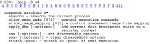

最后讲扩展命令。所谓扩展命令，顾名思义是可扩展的。扩展命令从动态链接库中暴露出来，一般以DLL文件名来代表一类扩展命令集，首先我们要搜索出系统中有多少个这样的DLL文件，使用命令`.chain [/D]`，此命令能够给出一个扩展命令的链表。和`.help`命令一样，也可以使用`/D`参数以DML格式显示，如下

```
0:001> .chain
Extension DLL search Path:
    C:\Program Files (x86)\Windows Kits\8.0\Debuggers\x64\WINXP;
Extension DLL chain:
    dbghelp: image 6.2.9200.20512, API 6.2.6, built Fri Sep 07 13:45:49 2012
        [path: C:\Program Files (x86)\Windows Kits\8.0\Debuggers\x64\dbghelp.dll]
    ext: image 6.2.9200.16384, API 1.0.0, built Thu Jul 26 10:11:33 2012
        [path: C:\Program Files (x86)\Windows Kits\8.0\Debuggers\x64\winext\ext.dll]
    exts: image 6.2.9200.16384, API 1.0.0, built Thu Jul 26 10:15:20 2012
        [path: C:\Program Files (x86)\Windows Kits\8.0\Debuggers\x64\WINXP\exts.dll]
    uext: image 6.2.9200.16384, API 1.0.0, built Thu Jul 26 10:15:09 2012
        [path: C:\Program Files (x86)\Windows Kits\8.0\Debuggers\x64\winext\uext.dll]
    ntsdexts: image 6.2.9200.16384, API 1.0.0, built Thu Jul 26 10:16:01 2012
        [path: C:\Program Files (x86)\Windows Kits\8.0\Debuggers\x64\WINXP\ntsdexts.dll]
```

最上面两行显示了扩展模块的搜索路径。接下来共列出了6个Windbg自带的扩展模块：wdfkd、dbghelp、ext、exts、uext和ntsdexts。可以查看到这些扩展模块的版本信息、镜像文件路径。如何列出某个扩展库中所包含的扩展命令列表呢？绝大部分扩展模块可使用如下命令：`!模块名.help`

此外，扩展命令模块是可扩展的。如果读者从第三方处获取，或自己编写了一个扩展调试模块，则可通过`.load/.unload`命令动态加载/卸载

### DML语言

DML（Debugger Markup Language调试器标记语言）像HTML一样，可从一处链接到另一处。不同处在于，DML的链接内容需要用户点击后才会动态生成。一般用来以精简方式显示大量信息和扩展功能

DML有很多实用的功能，如果使用者一时不知道从何下手，最好就是输入`.dml_start`命令，开始DML之旅

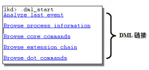

DML链接以更加可视化的方式，引导用户查看调试信息，使得调试工具的使用相比纯指令格式而言，更为友好。DML如同是对原指令的一层轻微的包装一样，让生硬的指令更加温和了。所以建议读者总是把DML默认开启：`.prefer_dml 1`，对应命令`.prefer_dml 0`可以关闭DML

一旦开启DML后，像k等支持DML的调试命令，将默认以DML格式显示输出内容

DML还能以一种很特殊的方式为函数画流程图。它主要的原理是使用反汇编，类似于`uf`，但在逻辑分支处，它会停止反汇编并显示分支让用户选择。另外，它能显示汇编代码对应的行号，这一点真的非常好。如果稍加精进，就能画出非常漂亮的流程图了。它的一个特点就是反汇编的顺序是从后往前推。只要细想一想，就会觉得很有道理。如果正推的话，分支太多；而反推则分支顺序在用户的参与下（即用户进行分支选择），是固定了的

`.dml_flow  FindAllInfFilesA  FindAllInfFilesA+30`这是一个非常简单、实用的例子，对Kernel32库中的FindAllInfFilesA接口函数进行反汇编，效果类似`uf`命令却更强大

### 基本信息

本节讲解和调试器软件本身相关的命令，比如查看软件版本、启动参数、以及最基本的软件设置命令

首先看版本命令`version`，此命令显示操作系统的版本信息以及Windbg本身的版本信息，Windbg的配置和操作系统密切相关，所以将操作系统的版本信息一并显示出来是很有必要的。在内核环境与用户环境下运行此命令，会得到不同的输出。下图为内核环境下输出结果：

```
0:001> version
Windows 7 Version 7601 (Service Pack 1) MP (8 procs) Free x64
Product: WinNt, suite: SingleUserTS
kernel32.dll version: 6.1.7601.18015 (win7sp1_gdr.121129-1432)
Machine Name:
Debug session time: Thu Aug 22 10:11:04.000 2013 (UTC + 8:00)
System Uptime: 14 days 17:26:44.613
Process Uptime: 14 days 17:14:25.000
  Kernel time: 0 days 0:09:02.000
  User time: 0 days 0:42:36.000
Full memory user mini dump: C:\Users\mozhang\AppData\Local\Temp\dwm.DMP

Microsoft (R) Windows Debugger Version 6.2.9200.16384 AMD64
Copyright (c) Microsoft Corporation. All rights reserved.
```

除了Windbg版本信息，上面的输出中还包括目标系统信息。如果纯粹是为了查看目标系统的版本信息，可使用`vertarget`命令

Windbg支持对多个调试系统中的多个调试目标同时进行调试。上面我们通过`version`或`vertarget`命令列出了当前调试系统的版本信息，还可以查看当前目标系统的状态：`||`

如Windbg中同时打开多个调试对象，“||”命令将列出对象列表。笔者为了演示此种情况，先在Windbg中开启Local Debug环境，然后两次使用`.opendump`命令打开两个DUMP文件，这样就同时拥有了三个被调试的目标对象。下图显示了这个情况：

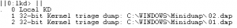

上图中的活动对象是0号对象（可从数字0前面的小数点看出）。调试器需要在多个调试目标之间进行切换的话，使用“s”参数。如要切换到1号目标可使用下面的命令：`|| 1s`

最后一个命令用来查看系统时间。这包括系统当前时间，以及系统正常运行持续时间；用户模式下还会显示当前进程的持续时间。命令格式为：`.time`

```
0:001> .time
Debug session time: Thu Aug 22 10:11:04.000 2013 (UTC + 8:00)
System Uptime: 14 days 17:26:44.613 // 系统运行时间
Process Uptime: 14 days 17:14:25.000// 当前进程运行时间
  Kernel time: 0 days 0:09:02.000
  User time: 0 days 0:42:36.000
```

### 基本设置

首先看一个清屏命令：`.cls`，当命令窗口中的内容太乱的时候，这个命令帮你快刀斩乱麻

下面看一个设置默认数字进制的命令：`n [8|10|16]`，软件默认是16进制，但有时候我们也需要把默认进制改成八进制或十进制的。下面尝试在八进制下面求数字11的值，如下：

```
0:001> n 8
base is 8
0:001> ? 11
Evaluate expression: 9 = 00000000`00000009
```

最后再来说一个处理器模式指令。关于处理器模式很值得一说，很重要。处理器模式的设置，反映了Windbg软件的强大。举例来说，主机位32位的系统，却可以同时调试X86、IA64、X64的目标系统，前提是先将主机的处理器模式设置正确了。可用处理器模式值有：x86、adm64、ia64、ebc。`.effmach x86`命令，`.effmach`表示Effective Machine Type，即有效的机器类型。此命令将当前的处理器模式设置为x86模式

### 格式化显示

将一个整数以各种格式显示，包括：16进制、10进制、8进制、二进制、字符串、日期、浮点数等，是不是很方便？！

`.formats 整数`，比如下面的例子

```
0:001> .formats 0x123abc
Evaluate expression:
  Hex:     00000000`00123abc
  Decimal: 1194684
  Octal:   0000000000000004435274
  Binary:  00000000 00000000 00000000 00000000 00000000 00010010 00111010 10111100
  Chars:   ......:.
  Time:    Thu Jan 15 03:51:24 1970
  Float:   low 1.67411e-039 high 0
  Double:  5.90252e-318
```

### 开始调试

现在领大家进入调试阶段。首先看看如何让调试器附载到一个已经运行的进程中去？比如IE软件在运行过程中发生了崩溃，打开Widbg后如何调试呢？第一步就是把Windbg附载到崩溃的IE进程上去，使用命令`.attach PID`，或者通过Windbg的启动参数来进行挂载`Windbg -p PID`，上面两个命令中，PID指定了进程ID

如果觉得指定PID不方便，也可以通过进程名进行挂载：`Windbg -pn 进程名`，比如挂载到记事本就可以`Windbg -pn notepad.exe`

上面的命令是把调试器挂载到已经存在的进程上，另外调试器可以创建新进程并对其进行调试，这两者使用了不同的侵入方式。使用命令`.create 程序启动命令行`或者Windbg启动参数`Windbg 程序启动命令行`。比如创建并调试一个记事本子进程，可以使用`.create notepad`或者`windbg notepad`命令，也可以打开Windbg后，在File菜单中选择“Open Executable...”启动notepad子进程，但这个选项只能被执行一次（之后就会灰掉）

使用上述命令可将调试器连续附载到多个进程，也就是说，能够同时调试多个进程，这一点看上去很神奇哦

下例中，调试器先创建子程序IOCTL.exe，然后又调用`.attach`命令附加到记事本进程，使用命令`|`列出所有被调试进程

读者可能会奇怪，多个进程同时调试怎么兼顾呢？只要有一个切换指令就可以了，这样就能够切换到任意的进程（令其为当前进程）并对之进行调试。比如上图显示1号进程为当前进程（注意1前面的小点），如何将当前进程切换到0号进程呢？可以使用进程列表命令“|”轻松切换，比如：`|0 s`，此命令把当前调试环境切换到0号IOCTL.exe进程。另外需注意的是，多个用户进程调试目标都处于同一个调试会话中，使用“||”命令会看到，它们属于同一个 “Live user mode”调试会话

### 下面看dump文件调试

`.opendump 文件名`打开一个dump文件，并建立一个Dump调试会话，如何手动创建一个dump文件呢？比如在调试过程中，遇到了无法解决的问题，希望获取异地帮助，则把当前调试环境保存到dump文件中发给能提供帮助的人，不失为一种好办法

Windbg下使用`.dump 文件名`生成一个dump文件。Dump文件一般以.dmp为后缀，系统生成的Dump文件都默认以.dmp为后缀的，但使用`.dump`命令时，使用者可以设置任意后缀，甚至无后缀。下例中，首先为当前进程生成一个dump文件保存到a.txt中（即后缀名为.txt），然后将之打开并分析：

```
0:001> .dump a.txt
Creating a.txt - mini user dump
Dump successfully written
0:001> .opendump a.txt
Loading Dump File [C:\Program Files (x86)\Windows Kits\8.0\Debuggers\a.txt]
User Mini Dump File: Only registers, stack and portions of memory are available

Opened 'a.txt' // 打开成功
```

上面讲到了进程挂载命令，当需要解除挂载时，可使用解挂命令：`.detach`。此命令结束当前调试会话， Windbg解除和被调试进程之间的调试关系（不管是通过挂载，还是通过创建方式建立的调试关系），解挂后，被调试进程能够独立运行；如果当前的调试会话是一个Dump文件，此命令直接结束对dump文件的调试，即结束调试会话

如果需要彻底结束调试，下面的命令更好用：`q|qq|qd`

q是Quit的缩写。结束当前调试会话，并返回到最简单的工作空间，甚至把命令行界面也关闭掉。q和qq两个命令将结束（close）被调试的进程，qd不会关闭调试进程，而是进行解挂操作

双机调试的时候，如果你感觉调试已经陷入僵局，比如目标机Hang住了都动不了，此时通过主机让目标机强制宕机或重启，不失为一个好主意`.crash`或`.reboot`

`.crash`命令能引发一个系统蓝屏，并生成dump文件；而`.reboot`使系统重启，不产生dump文件

## 符号与源码

符号与源码是调试过程中的重要因素，它们使得枯燥生硬的调试内容更加容易地被调试人员读懂。在可能的情况下，应该尽量地为模块加载符号和源码。大部分情况下源码难以得到，但符号却总能以符号文件的形式易于得到

什么是符号文件呢？编译器和链接器在创建二进制镜像文件（诸如exe、dll、sys）时，伴生的后缀名为.dbg、.sym或.pdb的包含镜像文件编译、链接过程中生成的符号信息的文件成为符号文件。具体来说，符号信息包括如下内容：

* 全局变量（类型、名称、地址）
* 局部变量（类型、名称、地址）
* 函数（名称、原型、地址）
* 变量、结构体类型定义

源文件路径以及每个符号对应于源文件中的行号，这是进行源码级别调试的基础

有这么多的信息包含在符号文件中，使得符号文件通常要比二进制文件（PE格式文件）本身要大很多。调试过程中，符号之重要性不言而喻。只有正确设置了符号路径，使得调试器能够将调试目标、符号文件以及源码文件一一对应起来，才能够最好地发挥调试器的强大功用

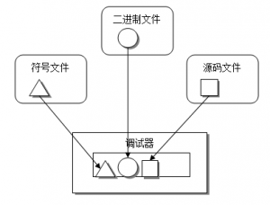

符号信息隶属于指定的模块，所以只有调试器需要用到某个模块时，它的符号信息才有被加载和分析的必要。所以我们在讲符号内容之前，先讲和模块相关的命令

### 模块列表

每个可执行程序都是有若干个模块构成，有些模块静态加载，有些模块以动态方式进行加载，所以对于有些模块，可能在A时刻运行时被加载，而在B时刻运行时，自始至终都未被加载。调试过程中，调试器根据模块的加载情况加载符号。有几个命令可以用来列举模块列表，分别是：`lm`、`!dlls`、`.reload /l`、`!imgreloc`。下面分别来看

`lm [选项] [a Address] [m Pattern | M Pattern]`，lm是list loaded modules的缩写，它还有一个DML版本：`lmD [选项] [a Address] [m Pattern | M Pattern]`

使用/v选项能列出模块的详细信息，包括：模块名、模块地址、模块大小、镜像名、时间戳、以及对应的符号文件信息（包括类型、路径、类型、编译器、符号加载状态）

如使用参数a，后面跟地址（address），则只有指定地址所在的模块能够被列出；

如使用参数m，后面跟一个表示模块名的字符串通配符，如`lm m *o*`将显示所有名称中包含字母o的模块，如下所示：

```
||0:0:001> lm m *o*
start             end                 module name
f3380000 f3512000   dwmcore    (private pdb symbols) 
f92d0000 f9327000   d3d10_1core   (deferred)             
fa890000 fa9f1000   WindowsCodecs   (deferred)             
faa50000 fac44000   comctl32   (deferred)             
fbf70000 fbf7c000   version    (deferred)             
fce20000 fce2f000   profapi    (deferred)             
fd970000 fdb73000   ole32      (deferred)             
fee60000 fee7f000   sechost    (deferred)
```

下面介绍另一个命令`!dlls [选项] [LoaderEntryAddress]`，首先看它的可选参数：

* -i/-l/-m：排序方式，分别按照初始化顺序、加载顺序、内存起始地址顺序排列
* -a：列出镜像文件PE结构的文件头、Section头等详细信息，是分析PE结构的好帮手（更好的帮手是利用自如PEView或Stud_PE等UI工具）
* -c：指定函数所在的模块

-c这个选项非常实用，比如我想知道NtCreateFile函数是哪个模块暴露出来的接口，如下：

```
0:000> !dlls -c ntcreatefile
Dump dll containing 0x7c92d0ae:
0x00251f48: C:\WINDOWS\system32\ntdll.dll
      Base   0x7c920000  EntryPoint  0x7c932c48  Size        0x00096000
      Flags  0x00085004  LoadCount   0x0000ffff  TlsIndex    0x00000000
             LDRP_IMAGE_DLL
             LDRP_LOAD_IN_PROGRESS
             LDRP_ENTRY_PROCESSED
             LDRP_PROCESS_ATTACH_CALLED
```

除了`lm`和`!dlls`外，下文将讲到的`.reload`命令在加入 /l选项后，也能列举模块，其命令格式如下：`.reload /l`

最后再来看一个`!imgreloc`命令，它也能够列出模块列表并显示各模块地址。但其主要作用尚不在此，它用来判断各个模块是否处于Preferred地址范围。所谓Preferred地址是这么一回事：二进制文件在编译的时候，编译器都会为其设置一个理想地址（Preferred Address），这样二进制文件被加载时，系统会尽可能将它映射到这个理想地址。当然，所谓“理想”往往是会受到“现实”的挑战的，当存在地址竞争的时候，需要适当调整二进制文件的加载地址，选择另一个合适的地方加载之。`!imgreloc`命令就是用来查看这种情况的，命令如下：`!imgreloc [模块地址]`

命令`!imgReloc`是Image Relocate的缩写，字面已能够反映其含义：镜像文件重定位信息。下面是一个例子

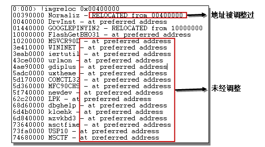

上例中，大部分系统模块（上图下部方框所示）其地址由于事先经过统筹分配，所以一般都能被加载到preferred地址处。只有少数模块（如最上面的Normaliz模块）由于地址冲突而受到了调整

### 模块信息

上一节我们了解了如何枚举模块列表，这一节我们研究针对单个模块，如何获取详细信息。有多个命令可以查看指定模块的详细模块信息，这包括：`lm`、`!dh`、`lmi`等，下面来一一介绍

首先看lm，这个命令上面我们已经介绍过，现在利用它来获取指定模块信息。其命令格式如下：`lm v a 模块地址`

这里使用了v选项，以显示详细（verbose）信息；并使用a参数以指定模块地址。通过此命令显示的信息，和我们在explorer资源管理器中通过鼠标右键查看一个文件的属性所看到的信息差不多。请看下面的清单：

```
0:000> lm v a 00400000
start    end        module name
00400000 00752000   UsbKitApp C (private pdb symbols)  C:\Trunk\CY001\UsbKitApp\Debug\UsbKitApp.pdb
    Loaded symbol image file: UsbKitApp.exe
    Image path: UsbKitApp.exe
    Image name: UsbKitApp.exe
    Timestamp:        Tue Mar 16 22:07:02 2010 (4B9F9086)
    CheckSum:         00000000
    ImageSize:        00352000
    File version:     1.0.0.1
    Product version:  1.0.0.1
    File flags:       1 (Mask 3F) Debug
    File OS:          4 Unknown Win32
    File type:        1.0 App
    File date:        00000000.00000000
    Translations:     0804.03a8
    CompanyName:      TODO: <公司名>
    ProductName:      TODO: <产品名>
    InternalName:     UsbKitApp.exe
    OriginalFilename: UsbKitApp.exe
    ProductVersion:   1.0.0.1
    FileVersion:      1.0.0.1
    FileDescription:  TODO: <文件说明>
    LegalCopyright:   TODO: (C) <公司名>。保留所有权利。
```

下面看`!lmi`命令，此命令通过指定模块地址查找模块并获取其信息，其命令格式如下：`!lmi 模块地址`，此命令侧重获取对调试器有用的信息，如下：

```
0:000> !lmi 0x400000
Loaded Module Info: [0x400000]
         Module: UsbKitApp
   Base Address: 00400000
     Image Name: UsbKitApp.exe
   Machine Type: 332 (I386)
     Time Stamp: 4b9f9086 Tue Mar 16 22:07:02 2010
           Size: 352000
       CheckSum: 0
Characteristics: 103
Debug Data Dirs: Type  Size     VA  Pointer
CODEVIEW  - GUID: {5DB12DF1-71CA-43F7-AD85-0977FB3629A4}
               Age: 3, Pdb: C:\Trunk\CY001\UsbKitApp\Debug\UsbKitApp.pdb
     Image Type: FILE     - Image read successfully from debugger.
                 UsbKitApp.exe
    Symbol Type: PDB      - Symbols loaded successfully from image header.
                 C:\Trunk\CY001\UsbKitApp\Debug\UsbKitApp.pdb
       Compiler: Resource - front end [0.0 bld 0] - back end [9.0 bld 21022]
    Load Report: private symbols & lines, not source indexed
                 C:\Trunk\CY001\UsbKitApp\Debug\UsbKitApp.pdb
```

如果还要查看更详细、丰富的模块信息，可以使用`!dh`命令，命令格式如下：`!dh [标志] 模块地址`。dh是display header的缩写，直译就是“显示文件头”的意思，它能够显示非常详细的PE头信息。下图截取了输出信息中的开头部分，其它详细内容，需要读者熟悉微软的PE结构才能看懂：

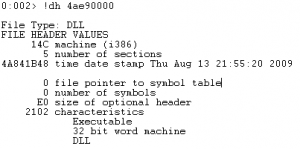

模块相关的知识点讲完了，下面讲符号有关命令。和符号相关的知识点包括：符号路径、符号服务器、符号缓存、符号加载以及符号的使用等

### 符号路径

什么是符号路径呢？就是调试器寻找符号文件的方向，它可以是本地 文件夹路径、可访问的UNC路径，或者是符号服务器路径

什么是符号服务器呢？如果调试过程中，需要涉及到成千上万个符号文件，以及同一个符号文件存在不同平台下的不同符号文件版本的时候，那么一一手动设置符号路径肯定是不现实的，于是引入符号服务器的概念。符号服务器有一套命名规则，使得调试软件能够正确找到需要的符号文件。一般来说，符号服务器比较大，都是共用的，放在远程主机上。为了降低网络访问的成本，又引入了符号缓存的概念，即将从服务器上下载到的符号文件，保存在本地缓存中，以后调试器需要符号文件的时候，先从缓存中寻找，找不到的时候再到服务器上下载。下面分几部分一一来看

**设置符号路径**

设置符号路径的语法如下：`.sympath [+] [路径]`

如果不加入任何参数执行`.sympath`命令，将显示当前的路径设置：`.sympath`

如要覆盖原来的路径设置，使用新路径即可：`.sympath <新路径>`

要在原有路径的基础上添加一个新路径，可使用：`.sympath+ <新增路径>`

要注意的是，使用`.sympath`改变或新增符号路径后，符号文件并不会自动更新，应再执行`.reload`命令以更新之

这里要谈一谈延迟加载的知识点。延迟加载使得模块的符号表，只在第一次真正使用的时候才被加载。这加快了程序启动，不用在一开始耗费大量时间加载全部的符号文件

>这个设计思路在任何软件项目架构中都是一个值得借鉴的点

使用`.symopt +4`和`.symopt -4`来开启或关闭延迟加载设置

在已经启动了延迟加载的情况下，如果想临时改变策略，立刻将指定模块的符号加载到调试器中，可以 使用`ld`或`.reload /f`命令

**符号服务器和符号缓存**

设置符号服务器的基本语法是：`SRV*[符号缓存]*服务器地址`

语法由SRV引导，符号缓存和服务器地址的前面各有一个星号引导。符号引导一般也叫做下游符号库。如某公司有一台专门的符号服务器，地址为`\\symsrv\\symbols`，则他们公司的所有开发人员都应该在他们的调试器中使用类似下面的命令：`.sympath+ srv*c:\symbols*\\symsrv\symbols`

此外，我们总是应该把微软的公用符号库加入我们的符号路径中：`.sympath+ srv*<缓存地址>*http://msdl.microsoft.com/download/symbols`

这是一台微软对外公开的服务器，使用http地址访问，不是所有人都能牢记这个网址，所以最好的办法就是使用.symfix命令，语法如下：`.symfix [+] [符号缓存地址]`，这个命令等价于上面的`.sympath`命令，而不用输入长长的http地址

```
0:000> .symfix c:\windows\symbols

0:000> .sympath
Symbol search path is: SRV*c:\windows\symbols*http://msdl.microsoft.com/download/symbols
```

**符号选项**

命令格式如下：

* 显示当前设置：`.symopt`
* 增加选项：`.symopt+  Flags`
* 删除选项：`.symopt-  Flags`

第一个命令没有任何参数，显示当前设置。后面两个，第二个命令含有“+”代表添加一个选项，第三个命令含有“-”代表去除一个选项

```
001> .symopt
Symbol options are 0x30337:
  0x00000001 - SYMOPT_CASE_INSENSITIVE
  0x00000002 - SYMOPT_UNDNAME
  0x00000004 - SYMOPT_DEFERRED_LOADS
  0x00000010 - SYMOPT_LOAD_LINES
  0x00000020 - SYMOPT_OMAP_FIND_NEAREST
  0x00000100 - SYMOPT_NO_UNQUALIFIED_LOADS
  0x00000200 - SYMOPT_FAIL_CRITICAL_ERRORS
  0x00010000 - SYMOPT_AUTO_PUBLICS
  0x00020000 - SYMOPT_NO_IMAGE_SEARCH
```

可用的符号选项请见下表

值           | 可读名称                     | 描述  
------------ | ---------------------------- | ------------  
0×1          |SYMOPT_CASE_INSENSITIVE       |符号名称不区分大小写
0×2          |SYMOPT_UNDNAME                |符号名称未修饰
0×4          |SYMOPT_DEFERRED_LOADS         |延迟加载
0×8          |SYMOPT_NO_CPP                 |关闭C++转换，C++中的::符号将以__显示
0×10         |SYMOPT_LOAD_LINES             |从源文件中加载行号
0×20         |SYMOPT_OMAP_FIND_NEAREST      |如果由于编译器优化导致找不到对应的符号，就以最近的一个符号代替之
0×40         |SYMOPT_LOAD_ANYTHING          |使得符号匹配的时候，匹配原则较松散，不那么严格。
0×80         |SYMOPT_IGNORE_CVREC           |忽略镜像文件头中的CV记录
0×100        |SYMOPT_NO_UNQUALIFIED_LOADS   |只在已加载模块中搜索符号，如果搜索符号失败，不会自动加载新模块。
0×200        |SYMOPT_FAIL_CRITICAL_ERRORS   |不显示文件访问错误对话框。
0×400        |SYMOPT_EXACT_SYMBOLS          |进行最严格的符号文件检查，只要有微小的差异，符号文件都不会被加载。
0×800        |SYMOPT_ALLOW_ABSOLUTE_SYMBOLS |允许从内存的一个绝对地址处读取符号信息。
0×1000       |SYMOPT_IGNORE_NT_SYMPATH      |忽视在环境变量中设置的符号路径，也忽视被调试进程的执行路径。也就是说，当搜索符号文件的时候，不会从这些路径中搜索。
0×2000       |SYMOPT_INCLUDE_32BIT_MODULES  |让运行在安腾系统上的调试器，也枚举32位模块。
0×4000       |SYMOPT_PUBLICS_ONLY           |仅搜索符号文件的公共（PUBLIC）符号表，忽略私有符号表。
0×8000       |SYMOPT_NO_PUBLICS             |不搜索符号文件的公共（PUBLIC）符号表
0×10000      |SYMOPT_AUTO_PUBLICS           |先搜索pdb文件的私有符号表，如果在其中找到对应的符号，就不再搜索公共（PUBLIC）符号表，这可以加快搜索速度。
0×20000      |SYMOPT_NO_IMAGE_SEARCH        |不搜索镜像拷贝
0×40000      |SYMOPT_SECURE                 |安全模式，让调试器尽量不影响到主机。
0×80000      |SYMOPT_NO_PROMPTS             |不显示符号代理服务器的认证对话框，将导致某些时候无法访问符号服务器
0×80000000   |SYMOPT_DEBUG                  |显示符号搜索的详细过程和信息

### 符号加载

本节分下面几个子题目分别讲解

**立刻加载：**

其命令格式如下：`ld 模块名 [/f 符号文件名]`。加载指定模块的符号。调试器默认采用延迟模式加载符号，也就是直到符号被使用的时候，才将符号文件加载到调试器中并进行解析。ld使得延迟模式被打破，让指定模块的符号文件立刻加载到调试器中。此指令可为模块的符号文件设置自定义的匹配名称，比如：`ld  123  /f  abc`。这样一来，abc.pdb将成为123.exe的符号文件。正常情况下，这是不可能的，只能是abc.pdb对应abc.exe

**重新加载：**

如果对自己正在使用的符号文件感到疑惑，比如源代码和行号明显不匹配，最好的做法就是重新加载一下符号文件。此命令语法如下：`.reload /f /v [模块名]`

`.reload`命令的作用是删除指定或所有已加载的符号文件，默认情况下，调试器不会立刻根据符号路径重新搜索并加载新的符号文件，而是推迟到调试器下一次使用到此文件时

使用/f参数(force)，将迫使调试器立刻搜索并重新加载新的符号文件。其他参数解释如下：

* /v：将搜索过程中的详细信息都显示出来
* /i：不检查pdb文件的版本信息
* /l：只显示模块信息，内核模式下，和“lm n t”命令类似，但显示内容比后者更多，因为包含了用户模块信息
* /n：仅重载内核符号，不重载用户符号
* /o：强制覆盖符号库中的符号文件，即使版本相同
* /d：用户层模式下使用Windbg时的默认选项，重载调试器模块列表中的所有模块
* /s：内核模式下使用Windbg时的默认选项，重载系统模块列表中的所有模块，另外，如果调试器在用户模式下运行，要加载内核模块，也必须使用/s选项，否则调试器将只会在调试器模块列表中搜索而导致找不到内核模块
* /u：卸载指定模块。如发现当前符号版本不对，使用/u开关先卸载之再重新加载

**符号验证：**

上面讲到`.reload`的时候，我们说过，符号文件会出现不匹配的情况。这是很有可能的，程序员在后期测试的时候可能会将工程多次编译，为了维护多个版本而使得自己也被搞混。可以使用下面的命令验证一个模块的符号文件：`!chksym <模块名> [符号名]`

**加载选项：**

有两类符号加载选项。第一类是Noisy/Quiet，Noisy选项将打印符号加载的详细信息，Quiet选项则忽略这些信息。第二类是Prompts/Prompts off，即是否允许执行提示（Prompts）对话框

一般都是在调用`.reload`命令之前，执行加载选项命令，以见立竿见影之效

所谓Noisy是吵闹的意思，调试器在搜索、加载符号的时候，会显示更多与搜索有关的信息。而安静模式下，则不会显示这些信息。不管吵闹与否，都不会影响到最终的搜索、加载结果

当从网络上下载符号文件的时候，可能会碰到网络服务器要求客户进行安全认证的情况，如果开启Prompts选项，则弹出认证对话框，让用户输入认证信息；否则，不弹出对话框，并且不会下载符号文件

不加任何参数的情况下，显示当前加载选项设置，下面的清单表明当前的设置为Quiet及Prompts模式：

```
lkd> !sym
!sym <noisy/quiet - prompts/prompts off> - quiet mode - symbol prompts on
```

### 符号搜索

符号搜索包括全局搜索和就近搜索两种

**全局搜索：**

命令`x`被用来进行符号的全局搜索，你可以把它直接就理解为search。格式如下：`x [参数] [模块!符号]`

如果什么参数都没有的话，它将列出当前调试环境下的所有局部变量，前提是要在有局部变量存在的情况下，显示局部变量的另一个命令是`dv`，后文也会讲到

`x kernel32!a*`这个命令搜索并打印出kernel32模块中所有a开头的符号。x命令支持DML，使用`/D`选项即以DML格式显示

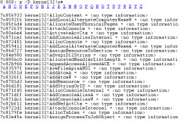

如果你不知道ntcreatefile这个函数是在哪个模块中定义的，可以试着使用下面的命令：`x *!*NtCreateFile*`

同名函数在多个系统模块中并定义，这可能出乎你的意料，但却给你带来真正的知识

此外，x命令有多个可选参数。建议总是带上/t和/v，可显示更多符号、类型信息

* /f：将只显示函数符号；并且会显示函数的详细定义
* /d：显示更多的变量类型相关信息

**就近搜索：**

如果知道了符号的大概地址，但不能确定确切的符号名称，该怎么处理呢？就近查找命令`ln`能发挥作用，ln是List Nearest的缩写。它的作用是：（根据给定的地址）列出附近一定范围内的所有符号。下表中，指定地址0x7c8179f0的前后各有一个符号被找到：

```
0:000> ln 7c8179f0
(7c8179c3)   kernel32!NlsServerInitialize+0x29   |  (7c8179fe)   kernel32!AllocTables
```

### 源码命令

如果含有源码信息，可使得调试过程能够以源码模式逐行进行。和源码相关的命令包括下面几个：

**源码路径：**

和符号路径类似，要设置源码路径，使用如下语法格式：`.srcpath[+] [路径1;路径2]`，不含任何参数的情况下，显示当前设置的源码路径

下面命令将覆盖原设置，设置新的源码搜索路径：`.srcpath <路径信息>`

使用“+”可以将新的路径添加到原设置中，而不会把原设置覆盖掉：`.srcpath+ <路径信息>`

**源码选项**

这里列出的源码选项有三个，下面分别来讲

第一个是源码的Noisy选项，语法如下：`.srcnoisy [1|0]`。此命令乃source noisy缩写，可以理解成“嘈杂的源码”，类似于符号设置中也存在的noisy选项。它的三种运用如下所示：

* 状态：.srcnoisy
* 开启：.srcnoisy 1
* 关闭：.srcnoisy 0

开始“吵闹的源码”选项后，在源码加载、卸载，甚至单步的时候，都会显示丰富的源码信息。下图显示了一个含有Noisy信息的单步命令：

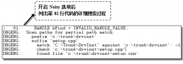

第二个命令是行号选项，即在符号文件加载过程中，是否将行号也一并加载进来。因为Windbg支持源码级调试，所以它在Windbg中是默认开启（Enable）的，我们一般也不应该去禁止他。语法如下：`.lines [-d|-e|-t]`，参数d是disable的意思；e是enable的意思；t表示切换的意思，即自动在disable和enable两者之间切换

最后看第三个命令，是代码行选项，包括行号和内容。语法如下

* 打开：l+ [选项]
* 关闭：l- [选项]

命令l是line的缩写，和上面的`.lines`命令不同的是，`.lines`是加载时选项，l是调试时选项。我建议读者总是调用“l+*”指令，打开所有的行选项，效果会很不错。这样在单步调试的时候，每一步的代码和行号都会显示出来。显得很醒目！

值得注意的是，进入源码模式和进入汇编模式的命令分别为：

* 源码模式：l+t
* 汇编模式：l-t

运行这两个命令和在Windbg的Debug菜单下点击source mode选项其效果是一样的

## 进程与线程

既可以显示进程和线程列表，又可以显示指定进程或线程的详细信息。调试命令可以提供比taskmgr更详尽的进程资料，在调试过程中不可或缺

### 进程命令

进程命令包括这些内容：显示进程列表、进程环境块、设置进程环境

**进程列表**

多个命令可显示进程列表，但一般只能在特定情况下使用，它们是：`|`、`.tlist`、`!process`和`!dml_proc`

竖线命令显示当前被调试进程列表的状态信息，这个命令在本章开头已作过介绍，命令格式如下：`| [进程号]`

请注意这里的定语：被调试进程列表。大多数情况下调试器中只有一个被调试进程，但可以通过`.attach`或者`.create`命令同时挂载或创建多个调试对象。当同时对多个进程调试时，进程号是从0开始的整数。下图中显示了两个被调试的进程

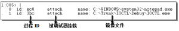

`.tlist [选项] [模块名]`显示当前系统中的进程列表，它是目前唯一可在用户模式下显示系统当前进程列表的命令。它有两个可选项：-v显示进程详细信息，-c只显示当前进程信息

内核模式下同样可以使用`.tlist`，但更好的命令是`!process`。`!process`在内核模式下显示进程列表，和指定进程的详细信息，也能显示进程中的线程和调用栈内容。典型格式如下

* !process: 显示调试器当前运行进程信息
* !process 0 0: 显示进程列表
* !process PID: PID是进程ID，根据进程ID显示此进程详细信息

此外，还有一个DML版本的进程列表命令，如下`!dml_proc [进程号|进程地址]`

此命令可以看成`|`和`!process~命令的DML合并版本，可在用户和内核模式下使用。显示的进程信息偏重于线程和调用栈。用户模式下此命令和`|`一样，只能显示被调试进程的信息

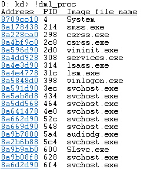

**进程信息**

进程环境块（Proccess Environment Block）是内核结构体，使用`!peb`命令参见其信息，但也可以用dt命令查看完整的结构体定义。格式如下：`!peb [地址]`

如果未设置PEB地址，则默认为当前进程。内核模式下可通过`!process`命令获取PEB结构体地址；用户模式下只能显示当前进程的PEB信息，故而一般不带参数

`dt nt!_peb 地址`命令显示系统nt模块中所定义的内核结构体PEB

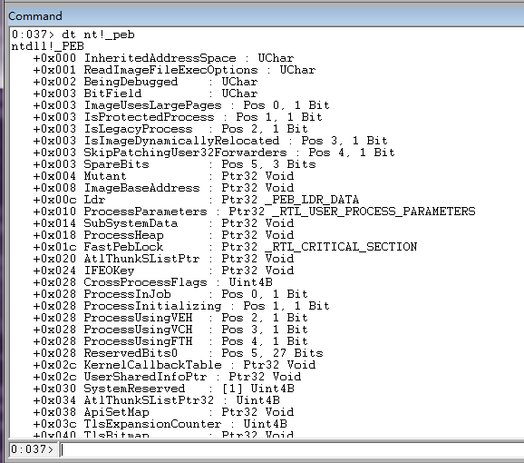

**进程切换**

进程环境的切换，将伴随着与进程相关的寄存器、堆栈的切换。在不同进程环境中进行的调试结果有天壤之别。上文在讲`|`命令的时候，讲过用户环境下多进程间如何互相切换，使用命令`| [进程号]s`

那么内核模式下，情况又不同了。内核模式下的进程切换，不同于用户模式下的被调试进程间切换，而是系统存在的多进程间切换。内核环境下，以进程地址作为参数，调用如下命令以进行进程环境切换：`.process [进程地址]`

如果不使用任何参数，`.process`命令将显示当前进程地址，所谓进程地址，即ERPCESS结构体地址

或以页目录地址为参数，调用下面命令切换用户地址空间：`.context [页目录地址]`

如果不使用任何参数，`.context`命令将显示当前页目录地址。页目录地址就是`!process`命令中显示的DirBase值

进程切换后，为了检测是否正确却换，可用`!peb`命令检查当前进程的块信息

### 线程命令

命令`~`能够进行线程相关的操作。不带任何参数的情况下，它列出当前调试进程的线程。下图是计算器进程某时刻的线程列表：

```
||0:0:001> ~
#  0  Id: f78.374 Suspend: 0 Teb: 000007ff`fffdc000 Unfrozen
.  1  Id: f78.fb0 Suspend: 0 Teb: 000007ff`fffda000 Unfrozen
   2  Id: f78.a4c Suspend: 0 Teb: 000007ff`fffd8000 Unfrozen
   3  Id: f78.22c8 Suspend: 0 Teb: 000007ff`fff9a000 Unfrozen
   4  Id: f78.2658 Suspend: 0 Teb: 000007ff`fffd4000 Unfrozen
   5  Id: f78.cbc Suspend: 0 Teb: 000007ff`fff96000 Unfrozen
   6  Id: f78.21ec Suspend: 0 Teb: 000007ff`fffd6000 Unfrozen
```

使用此命令可进行的线程操作包括：线程切换、线程环境、线程时间等

**线程冻结**

参数f与u分别代表freeze和unfress，前者是指冻住指定线程，后者将被冰冻线程解冻

`~2f`表示把2号线程冻住，在解冻之前，不再分发CPU时间给它

若要让指定线程重新运行，需使用参数u：`~2u`

针对这两个命令，下面有一个小实验：

```
运行Windbg，并选择调试记事本程序（Notepad.exe）。程序起来后，CTL+BREAK中断程序运行，输入命令： 

~0f 

再输入g命令让记事本继续运行。 

此时尝试用鼠标定位到notepad软件，发现软件界面无法被定位、移动、最大小化，甚至“清空桌面”操作也无济于事。

这是因为0号线程为notepad的主线程，被冻住后整个软件都失去响应。 

更严重的是，“清空桌面”操作（Win + D）也会失效，应是Notepad拒绝响应的缘故。

线程挂起 

参数n和m分别代表increase和resume，前者增加一个线程挂起计数，后者减少一个线程挂起计数。

如果两次增加线程挂起计数（即达到2），则必须两次resume才能让线程恢复到运行状态。
```

把上面实验中的`~0f`命令改变成`~0n`，也能达到相似的效果

**线程切换**

查看指定线程的信息，用下面的命令：`~ 线程号`

线程号是由调试器软件内部维护的线程ID值，是一个从0开始的整数，和线程ID不是一回事

线程信息中包括有线程环境块地址，可通过!teb命令查看环境块信息：`!teb [teb地址]`

如要在多线程间作切换，需使用~命令的s参数：`~线程号 s`

由于线程号在外部是没有太大意义的，所以另一个线程切换命令是以线程ID来标识一个线程的。这个命令比较奇怪，以双波浪线打头，格式如下：`~~ [线程ID] s`

注意这个命令中的[]并非可选符，而是命令的一部分。例如命令：`~~[11a0] s`，它将当前线程切换到线程ID为0x11a0的线程。线程ID是系统维护的系统唯一的ID值

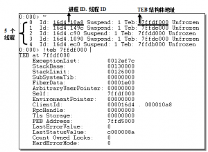

下面是关于线程切换的：

```
0:014> ~
   0  Id: 4f0.4f4 Suspend: 1 Teb: 00000000`7efdb000 Unfrozen
   1  Id: 4f0.5e0 Suspend: 1 Teb: 00000000`7ef9d000 Unfrozen
   2  Id: 4f0.604 Suspend: 1 Teb: 00000000`7ef9a000 Unfrozen
   3  Id: 4f0.61c Suspend: 1 Teb: 00000000`7ef97000 Unfrozen
   4  Id: 4f0.600 Suspend: 1 Teb: 00000000`7ef94000 Unfrozen
   5  Id: 4f0.610 Suspend: 1 Teb: 00000000`7ef91000 Unfrozen
   6  Id: 4f0.608 Suspend: 1 Teb: 00000000`7ef8e000 Unfrozen
   7  Id: 4f0.60c Suspend: 1 Teb: 00000000`7ef8b000 Unfrozen
   8  Id: 4f0.614 Suspend: 1 Teb: 00000000`7ef88000 Unfrozen
   9  Id: 4f0.5fc Suspend: 1 Teb: 00000000`7ef85000 Unfrozen
  10  Id: 4f0.5f4 Suspend: 1 Teb: 00000000`7ef82000 Unfrozen
  11  Id: 4f0.5f8 Suspend: 1 Teb: 00000000`7ef7f000 Unfrozen
  12  Id: 4f0.f58 Suspend: 1 Teb: 00000000`7ef76000 Unfrozen
  13  Id: 4f0.28e8 Suspend: 1 Teb: 00000000`7efd5000 Unfrozen
. 14  Id: 4f0.1b80 Suspend: 1 Teb: 00000000`7ef79000 Unfrozen
# 15  Id: 4f0.1f80 Suspend: 1 Teb: 00000000`7efd8000 Unfrozen

0:016> ~~[5fc]s
wow64cpu!CpupSyscallStub+0x9:
00000000`74412e09 c3              ret

0:009> ~
   0  Id: 4f0.4f4 Suspend: 1 Teb: 00000000`7efdb000 Unfrozen
   1  Id: 4f0.5e0 Suspend: 1 Teb: 00000000`7ef9d000 Unfrozen
   2  Id: 4f0.604 Suspend: 1 Teb: 00000000`7ef9a000 Unfrozen
   3  Id: 4f0.61c Suspend: 1 Teb: 00000000`7ef97000 Unfrozen
   4  Id: 4f0.600 Suspend: 1 Teb: 00000000`7ef94000 Unfrozen
   5  Id: 4f0.610 Suspend: 1 Teb: 00000000`7ef91000 Unfrozen
   6  Id: 4f0.608 Suspend: 1 Teb: 00000000`7ef8e000 Unfrozen
   7  Id: 4f0.60c Suspend: 1 Teb: 00000000`7ef8b000 Unfrozen
   8  Id: 4f0.614 Suspend: 1 Teb: 00000000`7ef88000 Unfrozen
.  9  Id: 4f0.5fc Suspend: 1 Teb: 00000000`7ef85000 Unfrozen
  10  Id: 4f0.5f4 Suspend: 1 Teb: 00000000`7ef82000 Unfrozen
  11  Id: 4f0.5f8 Suspend: 1 Teb: 00000000`7ef7f000 Unfrozen
  12  Id: 4f0.f58 Suspend: 1 Teb: 00000000`7ef76000 Unfrozen
  13  Id: 4f0.28e8 Suspend: 1 Teb: 00000000`7efd5000 Unfrozen
  14  Id: 4f0.1b80 Suspend: 1 Teb: 00000000`7ef79000 Unfrozen
  15  Id: 4f0.17cc Suspend: 1 Teb: 00000000`7efd8000 Unfrozen
# 16  Id: 4f0.1538 Suspend: 1 Teb: 00000000`7ef7c000 Unfrozen
```

第一个命令`~`运行时，当前线程是14号线程，请注意14号线程前面有一小点；运行第二个命令，将当前线程切换为9号线程；为了检验结果，再次运行`~`命令，此时注意到小点移到9号线程前，表明9号线程为当前线程

**线程遍历**

仍然是`~`命令。它除了能够作为线程列表命令外，还可用来对线程进行遍历，并执行指定命令。只需借助通配符“*”即可。如：`~*k`显示所有线程栈信息（此命令意指：对所有线程执行k指令）。下面，当前进程共包含2个线程，显示这两个线程各自的栈信息

```
0:009> ~*k

   0  Id: 4f0.4f4 Suspend: 1 Teb: 00000000`7efdb000 Unfrozen
Child-SP          RetAddr           Call Site
0019e648 74412bf1 wow64cpu!CpupSyscallStub+0x9
0019e650 7448d07e wow64cpu!Thunk0ArgReloadState+0x23
0019e710 7448c549 wow64!RunCpuSimulation+0xa
0019e760 77084956 wow64!Wow64LdrpInitialize+0x429
0019ecb0 77081a17 ntdll!LdrpInitializeProcess+0x17e4
0019f1a0 7706c32e ntdll! ?? ::FNODOBFM::`string'+0x29220
0019f210 00000000 ntdll!LdrInitializeThunk+0xe

   1  Id: 4f0.5e0 Suspend: 1 Teb: 00000000`7ef9d000 Unfrozen
Child-SP          RetAddr           Call Site
00abebc8 74412bf1 wow64cpu!CpupSyscallStub+0x9
00abebd0 7448d07e wow64cpu!Thunk0ArgReloadState+0x23
00abec90 7448c549 wow64!RunCpuSimulation+0xa
00abece0 770be707 wow64!Wow64LdrpInitialize+0x429
00abf230 7706c32e ntdll! ?? ::FNODOBFM::`string'+0x29364
00abf2a0 00000000 ntdll!LdrInitializeThunk+0xe
```

其他有用的遍历指令包括

`~*r`显示线程寄存器信息

`~*e`，上面的e是execute（执行）的缩写，后可跟一个或多个Windbg命令。它遍历线程并对每个线程执行指定命令，如：`~*e  k;r`，此命令意为：在所用线程环境中（~*），分别执行（e）栈指令（k）和寄存器指令（r）

**线程时间**

在软件调试的时候，若发现某线程占用执行时间过多，就需要当心是否有问题。线程执行时间的多少，其实就是占用CPU执行工作的时间多少。某线程占用越长，此长彼消，则系统中其他线程占用CPU的时间就越少

线程的时间信息包括三个方面：自创建之初到现在的总消耗时间、用户模式执行时间、内核模式执行时间。需注意的是，消耗时间一定会远远大于用户时间+内核时间，多出来的是大量空闲时间（为Idle进程占用）。使用下面的命令查看线程时间

* .ttime
* !runaway 7

在!runaway命令中加入标志值7，将显示线程的全部三种时间值

这两个命令的区别之处是，`.ttime`只能显示当前线程的时间信息，`!runaway`能显示当前进程的所有线程时间。下图是这两个命令的使用情况：

```
0:009> .ttime
Created: Wed Aug  7 16:47:29.011 2013 (UTC + 8:00)
Kernel:  0 days 0:00:00.031
User:    0 days 0:00:00.046
0:009> !runaway 7
 User Mode Time
  Thread       Time
   2:604       0 days 0:00:51.729
   4:600       0 days 0:00:47.159
   0:4f4       0 days 0:00:00.031
   3:61c       0 days 0:00:00.000
   1:5e0       0 days 0:00:00.000
 Kernel Mode Time
  Thread       Time
   4:600       0 days 0:13:45.073
   2:604       0 days 0:08:44.100
   3:61c       0 days 0:00:00.000
   1:5e0       0 days 0:00:00.000
   0:4f4       0 days 0:00:00.000
 Elapsed Time
  Thread       Time
   0:4f4       16 days 0:14:02.254
   4:600       16 days 0:14:02.207
   3:61c       16 days 0:14:02.207
   2:604       16 days 0:14:02.207
   1:5e0       16 days 0:14:02.207
```

对上二图进行对比，能看出两个命令之间的功能差异

### 异常与事件

在调试器语境中，事件是一个基本概念，Windbg是事件驱动的。Windows操作系统的调试子系统，是“事件”的发生源。调试器的所有操作，都是因事件而动，因事件被处理而中继。Windows定义了9类调试事件，异常是其中一类（ID为1）。所以异常和事件，这两者是前者包含于后者的关系

系统对各种异常和调试事件进行了分类，执行sx命令可以列出针对当前调试目标的异常或非异常时间的处理。下面是一个片段

```
0:009> sx
  ct - Create thread - ignore
  et - Exit thread - ignore
 cpr - Create process - ignore
 epr - Exit process - break
  ld - Load module - break
       (only break for livekd.exe)
  ud - Unload module - ignore
 ser - System error - ignore
 ibp - Initial breakpoint - break
 iml - Initial module load - ignore
 out - Debuggee output - output

  av - Access violation - break - not handled
asrt - Assertion failure - break - not handled
 aph - Application hang - break - not handled
 bpe - Break instruction exception - break
bpec - Break instruction exception continue - handled
  eh - C++ EH exception - second-chance break - not handled
 clr - CLR exception - second-chance break - not handled
clrn - CLR notification exception - second-chance break - handled
 cce - Control-Break exception - break
  cc - Control-Break exception continue - handled
 cce - Control-C exception - break
  cc - Control-C exception continue - handled
  dm - Data misaligned - break - not handled
dbce - Debugger command exception - ignore - handled
  gp - Guard page violation - break - not handled
  ii - Illegal instruction - second-chance break - not handled
  ip - In-page I/O error - break - not handled
  dz - Integer divide-by-zero - break - not handled
 iov - Integer overflow - break - not handled
  ch - Invalid handle - break
  hc - Invalid handle continue - not handled
 lsq - Invalid lock sequence - break - not handled
 isc - Invalid system call - break - not handled
  3c - Port disconnected - second-chance break - not handled
 svh - Service hang - break - not handled
 sse - Single step exception - break
ssec - Single step exception continue - handled
 sbo - Security check failure or stack buffer overrun - break - not handled
 sov - Stack overflow - break - not handled
  vs - Verifier stop - break - not handled
vcpp - Visual C++ exception - ignore - handled
 wkd - Wake debugger - break - not handled
 rto - Windows Runtime Originate Error - second-chance break - not handled
 rtt - Windows Runtime Transform Error - second-chance break - not handled
 wob - WOW64 breakpoint - break - handled
 wos - WOW64 single step exception - break - handled

   * - Other exception - second-chance break - not handled
```

可以看到这几个调试事件，当发生进程退出（Exit Process）和初始化断点（Initial breakpoint）事件的时候，调试器应当被中断（Break）。模块加载（Load Modual）以及有调试输出（Debuggen Output）时，需要输出相关信息；其他的都被忽略掉，不做处理(Ignore)。

我们分析一下前两个事件，使用调试器调试记事本进程时，不管是`.attach`挂载方式还是`.create`创建方式，在调试器正是侵入记事本进程前，都会有一个中断（Initial Breakpoint异常）；调试开始后运行一段时间，在外面将记事本关闭，又会发生一个中断（Exit Process异常）

可以通过Debug|Event Filters…打开事件设置对话框。这个对话框中列出了全部调试事件，用户可分别对它们进行设置

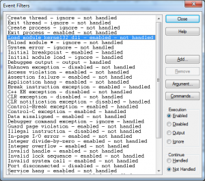

这个对话框列出了对于当前调试会话可用的全部调试事件。针对每个调试事件，可设置其属性。右列Execution和Continue两组单选键，分别表示事件的中断属性与中继属性。右列Argument按钮可设置调试事件执行参数（上图中Load Module事件有一个Kernel
32.dll参数，即当Kernel32.dll模块被加载时，调试器将被中断），Commands按钮可设置事件两轮机会发生时的执行命令

>更细致的内容，本章无力铺陈，请读者参阅《Windows 高级调试》（Mario & Daniel 2009 机械工业出版社）第三章，及《软件调试》（张银奎 2008 电子工业出版社）第9、30章相关内容

`sxr`，将当前所有对调试事件的设置，恢复到调试器的默认设置。最后一个字母r表示reset

`sx{e|d|n|i}`，这4个命令分别代表了图8-38中Execution组（中断属性）中的四个按钮，即Enable、Disable、Output、Ignore。Enable是开启中断，Disable是禁止事件中断（但对于异常，只禁止第一轮机会，第二轮机会到来时仍会中断到调试器），Output是禁止中断但会输出相关信息，Ignore表示完全忽略这个事件（对于异常，Output和Ignore两选项使得两轮机会都不会中断到调试器）

`sx{e|d|n|i} -h`， 上述命令如果带上-h选项，就不是设置中断属性，而是设置中继属性了。对应了图8-38中的Continue组。其中`sxe –h`表示Handled，`se{d|n|i} –h`都表示Not Handled

`.lastevent`显示最近发生的一个调试事件，往往是导致中断发生的那个。下图显示的是一个很典型的初始化断点引发的中断事件

```
0:009> .lastevent
Last event: 4f0.1538: Break instruction exception - code 80000003 (first chance)
  debugger time: Fri Aug 23 16:58:02.995 2013 (UTC + 8:00)
```

`.exr`，此命令显示一个异常记录的详细内容，传入一个异常记录地址：`.exr 记录地址`。如果仅仅为了显示最近的一条异常记录，可以用-1代替异常记录地址：`.exr -1`

由于异常是事件的一种，所以使用`.exr -1`命令得到的异常，，可能和使用`.lastevent`命令获取的事件（其实是异常），是同一个。但二者显示的信息各有侧重点。请对照图8-39看下面，同样的初始化断点异常，使用`.exr`命令时所显示的信息：

```
0:009> .exr -1
ExceptionAddress: 0000000077090530 (ntdll!DbgBreakPoint)
   ExceptionCode: 80000003 (Break instruction exception)
  ExceptionFlags: 00000000
NumberParameters: 1
   Parameter[0]: 0000000000000000 
```

还有一个类似的命令：`!cppexr`，它分析并显示一个C++异常信息

`.bugcheck`命令不带参数。在内核环境下，显示当前bug check的详细信息，可用于活动调试或者crash dump调试环境中。用户环境不可用

`!analyze`，分析当前最近的异常事件（如果在进行dump分析，则是bug check），并显示分析结果。这个异常事件，就是上面`.lastevent`命令对应的事件

* -v：显示异常的详细信息，这个选项在调试错误的时候，最有用。
* -f：f是force的缩写。强制将任何事件都当作异常来分析，即使仅仅是普通的断点事件。将因此多输出一些内容。
* -hang：这个选项很有用，对于遇到死锁的情况，它会分析原因。在内核环境中，它分析内核锁和DPC栈；在用户环境中，它分析线程的调用栈。用户环境中，调试器只会对当前线程进行分析，所以一定要将线程环境切换到最可能引起问题的那个线程中去，才有帮助。这个参数非常有用，当真的遇到死锁时，它可以救命（另一个分析死锁的有效命令是!locks）。
* -show bug-check-代码 [参数]：在内核环境下，显示指定的bug check的详细信息

`!error`，此命令和VC里面内置的errlook工具类似（请有兴趣的读者使用作者编写的免费软件e-look，它比errlook功能更好且易于使用）。用来根据错误码，查看对应的可读错误信息。微软系统中常用的全局错误码有两套，一套是Win32错误码，通过函数GetLastError()获得的值；另一套是NTSTATUS值。!error命令对这二者都能支持。区别的方法，若错误码后面无参数1，则为win32错误码；否则就是NTSTATUS错误码。比如，获取错误码为2的Win32错误信息，可用：`!error 2`；获取错误码为2的NTSTATUS错误信息，可用：`!error 2 1`

`!gle`，此命令是Get Last Error的缩写。它调用Win32接口函数GetLastError()取得线程的错误值，并打印分析结果。如果带有-all选项，则针对当前进程的所有线程（内核环境下为所有用户线程）执行GetLastError()操作；否则仅针对当前线程

`gh/gn`，这两个命令是g命令的扩展。`gh`是go with Exception handled的缩写，意思是：把异常标识为已处理而并继续执行程序；注意这里面的措辞，仅仅把异常“标识为”已处理，而并非真的被处理了。gh的作用在于，当遇到某个可以忽略的非致命异常时，将它先放过一边，而继续执行程序。`gn`是go with Exception not handled的缩写，意思是，对异常不进行任何处理，而继续执行程序。这时候，程序自己的异常处理模块将有机会处理异常

### 局部变量

有两个命令可以打印当前的局部变量列表：`x` 和`dv`。`x`命令前文已经讲过。`dv`是Display local Variable的缩写。下面是对一段简单的Win32控制台代码获取其局部变量的情况

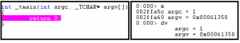

上图无法体现`dv`比`x`命令在显示局部变量上的高明之处。dv命令有几个开关选项，介绍如下：

* /v：显示虚拟地址（virtual）
* /i：显示变量详细信息（information），包括局部变量、全局变量、形参、函数变量等
* /t：显示变量类型（type），如int、char等等
* /f：可指定进行分析的函数，需指定函数名

命令中选项/f wmain是指针对wmain函数（即_tmain）分析其局部变量。看第一个变量argc，“prv param”对应/i开关选项；“@ebp+0×08”对应/v开关选项；“int”对应/t开关选项

### 显示类型

利用`dt`命令可以查看结构体的类型定义。命令`dt`是Display Type的缩写。当我们要查看一些内核结构体的定义时，`dt`命令是最直接有效的手段

## 断点

### 软件断点

软件断点的本质是代码改写，即将`INT 3`代码为（0xCC）指令替换到断点所在指令处（第一个字节），并保存被替换调的代码（即一个字节内容）。等执行到断点处，调试器将因断点而中断，并将被替换的一字节内容恢复到原内存中。其原理和代码补丁是一样的

源码或汇编模式下，最简单的断点设置方式，是定位到正确的代码处，并按下F9键。此外还有三种设置软件断点的指令，分别讲解如下

`bp`，此命令bp是BreakPoint的缩写。其指令格式如下：`bp[ID] [Options] [Address [Passes]] ["CommandString"]`。参数Address表示需设置断点的地址，缺省情况下使用当前指令指针（EIP）的地址。ID是断点号，一般不手动设置，由调试器内部编号。Passes是一个整数值，即第几次经过断点所在代码时，调试器才需要中断执行，默认为1，即每次都中断。CommandString用来设置一组命令，当断点发生的时候，就执行这一组命令，比如可以把它设置为“k”，这样断点处就会输出当前的调用栈

Options是一组可选开关项，有下面几种：

* /1：即阿拉伯数字1。这个选项表明这个被设置的断点只会在第一次有效，此后断点信息即被删除
* /p：这个开关项后跟一个EPCOESS结构体指针，只能用在内核调试环境下。内核调试环境下，如果要把断点设置到用户程序地址（即用户空间地址），需要使用这个开关，因为用户地址是进程相关的
* /t：这个开关项后跟一个ETHREAD结构体指针，只能用在内核调试环境下。此开关项与/p起到类似的作用，只不过前者定位到进程，后者更进一步定位到线程
* /c与/C：c或者C代表CallStack（调用栈）。这两个开关项和调用栈深度有关，都后跟一个整数值。前者表示调用栈深度如果小于这个整数值，断点才会引发中断，后者表示调用栈深度如果大于这个整数值，断点才会引发中断

`bu`，此命令格式与bp类似，u代表了Unresolved。使用此命令设置的断点虽登记到调试器，但它具体对应到哪处代码或指令，尚未确定

比如某EXE程序使用动态加载的方式加载DLL（使用函数LoadLibrary()），那么当DLL尚未加载时，就可用`bu`指令设置DLL中的代码断点，等到DLL加载时，调试器再正式落实此断点

`bm`，此命令用来批量设置代码断点，它带有一个通配符字符串，凡是符合通配符格式的地址都将被设置断点，如：`bm /a ntdll!NtCreate*File`则诸如NtCreateFile\NtCreateMailslotFile\NtCreateNamedPipeFile等函数都将被设置断点

### 硬件断点

硬件断点和软件断点的原理完全不同，硬件断点时通过CPU的断点寄存器来实现的，亦即依靠硬件方式实现。由于CPU的调试寄存器数量是有限的，所以能设置的硬件断点数量也是有限的。设置硬件断点的命令是`ba`，a代表Addres

指令格式为`ba[ID] Access Size [Options] [Address [Passes]] ["CommandString"]`

参数ID、Options、Passes及CommandString，含义与前文bp指令相同，此处不述。

参数Address是内存地址，有别于前文的指令地址，内存地址既可以是指令地址，也可以是数据地址。缺省为当前指令寄存器地址（EIP）。参数Size表示地址长度，x86系统可选值为1、2、4，X64系统可选值为1、2、4、8。需要注意的是，Address地址必须对齐到Size，即Address值必须是Size的整数倍

参数Access是内存访问类型，有下面几种：e：作为指令执行；r：读，或者写；w：写；i：执行IN/OUT操作

比如`ba r4 @ebp-0x08`，地址@ebp-8一定是一个局部变量地址，所以当CPU对这个局部变量执行读写操作时，将引发硬件中断

### 其他操作

其他的断点操作包括：显示断点列表、禁止或恢复断点、删除断点等

* bl：列出所有断点
* bd：禁止断点，d代表Disable。如bd 1，禁止断点1。断点被禁止后将不起作用，但亦未删除。
* be：恢复断点，e代表Enable。恢复被禁止的断点。如be 1恢复1号断点
* bc：清除断点，如：bc 1，清除断点1；bc *，清除全部断点
* br：序号管理，r代表ReNumber，即重新排序。如：br 2 0，将2号断点重设为0号断点

## 内存命令

这一节中，我们学习如何查看内存信息。内存是存储数据、代码的地方，通过内存查看命令可以分析很多问题。相关命令可以分为：

* 内存查看命令
* 内存统计命令，用来分析内存的使用情况

### 查看内存

有非常丰富的内存查看命令，它们被统一为d\*格式，如下所示：`d[类型] [地址范围]`

d代表Display，类型包括：字符、字符串、双字等。具体来说，d\*命令共有这几种：d、 da、db、dc、dd、dD、df、dp、dq、du、dw、dW、dyb、dyd、ds、dS。解释如下：

**内存类型**

基本类型：

* dw = 双字节WORD格式
* dd = 4字节DWORD格式
* dq = 8字节格式
* df = 4字节单精度浮点数格式
* dD =8字节双精度浮点数格式
* dp = 指针大小格式，32位系统下4字节，64位系统下为8字节

基本字符串

* da = ASCII字符串格式
* du = UNICODE字符串格式
* db =字节 + ASCII字符串
* dW = 双字节WORD + ASCII字符串
* dc = 4字节DWORD + ASCII字符串

高级字符串

* ds = ANSI_STRING类型字符串格式
* dS = UNICODE_STRING类型字符串格式

二进制+基本类型

* byb = 二进制 + 字节
* byd = 二进制 + DWORD值

如果读者对此感觉不明白，特别是组合模式究竟是何种情形？看下例应能清楚。下例将同一个ASCII字符串，分别以ASCII字符串、Unicode字符串以及组合模式等共五种方式显示：

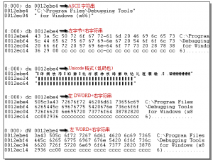

此系列命令还有一些可加利用的开关选项，介绍如下：

/c 列数：指定列数。默认情况下，列数 等于16除以列长，如dd命令的默认列数即为4列（=16/4）

比如`dd /c 8`，此命令每列显示8个DWORD数，即32字节内容

/p：此选项用来显示物理内存信息，只能用于内核模式中。不使用此命令时，都将显示虚拟内存信息。如：`d /p [地址范围]`，L 长度: 默认情况下，d命令只显示固定长度的内存，一般为128或64字节。L可指定长度，如下面的命令将显示地址0×80000000开始处的0×100个字节内容：`db 0x80000000 L100`

**数组形式内存**

难能可贵的是，d\*命令还能够以数组形式显示一段内存信息，包括：dda, ddp、 ddu、dds、dpa、dpp、dpu、dps、dqa、dqp、dqu、dqs

何谓“以数组形式显示”呢？这一组命令能够将指定地址处的内容，作为一系列指针，进而显示指针所指处内容。听上去有点拗口吧，读者这样想会清楚些：前一组命令显示address值，本节这一组命令显示address值

程序代码中如有类型`char *array[10]`的数组变量，可使用这些命令显示数组内容。下面会有例子。这一系列命令实则由第一组命令演化而来，可分为三组：

* 4字节DWORD为单位的dd\*系列数组指令
* 指针长度为单位的dp\*系列数组指令
* 8字节为单位的dq\*系列数组指令

**查看链表内存**

最后，d\*命令的另一个变体是以链表形式显示内存内容。命令如下：`dl 开始地址`

默认情况下，以正向从头到尾遍历链表；也可反向（由尾向头）遍历，指定b开关选项：`dl b 尾地址`

应注意的是，命令`dl`是Display List的缩写，这里的链表不能是用户自定义的链表，而专指符合LIST\_ENTRY或SINGLE\_LIST\_ENTRY格式的链表

### 内存信息

系统的内核空间很大的，想知道这么广大的内存空间里面都有些什么东西吗？想要知道一个内存地址，到底是被一个内核栈使用着，亦或被堆管理器使用着吗？我们这一节就领大家看看内存的地址概况

首先Address命令：`!address [地址]`。显示进程或系统的内存状态、信息，`!address`是最好的工具

不加任何参数，在用户模式下次命令将以内存块为代码，列出从地址0开始到0×80000000（略小于）的全部地址空间信息；内核模式下，将列出从地址0×80000000开始到0xFFFFFFFF（略小于）的全部地址空间信息

如指定地址值，则将显示此地址所在内存块的内存信息（此命令再Vista以后系统中，不能在内核模式下正常使用，此Bug应会在Windbg的以后版本中被修正）。下面分别截取了用户与内核空间中的内存信息片段

```
0:009> !address                            

        BaseAddress      EndAddress+1        RegionSize     Type       State                 Protect             Usage
------------------------------------------------------------------------------------------------------------------------
+        0`00000000        0`00010000        0`00010000             MEM_FREE    PAGE_NOACCESS                      Free       
+        0`00010000        0`00020000        0`00010000 MEM_MAPPED  MEM_COMMIT  PAGE_READWRITE                     Heap64     [ID: 1; Handle: 0000000000010000; Type: Segment]
+        0`00020000        0`00021000        0`00001000 MEM_PRIVATE MEM_COMMIT  PAGE_READWRITE                       
+        0`00021000        0`00030000        0`0000f000             MEM_FREE    PAGE_NOACCESS                      Free       
+        0`00030000        0`00031000        0`00001000 MEM_PRIVATE MEM_COMMIT  PAGE_READWRITE                       
// 省略很多...
```

上图截取了两段用户区内存，第一段从0开始，长度0×10000，状态为释放（FREE），表明这一段地址空间不可用；第二段从0×10000开始，长度0×1000，属于私有内存，状态为已提交，保护模式为可读写，此内存块被用于环境块

下面给大家解释一下内存块中的几个值：

**内存类型**：即Type值，共有四种：

* 第一种是什么都不是，即尚未被使用的
* 第二种是MEM\_IMAGE，即地址映射于一个可执行镜像文件片段，如DLL文件；
* 第三种是MEM\_ MAPPED，即地址映射于不可执行的镜像文件片段，如页文件；
* 第四种是MEM\_PRIVATE，即私有有内存，这里的私有是针对进程而言的，私有内存无法在多个进程间共享

**保护模式**：即Protect值

* 上例中见识了两种保护模式，NOACCESS和READWRITE
* 从字面即很容易理解其意思，前者是不能做任何访问的，因为空闲内存是无效内存
* 后者则可读可写，但不能执行，说明是保存数据的地方
* 所有可用的保护包括：
	* PAGE\_NOACCESS（不可访问）
	* PAGE\_READONLY（只读）
	* PAGE\_READWRITE（读写）
	* PAGE\_EXECUTE（可执行）
	* PAGE\_EXECUTE_READ（执行并可读）
	* PAGE\_EXECUTE_READWRITE（执行并可读写）
	* PAGE\_WRITECOPY（写时拷贝）
	* PAGE_EXECUTE\_WRITECOPY（执行，并写时拷贝）
	* PAGE\_GUARD（保护）

**内存状态**：即State值，共三种：

* MEM\_FREE，即空闲内存
* MEM\_RESERVED，即保留内存，保留内存尚不能被实际使用，但其地址空间已被预留，尚需一个提交动作
* 最后是MEM\_COMMIT，即内存已被提交，正在被使用

**内存用途**：即Usage值，有这样一些值和用途

* RegionUsageIsVAD：表示此地址区域已被分配
* RegionUsageFree：代表此地址区域已被释放，既没有保留也没有被提交，将来可以申请使用
* RegionUsageImage：代表此地址区域被映射到二进制文件的镜像
* Region UsageStack：代表此地址区域用于线程栈
* RegionUsageTeb：代表此地址区域用于保存目标进程的所有线程的TEB结构
* RegionUsageHeap：代表此地址区域用于堆内存
* RegionUsage Pdb：代表此地址区域用于保存目标进程的PEB结构
* RegionUsageProcessParameters：代表此内存块用于保存目标进程的启动参数
* RegionUsageEnviromentBlock：代表此地址区域用于保存目标进程的环境块

用户环境下可使用下面的明星显示内存统计信息，包括内存用途、内存类型、内存状态：`!address -summary`

```
0:009> !address  -summary

--- Usage Summary ---------------- RgnCount ----------- Total Size -------- %ofBusy %ofTotal
Free                                    101        0`7a5ba000 (   1.912 Gb)           95.60%
Image                                   294        0`022b8000 (  34.719 Mb)  38.49%    1.70%
                                 7        0`0113a000 (  17.227 Mb)  19.10%    0.84%
Stack32                                  51        0`01100000 (  17.000 Mb)  18.84%    0.83%
Heap32                                   26        0`006e0000 (   6.875 Mb)   7.62%    0.34%
MappedFile                               12        0`0069e000 (   6.617 Mb)   7.34%    0.32%
Stack64                                  51        0`00440000 (   4.250 Mb)   4.71%    0.21%
Other                                     8        0`001c1000 (   1.754 Mb)   1.94%    0.09%
Heap64                                    9        0`00190000 (   1.563 Mb)   1.73%    0.08%
TEB64                                    17        0`00022000 ( 136.000 kb)   0.15%    0.01%
TEB32                                    17        0`00011000 (  68.000 kb)   0.07%    0.00%
PEB64                                     1        0`00001000 (   4.000 kb)   0.00%    0.00%
PEB32                                     1        0`00001000 (   4.000 kb)   0.00%    0.00%

--- Type Summary (for busy) ------ RgnCount ----------- Total Size -------- %ofBusy %ofTotal
MEM_PRIVATE                             181        0`02f11000 (  47.066 Mb)  52.17%    2.30%
MEM_IMAGE                               295        0`022b9000 (  34.723 Mb)  38.49%    1.70%
MEM_MAPPED                               18        0`0086c000 (   8.422 Mb)   9.34%    0.41%

--- State Summary ---------------- RgnCount ----------- Total Size -------- %ofBusy %ofTotal
MEM_FREE                                101        0`7a5ba000 (   1.912 Gb)           95.60%
MEM_RESERVE                              94        0`02f5d000 (  47.363 Mb)  52.50%    2.31%
MEM_COMMIT                              400        0`02ad9000 (  42.848 Mb)  47.50%    2.09%

--- Protect Summary (for commit) - RgnCount ----------- Total Size -------- %ofBusy %ofTotal
PAGE_EXECUTE_READ                        56        0`01414000 (  20.078 Mb)  22.26%    0.98%
PAGE_READONLY                           129        0`0117a000 (  17.477 Mb)  19.37%    0.85%
PAGE_READWRITE                          153        0`004b5000 (   4.707 Mb)   5.22%    0.23%
PAGE_WRITECOPY                           26        0`0004c000 ( 304.000 kb)   0.33%    0.01%
PAGE_READWRITE|PAGE_GUARD                34        0`00048000 ( 288.000 kb)   0.31%    0.01%
PAGE_EXECUTE_READWRITE                    2        0`00002000 (   8.000 kb)   0.01%    0.00%

--- Largest Region by Usage ----------- Base Address -------- Region Size ----------
Free                                      0`030b0000        0`6cf40000 (   1.702 Gb)
Image                                     0`75d71000        0`00879000 (   8.473 Mb)
                                 0`7f0e0000        0`00f00000 (  15.000 Mb)
Stack32                                   0`00cd0000        0`000fd000 (1012.000 kb)
Heap32                                    0`02f13000        0`0019d000 (   1.613 Mb)
MappedFile                                0`01a90000        0`002cf000 (   2.809 Mb)
Stack64                                   0`00160000        0`00039000 ( 228.000 kb)
Other                                     0`006b0000        0`00181000 (   1.504 Mb)
Heap64                                    0`02b90000        0`000bf000 ( 764.000 kb)
TEB64                                     0`7ef76000        0`00002000 (   8.000 kb)
TEB32                                     0`7ef78000        0`00001000 (   4.000 kb)
PEB64                                     0`7efdf000        0`00001000 (   4.000 kb)
PEB32                                     0`7efde000        0`00001000 (   4.000 kb)
```

上图分别以内存使用、内存类型、内存状态显示用户空间内存统计信息

和`!address`命令类似，用户模式下还有两个命令可用

* !vprot  [地址]：显示指定内存块的信息，侧重于内存保护信息
* !vadump  [-v]：显示整个内存空间信息，dump者倾泻也，开启-v选项将显示详细（Verbose）信息

上面讲过，用户环境下使用`!address –summary`可显示用户空间的内存统计信息；现在再看两个内核命令，在内核环境下显示内存的统计信息

`!memusage`，此命令从物理内存角度显示内存统计信息。无数个页表信息将被打印出来，可以说是“最内存”的信息。此命令会查看所有的页帧，所以运行时会非常耗时

`!vm`，此命令从虚拟内存的角度显示内存统计信息，不仅能从全局角度显示内存的使用情况，还能以进程为单位显示内存使用情况

### 其他命令

内核模式下，查看文件缓存信息，命令格式为`!filecache`。此命令在用户内核模式下，显示文件缓存和页表状态。每一行信息表示一个虚拟地址控制块（VACB）。虚拟地址控制块可能对应着一个命名文件，也可能对应着一个元数据块。如果对应着一个命名文件，则此文件名称将被显示，否则显示元数据名称

**实验：查看文件缓存**

```
很多软件都使用文件缓存的方式保存数据，比如Office Word。

直接查看WORD文档，由于其内部格式不透明，故而不便分析。

但如果使用WORD打开一个txt文本文档，它就会以文本文档的方式来处理之，并且依旧使用文件缓存的方式。

读者用WORD打开一个TXT文档（比如：测试.txt）。

运行内核调试器并执行!filecache命令，在打印信息中查找“测试.txt”。
```

用户模式下查看堆信息，命令格式为：`!heap`

下面的清单显示了某个进程共有4个堆

```
0:004> !heap -a
Index   Address  Name      Debugging options enabled
  1:   00150000
    Segment at 00150000 to 00250000 (00031000 bytes committed)

  2:   00250000
    Segment at 00250000 to 00260000 (00006000 bytes committed)

  3:   00260000
    Segment at 00260000 to 00270000 (00003000 bytes committed)

  4:   00390000
    Segment at 00390000 to 003a0000 (00008000 bytes committed)
    Segment at 01370000 to 01470000 (0007b000 bytes committed)
```

堆资源是属于进程的，每个进程都会创建若干个堆，如C运行时堆、进程默认堆。以第一个堆为例，地址范围是[0x150000, 0x250000]，已经有0x31000个字节被申请提交

## 小结

抄写一遍的过程，确实把Windbg的调试逻辑更加深入了一遍，而且接触到了更多的命令，整理此篇文章，很方便后续在实际调试中随时过来查阅

关于调试、逆向分析，无论是使用Windbg、GDB，还是OllyDbg、IDA，一方面是深入学习理论知识，一方面是进行大量的实践练习
