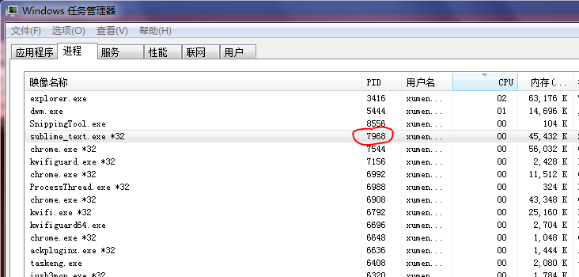
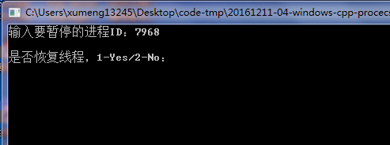
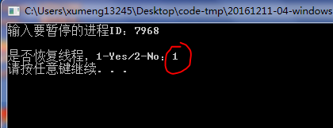

>测试环境：Windows 7、Visual C++ 6.0

有些时候，不得不让进程处于暂停状态。比如，病毒有两个运行的进程，它们在不断互相检测，当一个病毒进程发现另一个病毒进程被结束了，那么它会再次把被结束的病毒程序运行起来。由于两个病毒进程的相互检测频率较高。因此很难把两个病毒进程结束掉。因此只能让两个病毒进程都暂停后，再结束两个病毒进程

进程的暂停实质上是线程的暂停！因为进程是一个资源容器，而真正占用CPU时间的是线程。如果需要将进程暂停，就需要将进程中的线程全部暂停

本次练习进程的暂停与恢复，实质是对进程中全部线程进行暂停和恢复

## 线程枚举

要暂停进程中的全部线程，则离不开枚举线程。枚举线程的API和之前练习的枚举进程、枚举DLL的方法类似

但是和枚举DLL不同，因为不能创建指定进程中的线程快照，所以只能枚举到当前操作系统中的所有线程。那么在暂停线程时，必须对枚举到的线程进行判断，看其是否属于指定进程中的线程

如何判断一个线程属于哪个进程呢？其实在THREADENTRY32结构体中，th32ThreadId表示当前枚举到的线程ID，th32OwnerProcessID则表示线程所属的进程ID，这样就可以根据th32OwnerProcessID进行判断了

## 运行效果

使用资源管理器查看Sublime的PID是7968

输入7968，将Sublime进程挂起

这时候尝试去拖动Sublime，发现无任何响应，很显然，这时候该进程（内部所有线程）都被暂停了，无法响应拖动操作

然后输入1，恢复进程

这时候再去拖动Sublime、编辑文字，可以正常拖动、也可以正常编辑了，该程序又能正常工作了，说明进程恢复了
