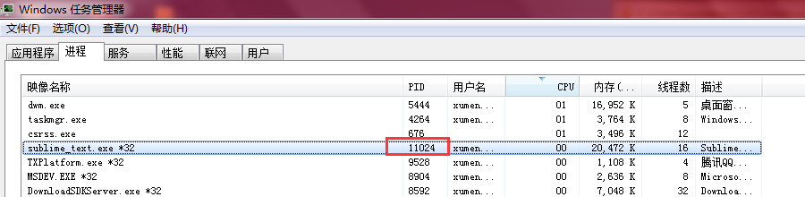
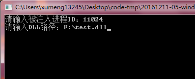
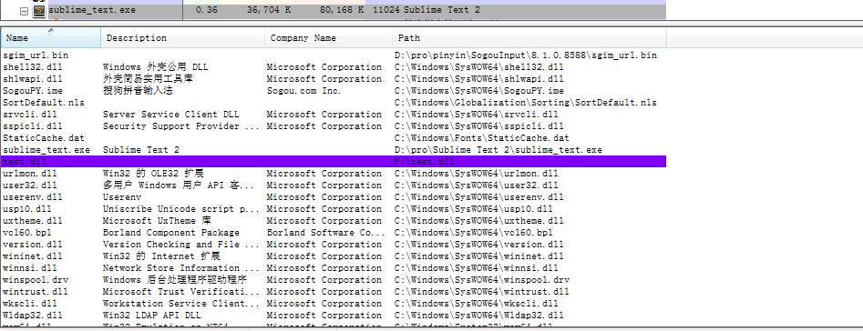
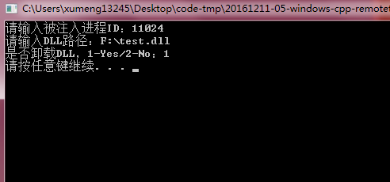

>测试环境：Windows 7、Visual C++ 6.0

Windows下为了避免各个进程互相影响，每个进程地址空间都是被隔离的

所谓的远程线程，并不是跨机器的，而是跨进程的，简单的说就是进程A要在进程B中创建一个线程

关于远程线程，大概可以用于

* DLL的注入
* 卸载远程DLL
* 不依赖DLL进行代码注入

远程线程被木马、外挂等程序广泛使用，反病毒软件中也离不开远程线程的技术。技术应用的两面性取决于开发者自己的个人行为意识！

## DLL远程注入

木马或病毒编写的好坏取决于其隐藏成都，而不在于其功能的多少。无论是木马还是病毒都是可执行程序。如果它们是EXE文件的话，那么在运行时必定会产生一个进程，就很容易被发现

为了不被发现，在编写木马或病毒时可以选择将其编写为DLL文件。DLL文件的运行不会单独创建一个进程，它的运行被加载到进程的地址空间中，因此其隐蔽性相对较好

DLL文件如果不被进程加载又如何在进程的地址空间运行呢？方式是强制某个进程加载DLL文件到其地址空间中，这个强制的手段就是远程线程

本例先实现一个练习，注入一个DLL文件到某目标进程中，所以远程线程函数的功能就是加载DLL。详细的信息在代码注释中说明

随便找一个DLL放在F盘下，目录是：F:\test.dll

Sublime，其进程号是11024

打开程序，输入进程号、DLL路径信息

回车后，使用process explorer查看Sublime加载的DLL信息，可以看到F:\test.dll被加载到Sublime进程中去了

继续执行程序卸载DLL

再去使用Process Explorer查看Sublime的DLL信息，此时F:\test.dll已经没有了！

>因为其中创建的远程线程调用的是LoadLibraryA、FreeLibrary，所以调用完成后线程也就自己结束、自动释放了。因为线程不是一直在循环，所以不需要考虑线程的释放问题

