>调试背景：Windows 7、4核、Delphi开发工具无响应、使用WinDbg进行调试

在使用Delphi开发的过程中，IDE突然无响应了

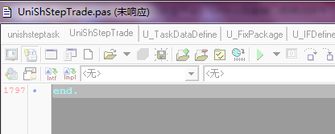

查看一下资源管理器的信息，两个个Delphi开发工具全部无响应了

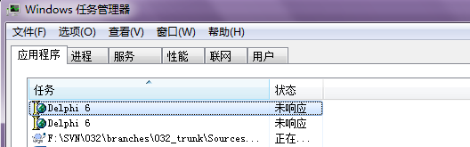

再去看CPU、线程数等信息，两个都在11%左右

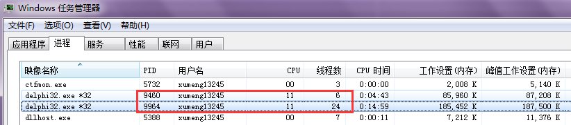

使用WinDbg Attach到Delphi进程9964上去排查一下

然后再去资源管理器看，其中一个的CPU占用率是0%，是因为WinDbg Attach到进程上后，会将进程的所有线程挂起，另一个是24%(机器是4核的)，怀疑是死循环了

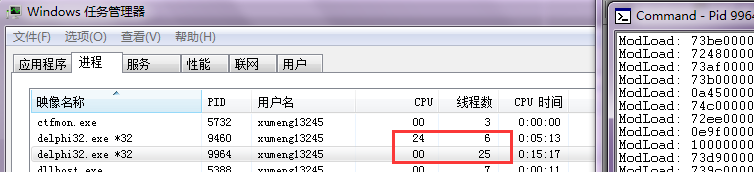

在WinDbg中输入命令[g]，让被调试进程的线程都跑起来

再去资源管理器查看一下，两个进程的CPU占用又变了

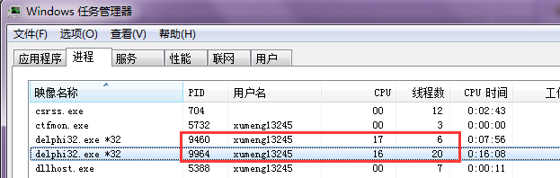

然后再把被调试的程序挂起，看到被调试进程的CPU占用又变成0，另一个的CPU占用又变成了25%

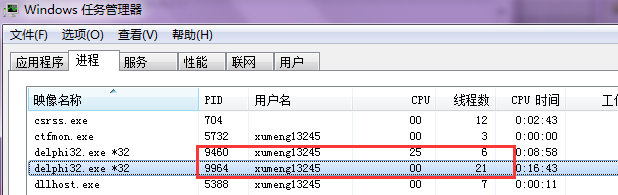

继续调试

因为是无响应，又加上CPU占用过高，所以怀疑是主线程死循环导致的，在WinDbg中主线程是0号线程

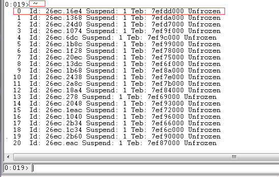

查看0号线程的调用栈

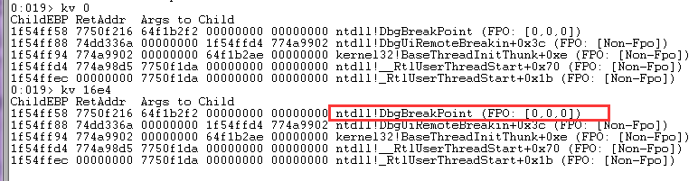

然后顺便想去看一下被调试的Delphi的锁信息，毕竟还是有可能是死锁导致的，但是输入[!locks]命令后一直处于BUSY状态，然后选择【Debug】->【Detach Debugee】，但接下来就是WinDbg也无响应了

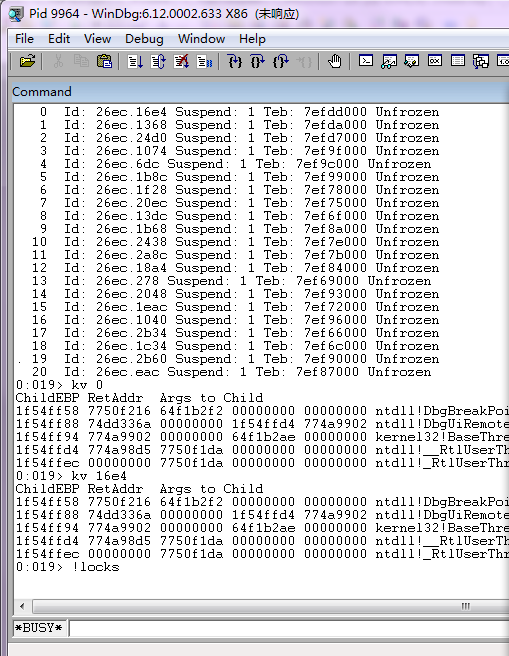

去资源管理器查看WinDbg的进程信息，进程的CPU占用为25%，怀疑是死循环了

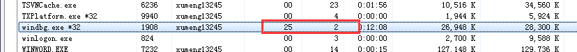

再去开一个WinDbg去调试无响应的WinDbg

先执行[~]查看线程信息，然后执行[!locks]查看当前锁死的临界区

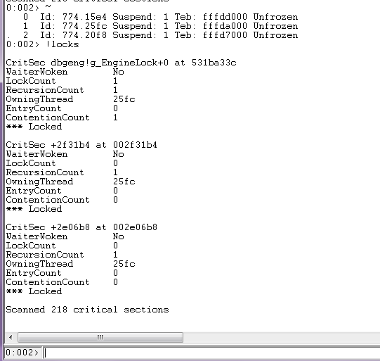

可以看到有三个锁住的锁，并且都是被线程25fc占用的

----

Detach Debugee，然后使用procdump将无响应的WinDbg进程Dump下来

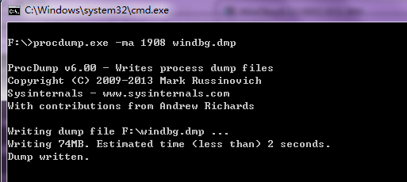

接下来使用WinDbg去分析Dump文件

执行[~]、[kv 1]、[kv 0]查看线程的调用栈等信息

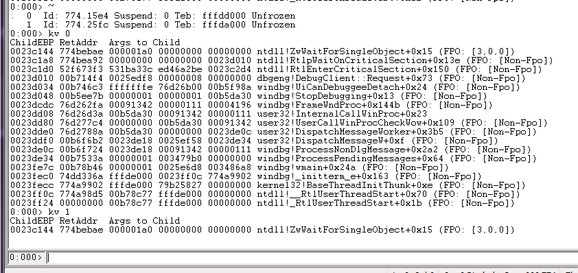

执行[!locks]看到有两个锁住的临界区，并且都是被25fc线程占用

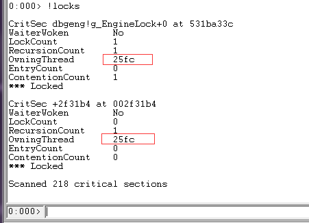

结合上面的调用栈信息，怀疑死锁导致的

----

过了一晚上，回来看卡死的WinDbg没事了，所以继续还是先用WinDbg调试卡死的Delphi

执行[!locks]没有看到死锁

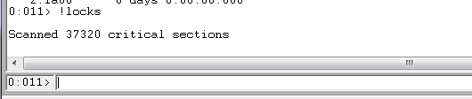

Detach之后，再去看Delphi的CPU占用情况，还是11%左右

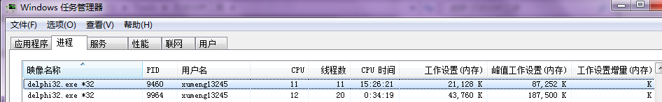

还是把进程Dump下来，去分析Dump文件

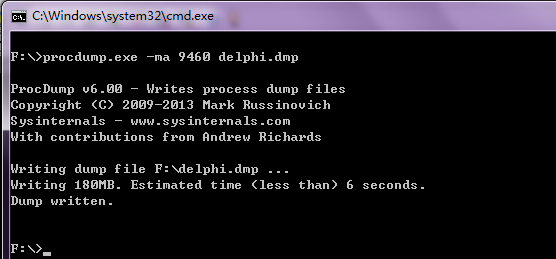

[!locks]显示确实没有锁住的锁

[!runaway]查看每个线程用户态时间，看到明显线程0:2260的CPU占用率过高

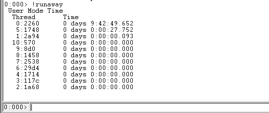

[!runaway 7]查看每个线程用户态、内核态、从创建开始经历的时间

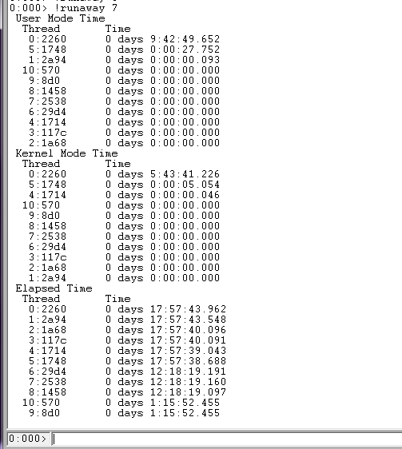

基本上可以确定是0号线程陷入死循环，在Windows 7下的WinDbg，0号线程就是进程的主线程，负责控件、界面相关的消息处理等，主线程进入死循环，基本就导致进程无法响应了

[kv 0]查看0号线程的调用栈，看到其是在调用user32!NtUserMessageCall+0x15时卡死

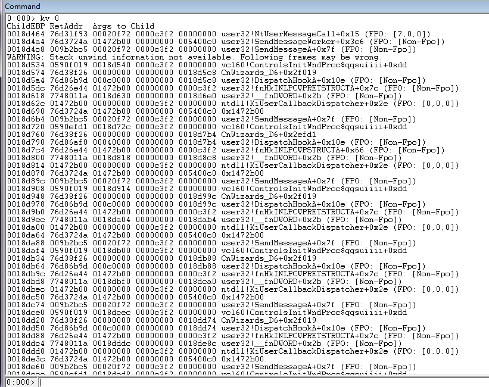

上面是将进程Dump下来后，分析Dump文件，如果直接Attach到进程上，因为WinDbg会将被调试进程的所有线程挂起、注入调试线程等，所以这时候看到的线程调用栈就有问题，和上面调试Dump的效果完全不同

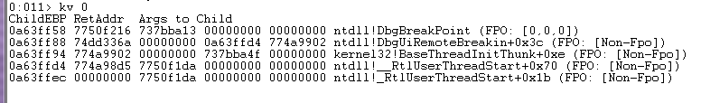

我想达到的效果是在WinDbg中将Delphi的死循环问题解决掉，而不是强杀Delphi，再去重启它

再用WinDbg Attach到无响应的Delphi上，[~ 0s]切换到线程0

再去用[kv]查看看0号线程的调用栈，，和Dump分析的结果是一致的

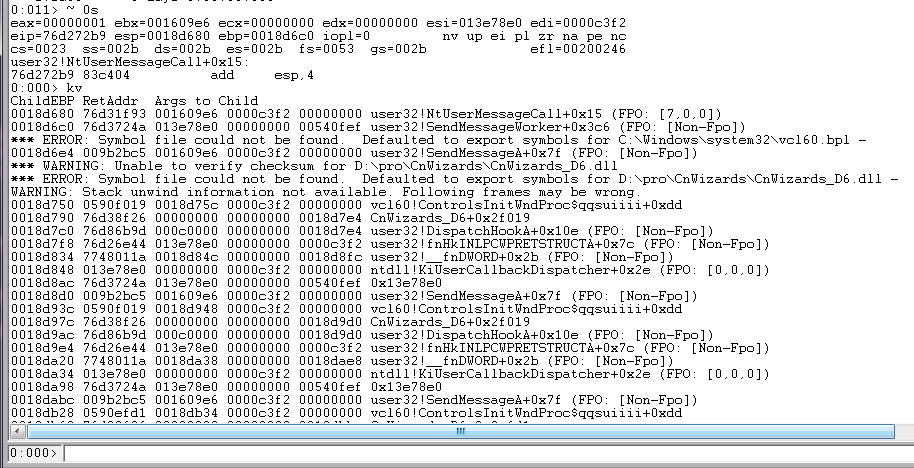

可以用WinDbg去断点调试，[bp user32!NtUserMessageCall+0x15]下断点，然后[g]让被调试程序运行起来

然后一直F10进行Step Over单步，或者执行[p]命令

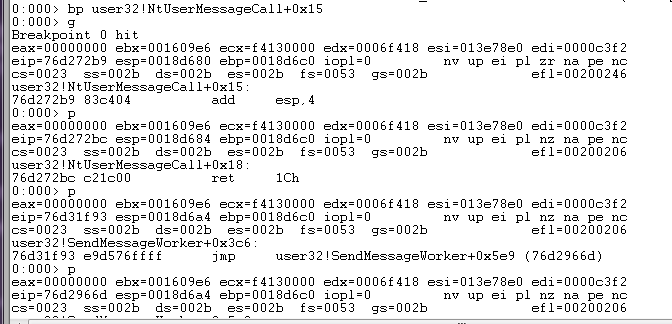

[p]命令的输出如下，是一些寄存器信息

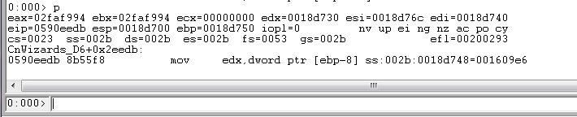

>如果想查某些命令的用法，可以在WinDbg上【Help】-->【Search】打开帮助文档。都是英文的，很好的训练自己阅读英文资料的方式

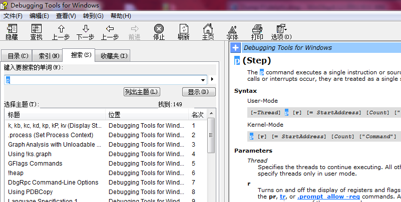

继续上面的调试，单步跟踪，目前我也不太懂寄存器、汇编，所以对于[p]输出的信息我也不太懂

>当然接下来就是重点研究CPU、寄存器、汇编相关的

不会就多试，试着多次执行[g]命令，因为之前是[bp user32!NtUserMessageCall+0x15]下的断点，所以一直是在这个地址停止，不过也不能说明是在这里面陷入了死循环，接下来要怎么搞？

----

现在针对这个问题我只是

* 大概知道是因为主线程陷入死循环
* 使用WinDbg的常用命令去查看线程、锁、函数堆栈信息、内存信息等
* 使用WinDbg的常用命令去控制线程，断点、单步、运行等

但是

* 为什么会陷入死循环
* 怎么使用WinDbg将进程从死循环中解脱出来
* [p]命令输出的寄存器信息对于调试有什么作用
* 寄存器、汇编该怎么理解
* 怎么用WinDbg调试WinDbg以深刻研究WinDbg的工作原理
* 线程、进程在操作系统中从内核态到用户态的工作原理是什么样的

以上也正是目前存在的问题，第一次独立使用WinDbg调试完全不像跟着别人的培训手把手模仿那么容易

>路漫漫其修远兮，吾将上下而求索