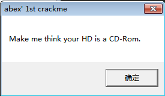
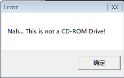
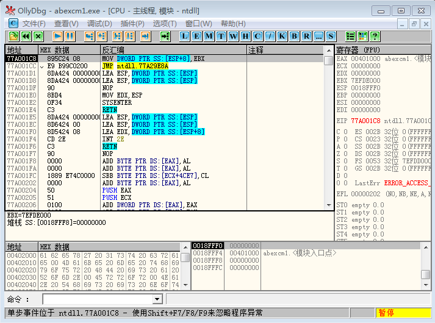
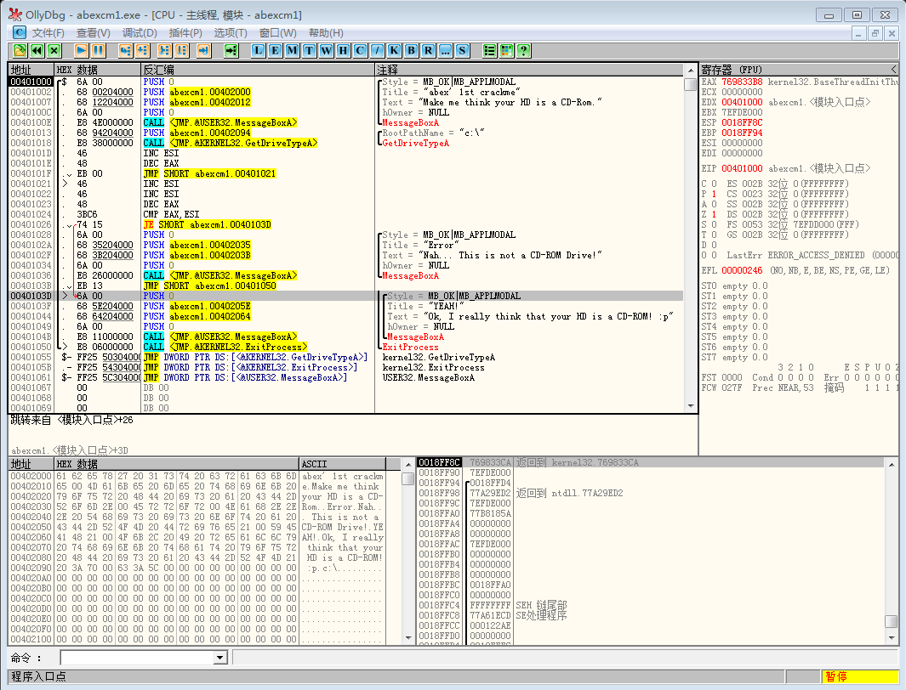
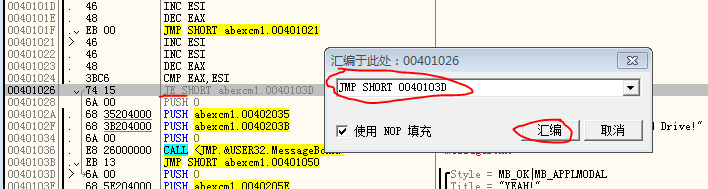
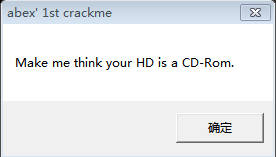
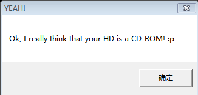

本文讲解使用OllyDbg逆向分析并破解一个简单的小程序

首先推荐相关文章[《汇编与逆向基础：使用IDA和OllyDbg分析C函数调用》](http://www.xumenger.com/c-assembly-ollydbg-ida-20161216/)

有很多公开用作破解练习的小程序可以用于锻炼和检验自己的逆向分析、软件破解的技术，加深自己对调试器以及汇编代码的认识

点击程序abex crackme #1后运行效果如下





打开OllyDbg，载入这个小程序



然后按`F9`运行程序，程序会在启动处暂停，可以看到这时的汇编代码



使用VC++、VC、Delphi等开发工具编写程序时，除了自己编写的代码外，还有一部分启动函数是由编译器添加的，经过反汇编之后，代码看上去就比较复杂，比如在[《汇编与逆向基础：使用IDA和OllyDbg分析C函数调用》](http://www.xumenger.com/c-assembly-ollydbg-ida-20161216/)看到的那样

但是如果直接使用汇编语言编写程序，汇编代码会直接变为反汇编代码。观察上面截图中该crack程序的汇编代码，main()直接出现在EP中，简洁又直观，充分证明了这是一个直接用汇编语言编写的程序

先看汇编程序中涉及到Win32 API调用的内容

```
MessageBox("Make me think you HD is a CD-Rom.")
GetDriveType("C:\\")
...
MessageBox("Nah... This is not a CD-ROM Driver!")
MessageBox("OK, I really think that your HD is a CD-ROM! :p")
ExitProcess()
```

如果之前大家从事过Windows应用程序的开发，那么对以上几个函数的含义应该非常了解。从上述代码的分析中，我们能够准确把握程序制作者的真正意图。在消息窗口按“确定”后，程序会调用GetDriveType() API，获取C驱动器的类型（大部分返回的时HDD类型），然后操作它，使之被识别为CD-ROM类型，在在消息窗口中输出"OK, I really think that your HD is a CD-ROM! :p"消息

然后逐行分析crackme的代码

```
;调用MessageBoxA()函数
00401000 >/$  6A 00         PUSH 0                                         ; /Style = MB_OK|MB_APPLMODAL
00401002  |.  68 00204000   PUSH abexcm1.00402000                          ; |Title = "abex' 1st crackme"
00401007  |.  68 12204000   PUSH abexcm1.00402012                          ; |Text = "Make me think your HD is a CD-Rom."
0040100C  |.  6A 00         PUSH 0                                         ; |hOwner = NULL
                                                                           ; 执行PUSH指令，将参数到栈中
0040100E  |.  E8 4E000000   CALL <JMP.&USER32.MessageBoxA>                 ; \MessageBoxA
                                                                           ; 在函数内部ESI被设置为FFFFFFFF

;调用GetDriveType()函数
00401013  |.  68 94204000   PUSH abexcm1.00402094                          ; /RootPathName = "c:\"
00401018  |.  E8 38000000   CALL <JMP.&KERNEL32.GetDriveTypeA>             ; \GetDriveTypeA
                                                                           ; 返回值 (EAX) 是3（DRIVE_FIXED）

0040101D  |.  46            INC ESI
0040101E  |.  48            DEC EAX
0040101F  |.  EB 00         JMP SHORT abexcm1.00401021                     ; 无意义的JMP命令（垃圾代码）
00401021  |>  46            INC ESI
00401022  |.  46            INC ESI
00401023  |.  48            DEC EAX

;条件分支（401028 或 40103D）
00401024  |.  3BC6          CMP EAX,ESI                                    ; 比较EAX(1)与ESI(2)
00401026  |.  74 15         JE SHORT abexcm1.0040103D                      ; JE（Jump If Equal）条件分支命令
                                                                           ; 若两值相等，则跳转到40103D
                                                                           ; 若两值不等，则从401028继续执行
                                                                           ; 在40103D地址为消息框输出代码

;MessageBoxA()函数调用失败
00401028  |.  6A 00         PUSH 0                                         ; /Style = MB_OK|MB_APPLMODAL
0040102A  |.  68 35204000   PUSH abexcm1.00402035                          ; |Title = "Error"
0040102F  |.  68 3B204000   PUSH abexcm1.0040203B                          ; |Text = "Nah... This is not a CD-ROM Drive!"
00401034  |.  6A 00         PUSH 0                                         ; |hOwner = NULL
00401036  |.  E8 26000000   CALL <JMP.&USER32.MessageBoxA>                 ; \MessageBoxA
0040103B  |.  EB 13         JMP SHORT abexcm1.00401050

;MessageBoxa()函数调用成功
0040103D  |>  6A 00         PUSH 0                                         ; |/Style = MB_OK|MB_APPLMODAL
0040103F  |.  68 5E204000   PUSH abexcm1.0040205E                          ; ||Title = "YEAH!"
00401044  |.  68 64204000   PUSH abexcm1.00402064                          ; ||Text = "Ok, I really think that your HD is a CD-ROM! :p"
00401049  |.  6A 00         PUSH 0                                         ; ||hOwner = NULL
0040104B  |.  E8 11000000   CALL <JMP.&USER32.MessageBoxA>                 ; |\MessageBoxA

;终止进程
00401050  \>  E8 06000000   CALL <JMP.&KERNEL32.ExitProcess>               ; \ExitProcess

00401055   $- FF25 50304000 JMP DWORD PTR DS:[<&KERNEL32.GetDriveTypeA>]   ;  kernel32.GetDriveTypeA
0040105B   .- FF25 54304000 JMP DWORD PTR DS:[<&KERNEL32.ExitProcess>]     ;  kernel32.ExitProcess
00401061   $- FF25 5C304000 JMP DWORD PTR DS:[<&USER32.MessageBoxA>]       ;  USER32.MessageBoxA

```

特别说一下JMP和JE指令

* JMP：直接跳转到指定地址
* JE：条件跳转指令（Jump if Equal），若ZF标志位为1，则跳转

下面修改汇编指令代码来破解这个小程序

>代码逆向分析技术中，我们把有意将已有代码（或数据）覆盖为其他代码的行为称为“打补丁”（patch）

将光标移动到401026地址处，按空格键，在打开的汇编窗口中将汇编指令`JE SHORT 0040103D`替换为`JMP SHORT 0040103D`。换言之，通过汇编命令窗口将条件分支语句（JE）替换为无条件跳转语句（JMP）



对于中文版的OllyDbg，在反汇编窗口右键-->复制到可执行文件-->选择，打开一个新的窗口，然后右键-->保存文件，就将原有的exe程序中的逻辑做了修改，并且生成一个新的EXE，该EXE的逻辑变了，所以相当于对原有的程序进行了成功的破解

运行破解后的程序





>这是一个极其简单的破解程序的例子，不过也很好的帮助了我理解破解的基本方法、简单的汇编语言。不过后续还需要进行大量的练习。正如开头说的，通过互联网找一些Windows、Linux平台下各种类型的crackme程序，去锻炼去总结