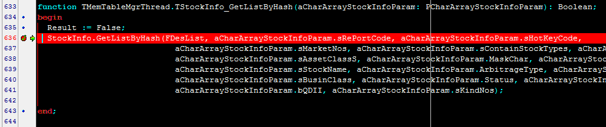
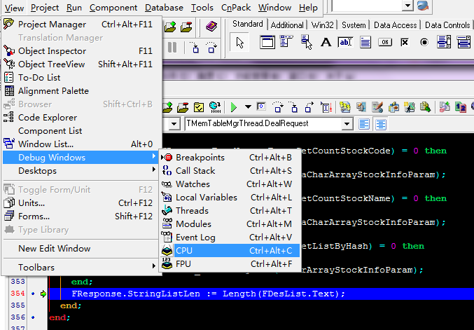
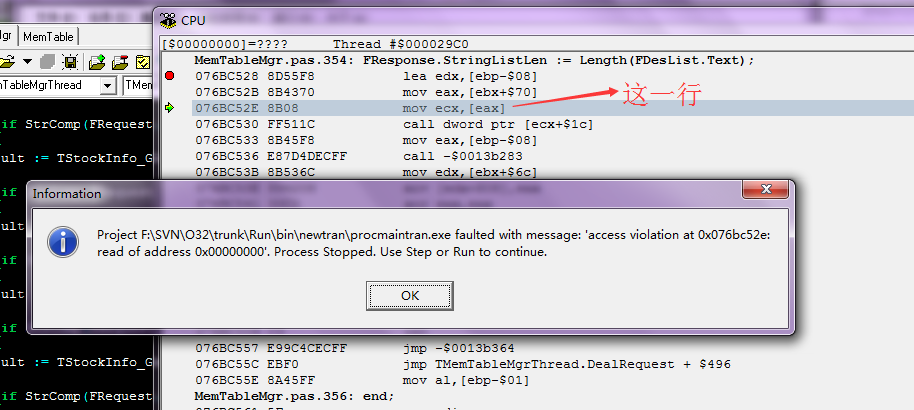
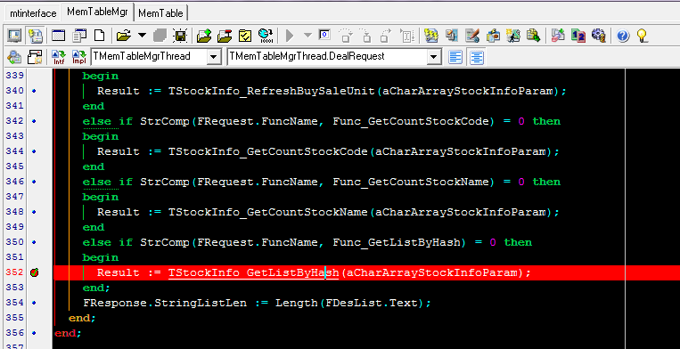
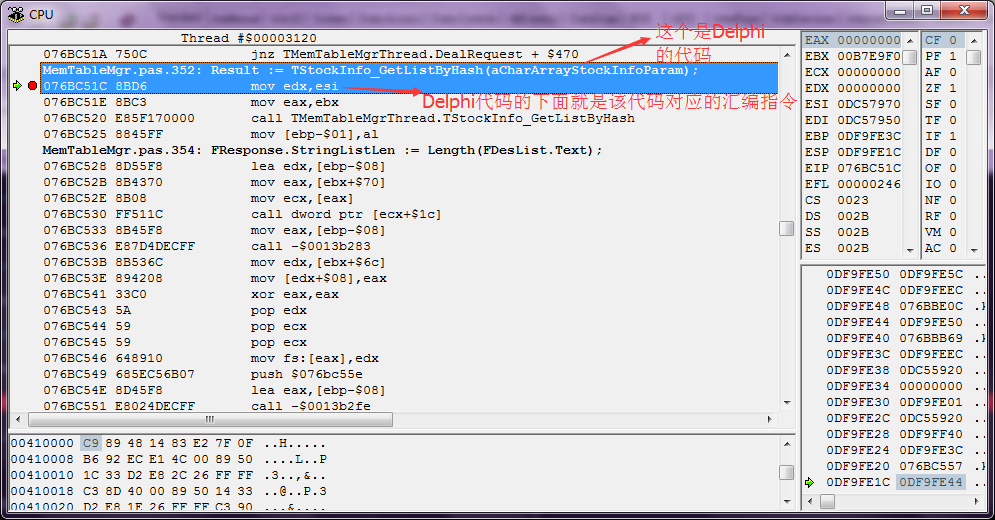
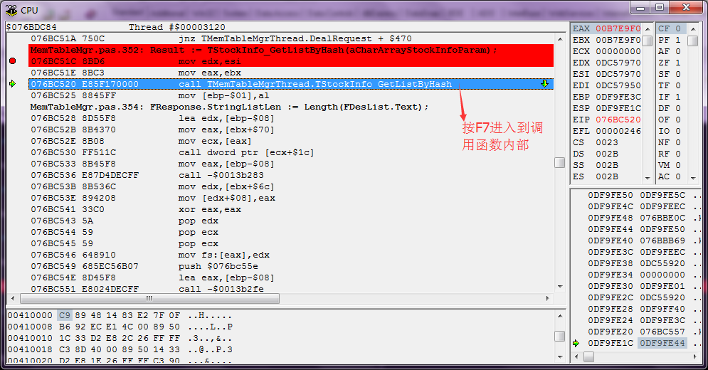
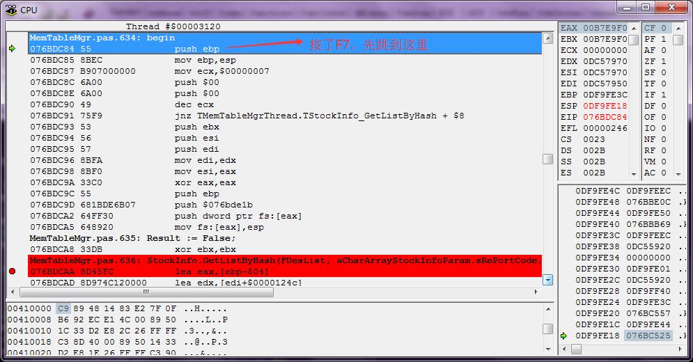
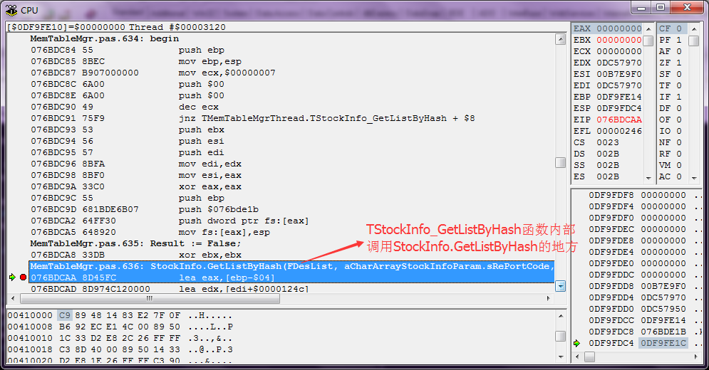
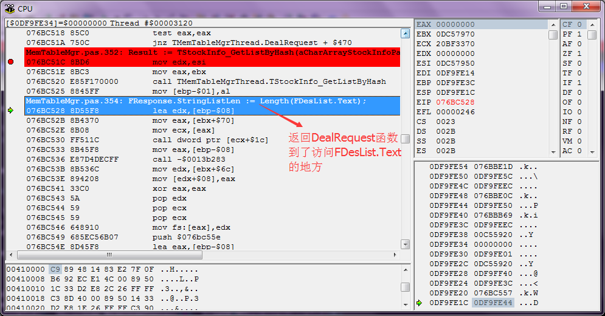
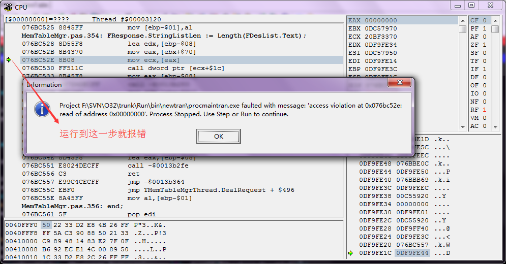

## 先简单说明一下情况

最近在开发进程化框架的共享内存，出现了一个比较诡异的现象，下面大致复述一下

程序的代码大概是这样的：

```
procedure TMemTableMgrThread.Execute;
var
  isSingleData: Boolean;
  RespShareMemBakName: string;
begin
  while not Terminated do
  begin
    try
      if WaitForSingleObject(FReqLockHd, 500) = WAIT_OBJECT_0 then
      begin
        ResetEvent(FReqLockHd);
        try
          CopyMemory(FRequest, FReqShareMem, SizeOf(TRequest));
          isSingleData := DealRequest();
          FResponse.StringListLen := Length(FDesList.Text);
          CopyMemory(FRespShareMem, FResponse, SizeOf(TResponse));
          if not isSingleData then
          begin
            if (Length(FDesList.Text)+1 > FRespMemSize) or (nil = FRespShareMemBak) then
            begin
              //扩展共享内存
              FRespMemSize := Length(FDesList.Text) + Const_1MB;
              if 0 <> FRespShareMemBakHd then
              begin
                CloseHandle(FRespShareMemBakHd);
                FRespShareMemBakHd := 0;
              end;
              RespShareMemBakName := Format(Const_RespMemNameBak, [FOperator, FTaskID]);
              FRespShareMemBakHd := CreateFileMapping($FFFFFFFF, nil, PAGE_READWRITE, 0, FRespMemSize, PChar(RespShareMemBakName));
              if 0 <> FRespShareMemBakHd then
              begin
                FRespShareMemBak := MapViewOfFile(FRespShareMemBakHd, FILE_MAP_ALL_ACCESS, 0, 0, FRespMemSize);
                //Success
              end
              else
              begin
                //Fail
              end;
            end;
            Move(FDesList.Text[1], FRespShareMemBak.Content[0], Length(FDesList.Text));
            FRespShareMemBak.Content[Length(FDesList.Text)] := #0;
          end;
        finally
          SetEvent(FRespLockHd);
        end;
      end;
    except
      on E: Exception do
      begin
        ...
      end;
    end;
  end;
end;

function TMemTableMgrThread.DealRequest(): Boolean;
var
  aCharArrayStockInfoParam: PCharArrayStockInfoParam;
begin
  FDesList.Clear();
  FResponse.RequestID := FRequest.RequestID;
  if StrComp(FRequest.ClassName, Class_TStockInfo) = 0 then
  begin
    aCharArrayStockInfoParam := PCharArrayStockInfoParam(@(FRequest.Params[0]));
    if StrComp(FRequest.FuncName, Func_Count) = 0 then
    begin
      Result := TStockInfo_Count(aCharArrayStockInfoParam);
    end
	else if StrComp(FRequest.FuncName, Func_GetListByHash) = 0 then
    begin
      Result := TStockInfo_GetListByHash(aCharArrayStockInfoParam);
    end;
    FResponse.StringListLen := Length(FDesList.Text);
  end;
end;

function TMemTableMgrThread.TStockInfo_GetListByHash(aCharArrayStockInfoParam: PCharArrayStockInfoParam): Boolean;
begin
  Result := False;
  StockInfo.GetListByHash(FDesList, aCharArrayStockInfoParam.sRePortCode, aCharArrayStockInfoParam.sHotKeyCode,
                            aCharArrayStockInfoParam.sMarketNos, aCharArrayStockInfoParam.sContainStockTypes, 
                            aCharArrayStockInfoParam.sExceptStockTypes, aCharArrayStockInfoParam.sAssetClassS, 
                            aCharArrayStockInfoParam.MaskChar, aCharArrayStockInfoParam.sStockSpell,
                            aCharArrayStockInfoParam.sStockName, aCharArrayStockInfoParam.ArbitrageType, aCharArrayStockInfoParam.sAttronType,
                            aCharArrayStockInfoParam.sBusinClass, aCharArrayStockInfoParam.Status, aCharArrayStockInfoParam.bBlurrySearch,
                            aCharArrayStockInfoParam.bQDII, aCharArrayStockInfoParam.sKindNos);
end;
```

当满足以下条件时，必然出现非法地址访问，导致程序崩溃：

* 调用TStockInfo_GetListByHash方法，内部调用GetListByHash方法
* 在DealRequest方法的后面访问FDesList.Text属性，像上面的代码那样
	* 如果直接在TStockInfo_GetListByHash中调用GetListByHash后，访问FDesList.Text没有问题
	* 如果再往外一层，在Execute方法中再访问FDesList.Text，没有问题
	* 如果在DealRequest中将访问FDesList.Text删除没有问题
	* 如果在DealRequest中访问FDesList.Count没有问题

以上看来，规律很清晰，但根本没有办法用我现有的常识来解释

## 使用Delphi调试

因为现在有代码，那么直接上Delphi调试，首先在TStockInfo_GetListByHash方法中加断点



Ctrl+Alt+C在汇编层面进行调试




和在代码层面调试一样：F7单步进入、F8单步步过、F9直接运行到下一个断点、F5也可以在汇编代码上断点，然后就可以对汇编代码进行逐行调试了；这中间的原理、源码和汇编的对应关系，其实就是通过调试符号文件实现的

汇编调试，到了下图这一样就出问题了



看这里的汇编，没有上下文，看不出什么头绪，接下来去看上两层也就是DealRequest调用TStockInfo_GetListByHash函数时的汇编，在该这个逻辑点下断点



接下来结合之前研究汇编语言，详细分析逐步的调试过程和汇编代码

最开始停留在断点的地方（Delphi代码和如下汇编代码一一对应），一般一行高级语言代码对应很多行汇编代码，Delphi很友好的一点就是在Delphi语言下面对应给出该行高级语言的汇编指令



然后单步进入到TStockInfo_GetListByHash函数内部





再进一步到了TStockInfo_GetListByHash函数内部调用StockInfo.GetListByHash的地方



然后到了DealRequest函数内部，访问TDesList.Text的地方



继续运行到`mov ecx, [eax]`的地方会出现非法地址访问报错



整个调试过程走了一遍，但是期间对于堆栈、寄存器、变量值、堆内存等的变化都完全没有进行详细的分析和对比，所以到现在也看不出什么东西。其实现在遇到一些程序异常的问题分析起来还是没有太好的思路和方法

* 很多问题首先还是不知道该如何分析
* 每一行汇编代码是干什么的可能知道，但大量的汇编指令放在一起，该如何去理解这个上下文就很有困难了
* 调试汇编的时候，不光是指令的执行，对应每一步寄存器、内存都会有变化的，这个该如何结合上下文进行分析其变化以及对应的影响

所有这些都需要更多的练习和经验的积累

## 简单反思总结

之所以想到针对这相关的函数进行逐层调试，就是出现这种诡异问题没有多线程并发访问导致异常，那么就极有可能是堆栈破坏导致的，有了这个怀疑，但是还是想不到如何进行合理的解释

然后去问了公司的技术专家，现在我是直接对接接口文件编程的，如果接口定义的是`procedure Proc(i: Integer; s: string);`，但测试环境中的对应实现的dll内部可能是老版本的实现和最新的接口不一致，老版本中可能就没有这个方法的实现，或者可能实现是`procedure Proc(i: Integer);`导致实现和接口不一致，因为我是直接对接接口编程，所以在编译期间是不会报错的，但是到了运行的时候就出问题了。所以我现在只是在弄清楚可能原因后，自己再回头进行的调试，并不是自己一开始就想到的

最后拿相同版本的接口和dll，重新编译、运行就没有这个问题了！

哎，这么多版本，我作为一个开发，自己的自测环境上各种版本的接口、dll混在一起，怎么能不出问题，所以通过自己实实在在遇到这个棘手的问题，让自己真正明白了环境、版本、规范性的重要性
