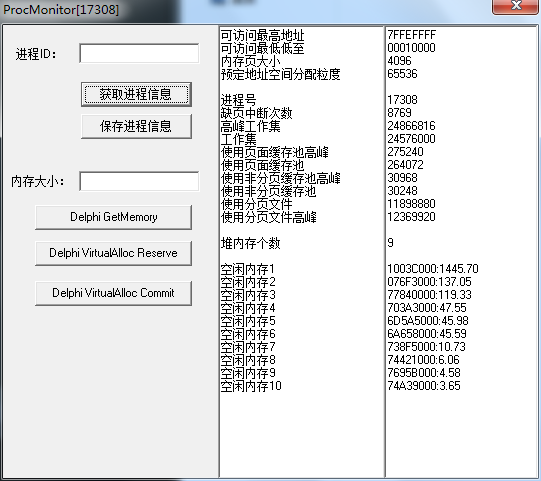
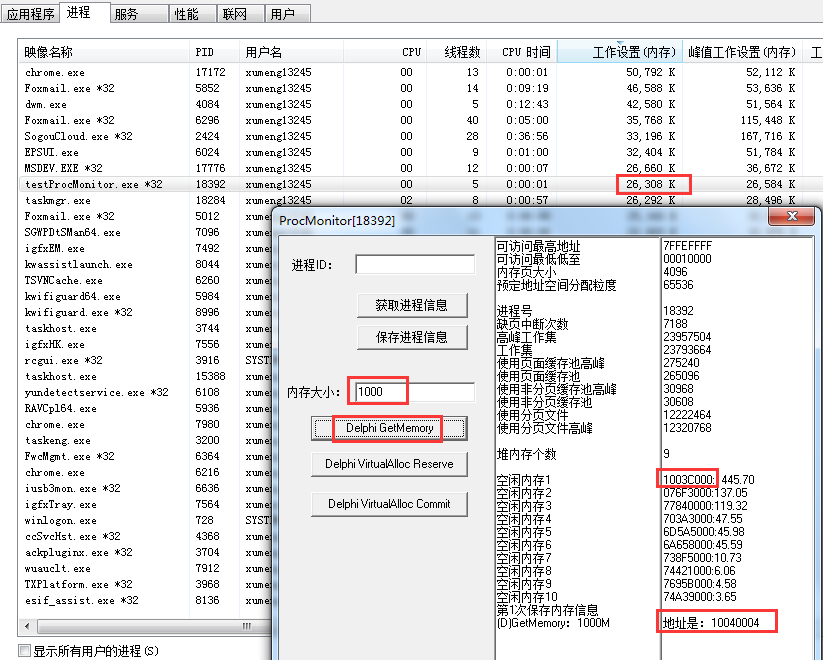

## GetMemory简介

可以看到GetMemory在Delphi中的实现是

```
function GetMemory(Size: Integer): Pointer; cdecl;
begin
  Result := MemoryManager.GetMem(Size);
end;
```

## 测试进程启动时的内存情况

进程启动时【获取进程信息】，可以看到最大的空闲内存是`0x1003C000`处的1445.7M，其他都是100M左右的空闲内存



【保存进程信息】，打开HTML，查看`0x1003C000`处的地址是Free的


## GetMemory 1000M后内存变化情况

申请1000M的内存（因为是1000M大内存，所以只能在1003C000对应内存区域的某个地方申请），申请的地址是`0x10040004`，但是对应看其在任务管理器中内存并没有上升到1000M以上



说明Windows在进程申请了内存但是没有使用这块内存的时候，是不会真正分配内存的，所以上面测试的前置机在80M时就Out Of Memory可能是有内存碎片，也有可能申请了很多内存但是没有使用，导致虽然看到内存只有80M，但实际用了很多。总之两者都有可能

>在[《windows任务管理器中的工作设置内存,内存专用工作集,提交大小详解》](http://shashanzhao.com/archives/832.html)中有对**工作设置（工作集）**有说明：工作设置指程序占用的物理内存（包含与其他程序共享的一部分），其值等于`专用工作集 + 与其他进程共享的物理内存`，所以可以看到工作设置是物理内存，猜测是因为这部分虽然申请了，但是没有对应到物理内存中，所以没有计算在工作设置中

>后续可以专门整理一篇文章测试一下，当往这块内存中写入数据时，工作设置会不会有变化！暂时先不管，这部分对于理解进程内存模型不是核心的点，先知道有这么个现象就行

>这里是针对目前现象做的一个合理猜测，可能并不是这样，后续针对进程内存模型有了更深入的研究之后再来完善这里的解释

【保存进程信息】，打开HTML，搜索`0x10040004`左右处的内存查看其信息


`0x1003C000`原来是`Free 1515929600Byte`，现在因为被申请了1000M的内存，所以变成`Free 16384`，后面的`0x10040000`开始申请

我们可以使用WinDbg来分析一下内存情况，`!address 10040000`查看该地址对应的内存页属性，可以看到起始地址`0x10040000`、结束地址`0x4e844000`、大小`0x3e804000 = 1048592384`和在HTML输出的信息是一致的


现在有几个问题需要解释一下：

* 为什么使用WinDbg查看的内存其实地址是`0x10040000`，但GetMemory返回的值是`0x10040004`，多出来的4Byte是干什么用的？！
* 为什么我GetMemory申请的是`1000*1024*1024 = 1048576000 = 0x3E800000`，但用WinDbg查看的这块内存大小是`0x3e804000 = 1048592384`多出来`0x4000 = 16384`字节

先针对这些信息进行合理的猜测，然后再去查资料进行验证

`db 10040000`以16进制形式查看`0x10040000`处的内容是`06 00 80 3e`，我的机器是小端存储模式，所以应该是`0x3E080006`


GetMemory返回的地址是`0x10040004`，所以从`0x10040004`的`1000 * 1024 * 1024`字节就是这次我们申请到可供我们使用的1000M内存

那我们继续查看这1000M的最后一个字节，`0x10040004`开始内存的第一个字节的地址是`0x10040004 + (0x1 - 0x1) = 0x10040004`，所以`0x10040004`开始内存的第1000M字节是`0x10040004 + (0x3E800000 - 0x1)`。所以我们`db 0x10040004 + (0x3E800000 - 0x1)`查看最后一个字节的内容


可以看到最后一个字节的内容是0，接下来的两个是`04 46`

>这里又有一个疑问：在[《Delphi 的内存操作函数(4): 清空与填充内存》](http://www.cnblogs.com/del/archive/2008/11/14/1333425.html)讲到使用GetMemory申请的内存没有初始化内存内容，而AllocMem会初始化内存内容。具体为什么这里使用GetMemory申请的内存都是0，而AllocMem到底有什么特点，后面我会专门对AllocMem这个函数申请内存的特点进行类似的探究！

梳理一下，现在我们申请了`0x3E800000 = 1000 * 1024 * 1024`字节，GetMemory返回的地址是`0x10040004`，但是`!address 10040004`看到这块内存的起始地址是`0x10040000`，通过上面分析内容，猜测前4个字节存储的是这块内存的长度，包括`前4Byte的长度信息 + 1000*1024*1024的实际分配内存 + 2Byte的其他信息`

其中前4Byte存储的是这块用户申请的内存的实际长度`4Byte + 1000*1024*1024 + 2Byte = 1040711686 = 0x3E080006`

>可以后续自己GetMemory申请一块小一点的内存，再去看对应内存块的详细信息，和这次申请1000M的情况进行对比，作为一个简单的验证。后续可以专门做一下补充

另一个问题：为什么申请`1000M = 0x0x3E080000`，加上多余的6字节也就`0x3E080006`，但实际这块内存块有`0x3E804000 = 1048592384`这么大，多出来了`0x3E804000 - 0x3E080000 - 0x6 = 0x4000 - 0x6 = 16372`

在《Windows》核心编程中有讲到：

* 当应用程序预订地址空间区域时，系统会确保区域的`起始地址正好是分配粒度的整数倍`
	* 分配粒度会根据不同的CPU平台而有所不同
	* `GetSystemInfo(info: TSystemInfo)`中TSystemInfo的dwAllocationGranularity字段表示分配粒度
	* 经过测试发现是`65536Byte = 64K`
* 当应用程序预订地址空间中的一块区域时，系统会确保区域的`大小正好是系统页面内的整数倍`
	* 页面是一个内存单元，系统通过它来管理内存
	* 与分配粒度相似，页面大小会根据CPU而有所不同
	* 按照我们GetSystemInfo的情况，可以看到当前测试机器的页面大小是`4096Byte = 4KB`

>这里又有一个疑问：正常申请1000M大小是4KB的整数倍，但是多出来了6Byte的多余信息，导致`1000M + 6Byte`不再是4KB的整数倍，那么往后扩展`4KB - 6Byte`就够了，为什么要扩展`16KB - 6Byte`呢

>还有一个疑问：多出来的这`16KB - 6Byte`空间明显没有被使用到，那还可不可以用到其他地方？还是说和我在[《Delphi配合VC++开发：结构体对齐机制》](http://www.xumenger.com/delphi-vc-dll-2-20160903/)中整理的结构体对齐机制一样，剩下的这些内存就这么浪费了？

## 找一块其他的Private内存进行比较

又找到一块Private的内存`7EF91000`


使用`!address 7EF91000`查看内存块信息，起始地址、结束地址、大小都与HTML输出信息一致


但是`db 7EF91000`看这块内存的开始区域的内容是`00 30 f9 7e`，因为是小端机器，所以是`7EF93000 = 2130259968`，明显并不是这块内存的大小信息

>猜测GetMemory使用的内存管理方式与我随便找到的这块内存的管理方式不同，所以内存结构也不同！


## 待续

这次分析先到这里，对GetMemory有了大致的理解和梳理，但很多事情就是不能一次到位的，后面继续研究的时候再对这部分内容进行查漏补缺、修改存在的错误！

这篇整理中，虽然对进程内存模型、GetMemory的特性做了一些总结，但还是有一些只是自己猜测的部分，以及自己在整理过程中提出的一些自己还没法解释和的疑问

这些猜测的验证、疑问的解答有必要在后续继续研究、查阅更多的资料过程中逐一进行解决

## 参考资料

* [《Delphi 的内存操作函数(4): 清空与填充内存》](http://www.cnblogs.com/del/archive/2008/11/14/1333425.html)
* [《Delphi配合VC++开发：结构体对齐机制》](http://www.xumenger.com/delphi-vc-dll-2-20160903/)
* [《windows任务管理器中的工作设置内存,内存专用工作集,提交大小详解》](http://shashanzhao.com/archives/832.html)
* [《windbg 常用命令详解》](http://blog.csdn.net/chenyujing1234/article/details/7743460)
* 《Windows核心编程》

