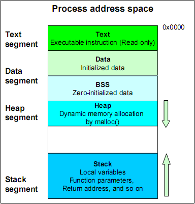

之前在[《Windows下32位进程内存模型》](http://www.xumenger.com/01-windows-process-memory-20170101/)、[《Linux下32位进程内存模型》](http://www.xumenger.com/02-linux-process-memory-20170101/)分别对Windows下32位进程、Linux下32位进程的内存模型进行了总结

按照当时的测试情况，Linux下32位进程是符合下面这个进程模型图的（至少当时的实验结果如此）

但当时的测试情况显示Windows下32位进程和这个进程模型图有出入。因为当时对于Windows进程的了解程度还是不够，所以也没有给出这个现象的合理解释，暂时就搁置了

## 一个契机让我重新接触Win32进程

因为我们组开发的产品在客户现场出现了进程内存仅80M的时候就出现Out Of Memory，我在[_ProcMonitor](https://github.com/HackerLaboratory/_Laboratory/tree/master/_Basic/_ProcMonitor)中进行了详细的背景介绍（当然，其中关于内存泄漏、内存碎片的解释可能并不对，毕竟当时对于Windows进程内存模型也并不是很清楚

所以借这个机会想办法实现对一些特殊进程的内存使用情况进行监控的功能，参考《Windows核心编程》的内存管理的相关章节实现了一个插件，通过调用接口可以将当时指定进程的内存使用情况进行详细的输出，详细的源码在[_ProcMonitor](https://github.com/HackerLaboratory/_Laboratory/tree/master/_Basic/_ProcMonitor)中

仅仅将进程的内存使用情况输出，又有什么意义呢？何不借此机会对Win32进程的详细结构进行系统化的梳理呢！所以就有了这系列文章

还有一个让我整理这篇文章的动力就是：虽然一直以来知道WinDbg是一个很强大的工具，能用来调试、排查很多疑难杂症，也花了时间去研究和记住WinDbg的命令，但是具体在应用的时候还是丈二和尚摸不着头脑，细想根本原因是自己光知道皮不知道内核，所以梳理一下Win32进程的内存原理、Win32线程原理、堆栈的原理、寄存器原理、CPU原理等，弄明白这些本质性的东西才能在调试的时候真正得心应手！

虽然这是针对Win32进程模型的梳理，但是完全可以“窥一斑而知全豹”，通过对Win32进程的理解，扩展去理解Win64进程、Lin32进程、Lin64进程、理解操作系统原理、理解编译原理、理解计算机组成原理……

这个过程主要是通过我写的插件，结合WinDbg这个神器对进程的内存进行分析，同时我会参考《Windows核心编程》、《格X汇编》等深入的技术书籍

Linux下也有GDB这个调试神器，虽然具体的命令可能不同，但是背后的思想、使用的原理都是一致的，所以学习不要局限，要学会扩展

## 理解进程内存模型的诸多好处

首先是通过理解进程内存模型，知道堆、栈、代码段等概念，知道怎么使用WinDbg查内存、分析内存，可以很好的对操作系统原理、编译原理、计算机组成原理有很好的理解

其次可以在以后在遇到地址报错、崩溃等问题出现的时候Attach到进程、或者通过Dump文件很好的对进程、线程进行充分的分析

另外就是让自己开发出对内存使用更合理的程序

* 怎么用尽量少的内存管理尽量多的数据
* 避免小内存的频繁释放、申请可以很好的解决内存碎片问题
* 系统如果在物理内存和页交换文件之间复制页面的频率越高，硬盘颠簸越厉害，系统运行越慢，那么如何合理使用内存避免这个情况？

## Win32进程内存模型系列文章

>这期间测试程序的界面、逻辑可能有变动，所以其中关于程序的截图可能和[_ProcMonitor](https://github.com/HackerLaboratory/_Laboratory/tree/master/_Basic/_ProcMonitor)中的程序略有出入！

这一系列文章中会分析一些API对内存的影响、分析堆内存的特性、分析栈内存的特性等等，为后续使用WinDbg、GDB排查疑难杂症做好充分准备！

* [《GetMemory对内存的影响》](https://github.com/HackerLaboratory/_Crack/blob/master/20170816~2017mmdd-win32-windbg-memory-detail/01-delphi-getmemory.md)
* [《Delphi6的New为结构体申请内存》](https://github.com/HackerLaboratory/_Crack/blob/master/20170816~2017mmdd-win32-windbg-memory-detail/02-delphi-record-new-and-string.md)
* [《Delphi6下的string》](https://github.com/HackerLaboratory/_Crack/blob/master/20170816~2017mmdd-win32-windbg-memory-detail/03-delphi-string.md)
* [《内存中的临界区》](https://github.com/HackerLaboratory/_Crack/blob/master/20170816~2017mmdd-win32-windbg-memory-detail/04-critical-section.md)
* [《VirtualAlloc对内存的影响》]()
* [《AllocMem对内存的影响》]()
* [《分析内存中的Delphi对象》]()
* [《分析内存中的函数》]()
* [《线程栈内存详解》]()
* [《进程堆内存详解》]()
* [《PEB对象》]()
* [《TEB对象》]()
* [《Windows内核对象》]()
* [《如何检查内存泄漏》]()

## 总结反思

还是那句话，工欲善其事必先利其器，使用WinDbg查看进程的某块内存、使用计算器根据基地址和偏移计算来分析内存

我一直认为研究计算机有两个最根本的方向：

* 深入钻研计算机底层：计算机组成原理、操作系统原理、编译原理、网络原理、数据库原理……
* 灵活应用计算机知识实现各种想法

就这两个大方向，都弄明白了，就可以了
