>继续研究Windows、Linux平台下的调试技巧

>对GDB、WinDbg常用的命令再进行一次总结。加深对于调试器的理解，后续对于各种命令会逐步完善到该笔记中

另外，还有相关博客

* [《Linux下GDB的调试逻辑》](http://www.xumenger.com/linux-gdb-20170228/)
* [《用WinDbg调试分析进程》](http://www.xumenger.com/windbg-debug-20170217/)
* [《WinDbg小试牛刀》](http://www.xumenger.com/windbg-20170214/)
* [《Linux下32位进程内存模型》](http://www.xumenger.com/02-linux-process-memory-20170101/)
* [《Windows下32位进程内存模型》](http://www.xumenger.com/01-windows-process-memory-20170101/)
* [《拷贝进程内存中的数据、函数指令到磁盘文件》](http://www.xumenger.com/process-binary-copy-20161225/)
* [《汇编与逆向基础：使用IDA和OllyDbg分析C函数调用》](http://www.xumenger.com/c-assembly-ollydbg-ida-20161216/)
* [《汇编与逆向基础：Windows 7 64位环境下搭建汇编开发环境》](http://www.xumenger.com/windows-assembly-20161208/)
* [《汇编与逆向基础：VC++6.0 调试模式下探究Win32进程堆内存模型》](http://www.xumenger.com/windows-vcpp-debug-20161203/)
* [《初步了解如何用GDB分析Core文件》](http://www.xumenger.com/linux-c-cpp-gdb-coredump-20160908/)

## 学习反思

以往针对调试、调试器的学习，都只是停留在记命令的层面。但是因为对于进程内存结构、进程在操作系统中是如何运行的等这些底层的东西不是很了解，所以死记硬背的效果很差。要知其然更要知其所以然，这样才能真正活学活用

这段时间针对操作系统是如何管理进程、管理线程的；进程的内存模型；寄存器的作用；汇编语法都展开学习了，所以对于底层的原理也越来越清楚了，这次研究GDB、WinDbg的命令的同时，需要结合汇编、寄存器、内存模型、代码段、数据段、操作系统是如何运行进程的等底层的知识点进行融会贯通

这样才是真正的好的学习方法，才能真正相对于以前能有更深入的理解！

时刻思考：

* 线程是如何运行的
* CPU是如何执行指令的
* 进程的内存结构是什么样的
* 数据是如何在内存中存储的
* 指令是如何在内存中存储的
* 堆栈有什么用
* 模块在进程中是如何加载和工作的
* 可执行文件在磁盘和内存的对应关系
* 汇编是如何运行的
* 在报非法地址错误时，那个地址代表的是什么

## 常用调试命令对照表

功能                       | WinDbg命令    | GDB命令  
-------------------------- | ------------- | ----------------
设置软件断点               |  bp           |  break或b
设置硬件断点               |  ba           |  watch
显示函数调用序列（栈回溯） |  k            |  backtrace或bt
恢复执行                   |  g            |  continue或c
单步跟踪                   |  p/t          |  next/step或n/s
观察内存                   |  d            |  x
观察局部变量               |  dv           |  info locals
观察数据类型（结构）       |  dt           |  pt
执行到函数返回             |  gu           |  finish
切换当前栈帧               |  .frame       |  frame
列模块                     |  lm           |  i shared

## 调试模式

下图展示了GDB的调试模式

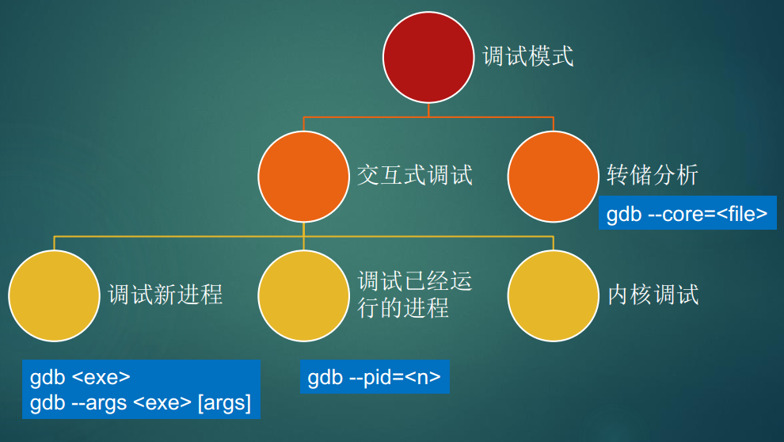

* GDB自己启动进程进行调试
* GDB attach到一个已经启动的进程上进行调试
* 调试分析Core文件，在进程崩溃产生Core文件时很有用

对应的，WinDbg也有相同的三种调试模式

转储文件在Linux下一般称为Core文件，在Windows下一般称为Dump文件，是将进程某一刻的内存数据转储到磁盘得到的文件。包含那一刻的数据、代码，通过调试器去分析Core/Dump文件可以对进程在那一刻的运行情况有深刻的了解，能获取很多有用的信息

## 断点

**软件断点和硬件断点**

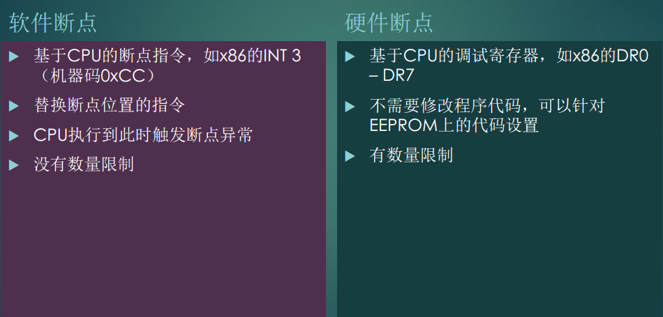

**GDB断点**

* 软件断点
	* break：普通
	* tbreak：一次性
	* rbreak：接受正则表达式成批设置
* 硬件断点
	* hbreak：普通
	* thbreak：一次性
* 管理断点
	* info b
	* delete 1	  # delete the breakpoint 1
	* disable 1   # disable the breakpoint 1
	* enable 1    # enable the breakpoint 1
	* delete      # delete all breakpoints
	* clear sum   # clear any breakpoints at the entry to function sum
* 监视点
	* 监视表达式，值变化时中断
	* watch a\*b + c/d
	* watch \*(int \*)0x12345678
	* wantch \*global\_ptr
* 线程约束
	* 指定线程遇到断点时才中断
	* break hd\_ioctl thread 1
* 条件断点
	* 当满足某些条件时才触发断点
	* break hd\_ioctl thread 1 if fd>8

展示一个线程约束的例子

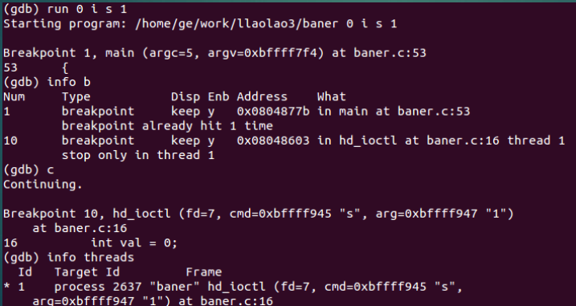

条件断点的例子

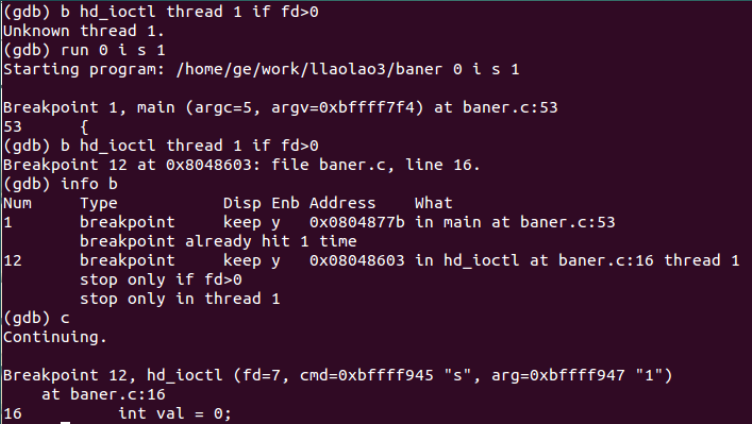

**WinDbg断点**

* 软件断点
	* bp ntdll!RtlRaiseException "r eax; dt MyVar; g"
	* bu设置延迟的断点
	* bm模式匹配，bm /a nt!Dbgk\*
* 硬件断点
	* ba i|w|r|en 地址
* 控制和显示
	* be bd bl bc
* 数据监视断点
	* 监视变量访问，内存中数据段
	* ba r1 xxx 读写中断
	* ba w2 xxx 写中断
* 条件断点
	* bp hal!x86BiosWriteIoSpace+0x5 ". if a=ec00 {...} .else {...}"
	* 相当于IDE调试器中的追踪点

## 内存和寄存器

**GDB**

* 观察寄存器
	* info reg
* 修改寄存器
	* set $r14 = 1
* 查看函数局部变量
	* info local
* 查看函数参数
	* info args
* 切换堆栈
	* bt显示函数调用栈回溯
	* frame 1，切换到堆栈1
* 查看内存中的值
	* examine（x）查看内存地址中的值
	* x/<n/f/u> <addr>
	* n是一个整数，表示需要显示的内存单元的个数，也就是说从当前地址向后显示几个内存单元的内容，一个内存单元的大小由后面的u定义
	* f表示显示的格式。如果地址所指的是字符串，那么格式可以是s，如果是指令地址，那么可以是i
	* u表示从当前地址往后请求的字节数
	* 和DEBUG工具的d命令有些类似
	* 该命令在观察内存内容的时候有重要作用，对于理解进程的内存结构也有重要的作用
* 修改内存
	* set <var>=<exp>
* 搜索内存
	* find [/sn] start\_addr, +len, val1[, val2...]
	* find [/sn] start\_addr, end\_addr, val1[, val2...]
	* find @hello[0], +sizeof(hello), "hello"

**WinDbg**

* 查看寄存器的值：r
* 显示内存d\*
	* d，da，db，dc，dd，dD，df，dp，dq，du，dw，dW，dyb，dyd
	* 对于物理内存，!db，!dc，!dd，!dp，!dq，!du，!dw
	* 按类型显示：dt、ds、dS、dl
* 编辑内存e\*
	* e，ea，eb，ed，eD，ef，ep，eq，eu，ew，eza，ezu
	* 对于物理内存，!eb，!ed
* 区域操作
	* 移动m
	* 填充(fp)
	* 比较c
	* 查找s
* 局部变量
	* dv
	* !for\_each\_local
* 搜索内存
	* s -u 10000 L8000000 "内容"

使用r命令查看寄存器的值

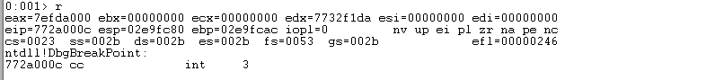

可以看到eip寄存器的值772a00c，而下面显示的指令是`int 3`，所在的地址是772a00c。在32位CPU下，eip寄存器表示下一个要执行的指令的地址

看起来和我在学习汇编时使用debug调试时的r命令一样

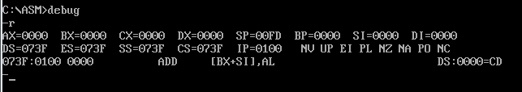

可以看到ip寄存器的值是0100，cs寄存器的值是073F，而下面要执行的指令是`ADD [BX+SI], AL`，所在的地址是073F:0100。在8086CPU（16）下，ip寄存器表示下一个要执行的指令的地址

## 反汇编

Intel语法：先是目标，然后是源，也就是从右向左赋值。在Windows上流行

AT&T语法：先是源，然后是目标，也就是从左向右赋值，Unix/Linux上流行

**GDB**

* 对函数进行反汇编
	* disas main
* 使用x名称查看代码段的内容
	* x/5i main

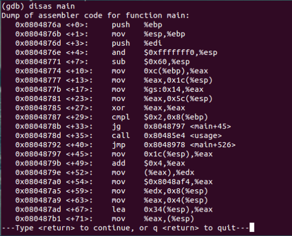

**WinDbg**

* u [address] : 反汇编address地址处的指令。如果没有指定address，就从eip处开始反汇编
* uf [address] : 反汇编某个函数的所有指令。uf不带参数，则反汇编当前eip所属函数

下面先执行`u $ip`对当前指令指针所在的地址进行反汇编，获取接下来要执行的指令。然后运行`t`命令可以看到会单步执行，可以看到接下来的指令被逐条执行！

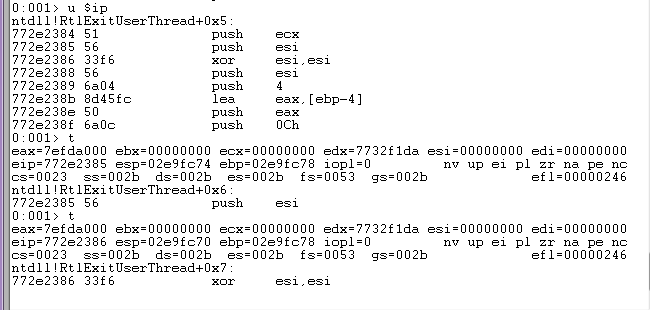

>EIP寄存器里存储的是CPU下次要执行的指令的地址

>最近学习汇编语言的语法，对于现在我使用GDB、WinDbg进行调试有很大的帮助作用，以往看不懂的汇编、不清楚程序是如何运行的，现在结合WinDbg都很清楚了

## 观察栈

**GDB**

backtrace/bt观察栈回溯

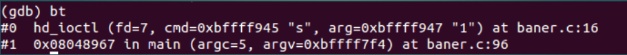

frame <no>切换栈帧

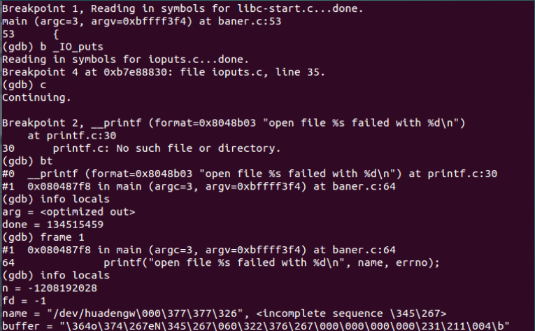

**WinDbg**

使用k、kb、kv、kd、kp等命令

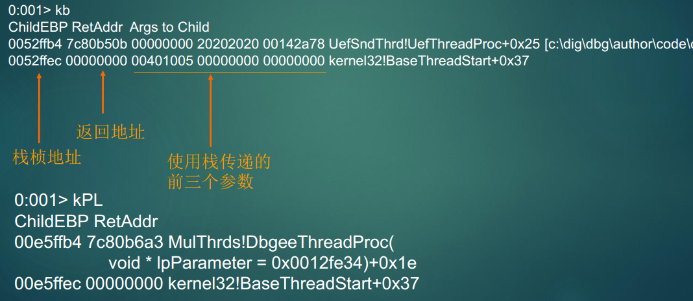

## 多进程/多线程调试

**GDB**

下程管理

* 显示所有下程：info inferiors
* 克隆下程：clone-inferior -copies 2
* 切换下程：inferior 2
* 增加下程：add-inferior -copies 1 -exec a.out

info threads查看所有线程，\*代表当前线程

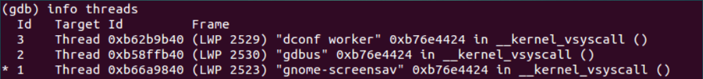

thread thread-id切换线程

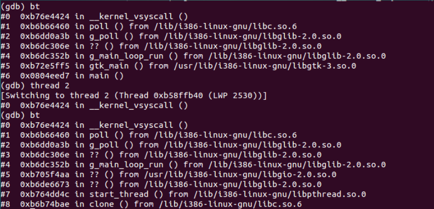

**WinDbg**

|显示进程信息，|s设置当前进程

~线程线程信息，~s设置当前线程

* 线程挂起、恢复
	* 改变线程的挂起计数，相当于调用SuspendThread和ResumeThread
	* ~n挂起
	* ~m恢复挂起
* 线程冻结、解冻
	* 调试子系统的控制，脱离调试时会自动解冻
	* ~f冻结
	* ~u解冻
* 针对线程执行命令
	* ~* k，查看线程的栈回溯
	* ~*e !gle，依次显示所有线程的Last Error
	* ~*e ? $tid;.ttime

## 其他

关于调试，上面这些是比较基础的、常用的，还有下面这些领域

* 调试符号
* 信号
* Linux下的ELF格式
* Windows下的PE格式
* 远程调试
* WinDbg脚本
* GDB脚本

## 软件调试学习之路

>到目前为止，因为通过学习汇编、计算机组成原理，对于计算机的运行机制有了更深刻的认知，再来研究GDB、WinDbg就明显更好理解了。后续要做的就是更多的进行实际调试练习、逆向分析、在Windows下用WinDbg分析Dump文件、在Linux下用GDB分析Core文件、使用OllyDbg进行逆向分析……

真的是念念不忘，必有回响！

一直对于软件调试感兴趣，想要学好，想要在自己平时的开发中应用软件调试去分析诸多疑难问题，但是苦于自己对于计算机的底层知识很不了解，所以这段时间一直在补这方面的知识漏洞：研究进程内存模型、了解调试的原理、了解操作系统工作原理、了解CPU工作原理、了解汇编。到现在略见成效，结合最近对于汇编的学习、计算机组成原理的学习，再来研究调试器，对于每个调试命令的作用都能有一个很深刻的理解了，而不再像以前那样只是死记硬背

经过到目前为止的学习，想从以下几个方面谈谈

我们在开发中常见的疑难问题无非以下这些：

* 地址报错：下面会针对这个谈一下排查思路
* 界面程序卡死
	* 无非是主线程死锁和死循环两种可能
	* 死锁的话，主线程CPU占用一般为0
	* 死循环的话，主线程会占满一个CPU
* 程序崩溃
	* out of memory可能导致崩溃
	* 堆栈溢出可能导致程序崩溃
	* 其他原因
* 其他疑难杂症
	* 程序毫无征兆的没有了，没有留下core/dump等任何信息

对于地址报错，我们可以分析一下可能的原因

* 关于进程内存模型，先推荐两篇相关文章
	* [《Windows下32位进程内存模型》](http://www.xumenger.com/01-windows-process-memory-20170101/)
	* [《Linux下32位进程内存模型》](http://www.xumenger.com/02-linux-process-memory-20170101/)
* 知道了进程的内存模型，那么就去使用相关的命令检查这个地址
	* 如果分析其是代码段，则对齐进行反汇编，查看对应汇编指令是什么，分析汇编代码
	* 如果是堆栈段，则查看当前栈帧信息，查看是哪个函数正在被调用，分析参数、返回值、局部变量等信息
	* 如果是数据段，则查看当前内存中的数据内容
	* 等方法
* 结合更多方法、更多套路、更多命令进行分析

因为知道了进程的内存模型，所以知道可以使用对应的命令去查询某块内存地址、在内存搜索某些内容；判断某块地址是代码段还是数据段，如果是代码段，那么就对其进行反汇编查看汇编代码分析，如果是数据段，则去查看对应的数据内容

通过学习汇编，知道了寄存器、内存、数据段、代码段、堆栈段都分别是干什么用的，对于现在理解和分析进程有很重要的作用

又因为自己平时进行了很多的多线程开发，所以在感性层面对于多线程的运行有深刻的了解

以及其他各方面的基础准备

现在能很好的对调试背后的原理深刻理解，以上的这些基础准备都是少不了的，所以学习是一个循序渐进的过程。同样的，学习到目前的阶段还只是一个起步，后续还有太多要学习的、要在大量的实践中升华自己的技术能力

无论是DOS下的debug、Windows下的WinDbg、Linux下的GDB，调试的最基础套路无非是下面几点：

* 分析进程的内存结构：代码段、数据段、堆栈段
* 反汇编代码段，查看汇编指令，分析程序逻辑
* 查看堆栈段的栈帧信息，了解函数调用情况
* 查看数据段的数据，搜索重要数据信息
* 等等其他调试套路

## 更多思考

最近，除了学习软件调试，于此同时，还研究了一个Windows下的网络库，研究IOCP、select等网络编程模型，对于网络编程的学习取得了不错的进步

学习网络编程和学习软件调试一样，都是在自己对某个知识目标不确定的情况下，依然能去持续钻研，去补习各方面的知识漏洞、去编写小的demo进行练习，慢慢的积累。当然现在只是对于IOCP的运行机制有了解，大概知道如何实现一个网络库，但要想更深入的了解，必须是自己去亲自实现一个网络库，在这个过程中发现坑、填坑，最终达到对网络原理、网络编程的深入理解

其他任何领域的学习都应该参考这个学习方法

>很多知识在你不了解的情况下，是一团迷雾，感觉很困难，但是当你一直坚持去学习、去思考、去查资料、去实践……慢慢的积累了知识和经验，把知识结构前面的迷雾逐层拨开后，找到了学习的方法、分析相关问题的套路之后，就会发现一切也都不过如此。至少可以适用于绝大多数领域的知识学习
