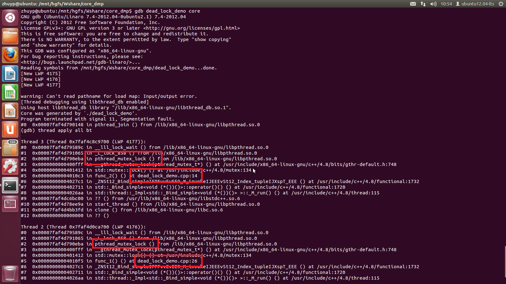

>转载[《gdb寻找死锁》](http://blog.csdn.net/yangkaikwill/article/details/49496887)

---

据说再高的高手在写多线程程序的时候都难确保不会产生死锁，死锁的调试也就成为一个比较常见的问题，假设有下面这样一个问题：

>一个正在生产环境下运行的进程死锁了，或者你只是在跑一个程序，并没有在调试器里面打开它，然后发现没有响应，日志输出也停止了。由于你是一个有经验的程序员，会想到“我刚刚加上了新的锁策略，不一定稳定，这可能是死锁了”。但是你不想就这么杀掉进程，因为多线程的bug不容易重现，遇上一次死锁可能要凭运气，错过了这次，它下次死锁可能会出现在你演示给老板看的时候......怎么办？

对于这样的问题可以借助Core Dump来调试

有时候程序Down了，但是Core文件却没有生成，Core文件的生成跟你当前系统的环境设置有关系，可以用下面的语句设置一下，然后程序再次Down的时候就会生成Core文件

```
ulimit -c unlimited
```

Core文件生成的位置一般与运行程序的路径相同，文件名一般为core.进程号，在我的ubuntu12.04lts下产生的文件名为core

介绍了core dump之后，来看看如何在多线程调试中使用core dump

使用kill命令产生core dump文件：

```
kill -11 pid
```

这不是杀掉进程吗？没错，但是你用信号11杀掉它，会让进程产生一个Segmentation Fault，从而（如果没有禁用core dump的话），导致一个core dump。随后你得到一个core文件，里面包含了死锁的时候，进程的内存镜像，也就包括了正在纠结缠绵、生离死别从而产生死锁的那两个，没准是几个，线程们的栈

现在知道该怎么办了吧？使用GDB打开这个core文件，然后输入命令

```
thread apply all bt
```

GDB会打出所有线程的栈，如果你发现有那么几个栈停在pthread\_wait或者类似调用上，大致就可以得到结论：就是它们几个儿女情长，耽误了整个进程

## 下面我来几个简单的例子

>为了代码尽量简单，使用了C++ 11 的thread library

```
#include <iostream>
#include <thread>
#include <mutex>
#include <chrono>

using namespace std;

mutex m1, m2;

void func_2()
{
	m2.lock();
	cout << "about to dead_lock" << endl;
	m1.lock();
}

void func_1()
{
	m1.lock();

	chrono::milliseconds dura(1000);	//delay to trigger dead_lock
	this_thread::sleep_for(duar);

	m2.lock();
}

int main()
{
	thread t1(func_1);

	thread t2(func_2);

	t1.join();
	t2.join();

	return 0;
}
```

编译代码

```
$> g++ -Wall -std=c++11 dead_lock_demo.cpp -o deal_lock_demo -g -pthread
```

运行程序，发现程序打印出“about to dead\_lock”就不动了，现在我们使用gdb来调试。注意gdb的版本要高于7.0，之前使用gdb6.3调试多线程是不行的

在这之前需要先产生core dump文件：

```
$> ps -aux | grep dead_lock_demo
```

找出deal\_lock\_demo的进程号，然后：

```
$> kill -11 pid
```

此时会生成core dump文件，在我的系统上名字就是core

然后调试

```
$> gdb dead_lock_demo core
$> thread apply all bt
```

下面来看一下实际的过程



从上图中可以看出两个线程都阻塞在wait上，而且还给出了在哪一行代码中（当然这需要在编译时指定-g参数，以生成符号文件），很容易就定位到产生死锁的位置
