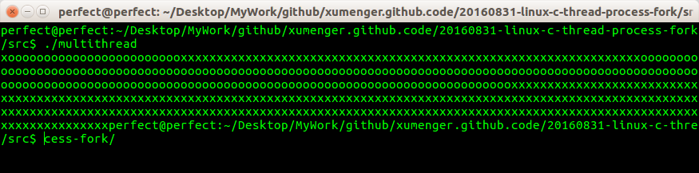

## 说明

本次小练习主要就是介绍Linux下多线程、多进程创建和运行的相关API，只是很肤浅的展示部分API 的调用语法，简单展示了运行效果

但是更深层次的这次完全没有涉及到，包括

* 调用fork()
* Linux下多线程和多进程有什么差别，具体的实现机制是什么样的？
* 多进程在Linux 和Windows 下有什么异同，这两种操作系统底层分别是如何实现的
* 多线程在Linux 和Windows 下有什么异同，这两种操作系统底层分别是如何实现的
* Linux下编译多线程程序，为什么要`gcc -pthread multithread.c -o multithread`
  * 而不是直接`gcc multithread.c -o multithread`
  * 这又涉及到操作系统、编译原理(链接、编译)相关的哪些知识
* 如果将对应的多线程和多进程的两个练习中的输出从fputc，改成printf，那么运行的输出结果可能就不同了
  * 这个和printf输出时的缓存机制有关
  * 这一点也有必要多去了解一下！
* 等等等等

这些点才是最值得好好研究的点，绝对不是简单的调用API而已！

今天就只是先初步了解一下，包括之前练习[20160825-python-thread-process](https://github.com/xumenger/xumenger.github.code/tree/master/20160825-python-thread-process)也都只是先实现一个最简单的小例程，先根据运行结果直观的感受一下

就像上面所列举的那些点，还有更多更深层面的东西需要研究，而且还需要做更多的开发练习！

## 练习步骤说明

* 首先编写该程序
* `gcc fork_process.c -o fork_process`编译这个多进程的小例程
* `gcc -pthread multithread.c -o multithread`编译这个多线程的小例程
* `./fork_process`运行的结果如下，可以看出'c'、'f'字母的输出是随机打乱的，所以说明Linux下多进程的时间片是随机分配的

* `./multithread`运行的结果如下，可以看出'x'、'o'字母的输出是随机打乱的，所以说明Linux下多线程的时间片是随机分配的

