>Linux用户态、内核态程序开发与调试

Windows的哲学

* 尽可能复杂
* 然后通过一个强大的调试器来平衡复杂度

Linux的哲学

* 不喜欢调试器
* 然后通过将代码写好、写简单来平衡

## 从Linus说起

目前Linux内核包括2000万行源代码

全球有12000个开发者参与开发Linux内核项目开发

Linux项目每一天平均有185个修改被接受，也就是说Linus每天需要Review大量请求并决定将哪些请求最终合并到Linux中

Linux内核是很庞大的项目，怎么入手开始进行学习呢？

熟悉Linux社区很有必要

推荐TED：《The mind behind Linux》

内心平和，沉入代码的世界中

>Linus本人是不太支持KGDB和KDB这种调试机制的

## 驱动程序开发：可加载内核模块

用内核态、用户态来划分操作系统

用户态：运行应用程序，是可见的；内核态：拥有更高的特权，不可见

驱动程序开发

简单介绍可加载内核态模块LKM（Loadable Kernel Module）的开发：我们开发内核态模块时，可以理解为开发一些回调函数，这些回调函数会等级给内核，然后内核在对应的时候进行回调

```
#include <linux/module.h>

static int __init helloworld_init(void)
{
	int n = 0x1937;
	printk(KERN_INFO "Hello world at address 0x%p stack 0x%p.\n", helloworld_init, &n);

	return 0;
}

static void __exit helloworld_exit(void)
{
	printk("Exiting from 0x%p... Bye!\n", helloworld_exit)
}

module_init(helloworld_init);
module_exit(helloworld_exit);

MODULE_AUTHOR("xumenger");
MODULE_DESCRIPTION("Hello World");
MODULE_LICENSE("GPL");
```

linux/module.h是所有可加载模块必须依赖的头文件，因为它定义了所有可加载模块最基本的宏、结构体……

>linux内核的源码在/usr/src/目录下，往后可以针对这里面的代码逐步深入研究代码架构、编码风格……

LKM是用来帮助内核做一些事情的，比如内核不能访问某些硬件，我们就可以自己编写一个LKM并且注册到内核中，帮助内核实现可以加载某些硬件

linux/module.h中的结构体struct module用于记录每个可加载模块的详细信息，**以链表形式相互关联**

lsmod命令可以列举当前Linux系统中已经加载的LKM

>LKM是在Linux内核中很重要的一部分，并且一直在持续改进

linux/init.h定义了module_init和module_exit两个函数

建议通过Makefile编译我们自己基于LKM开发的驱动，LKM程序编译最终会生成一个.ko文件

**ELF格式**

.ko文件，可以使用`modinfo test.ko`查看ko文件的属性。Loadable kernel image file，是Linux世界的基础技术和标准件

.ko文件是ELF的二进制格式。Linux世界中，内核模块、用户态模块基本都是ELF格式的

可以使用`readelf`命令查看ELF文件的信息。-h查看头信息、-S查看节信息

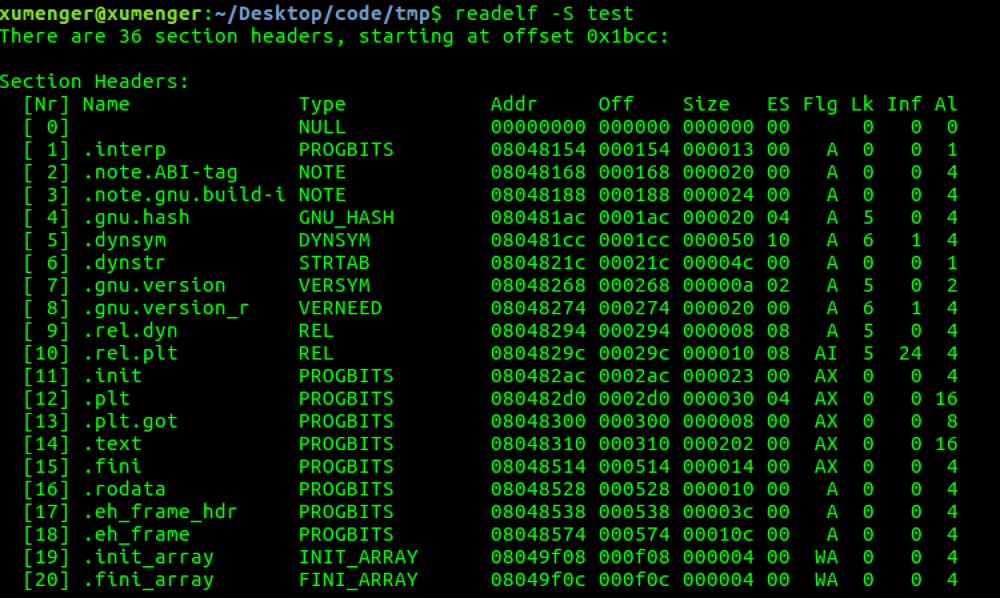

**加载和运行.ko**

`sudo insmod test.ko`即可完成加载，此时init函数会被调用，然后`dmesg`会输出在init中调用的printk打印的信息

`sudo rmmod test`即可卸载模块，此时exit函数会被调用，然后`dmesg`会输出在exit中调用的printk打印的信息

一个模块被加载之后，在虚拟文件系统中就会有一个专门的目录，比如test.ko加载之后，可以使用`ls -1 /sys/module/test`查看这个模块的虚拟文件，然后可以继续查看该模块的各个虚拟文件的信息

## 驱动程序开发：设备模型

不同的硬件设备，其连接方式都是不同的，比如U盘和鼠标就会有区别。每个操作系统如何管理不同硬件的连接方式、管理不同的硬件设备，通常都有个设备模型。Windows上有著名的Windows Device Model，在Linux上也有类似的东西Linux Device Model

要想支持即插即用，是需要在用户态配合的。udevd就是用于支持Linux设备即插即用，设备管理的用户态程序

udevinfo命令可以查看设备的详细信息，比如`udevinfo -a -p /sys/block/sr0`可以查看USB设备的信息

/dev虚拟文件系统是各个已经注册的设备的信息

要想写一个真实的设备驱动的话，必须是要处理中断的。来到中断之后，根据中断的情况来处理对应的事务

根据传输的数据类型，分为字符设备和块设备。字符设备就是传递的数据以字符来进行传输的，典型的就是键盘、串口；块设备，比如硬件、U盘，因为传输的数据量比较大

>一切皆文件，每个设备产生一个虚拟的文件名，应用程序就像打开文件一样打开设备名，打开之后就可以进行读写操作

扩展：典型PC架构、典型SOC架构

设备驱动程序通常都不是很大，400多行源码的设备驱动程序就算是一个中小型的驱动程序了

在内核态驱动程序中是不可以随意访问用户态buffer的，因为用户态buffer随时可能被交换出物理内存，否则可能会导致崩溃。如果想要用，那么需要使用copy\_to\_user()来将内核态数据拷贝到用户态，或者使用copy\_from\_user()从用户态把数据拷贝到内核态

## 日志和消息输出

系统日志架构

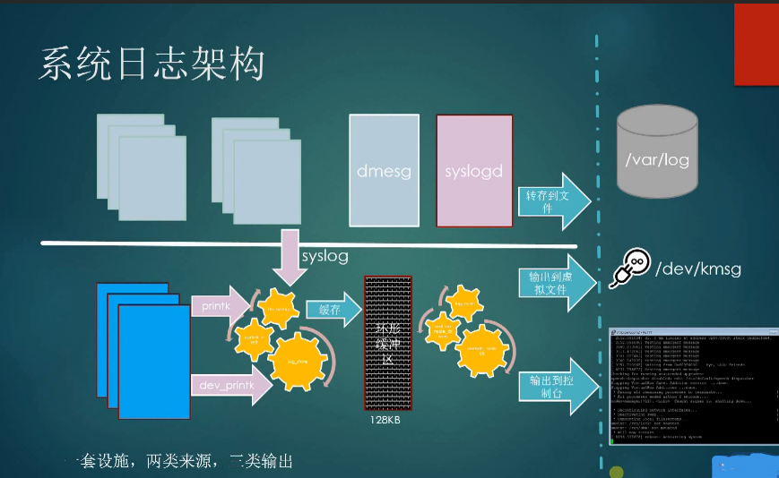

一套设施，两类来源，三类输出

printk是内核开发的一个著名函数，因为Linux的交互式内核调试机制不是很方便，所以在内核开发中程序员主要使用printk输出来进行调试。其在\kernel\printk\printk.c中进行定义

Linux两种内核日志输入的第一种是printk，另一种就是syslog

syslog是给用户态程序公开的一套内核调用

>Linux下，使用man命令可以查看所有Linux下API的使用文档，在Windows下开发的官方文档是MSDN。建议在开发的时候参考这些权威的官方文档，里面会对每个函数功能、每个参数、返回值做详细的说明，不推荐通过网络搜索一些稂莠不齐的博客来了解API的用法

上面讲到Linux内核日志系统的两类输入：printk、syslog，另外还有三类输出：console（控制台）、syslogd、/dev/kmsg

有多种方式修改日志输出的级别控制

* 内核启动参数，Kernel boot option : loglevel=level
* 通过demsg命令：demsg -n level
* echo $level > /proc/sys/kernel/printk
* 写程序使用syslog系统调用
* 修改sysctl.conf文件中的printk行

syslogd是一个后台服务，Linux很多以d结尾的都表示运行在后台的服务程序。它捕捉syslog消息，根据规则文件/ect/syslog.conf定义的规则将消息写到文件中。主要写到/var/log/下面的文件

/dev/kmsg是将日志输出到虚拟文件。作用是把内核态的消息以文件的形式公开出来。dmesg命令其中一种读日志的方式就是读/dev/kmesg虚拟文件中的信息

kmesg命令的源码所在目录是utils/util-linux/sys-utils/dmesg.c。dmesg命令用于输出或控制环形缓冲区

>回顾Linux系统日志架构

## 虚拟文件系统（VFS）

文件系统是操作系统中很复杂的一部分！

虚拟文件系统是内核中的一个软件层，它提供一个文件接口给用户态程序，它还提供了一种抽象，允许不同的文件系统在内核中实现共存

下面是Linux下的VFS架构图。VFS提供一个抽象层，使得POSIX API与不同的文件系统实现的细节分离出来。这也正是软件开发中最重要的一个思想，只暴露给开发者接口，把底层的细节、差异都封装、隐藏起来

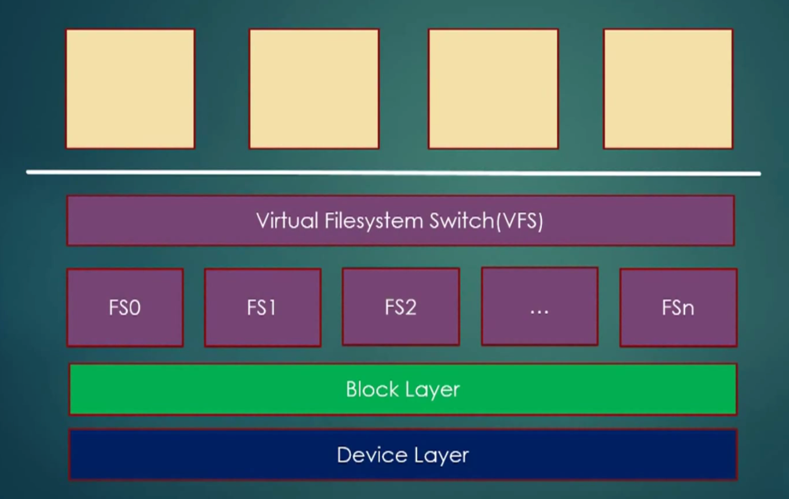

下面是更详细的Linux文件系统架构图(https://www.thomas-krenn.com/de/wikiDE/images/b/ba/Linux-storage-stack-diagram_v4.0.png)


VFS还有这样的定义：VFS管理文件系统有关的调用，然后把它们翻译给具体的相应的文件系统函数

VFS的一些典型系统调用API

* open
* read
* write
* lseek
* fcntl
* close
* stat
* chmod

介绍一些典型的文件系统

* ext2：一段时间来都是Linux上默认的文件系统
* ext3：在ext2基础上增加新功能，对该文件系统的所有操作都会记录日志，如果文件系统损坏了的话可以根据日志信息帮助恢复
* ext4：在ext3的基础上做了性能的改进
* Pseudo：伪文件系统，它不是基于磁盘的，它把内存中的一些信息模拟成文件，以便其他的程序可以以文件的形式来进行访问这些信息，比如典型的procfs、sysfs

VFS四大核心对象（VFS是使用C语言应用面向对象思想实现的系统）：

* superblock：描述整个文件文件系统的信息（文件系统描述自己的信息），每个文件系统有一个superblock
* inode：描述文件的信息，比如一个文件到底存储在哪些位置
* dentry：目录项信息
* file：打开一个文件后，用file描述这个文件

四种核心对象对应四大核心操作

* super_operations：文件系统特定的方法。write_inode()、sync_fs()
* inode_operations：文件特定的方法。create()、link()
* dentry_operations：目录想特定的方法。d_compare()、d_delete()
* file_operations：对于打开文件（文件句柄）的方法。read()、write()

对磁盘的所有访问都是以块（block）为单位的，块的默认大小是4096Byte，因为4096刚好是内存中一个物理页的大小，很多时候我们访问文件都是通过内存映射的方式，把文件映射到内存中，映射的时候文件的内容还不在内存中，当真正访问文件内容的时候，系统会产生一个page fault，之后才会把磁盘中的信息加载到物理内存中，因为磁盘的块大小等于物理页的大小，所以交换的效率很高

可以使用`dumpe2fs`这个命令查看文件系统的诸多信息

inode，是index node的缩写，索引节点。它的核心内容是存储一个文件、目录、链接在磁盘上的核心信息，比如文件类型、访问权限、文件的拥有者、时间戳、文件大小、这个文件对应的数据块block的一系列指针

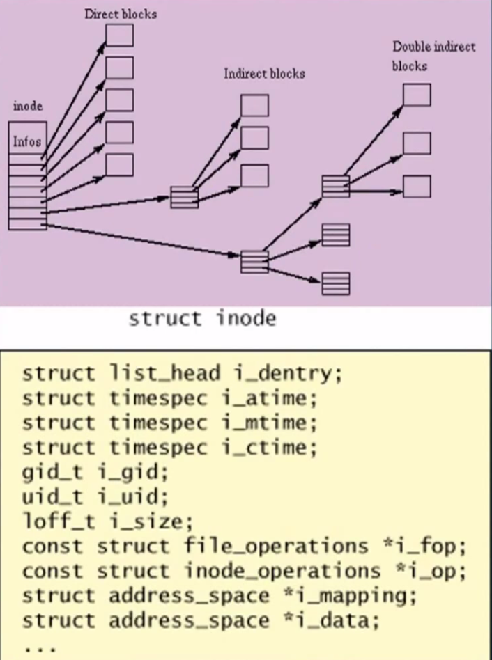

`stat`命令可以查看一个文件的inode信息

`df -i`显示inode相关信息

dentry全称是Directory entry，目录表表项。目录可以理解为文件系统的一个子区域，其中可以存放文件也可以存放子目录。目录表表项目并不是目录！

文件对象表示一个打开的文件，是磁盘文件打开后在内存中的表示，包括文件的模式、文件的路径、等信息

`debugfs`命令可以观察一个文件系统的各种属性

下图展示四个核心对象的交互逻辑

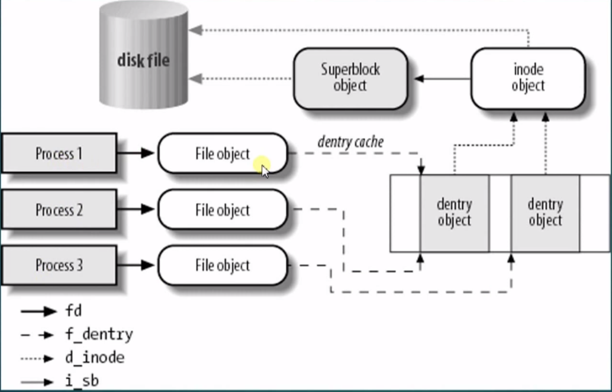

>下面重点谈谈伪文件系统，在开发和调试中比较常用

**procfs**

procfs是一种伪文件系统，也叫做虚拟文件系统，因为它没有数据在磁盘上，只是通过文件系统接口的形式来提供访问。最开始是提供进程信息的查询，后面增加了扩展，包括CPU、中断等信息。可以理解为内核向用户态公开的接口，使得用户态通过procfs可以访问到内核态一些高特权的信息

`ls /proc/`可以查看procfs的信息，会有进程（以进程ID显示）、cpuinfo等文件夹。比如进入cpuinfo文件夹，可以查看cpu的信息，当你打开这个文件的时候，实际上是调用procfs文件系统的内部函数，procfs的内部函数会将请求分发给实现cpuinfo的内核函数

比如`cd /proc/2446`可以进入进程号为2446的进程虚拟目录下，`ls`可以查看进程的信息

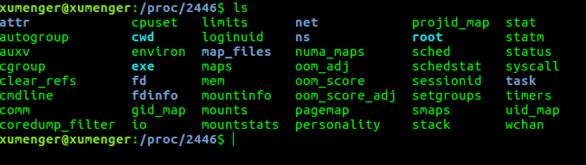

* cmdline：创建这个进程的时候指定的命令行参数
* cpu：执行这个进程当前的CPU，如果被挂起就是上一次执行的CPU
* maps：描述当前进程中已经映射的文件，比如.so等动态库、堆、栈等信息
* status：显示进程信息，进程号、父进程号、内存使用情况、线程信息等

经过以上的描述，我们可以理解为procfs是内核开放给用户态的一种接口，用于访问进程、cpu等信息！

/proc/interrupts是系统中中断的情况，显示的是每个CPU对应的每个中断号是分配给哪个硬件等信息。比如当系统很慢的时候，可能就是因为中断发生的非常多、非常频繁，CPU一直在处理中断，导致CPU响应慢，就可以去使用`cat /proc/interrupts`查看当前系统中中断的情况

每个CPU都会有一个特殊的中断：LOC，代表本地时钟中断，它是非常非常重要的，在主板上有一个特殊的硬件来触发时钟中断，当前的内核是非常依赖于这个中断的，依赖这个中断来触发一些操作，包括线程的调度。所以时钟中断有点类似于人类的脉搏，是今天操作系统运行的动力，收到一个中断就导致一个触发，在这个触发的触动下来做一些常规的动作

/proc/meminfo是系统的内存信息，在解决内存有关的问题时可以使用`ls /proc/meminfo`来观察内存的使用情况，既有物理内存又有交换区相关的信息

/proc/vmstat是从虚拟内存的角度显示的状态

/proc/ioports显示IO端口的分配信息，各个IO端口具体分配给哪个硬件了等信息

/proc/modules显示动态加载的模块

/proc/cmdline是内核的命令行参数信息

当今的procfs默认是build在内核中的。也可以调用proc_create系统调用创建新的proc文件

seqfile实现了对procfs的封装，用来简化输出proc信息

**sysctl**

sysctrl是用于配制内核各种属性的机制，可以在系统运行的过程中改变内核的特征，是一个很先进的功能

其实现原理也是基于procfs文件系统，其简单的思想是把要配置的这些项组织成一些类（目录），然后在下面的文件中配置具体的项，通过读这些文件就可以查看这些项当前的配置状态，通过写这些文件可以修改这些属性

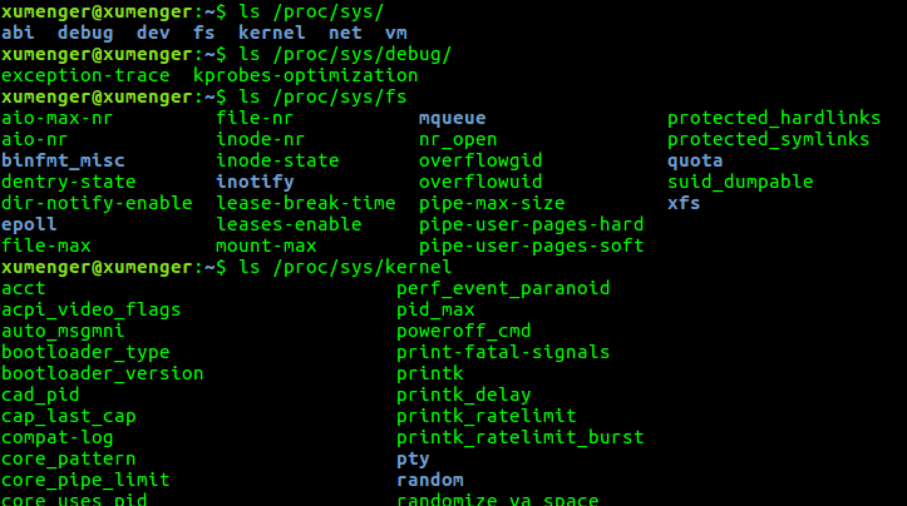

除了直接读写/proc/sys/来查看和修改内核属性，还可以使用`sysctl`命令，比如`sudo sysctl -w kernel.hostname=xumenger`

```
int __init proc_sys_init(void)
{
	struct proc_dir_entry *proc_sys_root;

	proc_sys_root = proc_mkdir("sys", NULL);
	proc_sys_root->proc_iops = &proc_sys_dir_operations;
	proc_sys_root->proc_fops = $proc_sys_dir_file_operations;
	proc_sys_root->nlink = 0;

	return sysctl_init();
}
```

sysctl与procfs都是伪文件系统，都是将内核的信息暴露给用户态，但普通的procfs一般都是只读信息，sysctl是可读写的信息

**sysfs**

sysfs和procfs是类似的，是在内存中的文件系统，用于公开内核的数据结构。sysfs和procfs的不同在于，procfs可以根据需要在代码中自由创建，但是sysfs不同，它是和kobject（内核对象）直接关联的，sysfs机制本身就是一个文件系统用于公开kobejct（内核对象）的

每一个kobject对应一个sysfs的目录，对应在/sys/目录下，每个内核对象是/sys/下的子目录


* block：
* kernel：
* bus：
* dev：
* devices：
* fs：
* net：

sysfs最初引入就是和设备驱动相关的，直到其中都保存着大量的设备驱动相关的各类属性，在设备驱动程序开发中有重要作用

**debugfs**

是Linux下另一个重要的伪文件系统，是一个方便内核态开发者将信息公布给用户态的方式

它和procfs相比，procfs主要是关于进程的，debugfs没有任何规则，开发者可以放任何信息进来，所以会很方便内核开发者的调试

debugfs可以实现一种双向的调试接口，而且对应的API也很简单

所在目录是/sys/kernel/debug/

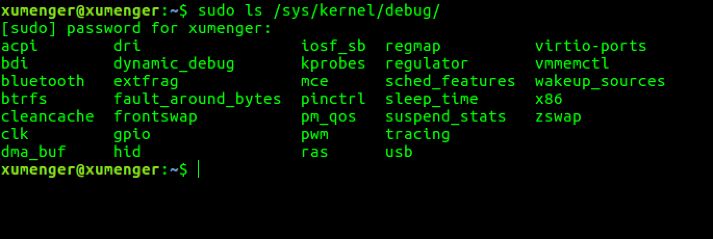

## 内核模块与用户态程序通信

Linux可以分为内核空间和用户空间，不同的身份有不同的特权。低特权的代码不可以直接访问高特权的数据或代码；高特权代码访问低特权数据和代码时要慎重，可能不可靠，可能不在内存中，因为用户态的内存是基于虚拟内存机制的，可能会被交换到磁盘中；但二者仍需协作，交换数据

目前主流的操作系统都有内核态、用户态的划分，如何处理内核态和用户态的通信是一个普遍的问题

用户态应用程序和内核态模块通信的几种主要方式

* 虚拟文件系统：procfs、sysfs、sysctl、debugfs
* Ioctl：一种特殊的系统机制
* Socket网络方式
* 系统调用：内核态和用户态通信的基础方式
* 信号机制：发送信号、等待信号的方式来交互信息
* Upcall：反向调用，简单理解为从内核态调用用户态的代码
* Mmap：映射一块特殊的内存，用户态和内核态通过共享内存来交换数据

ioctl是一种更简便的通过二进制模式直接读写的通信方式

```
int (*ioctl) (struct inode *inode, struct file *filp, unsigned int cmd, unsigned long arg);
```

* _IO：没有参数的操作
* _IOW：应用程序向内核的写操作
* _IOR：应用程序从内核的读操作
* _IOWR：既写又读操作

>对ioctl还不是很懂，还是因为没有做过实际的开发实践

**系统调用**

* 从用户态切换到内核态
* 使用INT 2E(NT)、INT 80(LINUX)软中断
* 但是软中断比较慢，所以从IA32 CPU设计了专门的指令（从奔腾II开始）
	* Intel的是：sysenter
	* CMD的是：syscall

不同的CPU提供的内核调用的机制是不同的，有不同的赢硬件架构。Linux针对不同的CPU定义不同的内存区，在其中写好如何进行内核调用，然后把特殊的区域映射到不同的用户态空间，用户态就可以访问它，来调用这里的函数实现系统调用

这个专门的区域叫做vdso：virtual dynamic shared object，虚拟的动态共享对象

不同的CPU架构的vdso的实现是不同的！

## GDB调试工具

Windows平台上有强大的调试工具[WinDbg](https://github.com/xumenger/xumenger.github.crack/tree/master/20170130~20170222-windbg)、OllyDbg，在Linux平台上也有专门的调试工具GDB，对于我们的开发、调试、研究操作系统的底层是极其重要的

GDB支持很多种CPU架构。其官网是https://www.gnu.org/software/gdb/

关于GDB，我之前已经整理了一系列文章：

* [《Linux下GDB的调试逻辑》](http://www.xumenger.com/linux-gdb-20170228/)
* [《让 CPU 告诉你硬盘和网络到底有多慢》](http://www.xumenger.com/cpu-mem-disk-network-20170110/)
* [《Linux下32位进程内存模型》](http://www.xumenger.com/02-linux-process-memory-20170101/)
* [《初步了解如何用GDB分析Core文件》](http://www.xumenger.com/linux-c-cpp-gdb-coredump-20160908/)
* [《x86汇编语言语法简介》](http://www.xumenger.com/x86-20160720/)
* [《Linux gdb调试器用法全面解析》](http://www.xumenger.com/linux-gdb-debug/)
* [《指针和字符串和字符串常量、用gdb来获取非法内存中的内容》](http://www.xumenger.com/pointer-string-const-gdb/)

$\_thread是输出线程号，不过这个线程号是GDB定义的从1开始的线程号，要想输出Linux系统的线程号，可以使用$\_gthread。线程号比如在条件断点的时候有用`cond 2 $_thread!=57`当57号线程遇到2号断点的时候就不会停下来，而其他的线程遇到2号断点的时候就会停下来

GDB的表达式：

* 可以是支持C、C++、Modula-2的语法，比如C和C++的指针、数组等语法
* !(操作系统命令)，比如!ls，列出当前目录的文件

WinDbg、GDB常用命令对比

WinDbg命令  | GDB命令       | 功能
-----------|---------------|----------
bp         |break或b       |设置软件断点
ba         |watch          |设置硬件断点、监视点
k          |backtrace或bt  |显示函数调用序列（栈回溯）
g          |continue或c    |恢复执行
p/t        |next/step或n/s |单步跟踪
d          |x              |观察内存
dv         |info locals    |观察局部变量
dt         |pt             |观察数据类型（结构）
gu         |finish         |执行到函数返回
.frame     |frame          |切换到当前栈帧
lm         |i shared       |列模块

GDB命令卡片

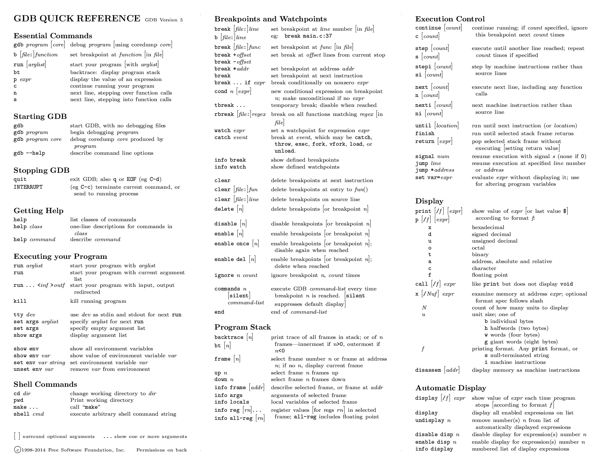

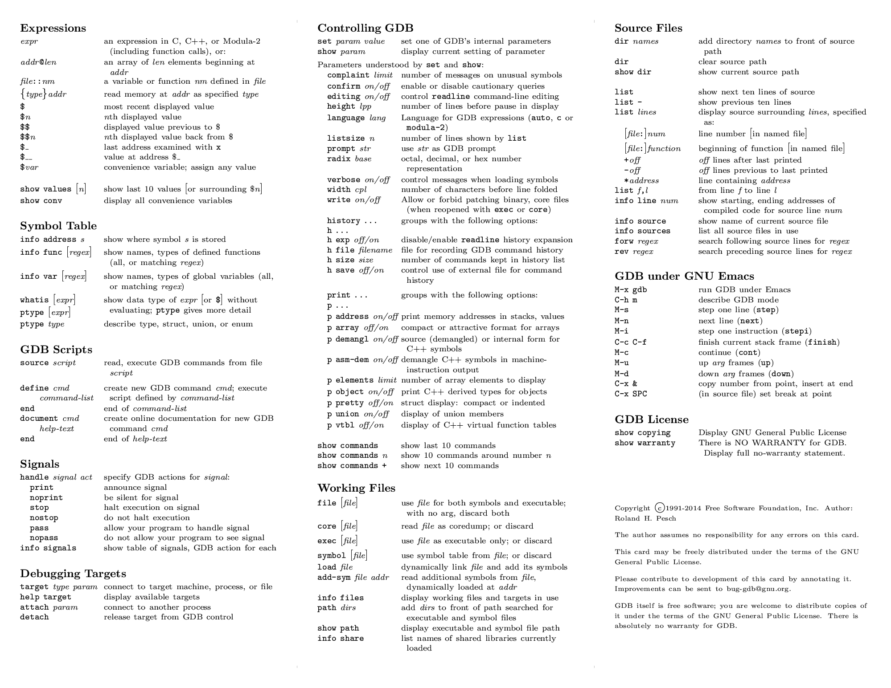

调试模式分类：

* 交互式调试
	* 调试新进程：gdb <exe>、gdb --args <exe> [args]
	* 调试已经运行的进程：gdb --pid=<n>
	* 内核调试
* 转储分析：gdb --core=<file>

环境变量相关命令

* path directory
* show paths
* show environment [varname]
* set environment varname = [value]

`info inferiors`显示当前被GDB调试的所有进程信息，因为一个GDB可以同时调试多个进程

直接执行`gdb`开启进程，然后可以选择进程进行调试

* file <文件名> --> run，当可执行文件和符号文件在同一个文件中可以如此启动进程
* 当可执行文件和符号文件分别为两个文件时
	* exec-file：指定可执行文件
	* symbol-file：指定符号文件
	* 然后执行run即可启动被调试进程

断点分为软件断点和硬件断点两类

* 软件断点
	* 基础CPU的断点指令，如x86的INT 3（机器码0xCC）
	* 替换断点位置的指令
	* CPU执行到此时触发断点异常
	* 没有数量限制
* 硬件断点
	* 基础CPU的调试寄存器，如x86的DR0～DR7，前四个用来存放地址
	* 不需要修改程序代码，可以针对EEPROM上的代码设置
	* 有数量限制

`b main thread 1`这句命令的意思是只有1号线程命中main函数处的断点时才停下来

`b func1 thread 1 if fd>0`：只有当线程1触发断点func1，并且fd>0时断点才停下来

`commands 12`后可以继续输入命令，输入end表示输入的命令结束，然后在触发12号断点的时候就会自动运行这里定义的命令

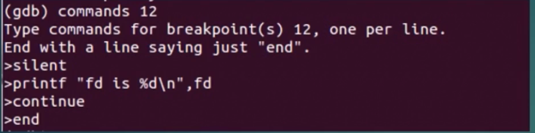

调试符号：

* 编译器在编译时（词法分析、语法分析、语义分析）产生的对调试器有用的信息
* 衔接二进制程序与源程序的桥梁
* 对调试有着重要意义
* 源代码级调试必须
* 二进制调试时的灯塔

在Linux下调试符号使用的是DWARF这套标准，http://www.dwarfstd.org有DWARF标准的白皮书，是很好的了解编译原理、计算机组成原理的资料，有必要在后续好好的进行研究

ELF是Linux下可执行文件的基本格式，readelf命令可以显示ELF内部的格式信息，也可以查看二进制文件中是否包含对应的调试信息，如果二进制文件中有对应的调试信息，那么就会有.debug\_aranges、.debug\_info等段

* .debug\_aranges段：地址范围
* .debug\_line段：源代码行信息
* .debug\_loc段：位置信息，比如函数内部哪些位置是对某个变量的作用域，在这里有详细的定义
* ......

调试时候的每个信息都是通过调试符号找到的，比如变量名、函数名、每个函数的起始结束地址等

使用gcc编译时，必须使用-g选项才会产生完整的调试信息，这样调试信息就会被存放在可执行文件中，一般是以段的形式放在里面；而像Ubuntu在发布程序的时候为了让程序不至于过大，会将符号信息从可执行文件中剥离出来放在符号服务器上，后续在调试的时候GDB是支持可执行文件与符号文件分开加载的

`info reg`命令查看寄存器

栈是目前各种计算机系统中极其重要的概念！每个线程有自己的栈；内核态有栈，用户态也有栈；栈上记录着三类重要信息，一类是函数的返回值，一类是函数的参数，一类是局部变量，我们在调试的时候观察栈，主要就是观察栈的这几类信息

`backtrace`观察栈回溯，每一行就是一个栈帧（对应有#0、#1这样的栈帧编号），就是观察在栈上的返回地址；`info locals`观察局部变量；`info args`观察函数参数

`frame <no>`切换到某个栈帧，然后就可以使用`info locals`、`info args`去查看切换到的函数栈帧的局部变量、参数等信息

注意，并不是所有的局部变量都是放在栈上的，有些是放在寄存器上的，所以使用`info locals`观察局部变量可能存在不准确的情况，需要小心

`print 变量名`查看变量的值，`x/s 0xffffffff81946000`以字符串格式（s）观察0xffffffff81946000地址处的值，……

`disas main`对main函数进行反汇编；`x/5i schdule`显示schdule地址开始的5条汇编指令

x86汇编语言，Windows上和Linux上有些不同，x86汇编有两种汇编语法：

* Intel语法
	* 先是目标，然后是源，也就是从右到左赋值，`mov dst, src`
	* Windows上流行
* AT&T语法
	* 先是源，然后是目标，也就是从左到右赋值，`mov src, dst`
	* Unix和Linux上流行

`info signals`查看信号。Linux下很多功能都是以信号的方式实现的，比如异常、中断、同步等都是通过发信号、等待信号方式实现的

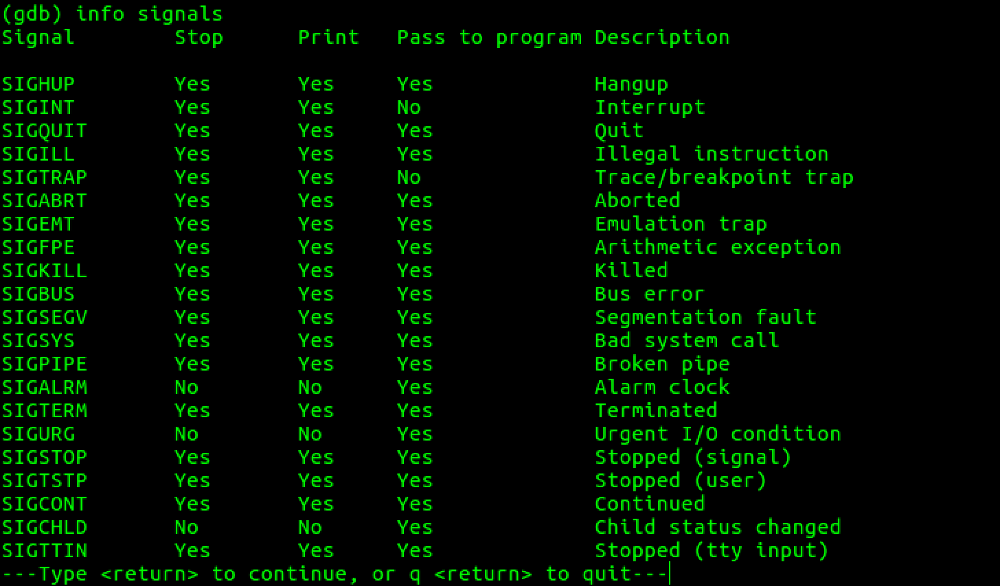

`handle 信号名 动作`改变信号的规则，比如`handle SIGPIPE nostop print`可以设置当SIGPIPE信号发生时，不停止被调试程序，但打印信息

`info threads`显示当前进程中的所有线程，*代表当前线程

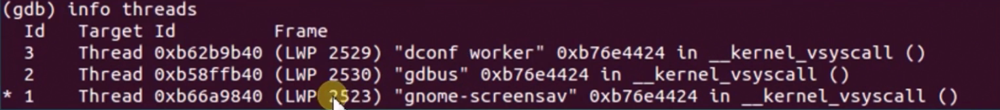

上面截图中，三个线程的栈帧都是\_\_kernel\_vsyscall()，代表这几个线程都在做系统调用、进入内核态当中，对于大多数应用程序的用户态线程来说，大多数时间都是进入内核态等待，被内核挂起

`thread apply all bt`针对所有线程执行bt命令，列出所有线程的栈回溯信息，和WinDbg的`~* kv`命令很像

>以上都是理论罗列，最重要的还是大量使用GDB去大量的进行调试、逆向分析

## 任务管理

介绍进程、线程的基础概念；Linux内核中管理进程和线程最核心的数据机构task\_struct；介绍进程有关的属性、线程有关的属性；介绍编程中如何处理创建新进程、新线程的API；……

任务是一个比较模糊的概念，与上下文密切相关。从CPU的角度来说，任务是CPU进行调度的一个单位，分发、执行的单位，在CPU手册中的任务相当于一个线程的概念；在操作系统层面，目前的大多操作系统像Linux、Windows都是多任务的操作系统，在操作系统层面，任务可以理解为进程

>推荐资料Intel《软件编程手册》

线程与进程

* 进程
	* 是一个空间的概念
	* 线程的住所
	* OS组织和管理系统资源的单位
* 线程
	* 是一个时间的概念
	* 活动的生命
	* CPU的调度单位，创建好线程后，程序指针指向某个地方，CPU就从那里取指针开始运行
	* 任务状态段（Task State Segment），CPU需要分配时间片，切换线程的执行，当CPU不执行某个线程时，需要将该线程的状态信息保存在TSS上

Windows下的进程和线程使用不同的数据结构

* 进程：
	* KPROCESS，内核态
	* EPROCESS，执行体
	* PEB，用户态
* 线程：
	* KTHREAD
	* ETHREAD
	* TEB

Linux下的数据结构

* task\_struct结构体既用于描述进程，又用于描述线程。和Windows不同
* 把线程看作是共享一个地址空间的“进程”
* 创建线程时，创建一个新的task\_struct，大多数字段和其他线程相同，主要由do\_fork完成
* 因此Linux线程又被称为轻量级进程，传统UNIX进程被称为重进程

Linux下用于任务管理的重要头文件

* include/linux/sched.h：大多数关于任务的数据结构，包括task\_struct
* include/linux/threads.h：
* include/linux/times.h：
* include/linux/time.h：
* include/linux/times.h：

进程空间的布局：高地址是内核空间，低地址是用户空间

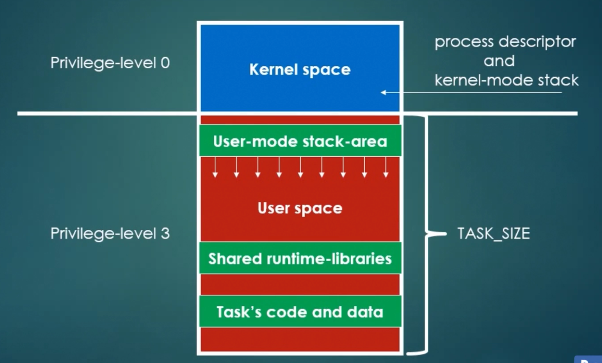

32位和64位是不同的；Windows和Linux是不同的

task\_struct进程描述符，是一个很庞大的数据机构，有几百个字段

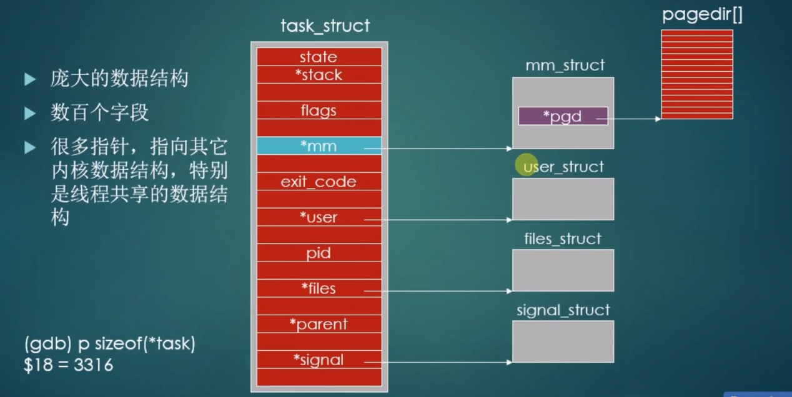

*mm指针指向一个mm\_struct，mm\_struct再指向多个页表，描述进程空间的内存如何对应到物理内存中

介绍task\_struct的重要字段

* tty\_struct，进程对应的有关的终端
* fs\_struct，当前目录、根目录的信息
* files\_struct，当前进程有关的描述符
* mm\_struct，当前进程的内存区域
* signal\_struct，当前进程有关的信号
* user\_struct，当前进程有关的用户信息
* ......

task\_struct中的一些进程属性相关字段

* pid：进程号，最大值是32767
* comm：进程的命令行
* ptrace：允许调试器与被调试的进程建立“收养的父子关系”，ptrace就是用于记录是否被调试的信息，0表示未被调试，非0表示被调试
* uid：创建进程的用户属性

进程关系图

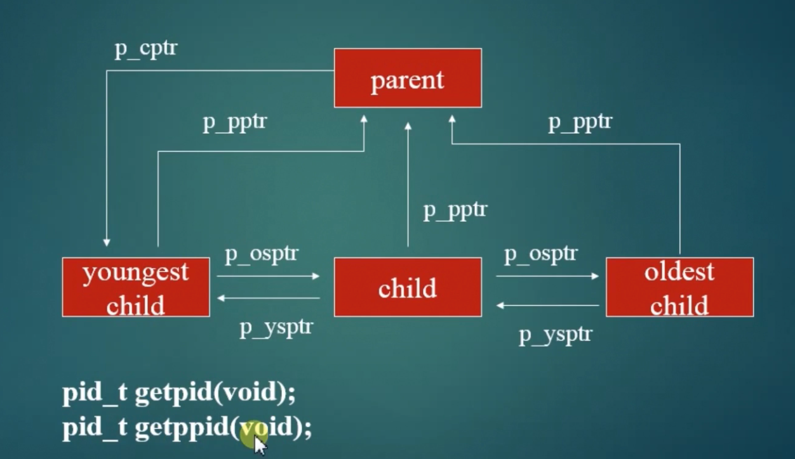

内核维护当前创建的所有进程是通过一个双向链表实现的

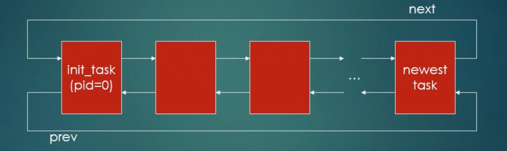

内核维护头指针，指向init_task，也就是0号进程。所谓0号进程，可以理解为内核最早启动时的执行序列，基本的初始化结束之后，这个进程就退休了，换个身份，做虚拟内存的交换，所以又被称为swapper

0号进程会产生1号进程，1号进程是其他所有进程的祖先

在内核调试的时候，如果直接触发break，常常是停在0号进程上，因为CPU没有事情的时候就会执行swapper中的idle任务

多CPU系统下，0号swapper进程会给每个CPU克隆一个空任务：idle任务，Windows下也有一个Idle进程，和Linux下的swapper是一致的，通过任务管理器查看一个4核的Windows系统，其线程数是4，因为有4个CPU，所以虽然Linux、Windows看起来不一样，但是底层的很多实现都是想通的！

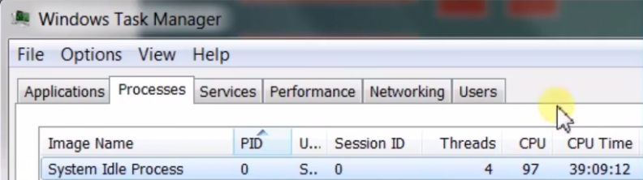

内核为了调度任务，有两个专门的队列：

* run queue：其中的任务准备好了，可以开始运行了。如果run queue很长，说明系统很繁忙，CPU忙不过来
* wait queue：等待队列，有多个，因为可能有多个任务等待一个内核对象

线程的内核态栈

* 创建线程时，创建内核态栈
* 32位下通常两个内存页大小，即8KB；64下通常是4个内存页，16KB
* 最低地址处放CPU架构相关的thread_info结构，保存当前线程里面和CPU架构相关的线程属性信息
* thread_info中就有一个专门的指针指向该线程的task\_struct结构数据内容
* 剩下的大部分空间都是作为内核态栈使用的
* 可以看到内核态栈空间很小，32位下只有8KB，所以在编写内核态函数、内核态模块的时候避免开太大的局部变量，也避免做递归调用，避免有太深的函数调用
* 32位Linux下，内核态只有1GB的内存空间，并且这1GB内存空间是所有内核态进程共享的，线程的内存态栈规定为8KB，就是防止开了太多的线程后导致占用过多的内核态内存空间
* 其实Windows下的内核态栈也比较小，32位的一般是12KB的内核态栈

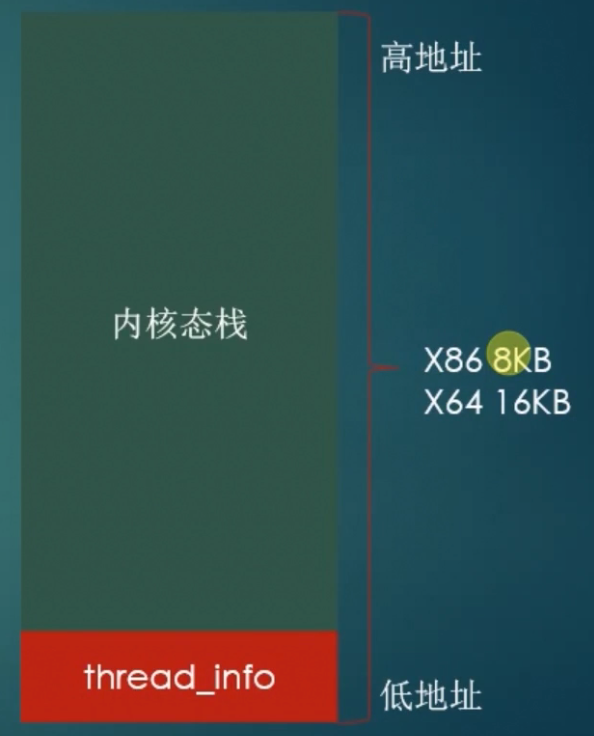

>今天CPU的设计，大都是基于栈的！

thread\_info在不同的CPU架构下的定义是不同的，下面看一下x86下的定义

```
struct thread_info{
	struct task_struct *task;			//更详细的线程信息
	struct exec_domain *exec_domain;	
	__u32 flags;
	__u32 status;
	__u32 cpu;
	int saved_preempt_count;
	mm_segment_t addr_limit;
	struct restart_block restart_block;
	void __user *sysenter_return;
	unsigned int sig_on_uaccess_error:1;
	unsigned int uaccess_err:1;
};
```

CPU的设计是很简单的原则：程序指针指向哪里，它就取哪里的指针进行执行，它总是假定指令、栈这些都准备好了

对于线程，还有另外一个thread\_struct数据结构

* 用于保存CPU相关的线程状态信息（程序指针的等寄存器信息）
* 比如线程A当前分配的时间片执行完了，需要剥夺它的继续执行资格，那么内核就会把当前的寄存器状态保存到thread\_info结构体中，再去运行其他线程，等到下次这个进程再获取时间片时，先把thread\_info的内容加载到寄存器中，再开始执行这个线程A……
* 这个数据结构的定义也是基于不同的CPU架构的
* task_struct中的thread结构体指针会指向该内容
* 因为结构体较大，如果放在thread\_info中，会占用宝贵的内核态栈空间
* 所以是thread\_info指向task\_struct，然后再指向thread\_info

线程的运行状态，有限状态机切换图

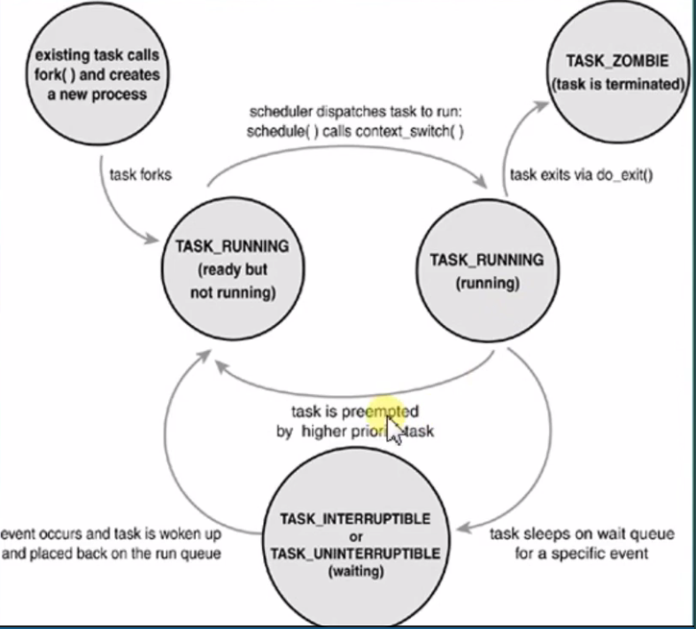

进程创建相关

* fork()，相关文章[《Linux开发简单多进程应用》](http://www.xumenger.com/linux-process-20170210/)
* exec系列API
* clone()

shell下执行ls命令的内部原理如下

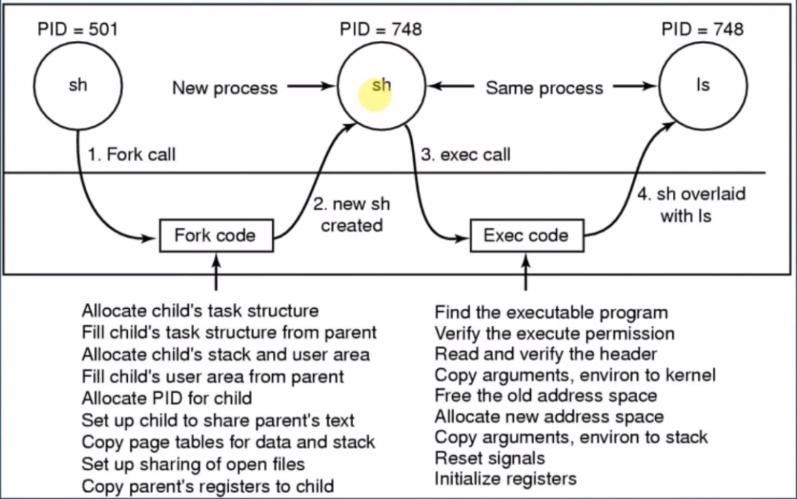

线程创建相关API

* clone()，创建本土线程
* pthread_create()

编写多线程程序是一项有挑战的工作，线程同步问题、锁的使用必须特别用心设计

`ps`命令报告当前（当前时间点）系统中的进程情况；`ps -ef`显示所有进程的详细列表，包括用户、进程id、父进程ID、时间、进程的命令行信息；`ps aux --sort pmem`，对进程使用的物理内存情况做排序

`pstree -ps`以更友好的方式显示进程树

`top`命令把进程、线程、CPU、内存、运行时间等信息

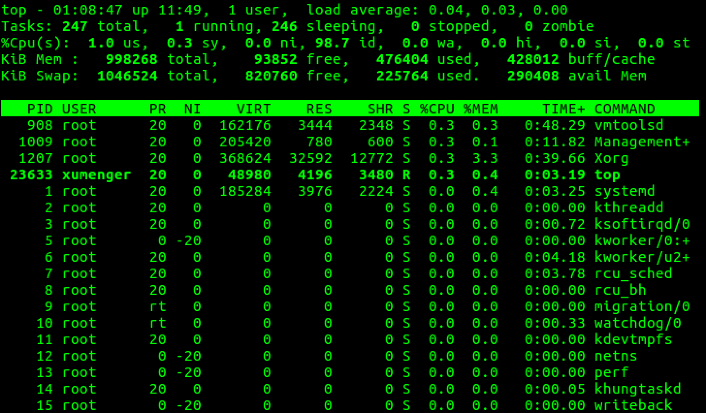

注意：Linux和Windows计算CPU占用率的逻辑不同。假如都是4核的，在Windows下是每个CPU分别最大值是25%，4个总共是100%；而在Linux下每个CPU都是100%，4个总共是400%

`strace ./test`追踪一个进程test调用系统api的情况；`strace -f ./test`既会追踪进程本身的系统api调用情况，也会追踪其创建的子进程的调用情况

## 内存管理

内存是计算机系统的核心部件，今天使用内存主要是DRAM，即动态随机访问的内存，再细分：DDR、DDR2、DDR3……

**物理内存**

目前服务器上主流的非对称内存架构：

* 每个CPU有自己的内存（非对称内存架构：NUMA），而目前的PC一般是多CPU共享一套内存（对称的内存架构：UMA）
* 一个CPU也可以访问其他CPU的内存，但访问速度要比访问自己的内存慢很多

内存层级结构：

* 有时也被称为Memory Node
* 对于普通PC，只有一个Memory Bank/Node
* 不妨就翻译为内存银行
* 在Linux内核中对应有一个struct node结构体
* 每个Memory Bank中又分为多个块：Zones
* 比Zone再小一级别的单位是Page：内存页，x86上最常见的内存页大小是4KB
	* 每个内存页有自己唯一的序号
	* page frame number，又称为PFN
	* PFN是底层管理内存一个极其重要的概念
* 分页内存寻址
	* 底层内存都是按照页来划分的，每个页有一个编号
	* 所以在内存寻址的时候，总是根据PFN找到这个页，然后加上页内偏移最终拿到物理地址

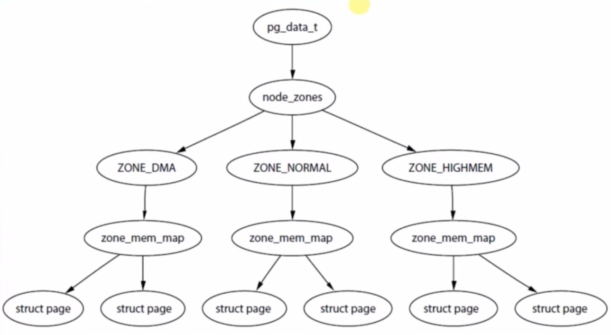

**页表管理**

保护模式下的内存管理

* 保护模式
	* 保护系统中的每个任务
	* 每个任务有自己的地址空间，在同一任务空间中保护高特权代码
* 保护模式下，进程空间中的代码和数据使用的都是虚拟地址
* CPU负责将虚拟地址翻译为物理地址

x86 CPU的内存管理

* 两种机制：段机制和页机制
* 段机制不可以禁止
* 页机制可以启动或禁止

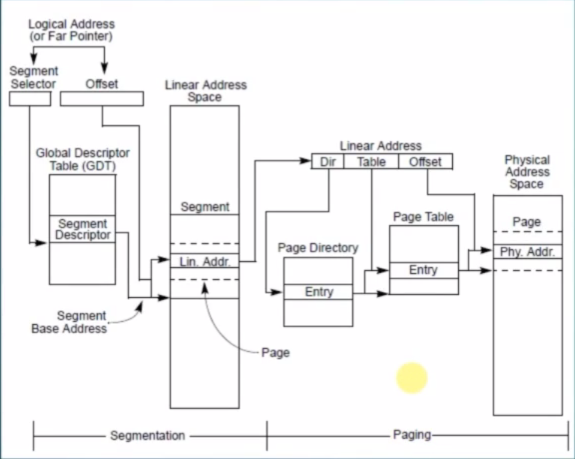

内存页翻译过程：从线性地址到物理地址（x86）

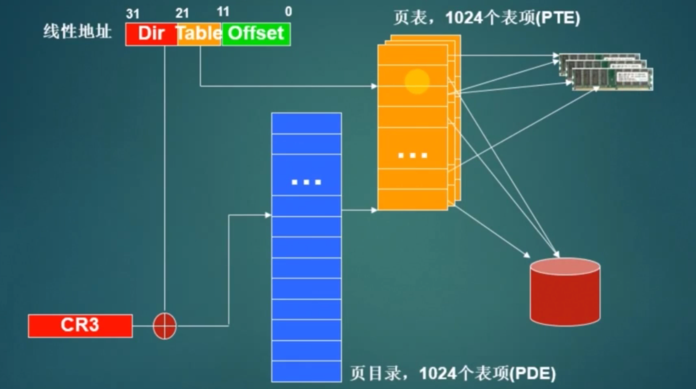

CR3寄存器

* IA32 CPU用来记录当前页目录表的物理基地址的寄存器，简称PDBR：Page Directory Base Register
* 每个进程的最重要属性之一
* 切换任务时，系统会将前一个任务的CR3作为上下文信息的一部分保存起来。在开始执行新任务前，系统会恢复寄存器状态，包括CR3、EFLAGS、EIP等
* 切换CR3寄存器意味着切换地址空间
* 不同进程拥有不同的地址空间（CR3内容）————隔离与保护

页的翻译是无时无刻不在发生的，翻译线性地址的时候需要查页表，因为页表也在内存中。如果读一个内存就需要首先查页表，有时候要查两次页表，所以“每一次”内存访问背后需要多次访问内存（因为先查页表），因为内存在CPU外部，所以是一个比较大的开销，为了加速页表翻译，目前的CPU都有特殊的在CPU内部的高速缓存：TLB，是一个特殊的表，记录了虚拟地址到物理地址的对应关系。CPU在翻译线性地址的时候，先去查TLB，如果这个地址已经翻译过，那么直接去找对应的结果就可以了，如果这个地址没有翻译过，那还需要一层一层查页表来找对应的物理内存，然后把虚拟内存和物理内存的对应关系再缓存到TLB中

CPU内部负责地址翻译的模块是MMU，MMU会先查TLB，如果查到了就直接根据TLB的信息去访问，否则就去查内存中的页表

将线性地址翻译成物理地址后，如果在对应的物理地址找不到，那么就会产生一个page fault，接下来就需要操作系统去磁盘中把对应的内容再加载到物理内存中

**虚拟内存**

进程的地址空间，每个进程有自己独立的虚拟内存空间，所有进程“共享”内核空间


`cat /proc/进程ID/maps`在调试一些复杂的进程内存问题时很有用，可以方便的查看内存的映射情况

**内核态池**

写驱动的时候如何在内核态申请内存：

* kmalloc
* Slab Allocation
* Memory Pools
* get\_free\_page，在申请较大的内存时使用，保证物理地址是连续的
* vmalloc，不保证物理地址是连续的，只能保证虚拟内存连续

因为内核态的内存空间只有1GB宝贵的空间，所以不建议在内核态分配太大的内存空间

**用户态堆**

如何在用户态应用程序中分配内存：标准C的运行时函数malloc/free，在速度、空间占用、可移植性方面是一个比较折衷的方案

在内核态需要管理物理内存、虚拟内存；用户态的内存其实是来自内核态的，当malloc分配内存的时候，其是间接从内核态获取的内存，因为如果每次在用户态申请内存的时候都向内核态申请，那么每次都需要进行系统调用，开销太大；所以通常是从内核态先批发上来，再在用户态分割成一小块一小块的，再进行分发，对应的函数是mmap、brk

堆管理器通常是先批发一批内存上来再进行分配，如果不够用了就再批发一块。glibc对于批发上来的内存，先拿出一块供自己用，主要是存放堆的管理数据结构，比如heap\_info，然后再割成一小块一小块的给用户使用

heap\_info是glibc中定义的堆管理数据结构

Windows下是堆内有多个段，段内部内存是连续的，但段和段的内存可能不连续；Linux下的glibc中的说法是，连续的内存是一个heap，堆上的内存就是连续的

当分配超过512字节内存时，会从一个特殊的链表（空闲列表）中访问，我们在释放一个块时并不是真正的释放它，而是把它放到空闲列表中，等到下次分配的时候企图从空闲列表中找到合适的进行匹配；如果是小于64字节的，会从事先缓存的分配器中分配

堆管理器通常是从内核态先批发上来，再在用户态分割成一小块一小块的，再进行分发。所以需要描述这个块的信息，malloc\_chunk就是这样的数据结构，也称为块的头，因为块有很多个，每个块都有块头，所以块头要定义的尽可能小，防止浪费太多空间

```
struct malloc_chunk{
	INTERNAL_SIZE_T prev_size;
	INTERNAL_SIZE_T size;

	struct malloc_chunk* fd;
	struct malloc_chunk* bk;

	struct malloc_chunk* fd_nextsize;
	struct malloc_chunk* bk_nextsize;
}
```

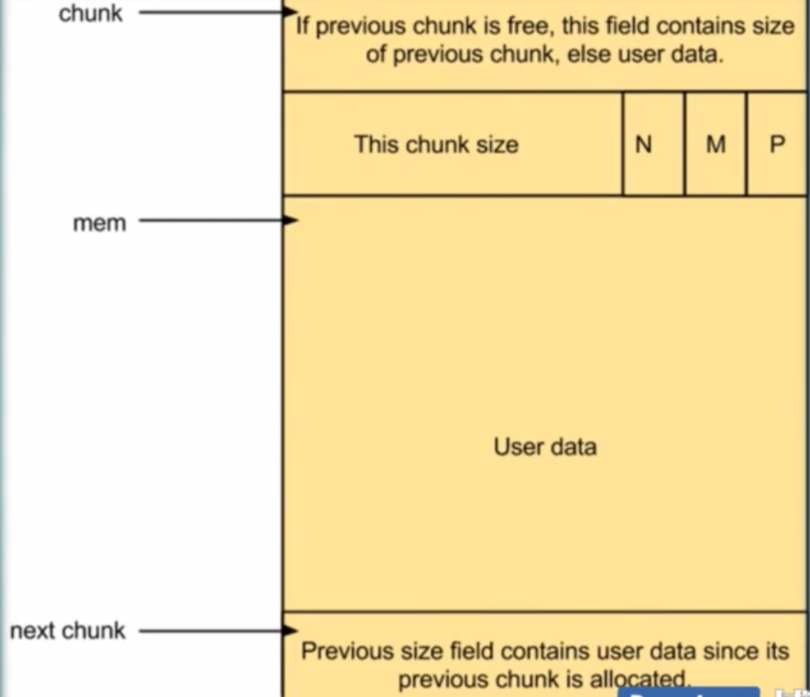

Bins：前端堆

* Fast Bin：管理16～80字节的
* Small Bin：管理小于512字节的
* Large Bin：管理大于等于521字节的
* Unsorted Bin：大小不确定

推荐阅读：[《汇编与逆向基础：VC++6.0 调试模式下探究Win32进程堆内存模型》](http://www.xumenger.com/windows-vcpp-debug-20161203/)

**故障调试**

`cat /proc/meminfo`观察内存的重要指标

`free -l -t`观察内存的重要数据，其实free命令就是基于/proc/meminfo这个文件获取的

`top`命令

推荐valgrind，通过向被分析的软件中“打桩”，来实现监视、测量、诊断的目的

* 内存错误检测器
* 两个关于线程错误的检测器
* 缓存、分支预测的优化器
* 调用树和分支预测的优化器
* 堆的优化器，可以检测内存泄漏、检查多次释放

## 应用程序崩溃

Linux上的段错误：Segment fault，对应在Windows上被称为访问违例：Access violation。其实是操作系统和CPU在检测发现问题后，主动让进程崩溃，防止产生更大的危害，是操作系统、CPU的自我保护机制

当程序出现崩溃之后，可以通过`dmesg`观察内核打印出来的消息。一旦发生segment fault，就说明CPU报警了，交给内核来处理。Linux内核收到这个异常的时候就会用printk打印一条消息，所以可以使用`dmesg`命令进行查看，比如

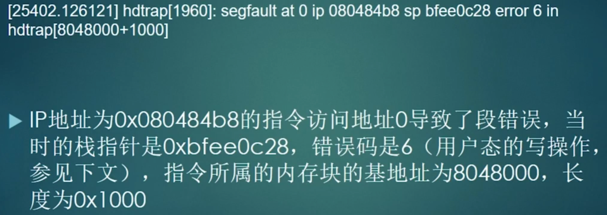

其信息量还是很大的，对于排查导致崩溃的原因是很有用的！

编译的时执行命令`gcc -o hdtrap hdtrap.c func.c -Wl,-Map=hdtrap.map`可以产生Map文件，然后结合`dmesg`的输出可以找到崩溃地址对应的函数等信息，然后就可以很方便的进行排查了

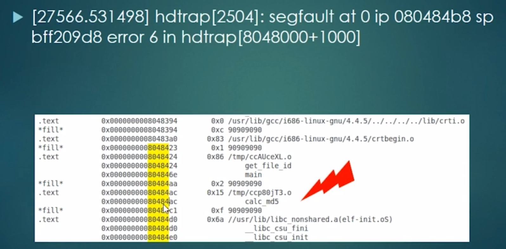

相关文章：[《使用WinDbg、Map文件、Dump文件定位Access Violation的代码行》](http://www.xumenger.com/windbg-map-access-violation-20160715/)

使用dmesg、Map文件做了初步的定位之后，接下来更主要的还是要用GDB对其进行反汇编，分析每一个bit的情况来进行排查

Linux平台上，出现Segment Fault错误的时候，对应产生的信号是SIGSEGV

崩溃的问题是比较难排查的一类问题，就是因为崩溃问题往往崩溃了之后，现场就没有了，另外就是崩溃往往不是必现的，所以如果能在程序崩溃的时候自动将调试器Attach到进程上来进行调试分析的话是最好的

在Windows上对于这种即时调试有很好的操作系统层面的支持，不需要修改代码。但是Linux上没有系统的支持，需要修改代码，在代码中注册信号处理器，因为出现崩溃的时候会有SIGSEGV信号，所以需要在程序中注册对SIGSEGV信号的处理

```
//崩溃时的处理逻辑
static void crach_handler(int sig)
{
	int status = 0;
	int pid;
	char *gdb_array[] = ("gdb", '"', NULL);
	char pid_str[40];

	sprintf(pid_str, "--pid=%d%c", getpid(), '\0');
	gdb_array[1] = pid_str;

	pid = fork();

	if(pid < 0){
		abort();
	}
	else if(pid > 0){
		while(1){
			sleep(6000);	//Give GDB time to attach
		}
	}
	else{
		execvp("gdb", gdb_array);
	}
}

//注册信号处理器
void register_jit_gdb()
{
	signal(SIGSEGV, crash_handler);
	//也可以注册其他异常信号
}
```

这里面是注册发生崩溃时自动调用GDB，也可以注册为在发生崩溃时自动生成core dump文件

>Windows平台的进程崩溃问题该怎么有效的、清晰的排查呢？！

## Core文件

把进程某一时刻内存中的数据、运行状态转储到磁盘，Linux平台上称之为Core文件

首选需要使用`ulimit`指定core文件的大小限制

Linux下Core文件的格式复用了Linux下可执行文件的格式，也就是ELF格式，可以使用`objdump -h core`或者`readelf -h core`查看Core文件的头信息；`readelf -l core`查看段信息；`readelf --notes core`可以查看note段的内容

`gdb 可执行程序名 core文件名`即可分析Core Dump文件，bt等大多数的GDB命令都是可以使用来分析core文件的

或者`gdb -c core`，但是这样因为没有对应的可执行程序，也就没有符号信息，所以可能不方便调试。不过可以在如此启动了gdb之后使用`file 可执行程序名`再去指定对应的可执行程序文件

扩展阅读：

* [《Linux下GDB的调试逻辑》](http://www.xumenger.com/linux-gdb-20170228/)
* [《初步了解如何用GDB分析Core文件》](http://www.xumenger.com/linux-c-cpp-gdb-coredump-20160908/)

## 简单总结

[20170130~20170222-windbg](https://github.com/xumenger/xumenger.github.crack/tree/master/20170130~20170222-windbg)中针对Windows的调试、Windows的简单底层原理进行了学习

这里又对Linux的调试、Linux内核的原理进行学习，虽然是有些学了后面的忘了前面的，但是明显感觉虽然Winodws和Linux看起来有很大的差异，但是其底层实现方面的很多原理都是一致的，最本质的就是CPU、内存、汇编这些东西，虽然现在有些混、不清楚，只要经过持续的学习、以及更重要的编程和调试实践，终究会将其融汇贯通

这还只是计算机的一方面：计算机组成原理的思想来实现计算机；Lisp是实现计算机的另一种思想，后面也是有必要去研究研究的

>路漫漫其修远兮，吾将上下而求索

