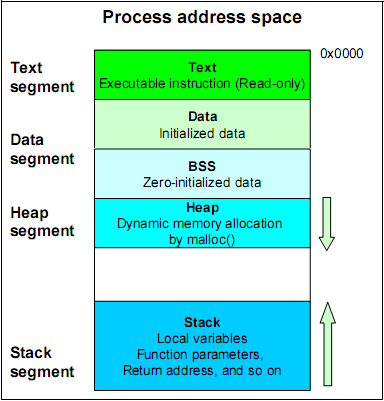

之前在[《Windows下32位进程内存模型》](http://www.xumenger.com/01-windows-process-memory-20170101/)、[《Linux下32位进程内存模型》](http://www.xumenger.com/02-linux-process-memory-20170101/)分别对Windows下32位进程、Linux下32位进程的内存模型进行了总结

按照当时的测试情况，Linux下32位进程是符合下面这个进程模型图的（至少当时的实验结果如此）



但当时的测试情况显示Windows下32位进程和这个进程模型图有出入。因为当时对于Windows进程的了解程度还是不够，所以也没有给出这个现象的合理解释，暂时就搁置了

最近在[win32-windbg-memory-detail](https://github.com/HackerLaboratory/_Crack/tree/master/20170816~2017mmdd-win32-windbg-memory-detail)中对Win32的进程内存模型准备做一次系统化的总结。不过既然要去研究进程内存模型了，为什么不一次性把Lin32进程内存模型进行梳理，这样Win32和Lin32相互促进，一方面既能同时学习Win32和Lin32，又能进行对比和比较有更深入的理解

## 查看Linux进程内存详细布局

对于Win32进程内存模型的研究，我是使用了WinDbg和自己参考《Windows核心编程》做的一个输出Win32进程内存块信息的插件：[_ProcMonitor](https://github.com/HackerLaboratory/_Laboratory/tree/master/_Basic/_ProcMonitor)

那在Linux下要怎么进行研究呢？

>注意我们在后续练习的时候，编译时不要加`-g`，需要练习无符号调试；需要加`-m32`，现在我只需要做32进程的调试

与WinDbg对应的就是GDB。关于GDB，我之前也都有专门对其用法、原理进行过整理：

* [《Linux下GDB的调试逻辑》](http://www.xumenger.com/linux-gdb-20170228/)
* [《初步了解如何用GDB分析Core文件》](http://www.xumenger.com/linux-c-cpp-gdb-coredump-20160908/)
* [linux-debug](https://github.com/HackerLaboratory/_Crack/tree/master/20170305~20170312-linux-debug)
* [gdb-disassemble](https://github.com/HackerLaboratory/_Crack/tree/master/20170318-gdb-disassemble)
* [milestone-windbg-vs-gdb](https://github.com/HackerLaboratory/_Crack/tree/master/20170426-milestone-windbg-vs-gdb)
* [windbg-gdb-deadlock](https://github.com/HackerLaboratory/_Crack/tree/master/20170509-windbg-gdb-deadlock)

那么在这个系列的整理中，对Linux下GDB的具体使用会是一次更全面的展示。期间也会用到很多的Linux命令，那么会将其详细用法整理到[_Manual](https://github.com/HackerLaboratory/_Laboratory/tree/master/_Manual)方便随时翻阅查看

另外难道我还要在Linux下开发一个类似Windows下的[_ProcMonitor](https://github.com/HackerLaboratory/_Laboratory/tree/master/_Basic/_ProcMonitor)吗？完全没有必要，因为Linux下已经具有类似的功能了，用起来很简单

比如下面查看bash进程的内存模型，先用`ps -ef | grep bash`查看其进程号，然后`cat /proc/1852/maps`即可查看其内存结构


这是64位的进程，那我们自己可以编译一个32位进程，查看32位进程的内存模型，具体使用[《Linux下32位进程内存模型》](http://www.xumenger.com/02-linux-process-memory-20170101/)中的例子

```
#include <stdio.h>

int q[200];

int main(void)
{
    int i, n, *p;
    p = malloc(sizeof(int));
    printf("请输入一个整数：");
    scanf("%d", &n);
    for(i=0; i<200; i++){
        q[i] = i;
    }

    printf("\n");
    printf("文本区域：    %p\n", main);
    printf("数据区域：    %p\n", q);
    printf("堆：          %p\n", p);
    printf("栈：          %p\n", &n);
    printf("动态链接函数：%p\n", scanf);
    printf("\n");

    free(p);

    return 0;
}
```

使用`gcc -m32 -g memory.c`编译得到32位进程，`./a.out`运行程序在等待输出时，我们开一个新的终端，找到其进程号，查看其内存结构


可以清晰的看到其代码段地址、数据段地址、堆内存地址、栈内存地址、动态链接库相关地址等，和我在Windows下做的小工具效果差不多

这是一个单线程进程的内存布局，如果是一个多线程进程呢，它的内存布局又会是什么样的呢？

## Lin32进程内存模型系列文章

* [《Linux下的malloc概述》](https://github.com/HackerLaboratory/_Crack/blob/master/20170820~2017mmdd-lin32-gdb-memory-detail/01-struct-malloc.md)
* [《Linux下的Mutex》](https://github.com/HackerLaboratory/_Crack/blob/master/20170820~2017mmdd-lin32-gdb-memory-detail/02-pthread-mutex.md)
* []()
* []()

## 总结反思

还是那句话，工欲善其事必先利其器，使用WinDbg、GDB查看进程的某块内存、使用计算器根据基地址和偏移计算来分析内存

我一直认为研究计算机有两个最根本的方向：

* 深入钻研计算机底层：计算机组成原理、操作系统原理、编译原理、网络原理、数据库原理……
* 灵活应用计算机知识实现各种想法

就这两个大方向，都弄明白了，就可以了

## 参考资料

* [《RMS's gdb Debugger Tutorial》](http://www.unknownroad.com/rtfm/gdbtut/gdbtoc.html)
* [Linux Kernel Document](https://www.kernel.org/doc/)
* [linux-debug](https://github.com/HackerLaboratory/_Crack/tree/master/20170305~20170312-linux-debug)
* [《使用 GDB 调试多进程程序》](https://www.ibm.com/developerworks/cn/linux/l-cn-gdbmp/)
* [GDB: The GNU Project Debugger](http://sourceware.org/gdb/documentation/?cm_mc_uid=64867782074414879232958&cm_mc_sid_50200000=1503400057)
