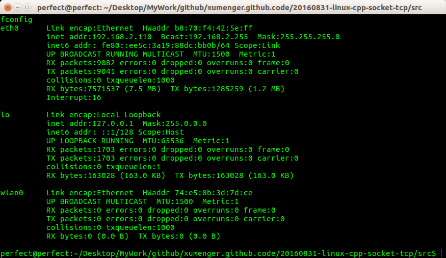
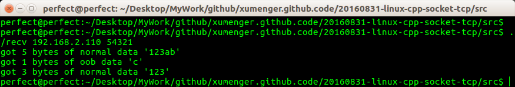

## API简单介绍

对文件的读写操作read和write同样适用于socket。但是socket编程接口提供了几个专门用于socket数据读写的系统调用，它们增加了对数据读写的控制。

其中用于TCP流数据读写的系统调用是：

```
#include <sys/types.h>
#include <sys/socket.h>
ssize_t recv(int sockfd, void *buff, size_t len, int flags);
ssize_t send(int sockfd, const void *buff, size_t len, int flags);
```

recv读取sockfd上的数据，buf和len参数分别指定读缓冲区的位置和大小，flags参数通常设置位0即可。recv成功是返回实际读取到的数据的长度，它可能小于我们期望的长度len。因此我们可能要多次调用recv，才能读取到完整的数据。recv可能返回0，这意味这通信对方已经关闭连接了。recv出错时返回-1，并设置errno。

send往sockfd上写入数据，buf和len参数分别指定写缓冲区的位置和大小。send成功时返回实际写入的数据的长度，失败时则返回-1并设置errno

## 实验流程

* 编码实现
* 分别编译：`g++ send.cpp -o send`和`g++ recv.cpp -o recv`
* 在ubuntu上执行`ifconfig`查看eth0的IP地址是：192.168.2.110；lo的ip地址是127.0.0.1



* 打开三个终端
* 在第一个终端，执行命令`sudo tcpdump -ntx -i lo 54321`等待tcpdump启动。因为是在本机上测试，所以并不会走以太网卡，所以应该去抓取回环网口lo而不是以太网eth0的包。这里发现，如果接收端和发送端都在一台机器上，虽然指定了IP地址，也不会走以太网，而是直接走回环网口
* 在第二个终端中执行命令：`./recv 192.168.2.110 54321`
* 在第三个终端中执行命令：`./send 192.168.2.110 54321`
* 然后可以看到在第二个终端(recv)输出信息如下，有时候像下面这样输出'123ab'、'c'、'123'，但也有时候输出'123'、'c'、'123'，一下的分析都是针对第一种情况的分析



* 在第一个tcpdump监听的终端输出信息如下，输出的是二进制格式的网络包。下图中的每个网络包中，既包含IP包头，也包含了TCP包头、TCP包体，可以对照IP和TCP的包结构去一个字节一个字节的分析

```
perfect@perfect:~/Desktop/MyWork/github/xumenger.github.code/20160831-linux-cpp-socket-tcp/src$ sudo tcpdump -ntx -i lo port 54321 
sudo: unable to resolve host perfect
tcpdump: verbose output suppressed, use -v or -vv for full protocol decode
listening on lo, link-type EN10MB (Ethernet), capture size 262144 bytes
IP 192.168.2.110.45564 > 192.168.2.110.54321: Flags [S], seq 3516811665, win 43690, options [mss 65495,sackOK,TS val 992076 ecr 0,nop,wscale 7], length 0
	0x0000:  4500 003c 6add 4000 4006 49b2 c0a8 026e
	0x0010:  c0a8 026e b1fc d431 d19e 4991 0000 0000
	0x0020:  a002 aaaa 865b 0000 0204 ffd7 0402 080a
	0x0030:  000f 234c 0000 0000 0103 0307
IP 192.168.2.110.54321 > 192.168.2.110.45564: Flags [S.], seq 588560235, ack 3516811666, win 43690, options [mss 65495,sackOK,TS val 992076 ecr 992076,nop,wscale 7], length 0
	0x0000:  4500 003c 0000 4000 4006 b48f c0a8 026e
	0x0010:  c0a8 026e d431 b1fc 2314 b76b d19e 4992
	0x0020:  a012 aaaa 865b 0000 0204 ffd7 0402 080a
	0x0030:  000f 234c 000f 234c 0103 0307
IP 192.168.2.110.45564 > 192.168.2.110.54321: Flags [.], ack 1, win 342, options [nop,nop,TS val 992076 ecr 992076], length 0
	0x0000:  4500 0034 6ade 4000 4006 49b9 c0a8 026e
	0x0010:  c0a8 026e b1fc d431 d19e 4992 2314 b76c
	0x0020:  8010 0156 8653 0000 0101 080a 000f 234c
	0x0030:  000f 234c
IP 192.168.2.110.45564 > 192.168.2.110.54321: Flags [P.], seq 1:4, ack 1, win 342, options [nop,nop,TS val 992076 ecr 992076], length 3
	0x0000:  4500 0037 6adf 4000 4006 49b5 c0a8 026e
	0x0010:  c0a8 026e b1fc d431 d19e 4992 2314 b76c
	0x0020:  8018 0156 8656 0000 0101 080a 000f 234c
	0x0030:  000f 234c 3132 33
IP 192.168.2.110.45564 > 192.168.2.110.54321: Flags [P.U], seq 4:7, ack 1, win 342, urg 3, options [nop,nop,TS val 992076 ecr 992076], length 3
	0x0000:  4500 0037 6ae0 4000 4006 49b4 c0a8 026e
	0x0010:  c0a8 026e b1fc d431 d19e 4995 2314 b76c
	0x0020:  8038 0156 8656 0003 0101 080a 000f 234c
	0x0030:  000f 234c 6162 63
IP 192.168.2.110.45564 > 192.168.2.110.54321: Flags [F.], seq 10, ack 1, win 342, options [nop,nop,TS val 992076 ecr 992076], length 0
	0x0000:  4500 0034 6ae2 4000 4006 49b5 c0a8 026e
	0x0010:  c0a8 026e b1fc d431 d19e 499b 2314 b76c
	0x0020:  8011 0156 8653 0000 0101 080a 000f 234c
	0x0030:  000f 234c
IP 192.168.2.110.54321 > 192.168.2.110.45564: Flags [F.], seq 1, ack 11, win 342, options [nop,nop,TS val 992076 ecr 992076], length 0
	0x0000:  4500 0034 9423 4000 4006 2074 c0a8 026e
	0x0010:  c0a8 026e d431 b1fc 2314 b76c d19e 499c
	0x0020:  8011 0156 8653 0000 0101 080a 000f 234c
	0x0030:  000f 234c
IP 192.168.2.110.45564 > 192.168.2.110.54321: Flags [.], ack 2, win 342, options [nop,nop,TS val 992076 ecr 992076], length 0
	0x0000:  4500 0034 6ae3 4000 4006 49b4 c0a8 026e
	0x0010:  c0a8 026e b1fc d431 d19e 499c 2314 b76d
	0x0020:  8010 0156 8653 0000 0101 080a 000f 234c
	0x0030:  000f 234c
```

## 分析这个过程

本次小练习调用recv、send分别有在flags参数中赋值MSG\_OOB，MSG\_OOB选项给应用程序提供了发送和接收带外数据的方法

根据上面运行效果可见，客户端发送给服务器的3字节的带外数据abc中，仅有最后一个字符'c'被服务器当作是真正的带外数据接收。并且，服务器对正常数据的接收将被带外数据阶段，即前一个正常数据"123ab"和后续的正常数据"123"是不能被一个recv全部读出的

tcpdum的输出内容中，和带外数据相关的TCP报文段如下：

```
IP 192.168.2.110.45564 > 192.168.2.110.54321: Flags [P.U], seq 4:7, ack 1, win 342, urg 3, options [nop,nop,TS val 992076 ecr 992076], length 3
	0x0000:  4500 0037 6ae0 4000 4006 49b4 c0a8 026e
	0x0010:  c0a8 026e b1fc d431 d19e 4995 2314 b76c
	0x0020:  8038 0156 8656 0003 0101 080a 000f 234c
	0x0030:  000f 234c 6162 63
```

这里我们第一次看到tcpdump输出标志U，这表示该TCP报文段的头部被设置了紧急标志

"urg3"是紧急偏移值，它支出带外数据在自己字节流中的数据的下一字节位置是7(3+4)，其中4是该TCP报文段的序号值相对于初始序号值的偏移。因此带外数据是字节流中的第6个字节，即字符'c'

值得一提的是，flags参数只对send和recv的当前调用有效，当然也可以通过setsockopt系统调用永久性地修改socket的某些属性
