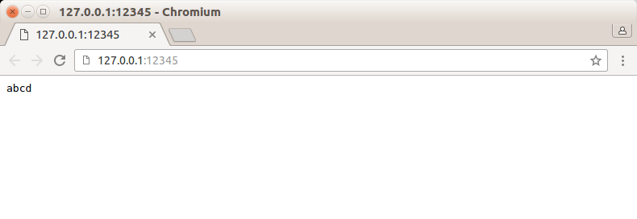

## 说明

有时我们希望把标准输入重定向到一个文件，或者把标准输出重定向到一个网络连接（比如CGI编程）

可以使用下面的用于赋值文件描述符的API实现

```
#include <unistd.h>
int dup(int file_descriptor);
int dup2(int file_descriptor_one, int file_descriptor_two);
```

* dup函数创建一个新的文件描述符，该新文件描述符和原文件描述符file_descriptor指向相同的文件、管道或者网络连接
* 并且dup返回的文件描述符总是取系统当前可用的最小整数值
* dup2和dup类似，不过它将返回第一个不小于 file\_descriptor\_two的整数值
* dup和dup2系统调用失败时返回-1，并设置errno

>通过dup和dup2创建的文件描述符并不继承原文件描述符的属性，比如close-on-exec和non-blocking等

本练习实现一个简单的CGI服务器

## 实验流程

关于这个程序的简单原理已经在代码中以注释的形式说明了，这里说一下怎么测试

首先在终端输入命令：`./simple_cgi 127.0.0.1 12345`

然后打开浏览器，在地址栏输入：`http://127.0.0.1:12345/`

最后浏览器段得到服务器发送的信息并显示，如下图


