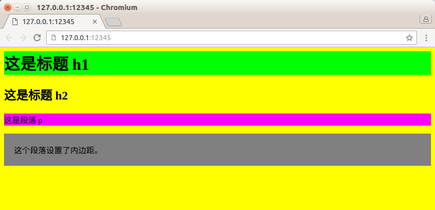

## API介绍

readv函数将数据从文件描述符读到分散的内存块中，即分散读；writev函数则将多块分散的内存数据一并写入文件描述符，即集中读

```
#include <sys/uio.h>
ssize_t readv(int fd, struct iovec* vector, int count);
ssize_t writev(int fd, struct iovec* vector, int count);
```

* fd参数是被操作的目标文件描述符
* vector参数的类型是iovec结构数组
  * iovec描述一块内存区
  * vector数组则描述多块内存区
* count参数是指定vector数组的长度，即有多少块内存数据需要从fd读出或写到fd
* readv和writev在成功时返回读出/写入fd的字节数，失败则返回-1并设置errno

## 练习内容

当Web服务器解析完一个HTTP请求之后，如果目标文档存在且客户具有读取该文档的权限，那么它就需要发送一个HTTP应答来传输该文档

这个HTTP应答包含如下部分：

* 一个状态行
* 多个头部字段
* 一个空行
* 文档的内容

其中，前三个部分的内容可能被Web服务器放置在一块内存中，而文档的内容则通常被读入到另一块单独的内存中

我们并不需要把这两部分内容拼接到一起再发送，而是可以使用writev函数将它们同时写出

## 运行展示效果

* 编写完成代码、编译程序
* 启动服务器：`./web_server 127.0.0.1 12345 test_html_css.html `
* 然后打开浏览器输入地址：`127.0.0.1:12345`，可以看到浏览器上的输出如下


