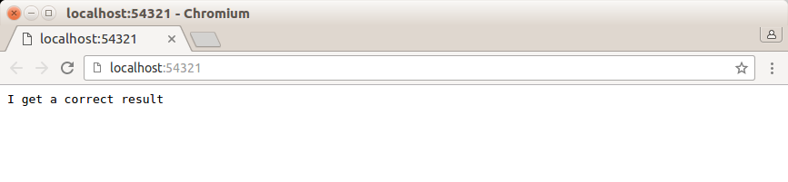
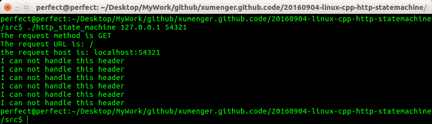

## 说明

本练习考虑有限状态机应用的一个实例：HTTP请求的读取和分析

很多网络协议，包括TCP协议和IP协议，都在其头部中提供头部长度字段。程序根据该字段的值就可以知道是否接收到一个完整的协议头部

但HTTP协议并没有提供这样的头部长度字段，并且其头部长度变化也很大，可以只有十几字节，也可以有上百字节

根据协议规定，我们判断HTTP头部结束的依据是遇到一个空行，该空行仅包含一对回车换行符<CR><LF>。如果一次读操作没有读入HTTP请求的整个头部，即没有遇到空行，那么我们必须等待客户继续写数据并再次读入。因此我们每完成一次读操作，就要分析新读入的数据中是否有空行

不过在寻找空行的过程中，我们可以同时完成对整个HTTP请求头部的分析(记住，空行前面还有请求行和头部域)，以提高解析HTTP请求的效率

本次练习使用主、从两个有限状态机实现最简单的HTTP请求的读取和分析

为了表述简洁，我们约定：直接称HTTP请求的一行(包括请求行和头部字段)为行

## 展示运行效果

终端输入命令`./http_state_machine 127.0.0.1 54321`

然后打开浏览器，输入地址`127.0.0.1:54321`回车

浏览器的输出如下

服务器的输出如下

