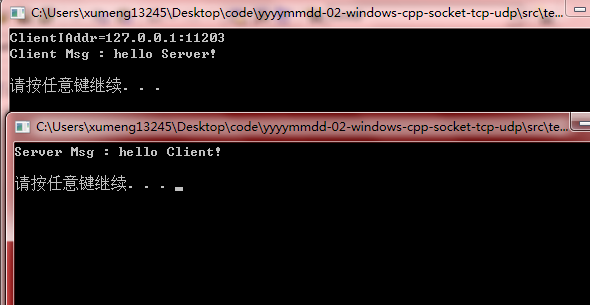
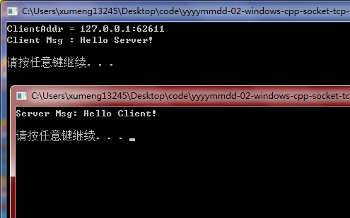

>测试环境：Windows 7、Visual C++ 6.0

>其实网络编程用到的API就固定是那几个，对应调用的时候也都是有规范的套路的，不过当结合多线程、非阻塞、多进程等的时候就可以有更多的变化，展现更大的威力

>对应的例程中有对API的详细注释说明

>本例中的程序代码，纯粹只是为了起到演示的作用，没有让多余的东西影响流程的清晰化，这里没有对API函数的返回值进行判断，实际的开发中为了保证程序的健壮性，应该对各函数的返回值进行判断，以免程序出现异常。简直就是一个低劣的玩具，纯粹是为了展示API的用法而已

## TCP编程

**服务端**

创建一个TCP的服务器端的程序需要调用的函数流程如下：

* WSAStartup()
* socket()
* bind()
* listen()
* accept()		阻塞
* send()/recv()
* closesocket()
* WSACleanup()

只要以此调用上面的函数就可以完成一个简单的服务器端程序了，完全是有一套标准套路的！

还有以下API可能会用到

* inet_addr		将字符串形式的IP地址，比如"127.0.0.1"转成in_addr结构体可接受的类型
* inet_ntoa		和inet_addr的作用相反
* htons			将主机字节序转换成网络字节序，常用于端口的转换
* ntohs			和htons作用相反

**客户端**

TCP客户端调用API的流程也很简单

* WSAStartup()
* socket()
* connect()		阻塞
* send()/recv()
* closesocket()
* WSACleanup()

**运行效果**

先打开服务器EXE，在打开客户端EXE，输出信息如下

## UDP编程

**服务端**

基于UDP协议的服务端程序不会去监听端口和等待连接，因此UDP协议的服务端程序相比于TCP协议的服务端程序来说代码更短

**客户端**

基于UDP客户端的代码相对于TCP协议的客户代码而言，不需要调用connect()函数进行连接，省去了TCP协议的“三次握手”过程，可以直接发送数据给服务器

**运行效果**

先打开服务器EXE，在打开客户端EXE，输出信息如下

