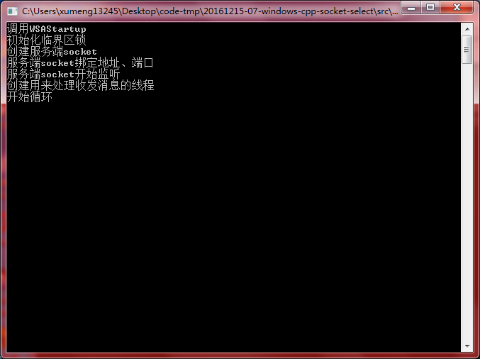
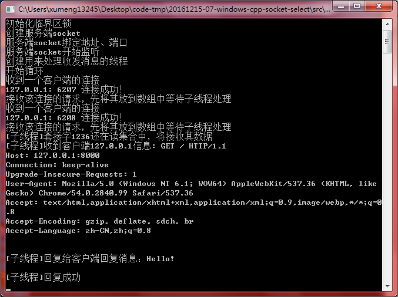

>测试环境：Windows 7、Visual C++ 6.0

>涉及技术点：Socket、网络编程、非阻塞、select、数据结构之集合、多线程、锁、数组的使用、内存管理

参考[《Windows I/O模型之一：Select模型》](http://www.cnblogs.com/Mr-Zhong/p/4160988.html)

WinSock套接字的工作模式有两种，分别是阻塞和非阻塞。阻塞模式下的WinSock函数会将程序的某个线程处于“等待”状态（如果程序中只有一个主线程，那么会导致整个程序处于“等待”状态），比如在“20161206-02-windows-cpp-socket-tcp-udp”中实践的程序，调用recv()函数后，如果当前的TCP协议栈中没有数据，那么该函数会在协议栈有数据之前一直处于等待状态，从而导致整个程序也处于暂停中

非阻塞模式的WinSock函数不会发生等待的情况。非阻塞模式下，当一个函数执行后会立即返回，对于recv，即使是当前的协议栈中为空也返回

推荐：[《Delphi网络编程：阻塞和非阻塞》](http://www.xumenger.com/windows-delphi-socket-20161011/)

## select模型的原理

select（选择）模型是WinSock中最常见的IO模型。之所以称其为“select模型”，是由于它的“中心思想”是利用select函数，实现对IO的管理。利用select函数，我们判断套接字上是否存在数据，或者能否向一个套接字写入数据

之所以要设计这个函数，唯一的目的是防止应用程序在套接字处于锁定模式中时，在一次IO绑定调用（如send或recv）过程中，被迫进入“锁定”状态；同时防止在套接字处于非锁定模式中时，产生WSAEWOULDBLOCK错误

>除非满足实现调用规定的条件，否则select函数会在进行IO操作时锁定！

## select函数原型

select函数原型如下

```
int select(
	int nfds,
	fd_set FAR * readfds,
	fd_set FAR * writefds,
	fd_set FAR * exceptfds,
	const struct timeval FAR * timeout
);
```

* 第一个参数nfds会被忽略，之所以仍要提供这个参数，只是为了保持和早期Berkeley套接字应用程序的兼容，传0即可
* readfds：检查可读性
* writefds：检查可写性
* exceptfds：例外数据

>从根本上讲，fdset数据类型代表一系列特定套接字的组合

其中，readfds集合包括符合下述任何一个条件的套接字

* 有数据可以读入
* 连接已经关闭、重设或终止
* 假设已调用listen，而且一个连接正在建立，那么accept函数调用会成功

writefds集合包括符合下述任何一个条件的套接字

* 有数据可以发出
* 如果已完成了对一个非锁定连接调用的处理，连接就会成功

exceptfds集合包括符合下述任何一个条件的套接字

* 假如已完成了对一个非锁定连接调用的处理，连接尝试就会失败
* 有带外（out-of-band，OOB）数据可供读取

例如，假定我们想测试一个套接字是否“可读”，必须将自己的套接字添加到readfds集合中，再等待select函数完成

select完成之后，必须判断自己的套接字是否仍为readfds集合的一部分。若答案是肯定的，便表明该套接字“可读”，可立即着手从它上面读取数据

在三个参数中（readfds、writefds、exceptfds），任何两个都可以是空值（NULL），但至少有一个不能为空。在任何不为空的集合中，必须包含至少一个套接字句柄，否则，select函数便没有任何东西可以等待

最后一个参数timeout对应一个指针，它指向一个timeval结构体，用于决定select最多等待IO操作完成多久的时间。如timeout是一个空指针，那么select调用会无限期地“锁定”或停顿下去，直到至少有一个描述符符合指定的条件后结束

timeval结构体的定义如下

```
struct timeval{
	long tv_sec;
	long tv_usec;
};
```

若将超时值设置为(0, 0)，表明select会立即返回，允许应用程序对select操作进行“轮询”。出于对性能方面的考虑，应避免这样的设置！

select成功完成后，会在fd_set结构体中，返回刚好有未完成的IO操作的所有套接字句柄的总量

若超过timeval设定的时间，便会返回0

不管你由于什么原因，假如select调用失败，都会返回SOCKET_ERROR

## 套接字集合

用select对套接字进行监视之前，在自己的应用程序中，必须将套接字句柄分配给一个集合，设置好一个或全部读、写以及例外fd_set结构

将一个套接字分配给任何一个集合后，再来调用select，便可知道一个套接字上是否发生上述的IO活动

WinSock提供了下列宏操作，可用来针对IO活动，对fd_set进行处理和检查

* FD\_CLR(s, \*set)：从set中删除套接字s
* FD\_ISSET(s, \*set)：检查s是否set集合中的一名成员。如果答案是肯定的，则返回TRUE
* FD\_SET(s, \*set)：将套接字s加入集合set
* FD\_ZERO(\*set)：将set初始化为空集合

例如，假设我们想知道是否可以从一个套接字中安全地读取数据，同时不会陷入无休止的“锁定”状态，便可使用FD_SET宏，将自己的套接字按字节分配给fd_set集合，再来调用select

要想检测自己的套接字是否仍属于fd_read集合的一部分，可以使用FD_ISSET宏

## select使用步骤

采用下述步骤，便可完成用select操作一个或多个套接字句柄的全过程

1. 使用FD_ZERO宏，初始化自己感兴趣的每一个fd_set
2. 使用FD_SET宏，将套接字句柄分配给自己感兴趣的每个fd_set
3. 使用select函数，然后等待在指定的fd_set集合中，IO活动设置好一个或多个套接字句柄。select完成后，会返回在所有fd_set集合中设置的套接字句柄总数，并对每个集合进行相应的更新
4. 根据select的返回值，我们的应用程序边可判断出哪些套接字存在着尚未完成（待决）的IO操作——具体的方法是使用FD_ISSET宏，对每个fd_set集合进行检查
5. 知道了每个集合中“待决”的IO操作后，对IO进行处理，然后返回步骤1，继续进行

select返回后，它会修改每个fd_set结构，删除那些不存在待决IO的套接字句柄。这正是我们在上述的步骤4中，为何要使用FD_ISSET宏来判断一个特定的套接字是否仍在集合中的原因

## 练习程序的逻辑

服务器的主要步骤

* 创建监听套接字、绑定、监听
* 创建工作者线程
* 创建一个套接字组，用来存放当前所有活动的客户端套接字，每accept一个连接就更新一次数组
* 接收客户端的连接，因为没有重新定义FD_SIZE宏，服务器最多支持64个并发连接。最好是记录下连接数，不要无条件的接受连接

工作线程是一个死循环，依次循环完成的动作是：

* 将当前客户端套接字加入到fd_read集合中
* 调用select函数
* 用FD_ISSET查看是否套接字还在读集合中，如果是就接收数据。如果接收的数据长度为0，或者发生WSAECONNERESET错误，则表示客户端套接字主动关闭，我们要释放这个套接字资源，调整我们的套接字集合（让下一个补上）。上面还有一个nRet==0的判断，就是因为select函数会立即返回，连接数为0就会陷入死循环

## 测试情况说明

>[《Windows I/O模型之一：Select模型》](http://www.cnblogs.com/Mr-Zhong/p/4160988.html)中示例代码有很多不规范的地方，比如多线程没有对共同访问的数据进行保护等，本次练习的代码在参考他的代码的基础上做了完善：多线程保护……

>当前练习中的代码也只是玩具程序，同样存在一些不足：只支持同时处理64个客户端连接、使用数组管理连接（建议在实际的生产中使用链表、队列等数据结构）、临界区锁在代码中使用的粒度太大必然导致性能的降低、没有进行必要的异常保护、代码规范不是很好、还存在一些bug没有修复的

>本次练习纯粹只是为了展示select的用法。程序存在诸多不规范，也是因为自己目前对网络编程、网络原理的理解不够深刻，还有好多需要学习、需要总结的！

程序启动时



然后在浏览器中输入对应的`IP:端口`


回车，看到程序的输出信息


