网络协议、网络系统虽然集成在计算机系统中，但是其是一个很独立、很有特色的模块，需要做单独的深入学习

关于网络编程，其看起来很简单：发送、接收，但实际绝对不是表面上看到的那样，其内部是很复杂的：

* 怎么配合多线程、多进程进行高并发编程
* API背后的网络协议原理是什么样的
* 如何优雅的关闭Socket连接
* TCP和UDP绝对不是一个面向连接一个不可靠这种表面的总结那么简单的，更深层次是什么样
* TCP网络报文中每个字段、每个值的详细作用
* TCP重传、滑窗机制在编程的时候该如何注意
* 网络环境不好的情况下应该如何处理
* Windows、Linux在网络编程方面有什么异同

网络编程入门容易，精通难，常见的误解和错误：

* 很多Unix的示例代码往往把网络IO和业务代码穿插在一起，在实际项目中可维护性差
* TCP连接、断开的时机选择，以及背后的网络原理还是有很多讲究的，但很多人都没有注意到
* TCP是网络流方式，保证顺序，但不保证边界。在应用层需要设计并实现分包的逻辑
* 直接发送C二进制结构体需要考虑对齐，但高度的不可扩展。但现在深交所就是使用二进制协议，需要研究他们是怎么考虑扩展性的
* TCP的自连接，当客户端和服务端建立连接失败时，比如可能客户端会自己从localhost:5000连接到localhost:5000，出现loop循环
* 非阻塞网络编程与阻塞网络编程。非阻塞网络编程中还有很多坑，所以对于非阻塞网络编程的特点需要深刻的知晓

目前网络编程对于我而言最大的坑就是：我知道有坑，但是不知道什么是坑，因此更不知道该如何针对性的去填坑

学习是一方面，更重要的是练习、思考、总结，否则可以认为是白学！

## 网络编程概览

高并发服务往往采用事务驱动 + 非阻塞IO的方法！

网络协议的层次结构：

* 以太网：frame--帧
* IP网络层：分组
* TCP传输层：分节
* 应用层消息

>以下讲到的各种性能数据都是在特点机器上测试的结果，重点是记住测试性能的方法，而不是死记这些性能数据

下面使用netcat（nc命令）做一个简单的网络性能测试，使用的机器信息如下：

* mac，实体机，有以下网卡和IP
	* en0，对应的IP是：192.168.31.171
	* vmnet1，对应的IP是：172.16.163.1
	* vmnet8，对应的IP是：172.16.192.1
* ubuntu，mac机器上的虚拟机，IP是：172.16.192.128

在ubuntu上执行`nc -l 5001 > /dev/null`，作为服务端，在5001端口收数据，然后转到黑洞中；在mac上执行`dd if=/dev/zero bs=1m count=1000 |nc 172.16.192.128 5001`从/dev/zero取1000M的数据发送到ubuntu的5001端口

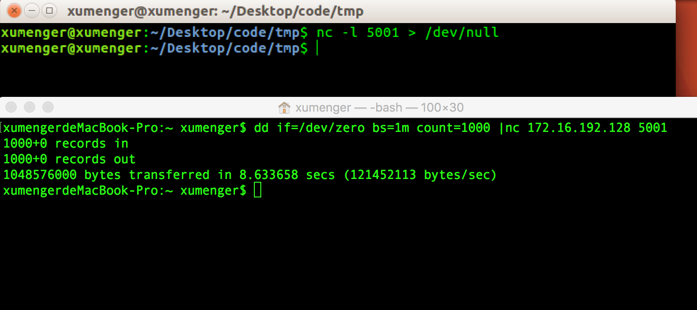

可以看到运行了8.63秒，传输了1048576000 Bytes，也就是1000 MB数据，带宽是121452113 Bytes/s，也就是115 MB/s。如果在本机之测试，性能会更快！

以上只是简单的一个测试性能的示例，实际测试中需要考虑的东西很多，控制变量法要考虑到底要控制哪些变量：

* CPU个数
* IO速度，磁盘数据是否缓存到内存中了
* 测试工具本身的影响
* TCP网络栈的影响
* 等等因素，要依赖于自己对于计算机系统的深刻掌握

特别解释一下mac上`dd if=/dev/zero bs=1MB count=1000 |nc 172.16.192.128 5001`命令的底层原理：

* dd命令（用户态）从/dev/zero（内核态）中读数据
* 然后将读到的数据（用户态）到管道（内核态）中
* nc命令（用户态）从管道（内核态）读取数据
* 然后将数据（用户态）入到TCP栈（内核态）
* 然后从TCP栈上发送数据
* 可以看到有4次的用户态和内核态空间之间的数据拷贝
* 所以上面的测试并不只是TCP一个环节，还有在其他环节的时间消耗

一些网络编程高级的主题：

* RPC。一个基本的开发网络服务的工具
* 负载均衡。网络编程中做服务器如果一台机器的容量不够，无法处理足够多的请求，可以用多台机器做负载均衡
* 服务系统的容量管理
* 延迟。在一个服务系统中，除了关注它的容量、吞吐量之外，延迟信息也需要特别关注，深刻的影响用户体验

## 基本的非并行网络阻塞式编程：TTCP源码分析

TTCP是一个传统的测试TCP性能的工具，主要测试两个机器之间的TCP吞吐量

性能测试关心的一些指标：

* 带宽：每秒收发多少字节的数据
* 吞吐量：在应用层面，每秒能传输多少条消息，能执行多少次查询，能完成多少次事务……
* 延迟：A给B发生网络包后，等待B给A响应，从A发出到收到B的应答的时间就是延迟，如果发收是异步的那基本不受延迟的影响，但是如果是一求一答的同步模式，就比较受延迟的影响了；延迟不光与网络带宽相关，假如带宽很高，但从B收到请求，处理请求到发出去这个时间比较长的话，也明显会导致延迟很长。延迟还需要考虑数据在网络上传输的时间，往往这个与物理距离也存在密切的关系
* 资源使用率：比如最大能达到100M/s，但我现在程序只达到了80M/s，则说明使用率为80%；还有CPU使用率等
* 额外开销：比如直接拷贝文件，此时CPU的利用率很低，但如果实时压缩和加密则需要占用一部分CPU资源，那么实时压缩和加密是不是能够提升拷贝文件的性能，就是我们需要额外考虑的

>在编程开发中，对于网络资源的利用、对于磁盘IO的性能、CPU使用率等，要在设计方案时给出一个估算，这就需要有很好的基础知识，以及比较丰富的开发经验。当然最好还是经过实验来进行验证

TTCP用到的协议是一个简单的请求响应式协议

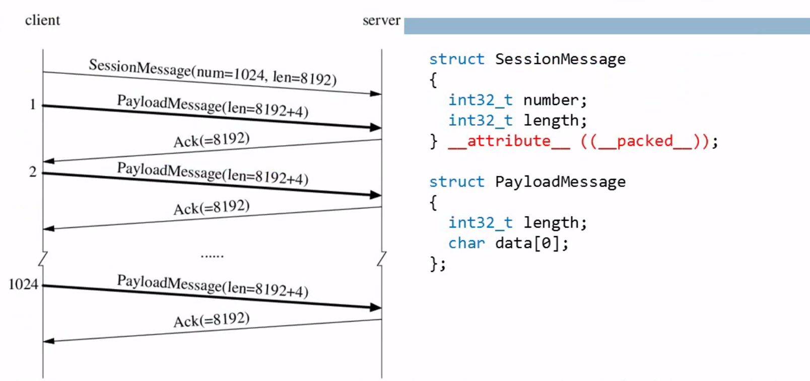

* 客户端向服务端发送一个SessionMessage结构的数据，告诉服务端接下来我将发送number条、分别是length字节的数据
* 客户端紧接着发送一个PayloadMessage，也就是对应之前告诉服务端的一条数据
* 服务端确认
* 客户端一直发送直到发到number条数据（只有在收到上一条的确认后才会发下一条消息，请求应答是同步的）
* 服务端针对每一条数据都给一个确认
* 客户端在发送完number条消息后，在收到最后一条的响应后就断开连接
* 服务端是在收到最后一个请求，发送完响应后就断开连接

>上面使用netcat测试，netcat是只发不收，而ttcp必须收到前一个的应答后才继续发下一条，所以明显ttcp测出来的结果更慢一些，尤其是在延迟比较严重的环境中，因为应答从服务端发回来也需要时间，这段时间对于客户端发送的网络通道是空闲的

>这也是TTCP值得学习的一点，因为好多协议都是请求、应答同步的模式

* 阻塞式：muduo/examples/ace/ttcp/ttcp_blocking.cc
* 非阻塞式：muduo/examples/ace/ttcp/ttcp.cc

对应代码注解参见[20170319~20170320-ttcp](https://github.com/xumenger/xumenger.github.open/tree/master/20170319~20170320-ttcp)，注意其服务端只支持一个TCP连接，因为它只是一个用于测试的小工具而已，能达到测试的目的就可以了

通过上面的流程图，可以看到TTCP是一种典型的请求-->等待响应的模式来测试TCP性能的，之前的netcat只是一味的发生，所以使用TTCP进行测试的时候，明显延迟会产生很大的影响

**使用TTCP进行网络传输性能测试**

下面展示一下陈硕环境上的测试情况，因为目前我的机器没办法编译ttcp，他使用两台机器:atom、e6400

服务端`while true; do ./ttcp -r; done`持续接收数据；客户端`./ttcp -t e6400`向e6400这台服务器发送数据，默认每个包是65536 Byte，一次发送8192个包。性能是77.6 MB/s

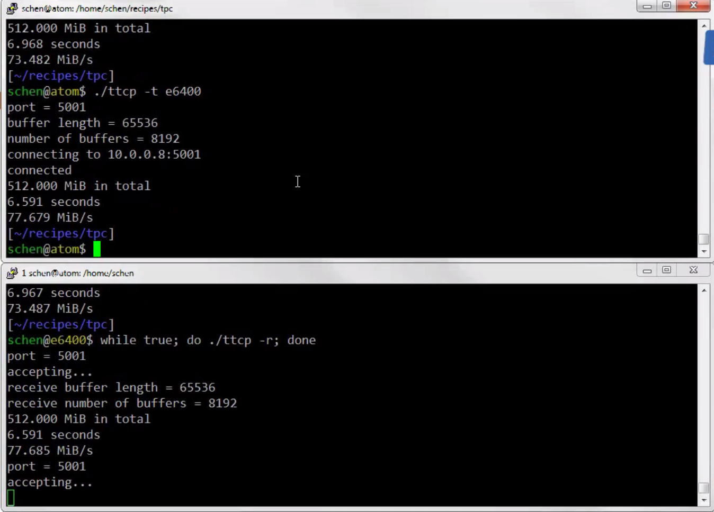

下面测试，客户端`./ttcp -t e6400 -l 1024`，发送8192个包，但每个包只有1024 Byte。这次下降到6.4 MB/s

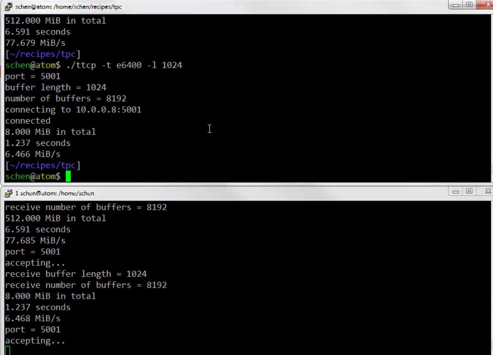

再测试，客户端`./ttcp -t e6400 -l 2048`，发送8192个包，但每个包只有2048 Byte。这次是11.25 MB/s。相比于上一个每次发送1024 Byte，基本成正比的规律

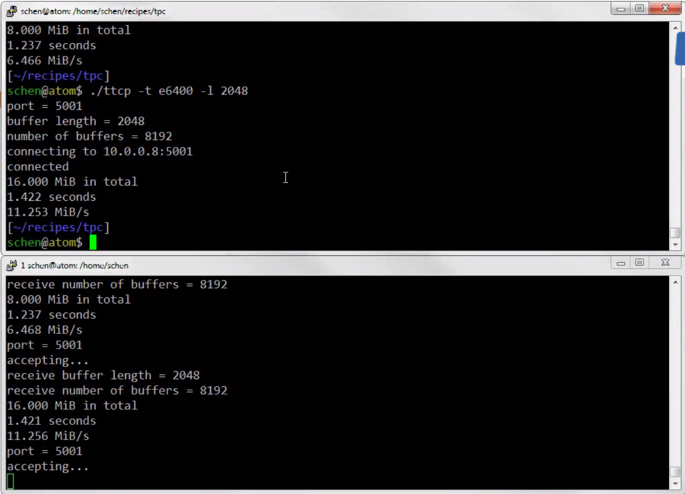

大概的原因是这样的，在带宽允许的情况下，每次发送1024 Byte和发送2048 Byte的时间是一样的，也就是说从客户端发送 --> 到服务端收到 --> 服务端返回应答，如此的延迟是一样的，所以每次发送的包变大了，性能就提升了

但当将每次发送的，因为带宽毕竟是有限的。通过提升每次发送的包大小，在带宽没有占完的情况下，可以提升性能，但当带宽被占完后就无法再提升了

陈硕机器的测试情况是，当`./ttcp -t e6400 -l `时，基本就是性能的极限了，截图如下

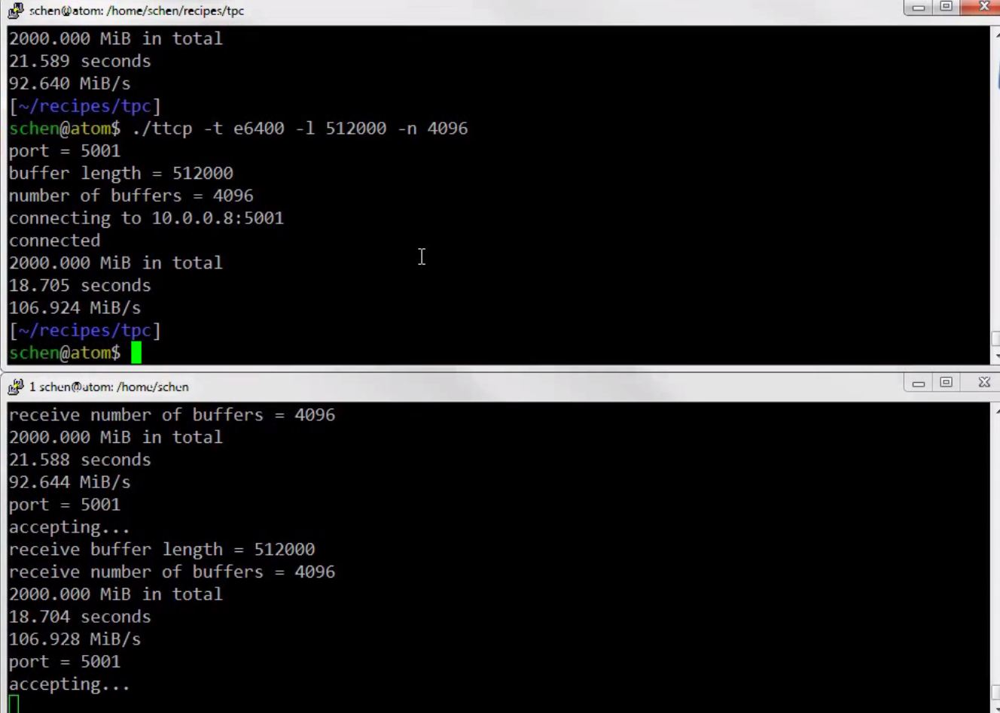

>当然这个值与具体的机器、网络的配置相关，不要死记硬背，重点是掌握测试方法、现象背后的原理

说一下陈硕机器的配置情况：

* atoms is Intel Celeron 1037U。低端的lvy Bridge，双核、1.8GHz、8GB内存
* e6400 is Dell laptop 2009。Intel Core Duo P8600，双核、2.4GHz、4GB内存
* e350 is AMD E-350。8GB内存，低端的APU

刚才是在两台机器上的测试情况，如果尝试在客户端和服务端都在同一台机器上进行测试，可以达到3466.382 MB/s

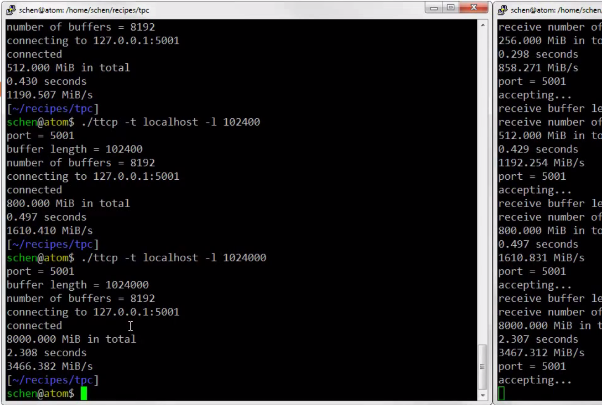

>所以如果在本机进行多进程开发，选择TCP的通信方式，是很好的一种选择，一般不存在性能的问题

**阻塞IO下的TTCP实验**

阻塞IO模式可能会导致阻塞，而且可能会一直阻塞下去。使用echo在本机做一下实验，当客户端一次性发送20M的数据时就产生阻塞

>echo使用阻塞IO模式实现，大概的逻辑是：客户端发送数据，发送完了才会去读；服务端没次读取4KB的数据，然后立刻将4KB的数据发送给对应的客户端

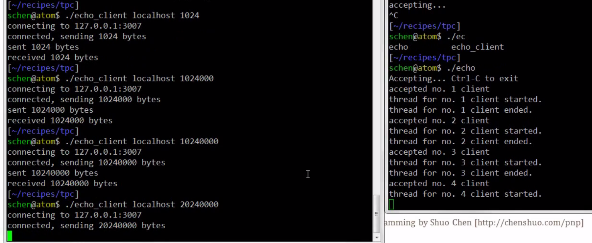

用netstat查看一下现在连接的状态

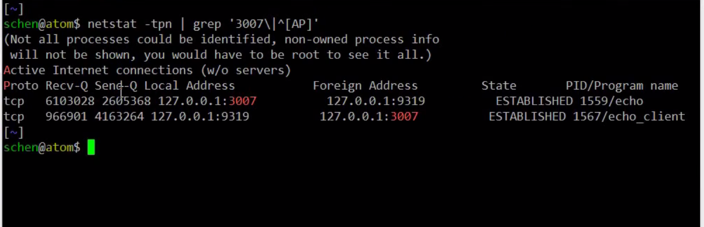

可以看到服务端接收队列（Recv-Q）长度为6103028 Byte，说明内核缓冲区中有这么多数据没有被进程读进来，发送队列（Send-Q）是2605368 Byte，说明内核缓冲区有这么多的数据没有发生出去；客户端接收队列是966901 Byte，发送队列长度是4163264 Byte

当时的情况是这样的

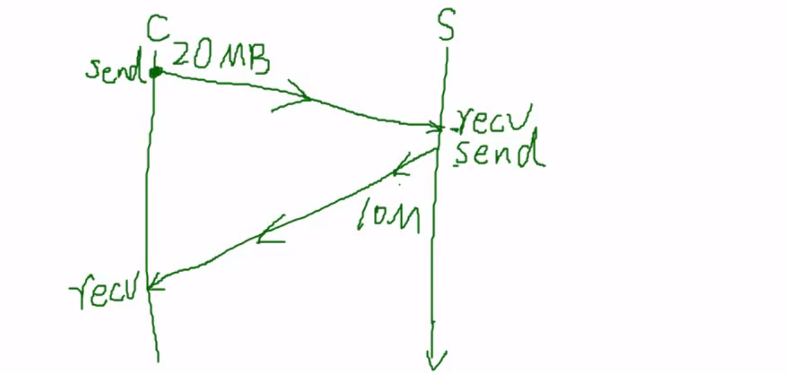

* 客户端发送时，是先将数据拷贝到内核缓冲区，内核缓冲区有一定大小，如果内核缓冲区满了，那么发送就会阻塞
* 刚才设置客户端一次性发送20MB，按照echo的逻辑，在发送完之前客户端自己是不会去读的
* 服务端会去读客户端发送回来的数据，同时往客户端发送
* 假如服务端内核缓冲区只有10MB，那么服务端就阻塞在Send上了
* 因为客户端此时还没有去读，因此服务端用完10MB的内核缓冲区后，但是并没有能处理完客户端发送的20MB数据，所以就在发送的地方阻塞了
* 因为服务端的Send阻塞了，也就导致对应的线程卡死，那么也就不能再去Recv了
* 对应的又会导致客户端的Send数据发送不完，因为客户端的内核缓冲区数据已经堆满，服务端没读，所以客户端就Send不出去
* 因此客户端也会在Send的地方阻塞住！
* 如上图，导致两个连接上都堆积了大量的数据

>这个小实验对于理解网络的运行原理有很好的帮助。阻塞IO虽然简单，但一旦发生长期阻塞的现象，是没有办法自我解脱的

>而且上面的实验是本机测试的，如果是两台不同的机器，那么不需要一次性发送20MB数据就会产生阻塞，大概在2MB数据时就会阻塞（当然，这个也与内核参数有关，也就是接收缓冲区、发送缓冲区的大小）

上面的问题出在服务端。客户端一次性发送20MB数据，但是服务端是循环每次读取4KB，然后发送回对应的客户端，问题就在于它没有一次性完整读取客户端发送过来的完整的请求

正常在设计协议的时候，客户端先发送一个header，告诉这个请求有多大（比如数据有20M），然后再发送请求数据本身（比如20MB数据），服务器在收到header的时候就准备一个20MB的内存缓冲区，然后再去完整的一次性读取20MB的数据，然后处理请求，产生响应，接着也是先发送一个header给客户端告诉客户端接下来发送多大的数据（比如16MB），然后客户端准备好16MB的内存缓冲区，服务端接着发送16MB的数据，客户端再去一次性读取16MB的数据

>如此设计应用层协议，客户端、服务端就都不会产生阻塞

TCP在发起连接的时候会选择一个“随机”端口号，然后才会向服务器的IP和端口发送一个SYN的请求。正常情况下服务器的IP和端口号与客户端所在的IP与端口号是不同的，但是如果本机上没有启动服务器监听某个端口，而客户端尝试去发起连接，先选择一个客户端端口（比如31000），然后会向服务端发起SYN请求，此时因为本机的IP和端口（其实是客户端“随机”选择的端口）已经打开了，所以客户端发起的连接就连接到自己上面了。这就是所谓的自连接

解决自连接的方法：连接成功时，判断如果服务端和客户端的IP/端口都一样，那么就主动断开

## Round-trip进行时钟同步

使用UDP测量两台机器之间的时钟差

自古以来，计时对于准确度有着执着的追求，现在计时最准确的是美国国家标准技术局的F1原子钟，其精度是10^-15

时钟实际上一个振荡器加一个计数器。推荐文章《计时的科学》

下图展示常用电脑主板上时钟晶振的照片，频率是14.318MHz，作为一般电脑的时钟源

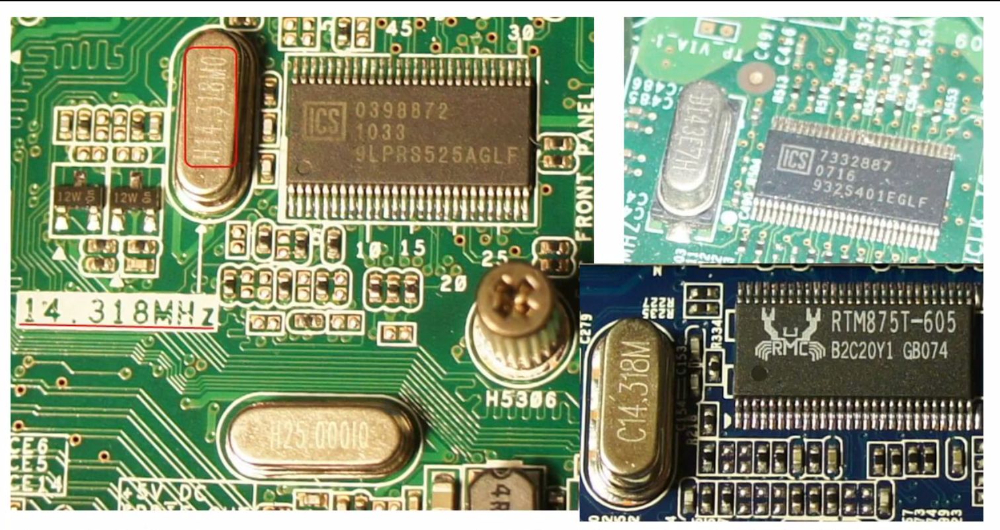

为什么是14.318MHz？N制的电视彩色负载波的频率是3.579545MHz（电视台需要很精确的频率来调制），4.318MHz取值为3.579545MHz * 4

晶体振荡器的震荡频率会变，会随着温度变化、时间流逝而发生变化，所以晶体振荡器无法做到绝对精确，总会有一个偏差

>Timekeeping in Linux Kernel

网络时间同步，主要是指将当前机器的时间与网络上已知的一台时间很准的机器进行同步，主要使用NTP协议来实现

NTP从网络协议的角度看很简单，其是基于UDP实现的

* 客户端发送一条消息（T1）
* 服务端收到消息（T2）
* 服务端发送消息（T3）
* 消息中会带有这三个时间戳信息
* 客户端收到消息（T4）

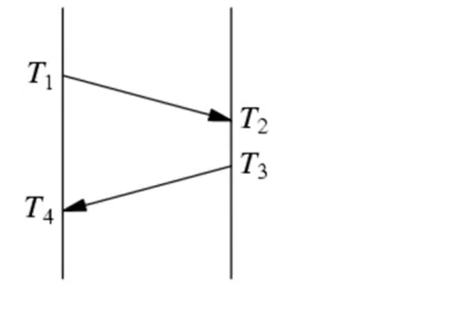

然后使用 ((T4+T1)-(T2+T3))/2 计算客户端和服务器之间的时间差，也就是 T1和T4的中间点 与 T2和T3的中间点 的差值

NTP的复杂度不在于网络编程上，其实逻辑很简单

为什么要测量两台机器之间的时间差，至少存在这样的一种场景：假如你想知道数据从机器1发送到机器2的时间延迟，并不能直接使用数据到机器2时机器2的时间，减去数据从机器1发出时机器1的时间，因为机器1和机器2的时间并不能保证完全同步。如果这样测试的话，假如从发出数据时，机器1的时间为12:20:20，中间传输1s，但是机器2的时间比机器1的时间慢2s，那么机器2收到数据的时间时12:20:19，如果单纯使用两台机器所在的时间计算的话，结果是传输时间只有-1s，所以只有在知道两台机器之间的时间差是多少才能计算出真正的数据传输延迟！

另外还有下面这些需要考虑的时间误差：

* 数据在网络上来回传输可能耗时不同
* 从机器收到数据到用户态读取数据也有时间差
* 程序中还是通过线程运行来计算时间，计算机上线程的切换也存在时间问题

UDP和TCP网络编程的区别（相当巨大）

* UDP服务端只需要一个Socket就可以服务不计其数的客户端，但TCP需要针对每个客户端创建一个Socket，这也是UDP和TCP网络编程的一个重大区别。所以UDP和TCP的并发模型是很不同的
* NAT穿透用TCP很难，但是用UDP就很简单
* TCP时线程不安全的，不要两个线程去同时读一个socket，否则可能出现线程A读了前500字节，线程B读了后500字节的情况；TCP也不要两个线程同时写；但TCP对于一个TCP连接，可以分别有一个线程去读，一个线程去写，因为TCP连接是全双工的。UDP的特点就是所有的客户端在服务端可以用一个fd就够了，因为recvfrom的时候自然就有客户端的地址，而且多个线程可以同时读写一个fd，因为UDP是数据报文协议，它自动就维护了消息的边界，两个线程一起写不会出现串话的情况

>一般认为应该默认使用TCP，而且不要为了所谓的性能而使用UDP。如果使用UDP其实连千兆网的带宽都用不完，TCP要用满千兆网带宽很简单，用netcat，然后117M的吞吐量就出来了；UDP要么拼命发，但是会产生很多丢包，如果不拼命发，又怎么样控制发包的速度更好的用完带宽，还要考虑网络上不止一个进程的场景（对于这种场景，TCP是可以自动处理的，可以自动地在多个连接之间共享同一个以太网链路层的带宽），但是在UDP的情况下又想占满带宽，又想不丢包，又想兼顾公平性，那其实就是基本上把TCP重新实现一遍，而且也不能保证比TCP的实现更好

**补充知识**

在计时领域，闰秒带来了很多头疼的问题。和地球自转变慢有关，往深究的话，就和相对论也有密切的关联

关于计时的科学、计时领域的解决方案，有机会的话可以去好好研究一下！

>分布式系统是相对论型的！

举一个简单的例子，纽约在美国的最东边，洛杉矶在美国的最西边，两个地方网络延迟单程是50ms，如果你这个系统在物理上就是分布在美国的东岸和西岸，那么同时性是不存在的，假如在东岸和西岸同时发生了A和B，但等到A通过50ms通知到西岸时，看起来比西岸的B是晚发生了50ms的。如果两件事没有因果关系的话，对于纽约和洛杉矶的人来说这个事件发生的顺序是不确定的

所以在做分布式系统的时候就需要考虑这种情况的存在！

>光速本身都是有限的，所以在不同的空间内并没有“同时”这么一说

更简单的一个例子，主板上的两个CPU。真空中的光速是3*10^8 m/s（实际电路中电磁波的传播速度会相对慢一些，假设就是2*10^8 m/s），CPU的主频假设是3*10^9 Hz，Hz的单位是1/s

(2*10^8 m/s) / (3*10^9 1/s) = 0.066m = 6.6 cm，也就是说在一个时钟周期内，电信号可以传播6.6 cm，但是服务器上两个主板的CPU可能相距10 cm～20 cm，所以没办法说两个CPU同时执行一条命令，到底谁先执行的并不能说清楚！所以即便是在主板这样的小范围内都是一个相对论系统

>关于时间、空间的相对概念确实很值得研究。空间上隔开的话，如果两件事情没有因果关系，它们发生了，是没有办法确定谁先谁后的

## NetCat

**如何正确使用TCP**

如果程序向一个对方关掉的管道中写数据的话，会收到SIGPIPE信号，写数据操作会返回错误，收到SIGPIPE信号的默认行为是终止进程，在原来的Unix使用场景中是很有用的一个特性，比如用管道串起一串命令`gunzip -c huge.loh.gz | grep ERROR | head`，那么管道末端的程序退出了（同时将管道关闭），那么整个链路中的程序会依次收到SIGPIPE信号，然后就挨个退出，好处就是不会做多余的计算浪费CPU资源

比如命令`gunzip -c huge.loh.gz | grep ERROR | head`，解压缩一个大的日志文件（gunzip），然后找出其中含有ERROR字符串的日志行（grep），然后输出前十行（head）。head输出10行后就会关闭程序，对应的grep就会收到SIGPIPE信号，然后grep关闭，接着gunzip也会收到SIGPIPE信号，关闭程序。这样就可以避免将整个大文件都解压缩，可能只是读了一小块数据，解压缩了几十KB数据后就收到SIGPIPE退出了（具体是多少KB取决于操作系统的缓冲区大小）

>由于Unix默认是阻塞IO，如果接收端收的慢的话，发送端就会阻塞在write上，CPU的占用率也就降下来了。比如上面的命令，假如正常gunzip的解压速度是300M/s（占满CPU），但后面的grep读数据很慢，假如只有30M/s，那么自然会导致gunzip的速度降下来，导致gunzip的CPU占用率也就降下来了

到了网络时代，如果对方关闭了Socket，我还是去写数据，同样会收到SIGPIPE信号，默认就会导致程序被杀死。所以如果不在服务端做特殊处理的话，任何一个客户端关闭连接都会导致服务端收到SIGPIPE而退出，连锁反应会导致其它的客户端也受到影响，这是一个严重的问题。因此网络程序在进程启动的时候都会显式的忽略SIGPIPE信号（比如muduo在全局对象构造时就实现了这个逻辑）

但是忽略SIGPIPE也会导致其它IO比如printf忽略SIGPIPE，那么就需要通过检查这些IO操作函数的返回值来确认是不是对方关掉了，然后进行一些针对性的处理

TCP网络编程中发送部分的开发难度大于接收部分的难度，还有一个原因就是Nagle算法（TCP\_NODELAY选项），其效果是，如果已经发送了数据在没有收到响应之前再发送的话，它会等待，等到响应ACK后再发送！如果发送的数据大于MSS、窗口也大于MSS的话，它可以直接再发，但最后的一个数据Segment会等一下，等到ACK，它的作用是为了防止程序写的不好发送太多小的网络包的话导致网络的压力太大，但是会严重影响请求响应式协议的延迟

如果程序的逻辑是：write-write-read（先发一个、再发一个、最后读一次），那么第二个发送会退后一个往返延迟，因为第二个发送的时候，第一个发送还没有收到应答ACK，对应的解决方法是：将前面的两个发送先在本机缓冲合并，然后调调用一次发送，变成write-read循环。但是还有一个问题，假如同一个连接上有并发请求的话（比如多线程发），这个程序是很难将这些并发请求事先合并成一个大的buffer然后一次性发出去的

对于上面的并发请求的情况，如果在开启TCP\_NODELAY选项的时候（也就是没有启动Nagle算法），客户端可以并发发送多个请求，然后服务器收到以后发回对应数量的应答，中间就只有一个round-trip的延迟（也就是多个请求一起发送，多个应答一起返回）；但如果你没有开启TCP\_NODELAY选项，会变成多个round-trip，会导致严重的延迟（也就是多个请求应答的变成串行的，一个请求发送后，要等待其应答，然后再发送，再等应答……）

所以建议不要使用Negla算法，也就是开启TCP\_NODELAY选项

>17对应的实验！如何测试网络延迟？熟练使用tcpdump抓包和分析包

**TCP使用的注意事项**

netcat号称是网络编程中的瑞士军刀

* 之前讲的ttcp、round-trip都只是和一个socket文件描述符打交道；netcat除了要读写一个socket文件描述符，还要读写标准IO，所以涉及到一些并发性的场景
* 以netcat为契机，引入两种常用的IO模型
	* 每个连接一个线程的阻塞式IO模型
	* 非阻塞IO模式下的IO多路复用
* 如何安全的关闭TCP连接，保证对方收到了完整的数据？
	* 建立TCP连接的难度小于TCP关闭连接的难度
	* 服务器建立连接的难度又小于客户端建立连接的难度
	* 接收TCP数据的难度小于发送TCP数据的难度，尤其是在非阻塞IO下
* 为什么IO复用要和非阻塞IO一起配合使用？使用阻塞IO的话可能会影响其它文件描述符上的收发

新手进行网络编程时常犯的错误是：编写了一个传送文件的程序，在send完成后直接调用close，发现有时候收到文件比原文件少，最后几十K丢失了。如果协议栈的接收缓冲区中有数据，但程序还没有去读的话，此时直接关闭连接导致TCP协议栈发送reset分节，强行的断开连接，如果这时候协议栈的发送缓冲区中还有数据对方没有收到，那么数据就丢失了，导致对方接收数据不完整

正确的做法应该是这样关闭连接的

```
//本方停止写数据
//本方停止写，导致对方接收返回0，这样对方就可以安全的关闭连接了
stream->ShutdownWrite();

//对方关闭连接后，就不再发数据，本方判断读不到数据就可以关闭连接了
//一直循环等待，直到recv的返回值为0
while((nr = stream->receiveSome(buf, sizeof(buf))) > 0)
{
	//do nothing
}

//关闭连接
stream->close();
```

总结起来一句话：read返回0才去关闭连接

这也是进行TCP编程时关闭连接时需要特别注意的一个事项

* A方发送数据
* A方停止发送数据，shutdownwrite（这个函数是发送FIN告诉对方数据已经发送完了）
* B方循环读，因为A方不再发送数据，所以B方判断读不到数据就去close
* B方close，所以不再发送数据
* A方再去循环读，直到读不到数据后，也去close
* 就像沟通好了一样，双方协商好关连接的规则，保证数据不丢失！

>但是还有一种特殊情况：比如服务端遇到一个恶意，或者有bug的客户端的连接，这个客户端可能是不close，那么服务端的read要么阻塞，要么返回一个错误代码，如此就永远无法满足read返回0的条件，所以在产品代码要加一个超时控制，如果在shutdownwrite多少秒之后，还没有发生read返回0的事件，就强行关闭连接。这样是为了安全，并不是数据的安全，而是服务端的安全

上面的方法是通过shutdownwrite告诉对方数据已经发送完了，更好的方法是在设计协议的时候把数据的长度包含进来，这样接收方能主动判断数据是否接收完了，而不用去判断FIN了，目前我在工作中接触到的各种TCP开发报盘的网络协议一般都是如此约定的，比如DCOM、上海STEP、深五代FIX、深五代Bianry等

>当然最好是在程序中对于这两个措施在程序中都使用！

TCP是一个可靠协议，那么为什么还要在应用层加一个应答消息表示它已经处理完了？原因就在于TCP协议栈本身的ACK是表示对方协议栈已经收到了数据，不代表对方的应用程序处理了这个数据，有可能数据还在对方的接收端协议栈中，但应用程序本身阻塞了或者死锁了导致数据没有办法被正确处理！所以TCP的ACK只表示协议栈是否收到，要想知道应用程序是否收到并且处理，那么最好还是采用应用层的ACK

**阻塞IO下Thread-per-connection**

准确的说并不是每个连接对应一个线程，而应该是每个连接对应两个线程，每个线程只管半个连接（要么收、要么发）。这种并发模型在go语言中应用很多，因为go语言中线程开销的代价很低

在简单的netcat实现中，应用两个线程：主线程负责读stdin，写socket；另外一个线程负责读socket，写stdout

阻塞IO的特点是，当你指定读n字节数据，但当前接收缓冲区中只有n-m字节的时候，它就会阻塞当前线程在read的地方，直到接收缓冲区内有n字节的数据才会成功读出来，接着线程继续执行；对于写也是一样的逻辑，当你指定写n字节的数据的时候，假如此时发送缓冲区中只有n-m字节的空间，那么就会阻塞当前线程在write的地方，直到发送缓冲区腾出n字节的空间

因为这个简单的netcat中使用到两个线程，假如线程阻塞到read或write上，那么怎么通知线程正确退出？目前针对阻塞IO没有好的在线程阻塞的情况下通知被阻塞的线程！！

**非阻塞IO下IO复用**

thread-per-connection适用于连接数目不太多，或者线程非常廉价的情况。在C、C++、Java这些主流编程语言中，线程廉价这个条件通常不满足！

用户态线程大概是在1993年出现的

IO复用是指能让一个线程或一个线程同时处理多个文件描述符，IO复用实际上不是复用的IO，而是复用的线程。IO复用最初分为两个阵营：BSD的select、AT&T的poll

IO复用还有很多其它的名称：事件驱动、基于事件，在现在的面向对象的环境下，通常叫做reactor。注意IO复用是同步的，而不是异步的！

IO复用通常要配合非阻塞IO一起使用

在socket之前，一个Unix进程也可以处理多个文件描述符，一个进程可以打开多个磁盘文件，然后读写这些文件。为什么BSD4.2在引入TCP/IP协议栈和SocketAPI的同时要引入select系统调用（IO复用）？因为磁盘文件对应的文件描述符是被动的，一个程序可以自行决定什么时候去读写磁盘文件，并不会遇到阻塞的情况（阻塞的意思是你要去读，但是没有数据供你读），读文件的时候要么有数据可读，要么就读到文件末尾返回EndOfFile，并不会长时间阻塞在那里；但是Socket文件描述符是主动的，Socket上什么时候有数据可读，取决于对方什么时候发送数据，这是与磁盘文件根本的不同！引入IO复用就是解决这个问题，在读/写之前，先去查一下哪些socket描述符可读/可写，然后再去读写，否则一个线程很难同时处理多个Socket描述符

>非阻塞IO网络编程相比于阻塞IO的网络编程要难得多（控制读、写会困难很多很多！），最近（2017-03）开发的几个转换机任务（上交所协议回购、黄金交易所多进程报盘）都是使用的非阻塞IO，明显遇到了很多的坑！我现在在程序中使用非阻塞IO模式开发，但是还是使用阻塞IO的逻辑实现的，导致出现了实际读少于预期读，实际写少于预期写等等等的情况！

应用程序不应该直接与非阻塞IO打交道，这个应该是网络库的责任，应该对非阻塞IO进行很好的封装才行

直接使用Socket API进行网络编程的话，会有很多的坑，一个好的网络库应该在内部将所有的这些坑都填平，然后应用层在开发的时候，最简单的进行读写就好了

>建议：因为thread-pre-connection更简单，所以推荐用这种模型，也是对于一般程序员来说最好控制的一种网络IO模型，但是对于连接多，但是连接交互不频繁的场景明显有些浪费；IO复用不太符合人的思维，更贴近机器的思维，而且复杂度相对而言高得多，所以一般程序员很难控制这种复杂度。非阻塞的IO通常是由一个网络库来管的，你需要明白IO复用的特点，配合这个网络库写出好的程序，在回调里面做一些不耗时的操作！网络库里面libevent、muduo针对IO复用有不错的解决方案，值得学习一下

目前在[《Delphi网络编程：ScktComp的回调逻辑》](http://www.xumenger.com/scktcomp-test-20170329/)对于非阻塞IO模型有一些初步的研究

>最近（2017-03）在研究ScktComp，目前为止还只是看懂了皮毛，除此之外，还有好多的好的网络库值得去深入研究的，最好接下来自己实现一套简单的网络库！最近在使用非阻塞IO进行网络程序开发的时候，实在是遇到了好多的问题，希望接下来一一查清楚原因，然后对应整理一份详细的系统的文章

* 好像说是select可能会错误的通知，比如明明接收缓冲区中没有可读数据，但还是会通知你，所以在使用非阻塞IO读的时候要去判断到底读出来了多少数据
* 非阻塞的读会遇到这样的问题：你预期读n字节的数据，但是缓冲区中只有n-m字节的数据，但是你此时调用read会先将这n-m字节读完（read的返回值会告诉你读了多少），可是此时读出来的数据是不完整的，就需要在应用程序内部再设计一个缓冲区，当读到的数据不完整的时候，先将不完整的数据放到应用程序的缓冲区中，等待后续读事件被触发的时候，再去读数据与应用程序缓冲区中的数据拼接直到能够拼成一个完整的数据
* 写也会存在问题，可能想写n字节，但发送缓冲区中只有n-m字节，那么调用write后，只往缓冲区中写了n-m字节，剩下的m字节还没有写入，所以需要判断，把剩下的没有发生出去的数据也放到应用程序的一个缓冲区中，等到下次可写的时候，再把剩下的m字节写入！比如你要发送1000Byte数据，结果只发出去了500Byte（ShortWrite），那么把剩下的500Byte数据放到一个缓冲区内，等到接下来要发送600Byte数据，不能直接发送600Byte数据，应该把这600Byte的数据先放到原来500Byte字节数据的后面，组成1100Byte，然后再发送

>看到上面的这些说明，我在最近使用非阻塞式IO做网络编程的时候完全没有考虑到，没有判断预期写与实际写的数量、预期读与实际读的数量……所以存在极大的问题。也是因为ScktComp对于非阻塞IO的封装做的不够彻底导致的

最近（2017-03）在Windows平台上使用ScktComp做网络开发，还遇到这样一个问题我无法解释的：明明接收缓冲区中有数据，但是我的OnRead就是没有被触发回调，导致接收缓冲区中的数据最后堆积到8192字节！

非阻塞IO还会遇到一种情况，就是对方接收数据缓慢的情况，比如代理运行在服务器机房的位置，和内部服务器是千兆网连接，客户端进来的是10M的家用宽带，然后客户端通过代理向服务器请求一个大的数据，因为内部是千兆的，代理直接从内部服务器拉过来了，但是发现客户端的带宽很小，只能慢慢给它发，很容易造成内存使用增长很快。这个是非阻塞IO从设计上必须考虑的问题。一个可行的办法就是发现代理中累计的没有发送出去的数据太多的话，就先别去再向服务端请求了，等待慢慢向客户端发送出数据后，再向服务端请求数据，保证不要再代理中堆积太多数据，也就不会导致内存的持续增长！（可以简单理解为一个池塘的出水口和入水口）

疑问：Level-trigger和edge-trigger到底是什么，对应适合什么样的应用场景？


