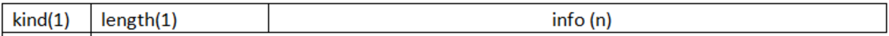

之前在[《TCP/IP学习笔记：网络协议的层结构》](http://www.xumenger.com/network-1-20161021/)、[《TCP/IP学习笔记：初识TCP协议》](http://www.xumenger.com/network-2-20161023/)中针对网络协议的知识做过最简单的一个描述

网络是一个很复杂的东西，需要挖掘的东西还有很多

先列出TCP协议的报文格式图

再列出TCP网络传输与TCP状态机的对应关系

## TCP头部结构

如上面图中展示的，TCP头部中的诸多字段为管理TCP连接和控制数据流提供了足够的信息

**16位端口号**：告诉主机该报文段是来自哪里（源端口）以及传给哪个上层协议或应用程序（目的端口）的。进行TCP通信时，客户端通常使用系统自动选择的临时端口号，而服务器则使用知名端口号

**32位序号(Sequence number)**：一次TCP通信（从TCP连接建立到断开）过程中某一个传输方向上的字节流的字节的编号。假设主机A和主机B进行TCP通信，A发送给B的第一个TCP报文段中，序号值被系统初始化位某个随机值ISN（Initial Sequence Number，处初始序号值）。那么在该传输方向上（从A到B），后续的TCP报文段中序号值将被系统设置成ISN加上该报文段所携带数据的第一个字节在整个字节流中的偏移。例如，某个TCP报文段传送的数据是字节流中的第1025～2048字节，那么该报文段的序号值就是ISN+1025.另一个传输方向（从B到A）的TCP报文段的序号值也具有相同的含义

**32位确认号（acknowledgement number）**：用作对另一方发送来的TCP报文段的响应。其值是收到的TCP报文段的序号值加1.假设主机A和主机B进行TCP通信，那么A发送出的TCP报文段不仅携带自己的序号，而且包含B发送来的TCP报文段的确认号。反之，B发送出的TCP报文段也同时携带自己的序号和对A发送来的报文段的确认号

**4位头部长度（header length/Data offset）**：标识该TCP头部有多少个32bit字。因为4位最大能表示15，所以TCP头部最长是60字节

**6位标志位**包含如下项：

* URG标志：表示紧急指针是否有效
* ACK标志：表示确认号是否有效。我们称携带ACK标志的TCP报文段为确认报文段
* PSH标志：提示接收端应用程序应该立即从TCP接收缓冲区中读走数据，为接收后续数据腾出空间（如果应用程序不将接收到的数据读走，它们就会一直停留在TCP接收缓冲区中）
* RST标志：表示要求对方重新建立连接。我们称携带RST标志的TCP报文段为复位报文段
* SYN标志：表示请求建立一个连接。我们称携带SYN标志的TCP报文段为同步报文段
* FIN标志：表示通知对方本段要关闭连接了。我们称携带FIN标志的TCP报文段为结束报文段

**16位窗口大小**：是TCP流量控制的一个手段。这里说的窗口，指的是接收通告窗口。它告诉对方本端的TCP接收缓冲区还能容纳多少字节的数据，这样对方就可以控制发送数据的速度

**16位校验和**：由发送端填充，接收端对TCP报文段执行CRC算法以校验TCP报文段在传输过程中是否损坏。注意，这个校验和不仅包括TCP头部，也包括数据部分。这也是TCP可靠性传输的一个重要保障

**16位紧急指针**：是一个正的偏移量。它和序号字段的值相加后表示最后一个紧急数据的下一字节的序号。因此，确切地说，这个字段是紧急指针相对于当前序号的偏移，不妨称之为紧急偏移。TCP的紧急指针是发送端向接收端发送紧急数据的方法

## TCP头部选项

TCP头部的最后一个选项字段是可变长的可选信息。这部分最多包涵40字节，因为TCP头部最长是60字节（还包含上面讨论的20字节的固定部分）。典型的TCP头部选项结构如下图

选项的第一个字段kind说明选项的类型。有的TCP选项没有后面两个字段，仅包含一个字节的kind字段。第二个字段length（如果有的话）指定该选项的总长度，该长度包括kind字段和length字段占据的2字节。第三个字段info（如果有的话），是选项的具体信息。常见的TCP选项由7种

kind=0是选项表结束选项

kind=1是空操作（nop）选项，没有特殊含义，一般用于将TCP选项的总长度填充为4字节的整数倍

kind=2是最大报文长度选项。TCP连接初始化时，通信双方使用该选项来协商最大报文长度（Max Segment Size，MSS）。TCP模块通常将MSS设置为（MTU-40）字节（减掉的这40字节包含20字节的TCP头部和20字节的IP头部）。这样携带TCP报文段的IP数据报文的长度就不会超出MTU（假设TCP头部和IP头部都不包含选项字段，并且这也是一般情况），从而避免本机发送IP分片。对于以太网而言，MSS值时1460（1500-40）字节

kind=3是窗口扩大因子选项。TCP连接初始化时，通信双方使用该选项来协商接收通告窗口的扩大因子。在TCP的头部中，接收通告窗口大小是用16位表示的，故最大位65535字节，但实际上TCP模块允许的接收通告窗口大小远不止这个数（为了提高TCP通信的吞吐量）。窗口扩大因子解决了这个问题。假设TCP头部中的接收通告窗口大小是N，窗口扩大因子（移位数）是M，那么TCP报文段的实际接收通告窗口大小是N乘以2^M，或者说N左移M位。注意，M的取值范围是0～14位。我们可以通过修改/proc/sys/net/ipv4/tcp\_windows\_scaling内核变量来启动或关闭窗口扩大因子选项

和MSS选项一样，窗口扩大因子选项智能出现在同步报文段中，否则将被忽略。但同步报文本身不执行窗口扩大操作，即同步报文段头部的接收通告窗口大小就是该TCP报文段的实际接收通告窗口大小。当连接建立好之后，每个数据传输方向的窗口扩大因子就固定不变了。关于窗口扩大因子选项的细节，可参考标准文档RFC 1323

kind=4是选择确认（Selective Acknowledgment，SACK）选项。TCP通信时，如果某个TCP报文段丢失，则TCP模块会重启最后被确认的TCP报文段后续的所有报文段，这样原来已经正确传输的TCP报文段也可能重复发送，从而降低TCP性能。SACK技术证实为改善这种情况而产生的，它使TCP模块只重新发送丢失的TCP报文段，不用发送所有未被确认的TCP报文段。选择性确认选项用在连接初始化时，表示是否支持SACK技术。我们可以通过修改/proc/sys/net/ipv4/tcp\_sack内核变量来启动或关闭选择确认选项

kind=5是SACK实际工作的选项。该选项的参数告诉发送方本端已经收到并缓存的不连续的数据块，从而让发送端可以据此检查并重发丢失的数据块。每个块边沿（edge of block）参数包含一个4字节的序号。其中块左边沿表示不连续块的第一个数据的序号，而块右边沿则表示不连续块的最后一个数据的序号的下一个序号。这样一对参数（块左边沿和块右边沿）之间的数据是没有收到的。因为一个块信息占用8字节，所以TCP头部选项中实际上最多可以包含4个这样的不连续数据块

kind=8是时间戳选项。该选项提供了较为准确的计算通信双方之间的回路时间（Round Trip Time，RTT）的方法，从而为TCP流量控制提供重要信息。可以通过修改/proc/sys/net/ipv4/tcp\_timestamps内核变量来启用和关闭时间戳选项

>好吧，整理到这里，算是一篇比较失败的文章，对于TCP的状态机转换、和Socket API的对应关系等完全都不清楚

>真的，关于网络原理的学习还有好多啊

