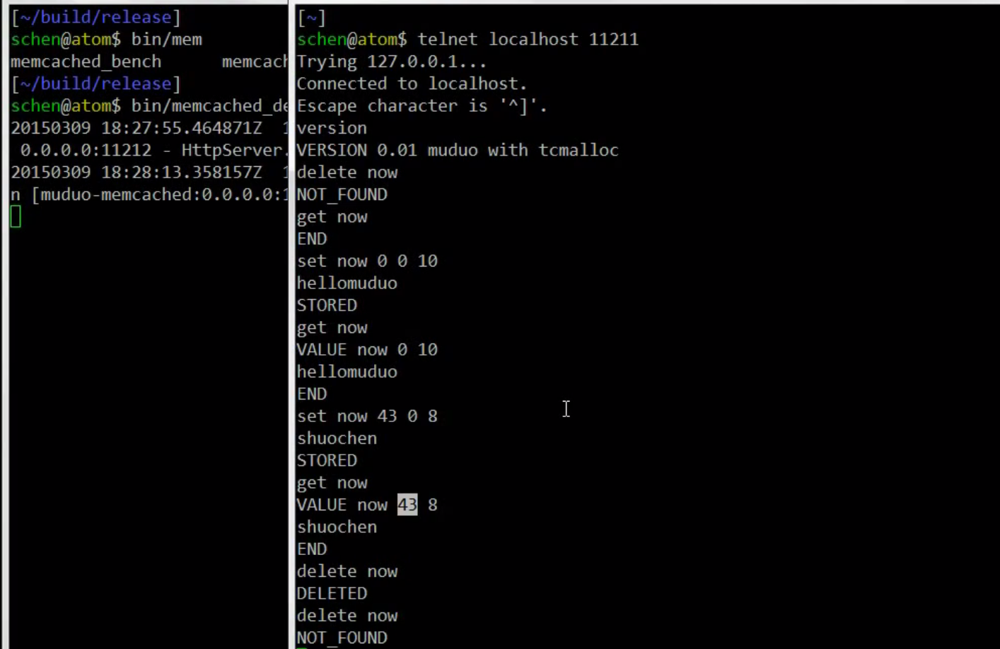
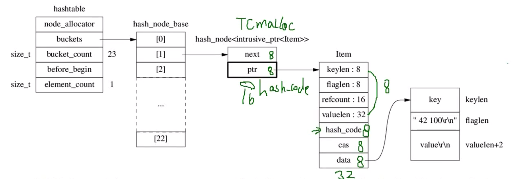
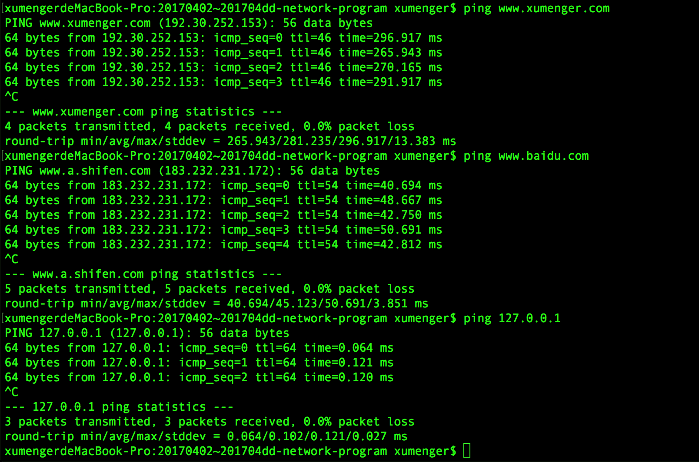
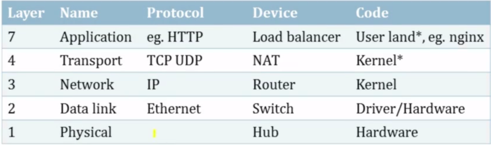
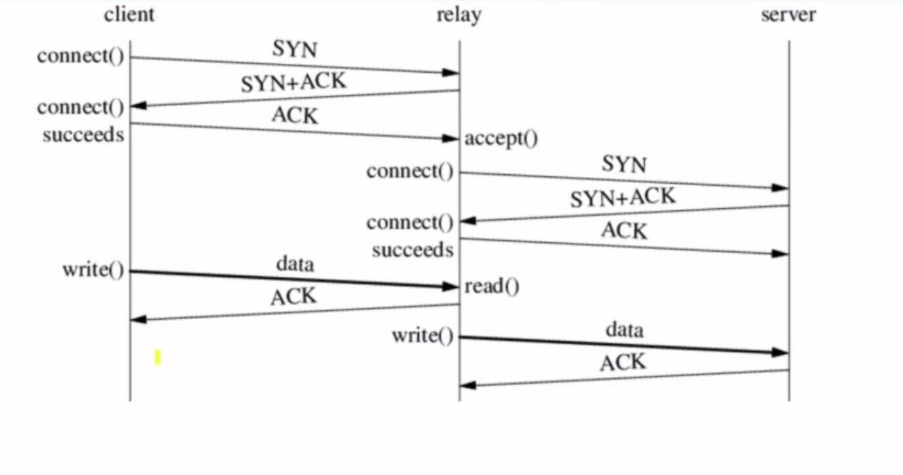
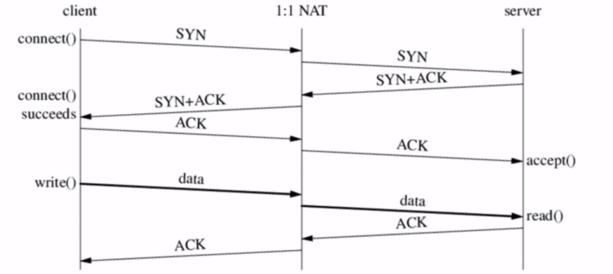
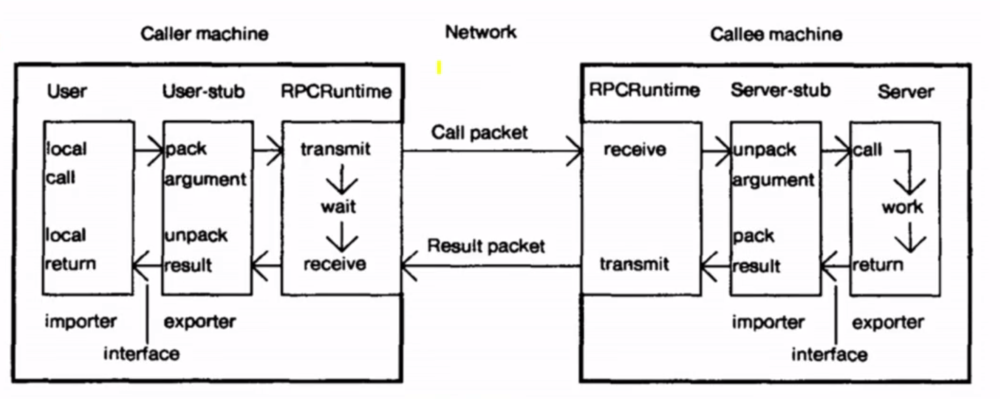
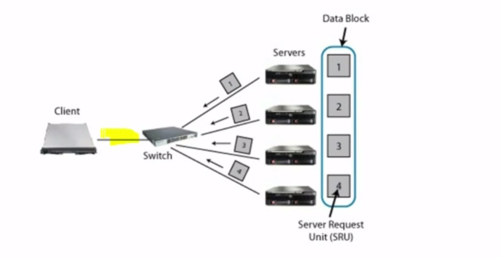

>关于网络编程的基础Socket API部分的介绍在[20170312~20170402-network-socket-api](https://github.com/xumenger/xumenger.github.crack/tree/master/20170312~20170402-network-socket-api)中已有整理，可以先参考那部分的笔记

>接下来的内容是一些网络编程在各个业务领域的具体应用的讲解

## 非阻塞式并行网络编程：监视进程状态procmon

procmon在机器上启动起来，就会一直监控进程，然后使用浏览器去查看进程的监控状态。其原理很简单：就是读/proc/pid/stat/虚拟文件系统下面的文件，获取进程的信息，然后做成HTML页面显示出来

procmon的代码详细注释参见[20170402~20170402-procmon](https://github.com/xumenger/xumenger.github.open/tree/master/20170402~20170402-procmon)

procmon是一个定制的专用HTTP服务器

在这个例子中，完全没有涉及到socket API的使用，完全都是使用网络库封装好的接口来收发数据，程序本身要做的就只是：

* 收请求数据（直接调用网络库的接口）
* 处理请求，这是应用程序的业务核心
* 根据请求，生成应答数据，这也是应用程序的业务核心
* 返回应答（直接调用网络库的接口）

## 非阻塞式并行网络编程：memcached

下面讲到的是一个简化的memcached（基于muduo），并不是真正的memcached

什么是memcached：

* 一个web的加速利器，主要用于缓存数据库查询的结果
* 恐怕是第一代的NoSQL，现在已经被其它更强大的NoSQL取代了
* 基本功能室key-value存储，只把数据放在内存中，不做持久化，所以进程一重启数据就没了

为什么要拿memcached作为网络编程的例子呢？

* 首先因为它是一个简单的基于请求-应答模式的文本协议
* 可以直接使用telnet作为客户端来进行测试
* 需要处理来自并发连接的请求（多个客户端连接），采用的是one-loop-per-thread，而不是thread-per-connection
* 不同的客户端连接会访问共享数据，因此需要进行适当的同步
* memcached是内存密集型的程序
* 这个例子的代码也就1000行，所以适合学习

memcached的基本协议：

* 存储
	* set：无条件赋值，总是成功
	* add：增加新的值，如果原来没有才成功，否则失败
	* replace：修改旧值，如果原来有才成功，否则失败
	* append：修改现有的值，把新的数据块加到原值的后面
	* prepend：修改现有的值，把新的数据块加到原值的前面
* 读取
	* get：
	* gets
* 删除
	* delete
* Compare-and-Swap

需要考虑一个问题，比如一个客户端在get，另一个客户端在delete，如果先delete后get，那么返回没有，这没啥问题；但是如果get先收到，正在将对应的数据块发回去的时候，又收到了delete请求，那么memcached到底应该继续发送还是报错，还是？

>等等其它的各种读写并发导致的问题！所以这个程序的复杂度相对也比较大一些

其运行效果大致如下



>在写一个网络库的时候，单元测试是极其重要的

这个简单的memcached例子没有实现以下功能：

* 二进制协议
* UDP传输
* 没有自己定制分配器，它用的是系统提供的malloc
* cache的替换算法没有实现，往里面存数据越来越多，没有将旧的数据丢掉以把空间腾出来
* 数据的超时没有实现
* 计数器的递增递减等命令都没有实现

**数据结构设计与分析**

memcahced本质上是一个远程的哈希表，所以首先要研究一下数据应该怎么存储！

* 最简单的方式是选择key-value
	* hash_map<string, value*>					//存指针
	* hash_map<string, unique_ptr<value>>		//no delete
	* hash_map<string, value>					//直接存值
* 减少临界区的长度：hasp_map<string, shared_ptr<value>>
* 节省内存空间：hash_set<shared_ptr<Item>>

```
struct value{
	uint32_t flags_;
	int      exptime_;
	uint64_t cas_;
	int      valueLen_;
	char*    valueData_;
};
```

>如果对方不读的话，阻塞IO的send可能就会阻塞在那里；非阻塞IO的send就不能发送指定数量的数据

引用计数可以减少临界区的使用

如果直接读memcached的代码，建议读1.2.8的版本，只有6000行：学习其中数据结构定义的技巧、算法的应用、网络编程的细节、内存优化、性能优化、锁的使用、锁的粒度讲究、引用计数的好处、并发的控制

`perf record 程序`可以在程序运行的时候记录其性能情况，然后通过`perf report`来查看函数调用时的时间分配情况……

**网络IO模型与代码解读**

>阻塞与非阻塞IO都是同步的模式

如果客户量不是很多、每个客户端交互的数据量也很大很多的话，真的建议thread-per-connection的阻塞IO方式，相对而言复杂度要低得多（其实对于报盘部分的网络编程，使用阻塞IO、thread-per-connection明显是极其适合的）

非阻塞IO在发送数据时必须要使用用户态的缓冲区，如果想要节约内存，要做一个状态机，每次发送多少，发送完成之后继续放下发，当前的状态就不能是一个局部变量了，应该是对象的某个变量，每次发完的时候继续从上次发完的地方往下发，如此程序实现起来会很复杂

关于安全的考虑：

* 如果是在内网使用的话，我们可以默认客户都是善意的，可以不用太考虑安全的问题
* 如果是在公网使用的话，那么什么样的客户都有，必须考虑恶意客户的攻击行为

>如果规划进行合理、有效的性能测试！有哪些纬度、重点测试哪些点？等等

性能测试的时候，出现性能瓶颈，至少有两种可能，测试工具本身有性能瓶颈、被测试程序的性能瓶颈，这句需要再去进行具体的分析了。另外还有机器本身的硬件限制……

`google-pprof`工具可以在程序运行的时候进行采样，然后分析具体在各个函数调用的地方的耗时情况

>认真的设计数据结构可以有效的使用内存资源；另外不同的内存管理器对于内存的利用效率也是不同的



好好研究一下Hash这种数据结构，并且认真的整理文章、编程练习

## 非阻塞式并行网络编程：数独求解器

简单介绍一下数独求解服务器：客户端发送过来81字节的数据（初始化的数独），然后服务器将初始化的数独排列好（成功或失败），然后将结果返回给客户端

在请求应答式协议的设计中，最好是请求包中保留一个字段供请求方使用，然后应答包中原样返回这个字段，这样就可以不用严格保证一请一答的顺序了，请求和应答的顺序可以乱掉，请求方根据应答中该字段的值就可以找到对应的请求！在报盘中如果交易所或者柜台可以留这样一个字段让我们随便填写，然后应答原样返回，那将很方便报盘的开发（报盘一般报单、应答都是异步的模式）

库（Library）和服务（Service）：

* 服务是跨进程边境的，因此会带来一些额外的开销
* 服务可以跨机器（只要TCP能被用来通信）
* 服务可以跨语言，只要网络协议明确了，使用任何不同的语言都可以
* 服务的开发周期、发布周期、缺陷修复都是独立的，只要接口不变，客户端服务端完全独立

**并发模型与测试工具**

目前可以使用以下的并发模式实现数独求解器：

* 单线程的事件循环模型
	* 有并发没有并行
	* 可以处理多个客户端并发连接上来
	* 但是客户端的请求在服务器上的处理是并行运行的
	* 因为只有单线程，所以不能有效使用多核
* 单线程事件循环做IO，然后用一个线程池进行计算
* 多个事件循环，每一个客户连接过来会固定的分配到某一个线程上去
* 多个事件循环，然后用一个线程池进行计算

>当服务端收到的请求过多处理不过来，服务端就会出现**过载**，以上几种不同的并发模型的表现是很不一样的。在进行网络编程的时候，需要考虑这种网络数据堆积的情况

性能、压力测试的不同方案：

* 本地测试。不涉及网络通信的部分，直接将数独求解的功能作为函数（或者库接口）的方式进行调用，测试函数本身的性能
* 批量发送。通过网络，客户端将所有需要求解的数独批量发给服务端，然后等待服务端求解后返回
* 测试服务器的最大容量。发送n个请求，只要返回来一个应答就继续加送一个请求，保证服务端一直在处理n个请求。因为考虑数据在网络上传输也是一个耗时的过程，这样就可以保证网络上一直有数据在传着，有效的利用网络带宽
* 压力测试：一直发，不去管是否收到响应
* 性能测试：还要考虑延迟的值（网络传输的延迟、服务端处理请求的延迟）

使用ping命令可以查看网络来回的延迟时间，比如下图中分别ping到[www.xumenger.com](www.xumenger.com)、[www.baidu.com](www.baidu.com)、127.0.0.1



很明显，到[www.xumenger.com](www.xumenger.com)的往返延迟要290ms左右；到[www.baidu.com](www.baidu.com)的往返延迟只要40ms左右；而如果是在本机的话，更少，只要0.1ms左右。如果再加上应用层对于请求的业务处理，也就是在服务器内部“耽误”的时间，那么延迟将会更大一些。所以延迟是分为不同的层次的：

* 客户端应用程序发送到内核缓冲区，内核缓冲区发送出去
* 网络传输数据
* 接收端内核缓冲区收到数据，服务器应用程序从内核读数据
* 服务端对请求数据进行业务处理
* 再原路返回......

[www.xumenger.com](www.xumenger.com)实际实际上是github的服务器；[www.baidu.com](www.baidu.com)实际上是百度的服务器。很显然这个延迟的量和距离的长短也有关系。想象一下下面这些场景

* 对于请求响应式的协议，如果是发送方发送一次，等到响应后再发起下一个响应，服务端处理每个请求的速度是1ms。那么访问[www.xumenger.com](www.xumenger.com)一次请求应答来回要290+1ms，访问[www.baidu.com](www.baidu.com)一次请求应答来回要40+1ms。很明显更多的时间是浪费在网络传输上
* 为了有效的提升性能，应该怎么办呢？对于[www.xumenger.com](www.xumenger.com)，每次主要的时间浪费在等待网络传输上，而且因为网络传输的路线长，很显然网络本身也没有很好的利用好。应该这样优化，因为服务端处理每个请求要花1ms，而传输的来回要140ms（如果只是发送过去的话就只要70ms），那么就采用流水线的方式：客户端发送一个请求后，等待1ms后再发送在一个请求，再隔1ms发送下一个请求......这样就能保证服务端能每隔1ms收到一个请求，又因为服务端处理一个请求要1ms，所以如此保证服务端压力没有过载的情况下，能持续每隔1ms收到数据，这样网络路程虽然长，但是能保证一直有数据在网络上传输（如此的话在发送的链路上一直有70个请求处于传输的过程中），而不是花费再等待上，明显如此可以更有效的利用网络、节省时间、提高性能

直接使用SocketAPI进行非阻塞网络编程的时候，如果要发送100Byte数据，但发送缓冲区只有50Byte，那么本次调用send的话，只会往内核态缓冲区中写入50Byte，剩下的50Byte需要程序自己控制等到下次再发；如果要用一个网络库封装SocketAPI的话，那么就不应该让应用程序考虑这种情况，所以网络库还需要自己在用户态搞一个缓冲区，当内核态缓冲区不足时，先把数据放到用户态缓冲区，所有这些由网络库自己来进行控制！

**过载保护**

假设程序架构是这样的：

* 客户端发送（客户端使用网络库，当没有真正发送出去时先缓存在网络库申请和管理的缓冲区中）
* 服务端IO线程接收数据，然后放到一块缓存中
* 服务端处理线程从缓存中取数据进行处理
* 处理完发送出去

客户端过载：假如服务端IO线程收取数据过慢，那么数据就会堆积在客户端（网络库申请和管理的用户态缓冲区）发送不出去，这种情况下受害的是客户端

服务端过载1：假如服务端IO线程收取数据很快，收到就直接丢到一块待处理缓冲区中，但是假如处理线程的性能太慢，那么数据就会堆积在服务端的待处理缓冲区中，如果请求很大，那么服务端可能就会出现内存暴增的情况

服务端过载2：服务端处理完大量的数据后，准备发送出去，但是客户端没有在接收，那么这些数据还是会堆积在服务端

>可以类比池塘的入水口的入水速度和出水口的出水速度！优化性能的重点找到是在哪一个流程处理的慢！

这是非阻塞IO本质的缺点！如果是阻塞IO下的thread-per-connection模型就不会存在这个问题。阻塞的读，读了之后阻塞的写，如果客户端不读这个响应的话，那么服务端就会阻塞在写上面，就不会去读客户端发送的数据，这样就从源头处限制了不会一直收到数据

针对这些过载情况，必须进行过载保护！尤其是针对两种服务端过载的情况！

针对以上两种情况其实瓶颈都在后面的部分，首先是想办法提升处理的性能，如果处理请求的性能达到极致了，而且发送部分因为客户端不接受实在解决不了，那么就只能在源头入口处进行控制了：在服务端实时判断当前堆积的未处理的请求数量，如果堆积过多，对于接下来的请求，直接返回“Server Too Busy”的异常应答。如此可以起到保护服务器的作用

**负载均衡**

负载均衡的一种模式是：在每个客户端内部自带一个Library，然后和所有的服务器建立连接，然后根据实际情况选择一个最不忙的服务器发起请求

负载均衡的另一种模式是反向代理：多个客户端连接到负载均衡服务器上，负载均衡服务器连接到多个服务端，所有客户端都向负载均衡服务器发起请求，负载均衡服务器收到请求后，再去选择一个最不忙的服务器把请求交给它来处理，然后以同样的路径返回应答

不管是哪种负载均衡模式，请求和应答数据都要经过负载均衡器

上面两种是最基础的两种，基于这两种可以有更多变换，实现更复杂的请求，比如多个客户端连接到第一层的一个负载均衡器，第一层的负载均衡器再连接到第二层的负载均衡器，第二层负载均衡器再真正将请求分配到处理服务器。这就是典型的计算机领域通过加一层来解决大多数问题的思想

>这里只是简单的讲解负载均衡，其实要深入钻研负载均衡会有很多值得挖掘的内容

负载均衡服务器大致还可以划分为：

* 连接级别的负载均衡（传输层）：完全不关心协议本身，只是客户端的连接，然后选择目前连接数最少的服务端发起连接
* 请求级别的负载均衡（应用层）：需要知道应用程序的协议，才能分出请求。然后根据请求的负载情况，找到最空闲的服务端，将请求发给这个服务端

第二种方式更好一些，因为使用连接级别的话可能很不均衡，因为有些连接请求很繁忙，但是有些连接可能根本就没有任何请求！

**如何把一个程序产品化**

将一个产品完善、产品化，以下的几个点很重要

* 心跳很重要，有了心跳协议可以很容易做到容错和升级重启
	* 升级重启的情况下，先不关闭服务端程序
	* 而是先让服务端不再发心跳给客户端
	* 客户端判断长时间收不到就认为服务端死了，那么就不会再给服务端发请求
	* 等到服务端的流量将为0之后，就可以重启服务端，保证客户端请求不会丢失！
* 监控，服务端程序的CPU占用、内存占用、等运行情况通过接口的方式支持从外部对其进行监控
	* 有了监控之后，可以支持在监控到服务端有异常的情况下报警

## 非阻塞式并行网络编程：广播与聊天程序

设计一个羽毛球记分系统。用户态用TCP协议向多个客户端进行广播

说到广播，很多人都想到的是IP广播，IP广播是有一个特殊的、保留的地址段，加入这个地址段后，就可以收到IP的一对多的数据发送，IP广播只对UDP有效。但是在用户层可以编写应用程序实现TCP广播

pub/sub：发布/订阅模式

凡是消息订阅型的都有一个基本问题：如果有的接收端比较慢怎么样？比如聊天服务器，收到数据后会发给多个客户端，但是假如其中有客户端收的很慢（网络传输问题，或者接收端程序编写的bug），或者故意不收，那么数据会堆积在服务器的内存中（这里指的是非阻塞IO使用网络库的情况，网络库会把数据缓存在服务端的用户态发送缓冲区中）

上面的问题，对于echo服务器，那么就比较简单，因为收发就一个连接，假如客户端接收慢，那么服务端的应对方法很简单：服务器发现客户端收的慢导致自己发的慢，那么服务端针对这个客户端收它的数据也慢，导致客户端也发不过来数据，直到客户端将数据收完服务端才去对应收客户端的数据。但是针对聊天服务器不能这样，假如1个人说，剩下10个人收，假如收数据的10个人中有一个慢就导致不收那一个发送人的数据，就很容易导致拒绝服务攻击，比如故意挂一个不收数据的客户端上去就会导致其他的客户端也受到影响，所以这种解决方案不好！

那么要怎么解决这个问题呢？这就完全取决于业务的场景：

* 可以在协议上做一些改动，让接收端告诉你已经收了多少了，把后续的数据合成一个再发
* 或者想办法把发不出去的数据先写到磁盘中，保证不占用服务器内存
* 实在太慢了，就直接把它踢掉！

>凡是涉及到一对多的发送，就必须考虑这个问题，假如有一个人收的慢，那么想要发送的数据应该往哪里存？

>有些网络方面存在的固有问题，最好是想办法在业务层面如何设计以保证可以规避这些问题！

## 非阻塞式并行网络编程：SOCKS代理服务器

>整个课程中最深入的实例

* 在讲代理服务器之前，先讲一个简单的功能类似的实现，TCP中继-TCP relay
* 讲解代理服务器
* 除了用户态的网络编程之外，能不能直接从TCP协议本身上实现一个功能类似但性能更高的版本
* TCP是可靠的协议，但是TCP的可靠性到底指的是什么？这部分最重要！
* muduo在C++11、14、17中的变化

**TCP relay介绍**

TCP relay是一个服务器，在某个端口侦听，客户端每向TCP relay发起一个连接，它就连接到服务器，等到这两个连接建立好之后，TCP relay就在两个连接之间搬运数据：客户端发数据给TCP relay，TCP relay再发给服务器，服务器发送数据给TCP relay，TCP relay再把数据发回给客户端

两个连接的网络带宽有很大的差别的场景，是TCP relay需要特别注意去处理的情况

>想想上交所协议回购的EzDataAccess、深交所的网关不就是类似的东西吗

给一个简单的实现逻辑：

* 建立一个TCP服务器
	* 创建socket、绑定端口、监听端口
	* 等待接收客户端连接
* 收到客户端的连接后，对应创建一个socket去和服务端建立连接
* 针对每个客户端连接创建两个线程
	* 一个线程是把ServerSocket的数据往ClientSocket发送
	* 另一个线程是把ClientSocket的数据往ServerSocket发送
* 注意因为其中使用的是阻塞式IO，所以使用两个线程进行双向的搬运
	* 也因为其是使用阻塞式IO，所以如果目标的连接接收数据慢，导致send阻塞的话
	* 那么从源Socket读数据也会变慢
	* 这样就不会存在数据在TCP relay中堆积的问题发生
	* 所以使用阻塞IO就自然解决了双方带宽不匹配的问题
	* 很显然，非阻塞式IO就难的多了

**TCP半关连接**

TCP是一个双向连接的协议：发送和接收。当然必要的时候可以只发送不接收，或者直接收不发送，这种情况就叫做半关连接

半关连接的情况本身比较少见

**非阻塞TCP relay实现**

上面讲到过使用阻塞式IO实现TCP relay可以自然的解决网络带宽不匹配的问题

使用非阻塞IO的话，如果不考虑内存消耗问题、带宽不匹配问题，那么很简单。有两个连接：

* 在ServerSocket的OnMsg CallBack中，收数据，调用ClientSocket的Send把收到的数据发出去
* 在ClientSocket的OnMsg CallBack中，收数据，调用ServerSocket的Send把收到的数据发出去
* 而且不需要使用两个线程，因为非阻塞IO是基于事件的

但是难就难在如果出现带宽不匹配的情况，怎么办？比如ClientSocket上来了很多数据，一直触发ClientSocket的OnMsg，然后发送给ServerSocket却很慢，导致一直发送不出去。如果是使用muduo这个网络库的话，它会尽量发送，如果确实发送不了的话，也不会像原始的Socket API那样返回，而是把数据缓存在用户态缓冲区，等到有机会的时候再发，因此就可能会导致用户态内存一直上涨

怎么样正确处理这种情况呢？如果内存中堆积的数据太多（比如是因为ClientSocket收的太快，ServerSocket发的太慢导致的），那么就主动不去读ClientSocket内核接收缓冲区中的数据。然后通过网络库提供的当把数据发送完之后的回调函数通知ServerSocket把堆积的数据都发送完了，在收到这个回调以后，再继续接收ClientSocket的数据。如此可以保证TCP relay不至于堆积太多的数据导致内存暴增

很显然，相对于阻塞式IO，非阻塞式IO的控制复杂度要高很多

**竞态条件及修复**

单线程使用非阻塞IO事件驱动方式开发的程序也可能会出现程序卡住的现象！

上面的TCP relay程序可能会出现卡死的现象。原因如下：

* Event Loop（事件循环）有两个连接，两个连接上同时发生了事件
* 第一个事件：ClientSocket是可读的，然后调用ServerSocket的Send
	* 但ServerSocket数据发不出去，出现了堆积，那么就把控制内存数据堆积的函数回调
	* 实际上是延迟回调，先把该回调放入Queue，等到事件处理完了再来处理回调
	* 为了防止在调用SendInLoop的时候调用用户回调，但用户回调内部又调用SendInLoop
	* 这样就导致SendInLoop重入了！
* 第二个事件：ServerSocket可写，然后调用ServerSocket的Send发送数据
	* 发送完成后去调用WriteComplete回调
	* 但是因为WriteComplete还没有注册
	* 因为其是在控制内存数据堆积的回调函数中注册的，而该回调放到Queue中还没有被执行
	* 所以WriteComplete也没有办法被回调
* 处理完事件后，放入Queue的控制内存数据堆积回调被调用
	* 然后在该回调函数中停止读，并且注册WriteComplete回调
	* 但是这时候WriteComplete回调就永远无法被调用到了，因为上面错过了回调的机会
	* 此时就进入了一个类似于死锁的状态

>Linux上的事件机制、Windows上的消息机制，其导致函数调用的时机、逻辑和顺序执行有一些不同，所以要换一种思维去理解这种机制！

**SOCKS4和SOCK4sa**

SOCKS4：在客户端可以指定连接到哪个IP、端口

SOCKS4a除了可以指定连接到哪个IP、端口，还可以指定HostName（主机名称）。这样的话，SOCKS4a的服务器就需要代理客户端进行一次DNS的地址解析

>使用阻塞IO，一般是配合多线程，上下文交换主要是由操作系统来实现（线程切换、线程状态的保存等）；但是使用事件驱动的非阻塞IO的话，上下文交换和上下文状态的保存就不是操作系统能帮你做的了，而应该是应用程序自己实现

>TCP状态机必须深入的研究！

**事件驱动与多线程的取舍**

>这是一个长达20年的争论

https://blog.acolyer.org/2014/12/09/why-threads-are-a-bad-idea/

https://blog.acolyer.org/2014/12/10/why-events-are-a-bad-idea/

陈硕的建议：

* 如果能用阻塞IO多线程模式解决的就用阻塞IO多线程模式
* 如果需要用事件你就用
* 如果能用阻塞IO多线程能满足的需求，那么就建议使用这种方式，除非有强烈的阻塞IO多线程不能满足的需求必须用事件驱动来做
* 非阻塞IO、事件驱动方式的复杂度要高的多

最早出现事件驱动模型的时候，是为了解决当时的操作系统没有用户态线程，以保证单线程可以处理多个IO（主要是网络IO），所以选择使用了事件驱动的方式

网络层次结构



普通的TCP relay的TCP协议与SocketAPI详解



TCP relay当然还有一些特殊的实现方式



**正确理解TCP的可靠性**

TCP是面向连接的、可靠的、字节流协议；UDP是无连接的、不可靠的、数据报协议

那TCP的可靠到底指的是什么？

当应用程序调用send之后，怎么判断对方是否连接成功？答案很明确！就是要应用层发送一个确认，因为TCP的ACK表示对方的协议栈收到了你发送的数据，但是不代表对方的医应用程序收到并处理了你发的消息，对方的应用程序可能死锁或者阻塞，不会去调用recv，那么你发送的数据就堆积在对方协议栈的接收缓冲区中了。很简单，用网络的层次来看，TCP是传输层的协议，它无法控制应用层的处理

举一个实际的例子，你调用`send(sockfd, "hello", 5)`发送数据，并且返回值为5，那么表示什么意思呢？

* 这只是表示本机协议栈的发送缓冲区拿到你的数据了
* 数据只是在本机的缓冲区中，还没有向网络上发送
* 当然可能也没有到达对方的协议栈接收缓冲区
* 当然就更有可能是对方的应用程序没有调用recv接收到数据

就算是收到了数据，也不能保证是原始发送的数据，为什么呢？不是说TCP是可靠的吗？TCP的可靠性指的是：不重、不漏、不乱序，但没有说不会被修改！所以在应用层协议上一定要加一个应用层的校验和！

还有一种可能，你连接上服务器，但是对方还没有调用accept，这时候你就发送了数据，这些数据就会堆积在对方的操作系统缓冲区中，如果服务器调用accept开始去读，那么就是读到操作系统接收缓冲区中的数据。但是如果它accept不成功的话（比如操作系统的文件描述符使用完了），那么就连读的机会都没有！这种情况对于客户端而言，连接已经建立了，数据也已经发过去了，ACK也拿到了，但是服务器没有机会去读它

还有另外一种可能，程序使用非阻塞IO模式，调用send但是没有判断返回值，就一直发送，结果其实本机的协议栈发送缓冲区早就满了，虽然调用send，但是返回值表示没有发送成功，你还以为是TCP出现丢包了呢（这也是我最近使用非阻塞IO模式开发犯的一个大错误，2017-03）

所以TCP的可靠性是有前提条件的，它只能保证在传输层是可靠的，在应用层完全不能保证

有一种天真的写法：建立连接-->发送数据-->断开连接，然后就以为数据被TCP正确的发送过去了。在本地测试的话，因为测试环境的两台机器通常是在接在一个交换机上，连路由都不会经过，那数据也不会出现被修改的情况（因为如果数据被修改，那么交换机上接的两个以太网卡的CRC会检查出这个错误）；但是拿到生产环境，拿到公网，拿到复杂的网络环境下，基本每次都会出现问题

编写可靠的网络服务（分布式系统）的基本思考点：

* 在分布式系统中，网络出故障、对方的程序出故障是分不出来的
* 必须怀疑这个观点：网络是可靠的，并且在编程的时候总是要认为网络是不可靠的
* 更多的经验积累

## 使用多台机器并行处理数据：N皇后问题

关于N皇后问题，首先推荐：[《回溯法解决N皇后问题（以四皇后为例）》](http://www.xumenger.com/backtracking-four-queue/)

另外建议去阅读一下知乎的问答：[《Linux C++ 服务器端这条线怎么走？一年半能做出什么？》](https://www.zhihu.com/question/22608820)

多种实现方案：

* 单机单线程实现
* 单机多线程实现，争取达到线程加速比（以CPU核数计）
* 多机多线程
* 思考：假如多台机器的CPU配置有差别，应该采用何种负载均衡策略，以求缩短求解问题的时间

>计算机科学中，算法与数据结构还是核心学科啊！自然科学中，数学还是核心领域啊！

**RPC简介与接口定义**

RPC：Remote Procedure Call，远端过程调用



RPC的基本原理如下：

* 调用方（User客户程序）发起本地调用
* User-Stub将本地调用的参数打包成一个消息
* RPC负责把消息发送出去，变成一个网络包
* 被调用方的RPC会收到消息
* Server-Stub会把报文解析成为函数的参数
* 然后再去调用实际函数
* 将函数返回结果
* 剩下的就是将函数结果按照相反的方向原路返回

RPC方式是构建分布式系统的基础

## 使用多台机器并行处理数据：多机求解中位数

多台机器上分别有大量的数据，怎么求出分布在多台机器上所有数据的平均数、中位数

一个客户端向多个Server发起请求，然后可能出现所有的Server同时响应的情况，在往外发的时候没有拥塞，但是多个服务端同时往回发的时候，在下面图中标黄的链路上可能出现拥塞，可能是客户端的网卡来不及收数据导致出现丢包，导致服务器必须重传来解决这个问题



## 使用多台机器并行处理数据：多机找出最频繁出现的数据项

>什么是Map-Reduce？怎么应用？

分布式系统值得好好研究！

## 课程总结

推荐书籍：《Unix高级环境编程》、《Unix网络编程》、《TCP/IP详解》

[tcpipv2.org](tcpipv2.org)

配合[20170312~20170402-network-socket-api](https://github.com/xumenger/xumenger.github.crack/tree/master/20170312~20170402-network-socket-api)，将这个课程全都学习完了，但是其中实践的部分都只是跟着视频过一遍，没有跟着动手做，后续对于网络编程更多的是去自己进行大量的实际开发、总结归纳

>网络编程是典型的易学难精的学科！

>网络编程只是手段，不是目的，重点的是业务逻辑的处理！


