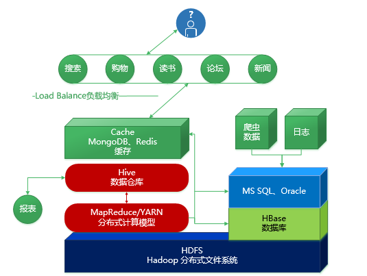
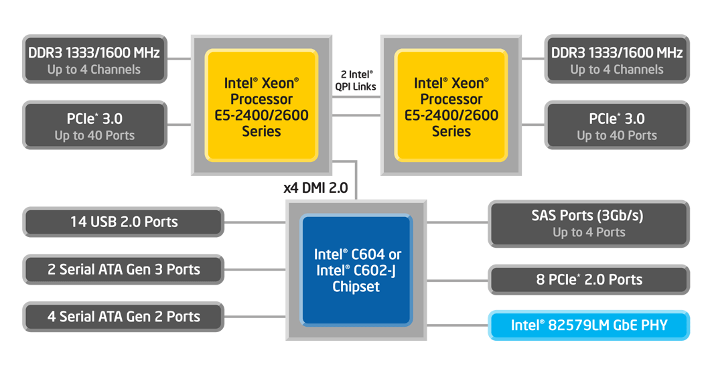
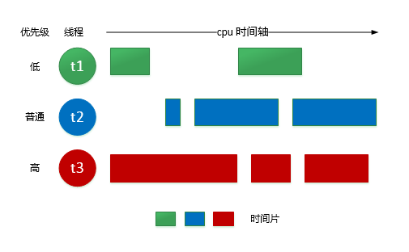
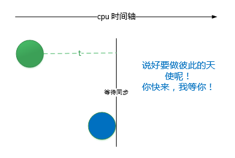
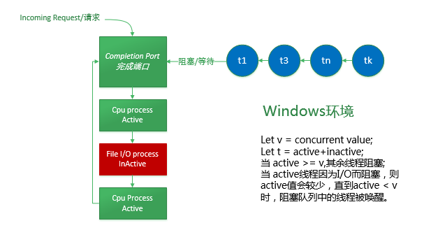
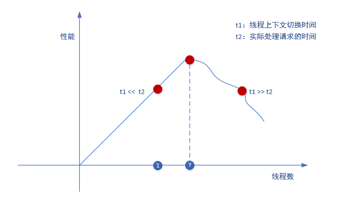
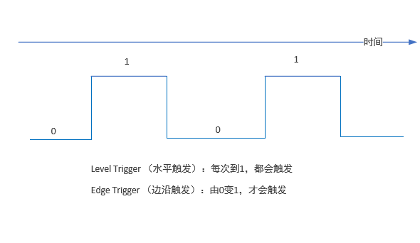
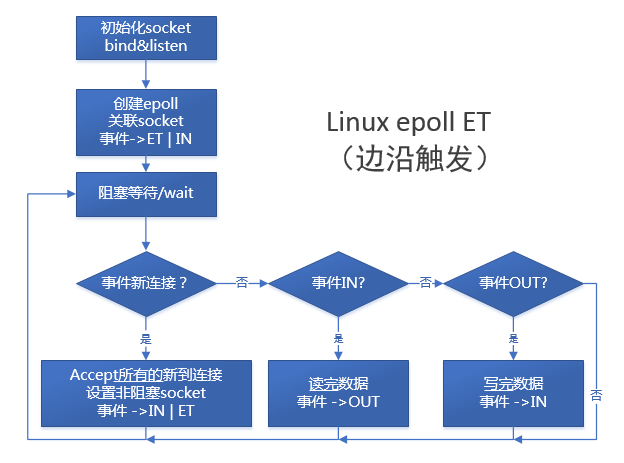

>转载[《高性能服务端漫谈》](http://www.cnblogs.com/foreach-break/p/4476001.html)

## 背景

进入多核时代已经很久了，大数据概念也吵得沸沸扬扬，不管你喜欢不喜欢，不管你遇到没遇到，big-data或bigger-data都必须正视

处理大数据，基本都离不开分布式计算和分布式存储，这其中以hadoop最为使用广泛和经典



分布式系统，就离不开计算系统、网络系统、文件系统和数据库系统

这么多系统，之间又是如何协作的呢？通讯过程又是如何保证高性能的呢？

### 单处理器

在以前的单核CPU下，我们要实现文件IO、网络IO，可以妥妥地使用单线程循环处理任务。但如果想“同时”做点其他事情，就得多开线程，比如：在下载远程文件的同时显示下载进度

### 多线程

我们会用主线程a来更新界面元素，这里是更新下载进度条，同时用一个额外的线程b去下载远程文件

### 阻塞

当需要下载的时候，我们必须使a阻塞，否则，我们的下载线程b将无法获得CPU时间。而当需要更新界面时，我们必须使b阻塞，原也是为了获得CPU时间

>阻塞：是一个线程进入阻塞或等待的状态，释放它所占用的CPU时间

阻塞的原因，是因为任何操作，无论是更新界面还是下载文件（网络IO和磁盘IO），都会转化成一条一条CPU可以执行的指令，而这些指令的读取、执行都是需要消耗CPU的时钟周期

事实上，我们可以使用类似`wait、await、sleep、read、write`等操作使当前调用的线程进入阻塞。显然，阻塞的目的是：

* 当前有更重要的事情要交给别的线程来做
* 调用线程可能面临一个长时间的IO操作，占据CPU时间显然是一种浪费
* 同步需求

虽然用户看起来是下载文件和更新界面“同时”运行，但实际上，任何一个时刻，在单核心CPU环境下，都只有一个线程会真正的运行，所以多线程之间是“并发”而不是真正的“并行”

### 多处理器

单核心时代早已过去，多核、多处理器无论在企业级服务器还是家用桌面电脑、平板和智能手机上都已经是主流



如果多处理器的核心是真实的而非虚拟化的，那么多线程就可以这真正的并行



可以看到，t1、t2、t3的运行时间可以出现重叠

但实际上，操作中运行的进程远不止几个，那么相应的线程数会远大于CPU的核心数，所以即使图中假设是4核心处理器，那么真正能同时执行的线程也只有4个，所以也会出现运行的中断，即阻塞

## 高性能通讯

在了解了多核、多处理器、多线程、阻塞的概念后，我们来看看通讯，显然，任何一个通讯框架都试图追求高性能、高吞吐、高TPS能力

但是，任何一个来自用户或其他服务器的请求都不可能只是要求一个简单的echo返回，所以请求执行的任务几乎都会包含：

* 计算，比如MapReduce、SQL、坐标计算等
* IO访问数据库、磁盘、缓存、内存或其他设备

站在用户的角度，总是希望自己的请求会被优先、快速的响应，而站在服务器的角度，总是希望所有的请求同时能够被处理

### 同步/异步

同步的意思如字面一般简单，同步就是多个对象的步调一致，这种步调是一种约定

* 比如，时间上约定10点同时到达，先到达的就会等待
* 比如，逻辑上约定必须取得结果，调用才能返回
* 比如，资源上约定read和write不可同时进行，但read之间可以同时执行

下面的图显示了时间上的同步约定



而异步，就是步调无须一致。异步，就是多个对象之间的行为无须遵守显式或隐式的约定：

* 比如，老婆没到，你也可以进场看电影
* 比如，可以不必等结果真正出现，就立即返回
* 比如，read和read之间可以乱序访问文件或资源

### 同步与阻塞的关系

服务器的能力是有限的，为了能够满足所有用户的请求，服务器必须能够进行高并发的处理。这一点可以通过两种方式达到：

* 单线程+异步IO（node.js）
	* 多线程的建立时需要开销的
	* 线程数越多，线程上下文的切换就会越频繁
	* 而异步IO在理想情况下是不会阻塞的
	* 调用完毕即返回
	* 通过回调callback或事件通知来处理结果
* 多线程+同步或异步IO（nginx）
	* 单线程的一个缺点就是无法充分利用多处理器的并行能力
	* 同时异步IO不是在任何情况下都是真正异步的
	* 比如文件在缓存中（通过映射到内存）、文件压缩、扩展、缓冲区拷贝等操作
	* 会使得异步IO被操作系统偷偷地转换为同步

>假如文件已经在缓存中，使用同步IO的结果会更快

这里你可能会疑惑，同步看起来很像“阻塞”，但自己看本篇中对它们的说明，你就会发现：

* 阻塞是调用线程的一种状态和行为，它的作用是放弃占用CPU
* 同步是多个线程之间的协调机制，它的作用是为了保证操作的顺序是正确可预期的

同步可以使用阻塞来实现，也可以使用非阻塞来实现

而有的情况下，因为同步是不得已的行为，所以要hold住一个来自其他服务器的session，以防止立即返回后的上下文失效，我们往往会这样

```
//还没有结果
bool haveResponse = false;

//调用异步IO，从远程数据库执行SQL，并返回结果
rpc.callAsync(database, sql,
    function(resp){
        response = resp;
        haveResponse = true;
    })

//通过循环阻塞来hold住这个线程的上下文和session
while(!response){
	//这里将阻塞100ms
	if(!response){
        await(100);
    }else{
        break;
    }
}

//通过请求的session返回结果
httpContext.currentSession.Respond(respond);
```

这是一种`多线程+异步`转为`多线程+同步`的方式，因为Web应用服务器处理session时采用的往往是线程池技术，而我们又没有服务器推（server push）或者用户的调用请求一直在等待结果，所以，即使访问数据库采用的是异步IO，也不得不通过这种方式来变成同步

与其如此，还不如

```
//调用同步IO，从远程数据库执行sql，并返回结果
//调用时，此线程阻塞
response = rpc.callSync(database, sql);

//通过请求的session返回结果
httpContext.currentSession.Response(response);
```

上面的代码，使用了简单的同步IO模型，因为一般的访问数据库操作是很费时的操作，所以处理当前session的线程符合被阻塞的目的，那么同步调用就被实现为阻塞的方式

事实上，从用户的角度来说，用户发出请求后总是期待会返回一个确定的结果，无论服务端如何处理用户的请求，都必须将结果返回给用户，所以采用异步IO虽然是最理想的状态，但必须考虑整个应用的设计，即使你这里使用了异步，别的地方也可能需要同步，如果这种“额外”同步的设计复杂性远高于使用异步带来的好处，那么请考虑“同步/阻塞式”设计

>如果业务逻辑上，要求依赖性调用，比如DAG，那么同步也是必须的

## IOCP和epoll

### IOCP（完成端口）

windows提供了高效的异步IO线程模型：完成端口



完成端口可以关联很多的文件句柄（这里的文件是广义的，文件、socket、或者命名管道都可以是），到一个完成端口上，称为`关联完成端口的引用`，这些引用都必须支持（Overlapped IO，重叠式IO）

重叠式IO是异步IO的基石，通过进行重叠IO，可以让调用IO操作的线程与IO操作线程并行执行而无须阻塞



多线程虽然可以充分发挥多处理器的并行优势，但却不是银弹

>当线程数增加，可“同时”处理的请求量上去了，这样吞吐量会很高，但可用于每个用户请求的时间变少，每个用户请求的响应时间随之下降，最后吞吐率下降

>同时，线程的启动和销毁是有开销的，虽然可以通过线程池（ThreadPool）来预先分配一定量的活动线程，但线程越多，其上下文切换的次数就越频繁

>考虑一种情况：当线程的栈很大而线程被阻塞的时间很长，操作系统可能会将线程的堆栈信息置换到硬盘上以节约内存给其他线程使用，这增加了磁盘IO，而磁盘IO的速度是很慢的

>而且，线程的频繁切换也会降低指令和数据的locality（局部性），CPU的缓存命中率会下降，这又加剧了性能的下降

完成端口的设计目标是：

* 任一给定时刻，对于任一处理器，都有一个活动线程可用
* 控制活动线程的数量，尽量减少线程上下文的切换

可以看出，IOCP主要是针对线程模型的优化

创建完成端口时，需要指定一个`Concurrent Value = c`的值，来指示：

>当活动线程的数量`v >= c`，就将其他关联在完成端口上的线程阻塞，直到活动线程的数量`v < c`

>当一个活动线程进行IO时，会阻塞，活动线程数量`v`就会下降

>这一点是IOCP的精髓

完成端口的原理是：

>在创建了完成端口后，将socket关联到这个端口上，一旦socket上的IO操作完成，操作系统的IO管理模块会发送一个通知（Notification）给完成端口，并将IO操作的完成结果（completion packet）送入完成端口的等待队列`WQ`，这个队列的顺序是先入先出

>也就是说，调用线程可不必等待socket的IO操作完成，就立即返回做其他的事情

>而当活动线程的数量下降，小于指定的并发约束（concurrent value）时，操作系统将会唤醒最近加入阻塞队列`BQ`的线程，让它从完成包的等待队列中取出一个最老的IO结果进行处理。这里可以看出，`BQ`的顺序是后入先出

IOCP所谓的异步是：

>与完成端口关联的文件（file、socket、named pipeline）句柄上的IO操作是异步的。调用线程只负责将socket IO丢给完成端口，然后就可以做其它事，而无需向同步那样等待

但是，如果一个调用线程在处理这个从完成队列取出的数据后，又在当前线程进行了其他IO操作，比如读取文件、访问数据库，那么这个调用线程同样会阻塞，但不是阻塞到完成端口的队列上

这一点，对数据的处理就涉及不同的业务逻辑需求，IO线程是否应该与逻辑线程分开，分开后，逻辑线程应该是如何控制数量，如果分开，就要求在拿到数据后，要么另起线程处理数据，要么将数据扔进线程池。无论是哪种方式，都会增加线程上下文切换的次数，反过来影响IOCP的可用资源

>所以，要从应用的实际需求出发，来总体控制整个服务器的并发线程数，否则，无论多么高效的通讯模型，都会被业务模型（往往需要对文件或数据库的访问）所拖累，那么整个应用的性能就会下降

### epoll

linux上的高效IO模型则是epoll

epoll是对select/poll模型的一种改进

* 既然是对select/poll的改进，就是一种IO多路复用模型
* 支持的文件（同样是广义）描述符`fileDescriptor`巨大，具体多大与内存大小直接相关
* wait调用在活跃socket数目较少时，可高效返回

>在传统的select/poll模型中，内核会遍历所有的fileDescriptor（这里只说socket），而不管socket是否活跃，这样，随着socket数据的增加，性能会很快下降

>而epoll模型，采用了向内核中断处理注册回调的方式，当某个socket上的IO就绪，中断就会发出，接着就会将这个结果推入一个`就绪队列Q`中，Q采用单链表实现，所以扩展性是天生的

>同时，由于采用了适宜频繁写的平衡树-红黑树的结构来存储fileDescriptors，所以当需要向fileDescriptors中加入、删除、查找socket时，会非常高效，另外还有一层内核级页高速缓存

>最后，由于活动的socket比较少时，IO就绪的中断次数相应减少，所以`就绪队列Q`中插入数据的次数相应减少，当`wait`操作被调用时，内核会考察Q，如果不空就立即返回，同时通过内存映射来讲就绪的IO数据从内核态拷贝到用户态，达到少而快的效果

epoll的主要接口调用如下：

```
//创建可保证size个效率epoll，返回epfd
int epoll_create(int size);

//设置应当注册的事件类型IN/OUT/EL/LT，并设置用于返回事件通知的events
int epoll_ctl(int epfd, int op, int fd, struct epoll_event *event);

//epoll进入阻塞，events用于设置返回事件通知的events
int epoll_wait(int epfd, struct epoll_event *events, int masevents, int timeout);
```

**边沿触发（ET）**



考虑上面的图，随着时间的增加，高低电平交替变化

>所谓边沿触发，就是当前达到边沿（一个临界条件）时触发，如同0到1

>epoll中的边沿触发，是指当IO就绪，中断到达时，执行对应的回调，将结果推入`等待队列Q`中，之后便不再关心这个结果

>这样导致的结果是，当`wait`调用返回时，如果对应的事件没有被处理完，比如读操作没有将buffer中的数据读完，就返回，那么就没有机会再处理剩余的数据

**水平触发（LT）**

所谓的水平触发，就是每到上边沿时就触发，比如每次到1

>epoll中的边沿触发，是指当IO就绪，中断到达时，执行对应的回调，将结果推入`等待队列Q`中，当队列被清空后，再次将结果推入队列

这样的结果是，当`wait`调用返回时，如果对应的时间没有处理完，比如写数据，写了一部分，就返回，也会在下次`wait`中收到通知，从而得以继续处理剩余数据

水平触发流程简单稳定，需要考虑的事情少，且支持阻塞/非阻塞的Socket IO。而边沿触发，在大并发情况下，更加高效，因为通知只发一次，但只支持非阻塞的Socket IO

下图是ET方式的epoll简略流程


