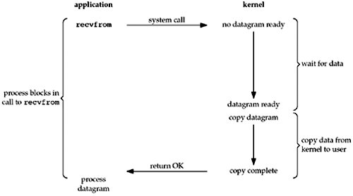
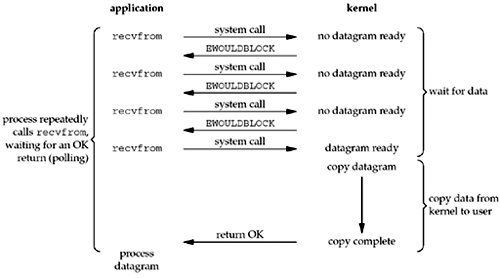
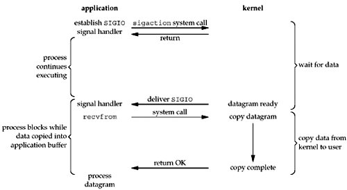
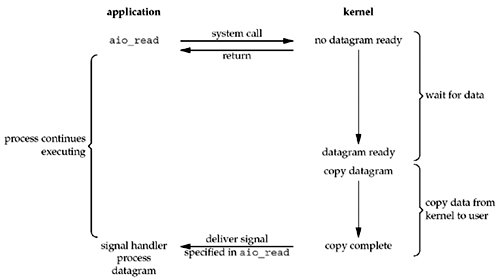
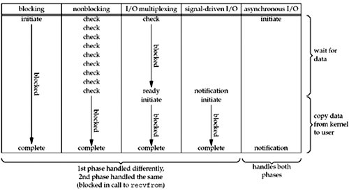

>转载[《再谈select, iocp, epoll,kqueue及各种I/O复用机制》](http://blog.csdn.net/shallwake/article/details/5265287)

## blocking IO

这个就不需要多解释了，阻塞套接字，下图是它调用过程的图示

重点解释一下上面的图

* 首先Application调用recvfrom()转入kernel
* 注意kernel有2个过程，wait for data 和copy data from kernel to user
* 直到最后copy complete后，recvfrom才返回
* 此过程一直是阻塞的

## nonblocking IO

与blocking IO对立的，非阻塞套接字，调用过程如下

可以看见，如果直接操作它，那就是个轮询......直到内核缓冲区有数据

## IO multiplexing（select and poll）

最常见的IO复用模型，select

select先阻塞，有活动套接字才返回，与blocking IO相比，select会有两次系统调用，但select能处理多个套接字

## signal driven IO（SIGIO）

只有UNIX系统支持

与IO multiplexing（select and poll）相比，它的优势是，免去了select的阻塞和轮询，当有活跃套接字时，由注册的handle处理

## asynchronous IO（the POSIX aio_functions）

很少有\*nix系统支持，Windows的IOCP则是此模型

完全异步的IO复用机制，因为纵观上面其他四种模型，至少都会在由kernel copy data to application时阻塞，而该模型是当copy完成后才通知application，可见是纯异步的。好像只有windows的完成端口是这个模型，效率也很出色

## 五种模型的比较

可以看出，越往后，阻塞越少，理论上效率也是最优

五种模型的比较很清楚，剩下的就是把select、epoll、iocp、kqueue对号入座

select对应第三种模型；iocp对应第五种模型。那么epoll与kqueue呢？其实也与select属于同一种模型，只是更高级一些，可以看做有了第四种模型的某些特性，如callback机制

**那么，为什么epoll、kqueue比select高级？**

答案是，它们无轮询。因为它们用callback取代了。想想看，当套接字比较多的时候，每次select()都要通过遍历FD_SETSIZE个Socket来完成调度，不管哪个Socket是活跃的，都遍历一遍。这会浪费很多CPU时间，如果能给套接字注册某个回调函数，当它们活跃时，自动完成相关操作，那就避免了轮询，这正是epoll与kqueue做的

**windows or \*nix（IOCP or kqueue/epoll）？**

诚然，Windows的IOCP非常出色，目前很少有支持asynchronous IO的系统，但是由于其系统本身局限性，大型服务器还是在Unix下。而且正如上面所述，kqueue/epoll与IOCP相比，就是多了一层内核Copy数据到应用程序的阻塞，从而不能算作asynchronous IO类。但是这层小小的阻塞无足轻重，kqueue与epoll已经做得很优秀了

**提供一致的接口，IO Design Patterns**

实际上，不管是哪种模型，都可以抽象一层出来，提供一致的接口，广为人知的有ACE、Libevent这些，他们都是跨平台的，而且他们自动选择最优的IO复用机制，用户只需调用接口即可

说到这里又得说说2个设计模式，Reactor和Proactor。有一篇经典文章[http://www.artima.com/articles/io_design_patterns.html](http://www.artima.com/articles/io_design_patterns.html)值得阅读

Libevent是Reactor模型，ACE是Proactor模型，实际都是对各种IO复用机制的封装
