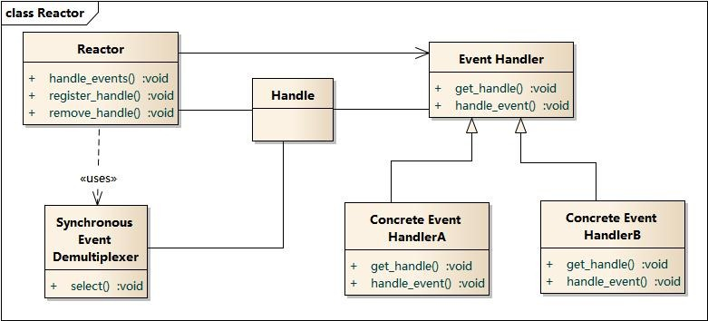
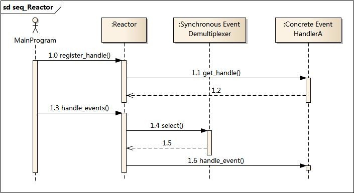

>[《IO设计模式：Reactor和Proactor对比》](http://www.cnblogs.com/me115/p/4452801.html)

平时接触的开源产品如Redis、ACE，事件模型都使用Reactor模式；而同样做事件处理的Proactor，由于操作系统的原因，相关的开源产品也少。这里学习一下其模型结构，重点对比下两者的异同点

## 反应器Reactor

Reactor包含如下角色：

* Handle句柄：用来标识Socket连接或是打开文件
* Synchronous Event Demultiplexer：同步事件多路分解器。由操作系统内核实现的一个函数；用于阻塞等待发生在句柄集合上的一个或多个事件（如select/epoll）
* Event Handler：事件处理接口
* Concrete Event HandlerA：实现应用程序所提供的特定事件处理逻辑
* Reactor：反应器，定义一个接口，实现以下功能：
	* 供应用程序注册和删除关注的事件句柄
	* 运行事件循环
	* 有就绪事件到来时，分发事件到之前注册的回调函数上处理

反应器名字中“反应”的由来：“反应”即“倒置”、“控制逆转”，具体事件处理程序不调用反应器，而是由反应器分配一个具体事件处理程序，具体事件处理程序对某个指定的事件发生做出反应；这种控制逆转又称为“好莱坞法则”（不要调用我，让我来调用你）

**业务流程及时序图**

* 应用程序启动，将关注的事件Handle注册到Reactor中
* 调用Reactor，进入无限事件循环，等待注册的事件到来
* 事件到来，select返回，Reactor将事件分发到之前注册的回调函数中处理

## 主动器Proactor

Proactor主动器模式包含如下角色：

* Handle句柄：用来标识Socket连接或是打开文件
* Asynchronous Operation Processor：异步操作处理器，负责执行异步操作，一般由操作系统内核实现
* Asynchronous Operation：异步操作
* Completion Event Queue：完成事件队列，异步操作完成的结果放入队列中等待后续使用
* Proactor：主动器，为应用程序进程提供事件循环，从完成事件队列中取出异步操作的结果，分发调用相应的后续处理逻辑
* Completion Handler：完成事件接口，一般是由回调函数组成的接口
* Concerte Completion Handler：完成事件处理逻辑，实现接口定义特定的应用处理逻辑

**业务流程及时序图**

* 应用程序启动，调用异步操作处理器提供的异步操作接口函数，调用之后应用程序和异步操作处理就独立运行。应用程序可以调用新的异步操作，而其他操作可以并发进行
* 应用程序启动Proactor主动器，进行无限的事件循环，等待完成事件到来
* 异步操作处理器执行异步操作，完成后将结果放入到完成事件队列
* 主动器从完成事件队列中取出结果，分发到相应的完成事件回调函数处理逻辑中

## 对比两者的区别

**主动和被动**

以主动写为例

* Reactor将Handle放到select()，等待可写就绪，然后调用write()写入数据，写完处理后续逻辑
* Proactor调用aoi_write后立即返回，由内核负责写操作，写完后调用相应的回调函数处理后续逻辑

可以看出，Reactor被动的等待指示事件的到来并作出反应，它有一个等待的过程，做什么都要先放入到监听事件集合中等待Handle可用时再进行操作

Proactor直接调用异步读写操作，调用完后立即返回

**实现**

Reactor实现了一个被动的事件分离和分发模型，服务等待请求事件的到来，再通过不受间断的同步处理事件，从而做出反应

Proactor实现了一个主动的事件分离和分发模型，这种设计允许多个任务并发的执行，从而提高吞吐量；并可执行耗时长的任务（各个任务间互不影响）

**优点**

Reactor实现相对简单，对于耗时短的处理场景处理高效

操作系统可以在多个事件源上等待，并且避免了多线程编程相关的性能开销和编程复杂性

事件的串行化对应用是透明的，可以顺序的同步执行而不需要加锁

事务分离：将与应用无关的多路分解及分配机制和与应用相关的回调函数分离开来

Proactor性能更高，能够处理耗时长的并发场景

**缺点**

Reactor处理耗时长的操作会造成事件分发的阻塞，影响到后续事件的处理

Proactor实现逻辑复杂。依赖操作系统对异步的支持，目前实现了纯异步操作的操作系统少，实现优秀的如Windows IOCP，但由于其Windows系统用于服务器的局限性，目前应用范围比较小；而Unix/Linux系统对纯异步的支持有限，应用事件驱动的主流还是通过select/epoll来实现

**适用场景**

Reactor：同时接收多个服务请求，并且依次同步的处理它们的事件驱动程序

Proactor：异步接收和同时处理多个服务请求的事件驱动程序