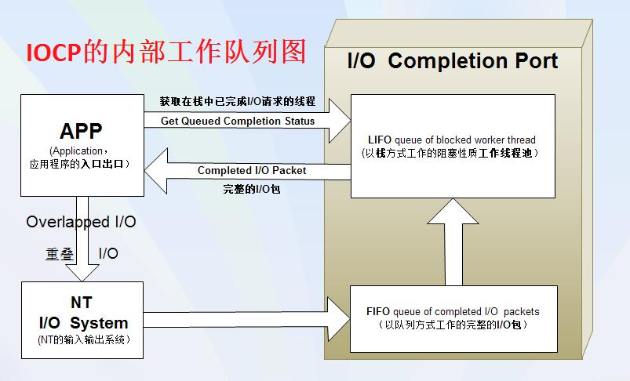
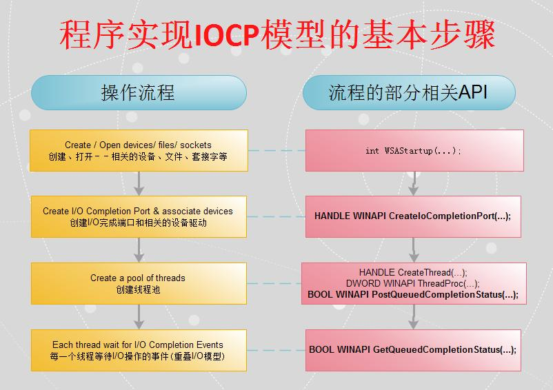
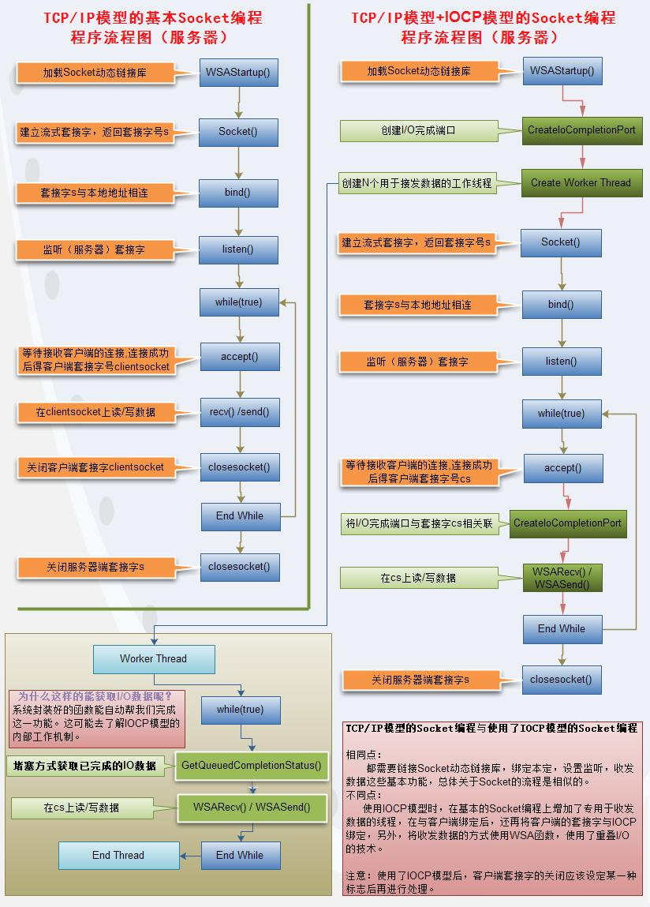
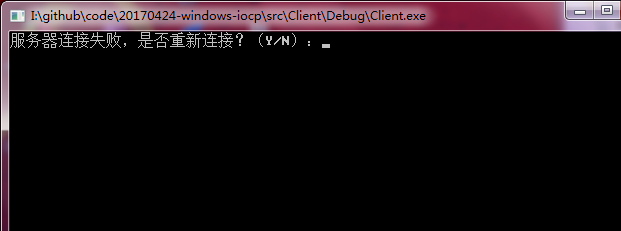
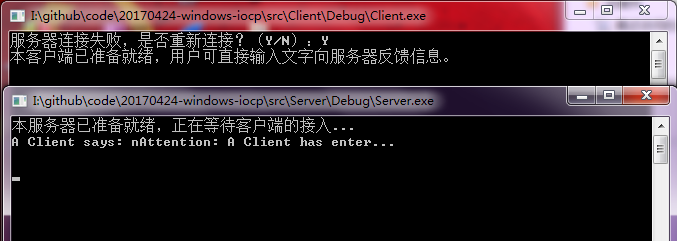
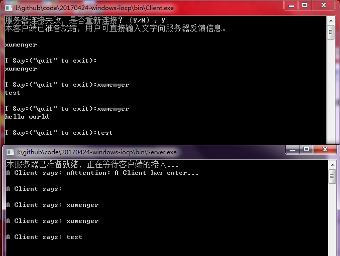

>[《IOCP模型与网络编程》](http://blog.csdn.net/neicole/article/details/7549497)

## 提出相关问题

* IOCP模型是什么？
* IOCP模式是用来解决什么问题的？它为什么存在？
* 使用IOCP模型需要用到哪些知识？
* 如何使用IOCP模型与Socket网络编程结合起来？
* 学会了这个模型以后与我之前写过的简单的Socket程序主要有哪些不同点

## 部分问题探究及解决

>保持怀疑

**什么是IOCP？**

IOCP（IO Completion Port），常称为IO完成端口

**什么是IOCP模型？**

* IOCP模型属于一种通讯模型，适用于（能控制并发执行的）高负载服务器的一个技术
* 通俗点说，就是用于高效处理很多很多的客户端进行数据交换的一个模型

第一个图是IOCP的内部工作队列图（来自文章《IOCP本质论》）

第二个是程序实现IOCP模型的基本步骤（来自《深入解释IOCP》）

第三个是使用IOCP模型及没使用IOCP模型的程序流程图

**IOCP的存在理由（IOCP的优点）及技术相关有哪些？**

之前说过，很通俗地理解可以理解成用于高效处理很多很多的客户端进行数据交换的一种模型，那么，它具有的优点有些什么呢？它到底用到了哪些技术呢？在Windows环境下又如何去使用这些技术来编程呢？它主要使用了哪些API函数呢？

* 使用IOCP模型编程的优点
	* 帮助维持重复使用的内存池（与重叠IO技术有关）
	* 去除删除线程创建/终结负担
	* 利于管理、分配线程，控制并发，最小化的线程上下文切换
	* 优化线程调度，提高CPU和内存缓冲的命中率
* 使用IOCP模型编程涉及到的知识点
	* 同步与异步
	* 阻塞与非阻塞
	* 重叠IO技术
	* 多线程
	* 栈、队列这两种基本的数据结构
* 需要使用的API函数
	* 与SOCKET相关
		* 链接套接字动态链接库：int WSAStartup(...)
		* 创建套接字：SOCKET socket(...)
		* 绑定套接字：int bind(...)
		* 套接字设为监听状态：int listen(...)
		* 接收套接字：SOCKET accept(...)
		* 向指定套接字发送信息：int send(...)
		* 从指定套接字接收信息：int recv(...)
	* 与线程相关
		* 创建线程：HANDLE CreateThread(...)
	* 重叠IO技术相关：
		* 向套接字发送数据：int WSASend(...)
		* 向套接字发送数据包：int WSASendFrom(...)
		* 从套接字接收数据：int WSARecv(...)
		* 从套接字接收数据包：int WSARecvFrom(...)
	* IOCP相关
		* 创建完成端口：HANDLE WINAPI CreateIoCompletionPort(...)
		* 关联完成端口：HANDLE WINAPI CreateIoCompletionPort(...)
		* 获取队列完成状态：BOOL WINAPI GetQueuedCompletionStatus(...)
		* 投递一个队列完成状态：BOOL WINAPI PostQueuedCompletionStatus(...)

## 完整的简单的IOCP服务器与客户端代码示例

对应程序源码参见对应的Sources

测试效果如下

先启动客户端，因为服务端没有启动，所以报错

然后启动服务端，且在客户端输入Y发起重连

然后在客户端输入发送的内容

## 简单总结

客户端编程的时候，还是只需要使用基础的Socket API即可

IOCP相关的使用主要是在服务端，详细的参见我在服务端代码中的注解

关于IOCP，我也从网上搜集了很多文章

* [《高性能服务端漫谈》](https://github.com/xumenger/xumenger.github.crack/tree/master/20170421~20170424-network-program/20170421-1-iocp-epoll)
* [《再谈select, iocp, epoll,kqueue及各种I/O复用机制》](https://github.com/xumenger/xumenger.github.crack/tree/master/20170421~20170424-network-program/20170421-2-select-iocp-epoll-kqueue)
* [《Windows下完成端口移植Linux下的epoll》](https://github.com/xumenger/xumenger.github.crack/tree/master/20170421~20170424-network-program/20170421-3-iocp-usage)
* [《[原创]理解I/O Completion Port》](https://github.com/xumenger/xumenger.github.crack/tree/master/20170421~20170424-network-program/20170424-3-windows-iocp)

## IOCP和select

关于IOCP和select有很多值得比较的地方

IOCP主流的编程模式是

* accept线程
	* 一个专门的线程用于accept客户端连接
	* 在accept线程中，将socket和完成端口进行关联
	* 在accept线程中，调用WSARecv方法，在该新的套接字上投递一个新的WSARecv请求（也可以是写操作）
	* accept线程的主要工作就是完成这个循环
* 工作线程
	* 调用GetQueuedCompletionStatus方法阻塞等待某个socket的IO完成事件，或者超时
	* GetQueuedCompletionStatus完成后，获得IO完成的socket
	* 处理对应的缓冲区中的已经读取好的数据
	* 然后再调用WSARecv在该socket上再投递一个IO请求，等待IO完成
	* 如此循环

select和IOCP的很大的区别是

* IOCP调用GetQueuedCompletionStatus获得一个socket后，内核中已经完成了对该socket的IO操作，比如已经将内核接收区的数据拷贝到指定的缓冲区中了
	* 这主要是关于读IO的描述，写的话，则是你先往用户态缓冲区中放入数据，然后调用WSASend投递一个写请求
	* 然后内核中发现发送缓冲区中可写的时候就会把数据写到接收缓冲区中
	* 写入完成后，你可以通过GetQueuedCompletionStatus获取该事件
* select模式则是在调用select后，获取了可读、可写的socket，然后需要自己再去调用send、recv方法去进行读写
* IOCP是完成了IO之后通知你，你直接去处理IO好的数据
* select是可以进行IO的时候通知你，你先去自己调用IO函数进行IO，然后再去处理IO好的数据

这些是关于IOCP、select的简单讲解。实际的应用中，还需要结合阻塞模式的使用；还需要考虑内核发送缓冲区慢了的情况；还需要考虑内核接收缓冲区中数据不足导致读取的数据不完成的情况，等等特殊情况还都是需要再进行考虑的
