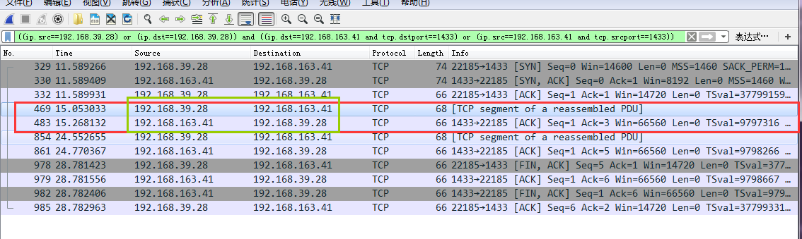

## 背景

最近因为工作的需要，研究如何在Linux上连接到Windows下的SQL Server，但是在安装了ODBC、freetds之后，却无法连接成功。所以就想到用WireShark抓包分析一下原因。结果在Windows上根本抓不到，想去用tcpdump在Linux上抓包，发现tcpdump有很多不熟悉的了，所以这次先去使用telnet来研究WireShark、tcpdump的用法，同时研究深入研究TCP的工作原理

之前有针对WireShark、TCP整理过一些文章：

* [《WireShark抓包分析简单网络问题》](http://www.xumenger.com/tcp-wireshark-20170215/)
* [《使用WireShark分析TCP的三次握手过程》](http://www.xumenger.com/wireshark-tcp-20160716/)
* [《TCP/IP学习笔记：网络协议的层结构》](http://www.xumenger.com/network-1-20161021/)
* [《TCP/IP学习笔记：初识TCP协议》](http://www.xumenger.com/network-2-20161023/)

先说一下环境信息：

```
Linux IP：192.168.39.28

Windows IP：192.168.163.41
在Linux上连接Windows的SQL Server，SQL Server的端口是1433
```

## WireShark/tcpdump分析telnet

首先在Windows上开启WireShark，捕获对应网卡的网络包，然后将过滤条件设置为

```
((ip.src==192.168.39.28) or (ip.dst==192.168.39.28)) and ((ip.dst==192.168.163.41 and tcp.dstport==1433) or (ip.src==192.168.163.41 and tcp.srcport==1433))
```

这样就可以Linux和Windows之间通信的，并且是从Windows的1433端口发送或接收的网络包。刚开始这条TCP连接上没有数据，所以WireShark上不显示任何数据


然后在Linux上开启tcpdump抓包，输入命令

```
tcpdump -i eth0 '((tcp) and (dst host 192.168.163.41 and dst port 1433) or (src host 192.168.163.41 and src port 1433))'
```


这句命令的意思是：抓取经过eth0网卡的TCP协议包，从Windows（192.168.39.28）的1433端口发送或接收的网络包

在Linux上再打开一个终端，执行`telnet 192.168.39.28 1433`连接到Windows，然后在Windows上使用WireShark抓包分析

### 打开连接和关闭连接

执行`telnet 192.168.39.28 1433`之后，这样就建立了TCP连接，然后`Ctrl+]`，继续输入close来关闭连接


熟悉TCP的话，知道建立连接是三次握手、断开连接是四次挥手，可以分别看一下WireShark和tcpdump的抓包结果


>这些都是对包的最简单分析，更深入一点是要思考sck、seq序号变化的规律，思考TCP为什么如此设计，是为了什么样的考虑！！

### 发送数据

重新开启WireShark、tcpdump，同样重启telnet来在两台机器之间发送数据


可以看到对应的TCP报文（前面三次握手和后面四次挥手就不在这里分析了）！


关于telnet的`send ayt`对应可以看到在抓包结果中先有一份从Linux（192.168.39.28）发送到Windows（192.168.163.41）的报文，然后是从Windows返回给Linux的应答报文



>这里只是发送了小数据，可以进一步测试如果发生大量数据，TCP是如何进行分包等处理的；另外既然是研究SQL Server，可以在使用freetds操作SQL Server数据库的时候，抓包，然后用telnet发送类似的包，来通过telnet操作数据库，理论上是可以的，只是难度比较大，到这里不就是一些黑客性质的技术了吗？！

>这里只是熟悉WireShark、tcpdump、telnet的用法，以上的点不在本文研究，不过后续都是有必要好好研究的！

>另外这里也没有详细分析TCP报文的每个字节的内容和含义！

## 参考文章

* [《Linux tcpdump命令详解》](http://www.cnblogs.com/ggjucheng/archive/2012/01/14/2322659.html)
* [《tcpdump非常实用的抓包实例》](http://blog.csdn.net/nanyun2010/article/details/23445223)
* [《telnet 命令使用详解 》](http://blog.chinaunix.net/uid-26167002-id-3054040.html)

## 个人思考

>以上只展示了WireShark、tcpdump、telnet的部分用法，千万不要拘泥于此！

>对于Telnet的认识，不同的人持有不同的观点，可以把Telnet当成一种通信协议，但是对于入侵者而言，Telnet只是一种远程登录的工具。一旦入侵者与远程主机建立了Telnet连接，入侵者便可以使用目标主机上的软、硬件资源，而入侵者的本地机只相当于一个只有键盘和显示器的终端而已

>研究网络、软件调试，一方面是学，另一方面就是用。可以是针对性的调试、抓包，也可以就在平时随手将WireShark、tcpdump打开，抓特定的包，没事就进行分析；打开WinDbg、GDB附到某个进程上，调试、反汇编、分析堆栈、分析线程等，就这样在随手间学习和时间
