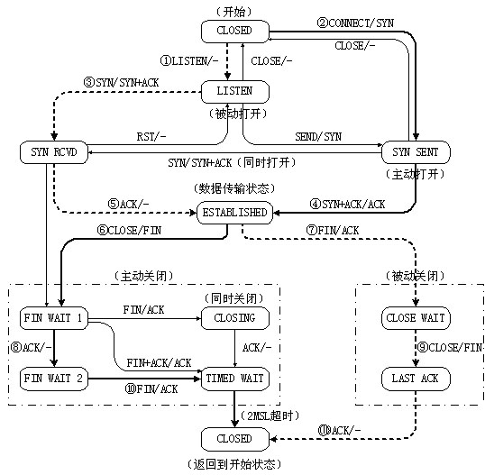
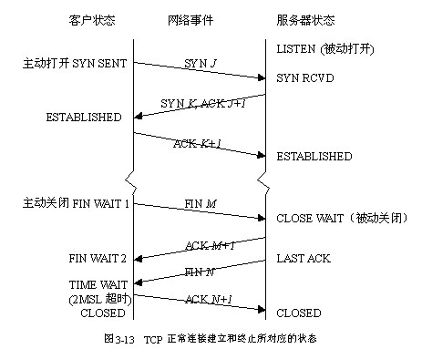
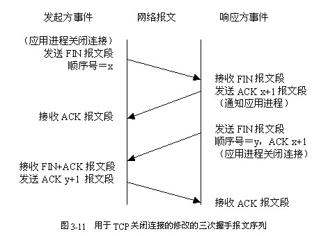

TCP协议的操作可以使用一个具有11中状态的有限状态机来表示

每个连接均开始与CLOSED状态。当一方执行了被动的连接原语（LISTEN）或主动的连接原语（CONNECT）时，它便会脱离CLOSED状态。如果此时另一方执行了相对应的连接原语，连接便建立了，不并且状态变为ESTABLISHED。任何一方均可以首先请求释放连接，当连接被释放后，状态又回到了CLOSED

## TCP状态表

 状态        | 描述            
-------------|-----------------------------------------------------
 CLOSED      | 关闭状态，没有连接活动或正在运行
 LISTEN      | 监听状态，服务器正在等待连接进入
 SYN RCVD    | 收到一个连接请求，尚未确认
 SYN SENT    | 已经发出连接请求，等待确认
 ESTABLISHED | 连接建立，正常数据传输状态
 FIN WAIT 1  | （主动关闭）已经发送关闭请求，等待确认
 FIN WAIT 2  | （主动关闭）收到对方关闭确认，等待对方关闭请求
 TIMED WAIT  | 完成双向关闭，等待所有分组死掉
 CLOSING     | 双方同时尝试关闭，等待对方确认
 CLOSE WAIT  | （被动关闭）收到对方关闭请求，已经确认
 LAST ACK    | （被动关闭）等待最后一个关闭确认，并等待所有分组死掉

## TCP状态机

下图描述了TCP的有限状态机：

* 图中的圆角矩形表示状态
* 箭头表示状态之间的转换（状态的解释参见《TCP状态表》）
* 用粗线表示客户端主动和被动的服务器端建立连接的正常过程
	* 客户端的状态变迁用粗实现
	* 服务器端的状态变迁用粗虚线
* 细线用于不常见的序列，如复位、同时打开、同时关闭等
* 图中的每条状态变换线上均标有“事件/动作”
	* 事件是指用户执行了系统调用（CONNECT、LISTEN、SEND或CLOSE）、收到一个报文段（SYN、FIN、ACK或RST）、或者出现超过两倍最大的分组生命期的情况
	* 动作是指发生一个报文段（SYN、FIN或ACK）或什么也没有（用“-”表示）

## 正常状态转换

下图显示在正常的TCP连接的建立与终止过程中，客户与服务器所经历的不同状态，可以和上图【TCP有限状态机】对比阅读

首先是三次握手建立连接

* 服务器端首先执行LISTEN原语进入被动打开状态（LISTEN），等待客户端连接
* 当客户端的一个应用程序发出CONNECT命令后，本地的TCP实体为其创建一个连接记录并标记为SYN SENT状态，然后给服务器发送一个SYN报文段
* 服务器收到一个SYN报文段，其TCP实体给客户端发送确认ACK报文段，同时发送一个SYN信号，进入SYN RCVD状态
* 客户端收到SYN+ACK报文段，其TCP实体给服务器端发送出三次握手的最后一个ACK报文段，并转换为ESTABLISHED状态
* 服务器收到确认的ACK报文段，完成三次握手，也进入ESTABLISHED状态

在ESTABLISHED状态下，双方可以自由传输数据

当一个应用程序完成数据传输任务后，它需要关闭TCP连接，假设仍由客户端主动发起关闭连接

* 客户端执行CLOSED原语，本地的TCP是以发送一个FIN报文段并等待响应的确认（进入状态FIN WAIT 1）
* 服务器收到一个FIN报文段，它确认客户端的请求发回一个ACK报文段，进入CLOSE WAIT状态
* 客户端收到确认ACK报文段，就转移到FIN WAIT 2状态，此时连接在一个方向上就断开了
* 服务端应用得到通告后，也执行CLOSED原语关闭另一个方向的连接，其本地TCP实体向客户端发送一个FIN报文段，并进入LAST ACK状态，等待最后一个ACK确认报文段
* 客户端收到FIN报文段并确认，进入TIMED WAIT状态，此时双方连接均已断开，但TCP要等待一个2倍报文段最大生存时间MSL（Maximum Segment Lifetime），确保该连接的所有分组全部消失，以防止出现确认丢失的情况。当定时器超时后，TCP删除该连接记录，返回到初识状态（CLOSED）
* 服务器收到最后一个确认ACK报文段，其TCP实体便释放该连接，并删除连接记录，返回到初识状态CLOSED

>陈硕在讲解网络编程的时候一直强调关闭TCP连接是一个更为有难度的点。上面确实看到在关闭连接时TCP的状态机变换也更为复杂！

## 继续讲解TCP的关闭过程

TCP连接建立后，就可以在两个方向传送数据流。当TCP的应用进程再没有数据需要发送时，就发关闭命令

>TCP通过发送控制位`FIN=1`的数据片来关闭本方数据流，但还可以继续接收数据，直到对方关闭那个方向的数据流，连接就关闭

TCP的连接要经历“三次握手”，而TCP关闭连接要经历“四次挥手”。这是因为TCP的半关闭（half-close）造成的。由于一个TCP连接是全双工（即数据在两个方向上能同时传递），因此每个方向必须单独的关闭

>关闭的原则就是当一方完成它的数据发送任务后就能发送一个FIN来终止这个方向的连接。当一段收到一个个FIN，它必须通知应用层另一端已经终止了那个方向的数据传输。发送FIN通知是应用层进行关闭的结果

从一方的TCP来说，连接的关闭有三种情况：

**本方启动关闭**

收到本方应用程序的关闭命令后，TCP在发送完尚未处理的报文段后，发`FIN=1`的报文段给对方，且TCP不再受理本方应用程序的数据发送

在FIN以前发送的数据字节，包括FIN，都需要本方确认，否则要重传

注意FIN也占用一个顺序号，一旦收到对方对FIN的确认以及对方的FIN报文段，本方TCP就对该FIN进行确认，再等待一段时间，然后关闭连接

等待是为了防止本方的确认报文丢失，避免对方的重传报文干扰新的连接

**对方启动关闭**

当TCP收到对方发来的FIN报文时，发ACK确认此FIN报文，并通知应用进程正在关闭

应用进程将以关闭命令响应

TCP在发送完尚未处理的报文段后，发一个FIN报文给对方TCP，然后等待对方对FIN的确认，收到确认后关闭连接

若对方的确认未及时到达，在等待一段时间后也关闭连接

**双方同时启动关闭**

连接双方的应用进程同时发关闭命令，则双方TCP在发送完尚未处理的报文段后，发送FIN报文

各方TCP在FIN前发报文都得到确认后，发ACK确认它收到的FIN

各方在收到对方对FIN的确认后，同样等待一段时间再关闭连接

这称为同时关闭（simultaneous close）

## Socket API和TCP的对应关系

之前我在[01-tcp-connect-send-close](https://github.com/HackerLaboratory/_Crack/blob/master/20170821~2017mmdd-network-program-detail/01-tcp-connect-send-close.md)通过断点调试对Socket API进行了分析，并且使用WireShark抓包详细分析了报文细节

但是我只是对客户端程序进行断点，分析客户端Socket API的网络报文细节。而服务端并没有对应断点调试其Socket API

这是上篇文章中不足之处！

比如我可以使用调试器控制双方进程，让某个进程估计不发送确认等，来模拟一些异常网络场景，再来抓包看TCP的表现

这样进行更细的控制、分析，是很好的理解某个知识点的方法。就像使用WinDbg、GDB来分析进程内存的每个字节一样有效！

>现在经过试验、查资料，对TCP、Socket已经有了很深刻的认知了。但是远远不够，还需要大量的练习、分析各种场景、查阅更多资料、反复学习实践思考，使其烂熟于自己的大脑中！

>至少要达到这样的成对，遇到一种场景，立马能在脑海里绘制出TCP的传输逻辑；比如在面试讨论TCP的时候，能事无巨细的讲解TCP的各种细节、原理、逻辑。惟其如此才是真正的掌握！

## 参考资料

* [《TCP网络关闭的状态变换时序图》](https://coolshell.cn/articles/1484.html)
* [《TCP 状态机》](http://www.cnblogs.com/huntaiji/p/4043967.html)
* [《TCP状态转换图》](http://www.cnblogs.com/qlee/archive/2011/07/12/2104089.html)
* [《TCP/IP协议以及TCP状态机》](http://blog.csdn.net/mrharvey/article/details/20647739)
* [《TCP 的那些事儿（上）》](https://coolshell.cn/articles/11564.html)
* [《TCP 的那些事儿（下）》](https://coolshell.cn/articles/11609.html)

