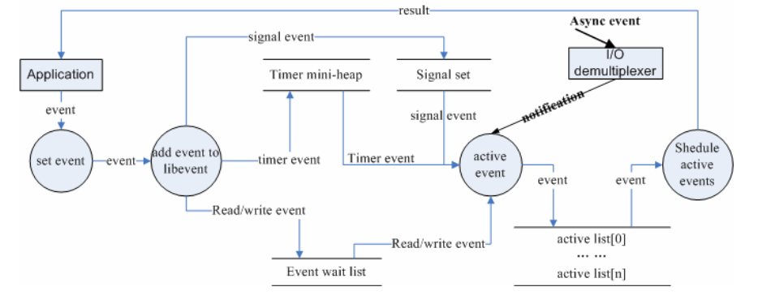

## 前言

学习源代码该从哪里入手？我觉得从程序的基本使用场景和代码的整体处理流程入手是个不错的方法，至少从个人的经验上讲，用此方法分析libevent是比较有效的

## 基本应用场景

基本应用场景也是使用Libevent的基本流程，下面来考虑一个最简单的场景，使用Libevent设置定时器，应用程序只需要执行下面几个简单的步骤即可

**(1)首先初始化Libevent库，并保存返回的指针**

```
struct event_base *base = event_init()
```

实际上这一步相当于初始化一个Reactor实例；在初始化Libevent后，就可以注册事件了

**(2)初始化事件event，设置回调函数和关注的事件**

```
evtimer_set(&ev, timer_cd, NULL);
```

事实上这等价于调用event_set(&ev, -1, 0, timer_cb, NULL);

event_set的函数原型是：

```
void event_set(struct event *ev, int fd, short event, void(*cb)(int, short, void *), void *arg)
```

* ev：执行要初始化的event对象
* fd：该event绑定的“句柄”，对于信号事件，它就是关注的信号
* event，在该fd上关注的事件类型，它可以是`EV_READ`、`EV_WRITE`、`EV_SINGAL`
* cb：这是一个函数指针，当fd上的事件event发生时，调用该函数执行处理，它有三个参数，调用时由event\_base负责传入，按顺序，实际上就是event\_set时的fd、event、和arg
* arg：传递给cb函数指针的参数

由于定时事件不需要fd，并且定时事件是根据添加时（event\_add）的超时值设定的，因此这里event也不需要设置

这一步相当于初始化一个event handler，在Libevent中事件类型保存在event结构体中

>注意，libevent并不会管理event事件集合，这需要应用程序自己管理

**(3)设置event从属的event\_base**

```
event_base_set(&ev, timeout);
```

**(4)是正式的添加事件的时候了**

```
event_add(&ev, timeout);
```

基本信息都已设置完成，只要简单的调用event\_add()函数即可完成，其中timeout是定时值

这一步相当于调用Reactor::register_handler()函数注册事件

**(5)程序进入无限循环，等待就绪事件并执行事件处理**

```
event_base_dispatch(base);
```

## 示例代码

```
struct event ev;
struct timeval tv;

void time_cb(int fd, short event, coid *argc)
{
    printf("timer wakeup\n");
    event_add(&ev, &tv);      //reschedule timer
}

int main()
{
    struct event_base *base = event_init();

    tv.tv_sec = 10;
    tv.tv_usec = 0;
    evtimer_set(&ev, time_cb, NULL);
    event_add(&ev, &tv);
    event_base_dispatch(base);
}
```

## 事件处理流程

当应用程序向libevent注册一个事件后，libevent内部是怎么样进行处理的呢？下面的图就给出了这一基本流程

* 首先应用程序准备并初始化event，设置好事件类型和回调函数；这对应于前面步骤2、3
* 向libevent添加该事件event。对于定时事件，libevent使用一个小根堆管理，key为超时时间；对于Signal的IO事件，libevent将其放入等待链表（wait list）中，这是一个双向链表结构
* 程序调用event\_base\_dispacth()系列函数进入无限循环，等待事件，以select()函数为例，每次循环前，libevent会检查定时事件的最小超时时间tv，根据tv设置select()的最大等待时间，以便于后面及时处理超时事件。当select()返回后，首先检查超时时间，然后检查IO事件

Libevent将所有的就绪事件，放入到激活链表中

然后对激活链表中的事件，调用事件的回调函数执行事件处理



## 小结

本节介绍了libevent的简单实用场景，并旋风般的介绍了libevent的事件处理流程，读者应该对libevent有了基本的印象

下面将会详细介绍libevent的事件管理框架（Reactor模式中的Reactor框架）做详细的介绍
