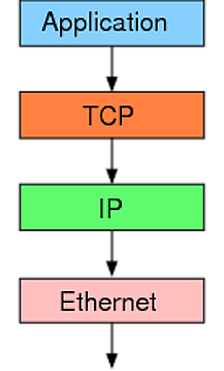
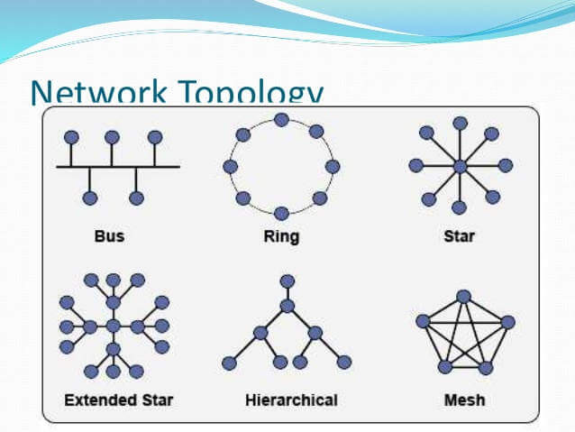
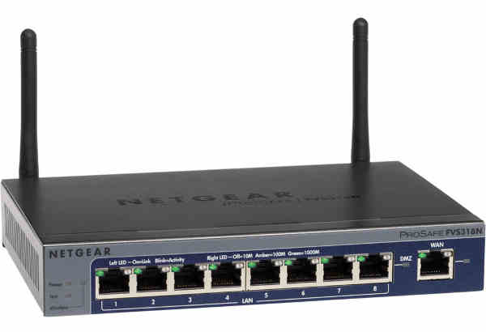
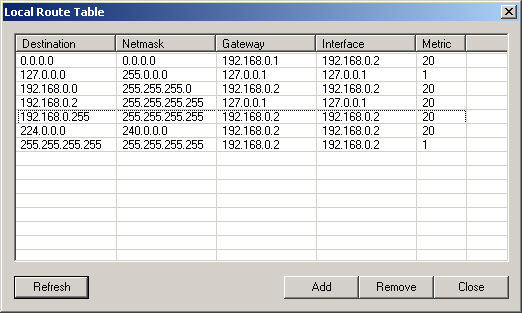
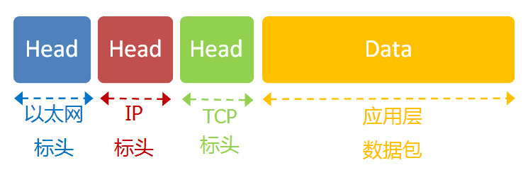
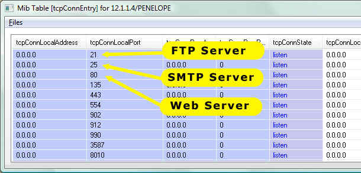
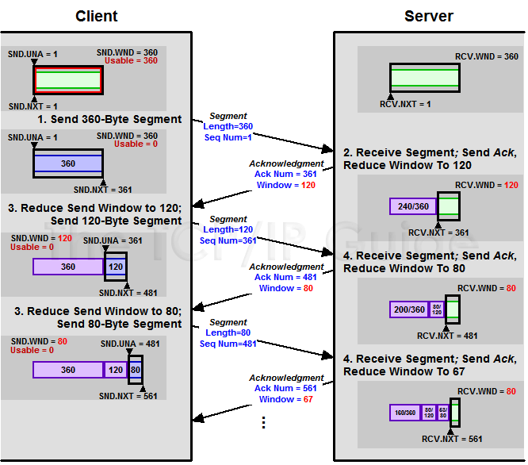
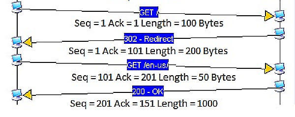
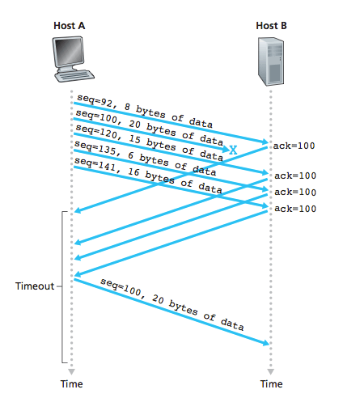

>转抄自[《TCP 协议简介》](http://www.ruanyifeng.com/blog/2017/06/tcp-protocol.html)

TCP是互联网核心协议之一，本文介绍它的基础知识

## TCP协议的作用

互联网由[一整套协议](http://www.ruanyifeng.com/blog/2012/05/internet_protocol_suite_part_i.html)构成。TCP只是其中的一层，有着自己的分工

>图片说明：TCP是以太网协议和IP协议的上层协议，也是应用层协议的下层协议

最底层的以太网协议（Ethernet）规定了电子信号如何组成数据包（packet），解决了子网内部的点对点通信

>图片说明：以太网协议解决了局域网的点对点通信

但是，以太网协议不能解决多个局域网如何互通，这由IP协议解决

>图片说明：IP协议可以连接多个局域网

IP协议定义了一套自己的地址规则，称为IP地址。它实现了路由功能，允许某个局域网的A主机，向另一个局域网的B主机发送消息

>图片说明：路由器就是基于IP协议。局域网之间要靠路由器连接

路由的原理很简单。市场上所有的路由器，背后都有很多网口，要接入多根网线。路由器内部有一张路由表，规定了A段IP地址走出口一，B段地址走出口二，……通过这套“指路牌，实现了数据包的转发

>图片说明：本机的路由表注明了不同IP目的地的数据包，要发送到哪一个网口

IP协议只是一个地址协议，并不保证数据包的完整。如果路由器丢包（比如缓存满了，新进来的数据包就会丢失），就需要发现丢了哪一个包，以及如何重新发送这个包。这就要依靠TCP协议

简单说，TCP协议的作用是，保证数据通信的完整性和可靠性，防止丢包

## TCP数据包的大小

以太网数据包（packet）的大小是固定的，最初是1518字节，后来增加到1522字节，其中1500字节是负载（payload），22字节是头信息（head）

IP数据包在以太网数据包的负载里面，它也有自己的头信息，最少需要20字节，所以IP数据包的负载最多为1480字节

>图片说明：IP数据包在以太网数据里面，TCP数据包在IP数据包里面

TCP数据包在IP数据包的负载里面。它的头信息最少也需要20字节，因此TCP数据包的最大负载是1480-20=1460字节。由于IP和TCP协议往往有额外的头信息，所以TCP负载实际为1400字节左右

因此，一条1500字节的信息需要两个TCP数据包。HTTP/2协议的一大改进，就是压缩HTTP协议的头信息，使得一个HTTP请求可以放在一个TCP数据包里面，而不是分成多个，这样就提高了速度！

>图片说明：以太网数据包的负载是1500字节，TCP数据包的负载在1400字节左右

## TCP数据包的编号（SEQ）

一个包1400字节，那么一次性发送大量数据，就需必须分成多个包。比如，一个10M的文件，需要发送7100多个包

发送的时候，TCP协议为每个包编号（sequence number，简称SEQ），以便接收的一方按照顺序还原。万一发送丢包，也可以知道丢失的是哪一个包

第一个包的编号是一个随机数。为了便于理解，这里就把它称为1号包。假定这个包的负载长度是100字节，那么可以推算出下一个包的编号应该是101。也就是说，每个数据包都可以得到两个编号：自己的编号，以及下一个包的编号。接收方由此知道，应该按照什么顺序将它们还原成原始文件

>图片说明：当前包的编号是45943，下一个数据包的编号是46183，由此可知，这个包的负载是240字节

## TCP数据包的组装

收到TCP数据包以后，组装还原是操作系统完成的。应用程序不会直接处理TCP数据包

对于应用程序来说，不用关心数据通信的细节。除非线路异常，收到的总是完整数据。应用程序需要的数据放在TCP数据包中，有自己的格式（比如HTTP协议）

TCP并没有提供任何机制，表示原始文件的大小，这由应用层的协议来规定。比如，HTTP协议就有一个头信息`Content-Length`，表示信息体的大小。对于操作系统来说，就是持续地接收TCP的数据包，将它们顺序组装好，一个包都不少

操作系统不会去处理TCP数据包里面的数据。一旦组装好TCP数据包，就把它们转交给应用程序。TCP数据包里面有一个端口（port）参数，就是用来指定转交给监听该端口的应用程序

>图片说明：系统根据TCP数据包里面的端口，将组装好的数据转交给相应的应用程序。上图中，21端口是FTP服务器，25端口是SMTP服务，80端口是Web服务器

应用程序收到组装好的原始数据，以浏览器为例，就会根据HTTP协议的`Content-Length`字段正确读出一段段的数据。这也意味这，一次TCP通信可以包括多个HTTP通信

## 慢启动和ACK

服务器发送数据包，当然越快越好，最好是一次性全发出去。但是，发得太快，就有可能丢包。带宽小、路由器过热、缓存溢出等许多因素都会导致丢包。线路不好的话，发得越快，丢得越多

最理想的状态是，在线路允许的情况下，达到最高速率。但是我们怎么知道，对方线路的理想速率是多少呢？答案就是慢慢试

TCP协议为了做到效率与可靠性的统一，设计了一个慢启动（slow start）机制。开始的时候，发送得较慢，然后根据丢包的情况，调整速率：如果不丢包，就加快发送速度；如果丢包，就降低发送速度

Linux内核里面[设定](http://elixir.free-electrons.com/linux/v4.5/source/include/net/tcp.h#L220)了（常量`TCP_INIT_CWND`），刚开始通信的时候，发送方一次性发送10个数据包，即“发送窗口”的大小是10。然后停下来，等待接收对方的确认，再继续发送

默认情况下，接收方每收到[两个](https://serverfault.com/questions/348666/when-the-tcp-engine-decides-to-send-an-ack)TCP数据包，就要[发送](https://stackoverflow.com/a/3604882/1194049)一个确认信息。“确认”的英语是acknowledgement，这个确认消息就简称ACK

ACK携带两个信息：

* 期待要收到下一个数据包的编号
* 接收方的接收窗口的剩余容量

接收方有了这两个信息，再加上自己已经发出的数据包的最新编号，就会推测出接收方大概的接受速度，从而降低或增加发送速率。这被称为“发送窗口”，这个窗口的大小是可变的

>图片说明：每个ACK都带有下一个数据包的编号，以及接收窗口的剩余容量。双方都会发送ACK

注意，由于TCP通信是双向的，所以双方都需要发送ACK。双方的窗口大小，很可能是不一样的。而且ACK只是很简单的几个字段，通常与数据合并在一个数据包里面发送

>图片说明：上图一共4次通信

* 第一次通信：A主机发送给B主机的数据包编号是1，长度是100字节
	* 因此第二次通信B主机的ACK编号是1+100=101
	* 第三次通信A主机的数据包编号也是101
* 同理第二次通信：B主机发送给A主机的数据包编号是1，长度是200字节
	* 因此第三次通信A主机的ACK是201
	* 第四次通信B主机的数据包编号也是201

>重点理解SEQ、ACK这两个东西是如何控制TCP通信的

即使对于带宽很大、线路很好的连接 ，TCP也总是从10个数据包开始慢慢试，过了一段时间以后，才达到最高的传输速率。这就是TCP的慢启动

## 数据包的遗失处理

TCP协议可以保证数据通信的完整性，这是怎么做到的？

前面说过，每一个数据包都带有下一个数据包的编号。如果下一个数据包没有收到，那么ACK的编号就不会发生变化

举例来说，现在收到了4号包，但是没有收到5号包。ACK就会记录，期待收到5号包。过了一段时间，5号包收到了，那么下一轮ACK会更新编号。如果5号包还是没有收到，但是收到6号包或7号包，那么ACK里面的编号不会变化，总是显示5号包。这回导致大量重复内容的ACK

如果发送方发现收到[三个](https://stackoverflow.com/questions/4233851/why-does-tcp-wait-for-three-duplicate-ack-before-fast-retransmit)连续的重复ACK，或者超时了还没有收到任何ACK，就会确认丢包，即5号包遗失了，从而再次发送这个包。通过这种机制，TCP保证了不会有数据包丢失

>图片说明：Host B没有收到100号数据包，会连续发出相同的ACK，触发Host A重发100号数据包
