>最近在做一个数据库SQL修改的任务，趁这个机会对SQL性能优化、SQL的原理进行简单的研究

------

# 一个小的测试

表结构是这样的：表A中有大量的数据（上万条），表B中有10条左右的数据，表1和表2都有一个字段（假设叫colAB）

想要实现这样的SQL：查询A中colAB字段值不在B的colAB列的记录

在PLSQL中执行下面的SQL，准备数据表（没加主键和索引）和基础数据

```
--创建测试数据表
create table tableA(
   colAB number(10), colA1 varchar(10), colA2 varchar(10), colA3 varchar(10), 
   colA4 varchar(10), colA5 number(10), colA6 number(10), colA7 varchar(10)
);

create table tableB(
   colAB number(10), colB1 varchar(10), colB2 number(10)
);

--在表A中模拟10万条数据
declare
  i number;
begin
  i := 0;
  for i in 1..100000 loop
    insert into tableA(
      colAB,
      colA1,
      colA2,
      colA3,
      colA4,
      colA5,
      colA6,
      colA7
    )values(
      mod(i, 10),
      to_char(i),
      to_char(i),
      to_char(i),
      to_char(i),
      i,
      i,
      to_char(i)
    );
  end loop;
end;

--在表B中模拟6条数据
declare
  i number;
begin
  i := 0;
  for i in 1..6 loop
    insert into tableB(
      colAB,
      colB1,
      colB2
    )values(
      i,
      to_char(i),
      i
    );
  end loop;
end;
```

## 方案一：先加载tableB，再在SQL中判断

先执行下面的SQL加载tableB中的colAB的值 

```
select distinct colAB from tableB;
```

加载tableB中的所有colAB的值，然后组成如下格式：1,2,3,4,5,6

然后执行下面的SQL查询A中colAB字段值不在B的colAB列的记录

```
select * from tableA t where t.colAB not in (1,2,3,4,5,6)
```

编写[测试程序](./Sources/test1.zip)，5000次执行上面的SQL

```
procedure TForm1.btnStartTestClick(Sender: TObject);
var
  ConnectString: string;
  Query: TADOQuery;
  Connection: TADOConnection;
  i: Integer;
  StartTime, Time: Cardinal;
begin
  ConnectString := Format(Const_ConnStr, [edtName.Text, edtPasswd.Text, edtDatabase.Text]);
  Query := TADOQuery.Create(nil);
  Connection := TADOConnection.Create(nil);
  Connection.ConnectionString := ConnectString;
  Connection.LoginPrompt := False;
  Connection.Connected := True;
  Query.Connection := Connection;

  StartTime := GetTickCount();
  for i:=1 to 5000 do
  begin
    Query.Close();
    Query.SQL.Clear();
    Query.SQL.Add('select * from tableA t where t.colAB not in (1,2,3,4,5,6) and rownum <=200');
    Query.ExecSQL();
  end;
  Time := GetTickCount() - StartTime;
  
  Query.Close();
  Query.Free();
  Connection.Close();
  Connection.Free();

  ShowMessage(Format('执行5000次SQL，耗时%d毫秒', [Time]));
end;
```

程序执行之前一段时间，系统的CPU和内存情况是这样的

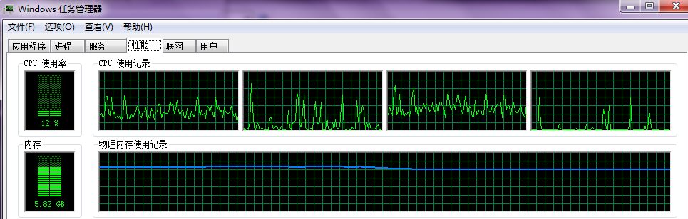

运行过程中查看任务管理器，其CPU和内存情况是这样分布的

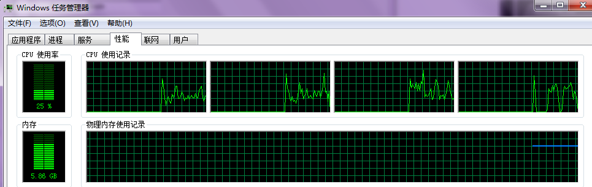

执行5000次查询，共耗时42308ms（约42.3s）

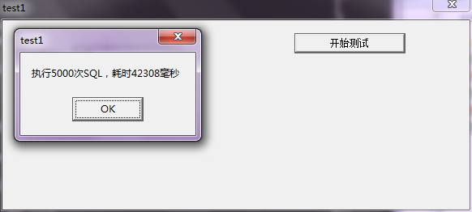

再次测试（重启进程，检查任务管理器是否有进程残留，有的话就先将上一个进程杀死再重启），这次耗时41.4s左右

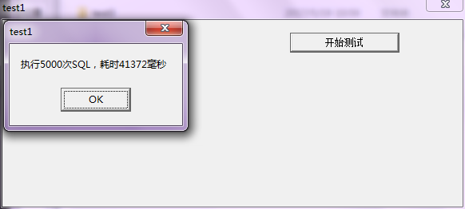

## 方案二：直接在SQL中判断

直接执行下面的SQL查询A中colAB字段值不在B的colAB列的记录

```
select * from tableA t where t.colAB not in (select distinct x.colAB from tableB x)
```

编写[测试程序](./Sources/test2.zip)，5000次执行上面的SQL

```
procedure TForm1.btnStartTestClick(Sender: TObject);
var
  ConnectString: string;
  Query: TADOQuery;
  Connection: TADOConnection;
  i: Integer;
  StartTime, Time: Cardinal;
begin
  ConnectString := Format(Const_ConnStr, [edtName.Text, edtPasswd.Text, edtDatabase.Text]);
  Query := TADOQuery.Create(nil);
  Connection := TADOConnection.Create(nil);
  Connection.ConnectionString := ConnectString;
  Connection.LoginPrompt := False;
  Connection.Connected := True;
  Query.Connection := Connection;

  StartTime := GetTickCount();
  for i:=1 to 5000 do
  begin
    Query.Close();
    Query.SQL.Clear();
    Query.SQL.Add('select * from tableA t where t.colAB not in (select distinct x.colAB from tableB x) and rownum <=200');
    Query.ExecSQL();
  end;
  Time := GetTickCount() - StartTime;
  
  Query.Close();
  Query.Free();
  Connection.Close();
  Connection.Free();

  ShowMessage(Format('执行5000次SQL，耗时%d毫秒', [Time]));
end;
```

程序执行之前一段时间，系统的CPU和内存情况是这样的：

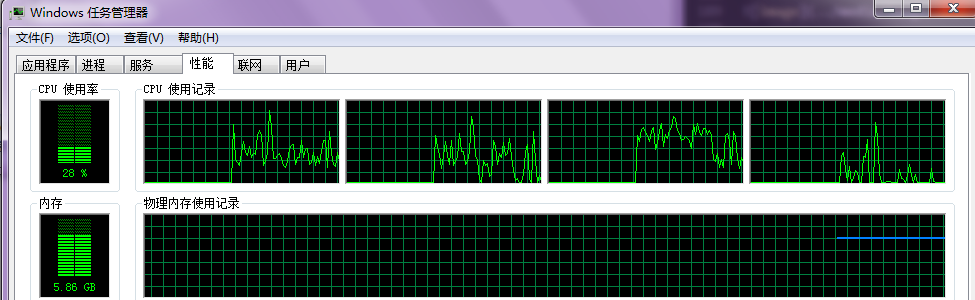

运行过程中查看任务管理器，其CPU和内存情况是这样分布的


执行5000次查询，共耗时44803ms（约44.8s）

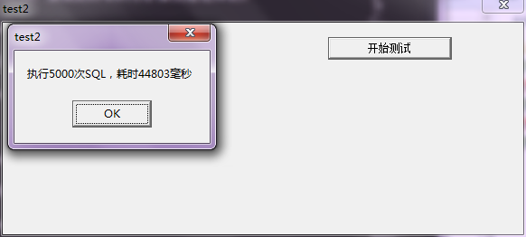

再次测试，这次耗时43.5s左右

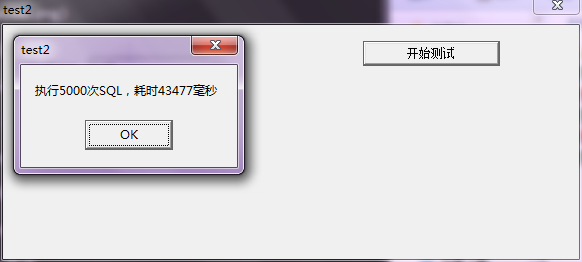

## 补充：更多SQL用法

执行下面的SQL，查询结果为空

```
select * from tableA t where t.colAB not in (null)
```

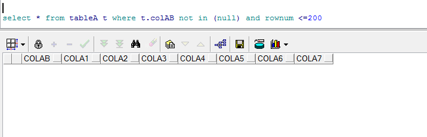

如果将tableB进行`delete from tableB`清空的话，执行下面的SQL结果为

```
select * from tableA t where t.colAB not in (select distinct x.colAB from tableB x)
```

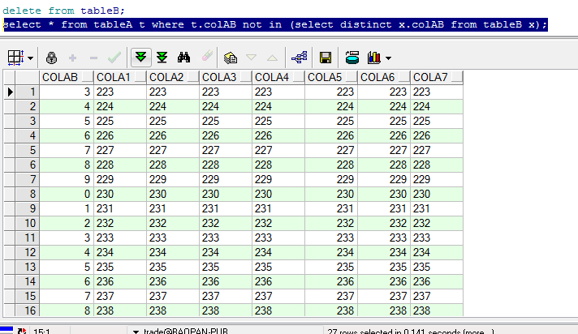

恢复tableB中的数据，实现下面的功能，根据系统参数61533组织SQL

* 如果61533系统参数值为1，表示开启，则需要查询tableA中colAB不在tableB的colAB中的记录
* 如果61533系统参数值为0，表示关闭，直接查询tableA
* 如果没有系统参数61533，表示关闭，直接查询tableA

如果只考虑功能实现，不考虑其他的点（性能、等），实现SQL如下

```
select *
  from tableA t
 where t.colAB not in
       (select distinct x.colAB
          from tableB x where exists (select *
                                      from tsysparameter y
                                     where y.l_serial_no = 61533
                                       and y.vc_value = 1))
```

在系统参数开启的情况下执行结果如下

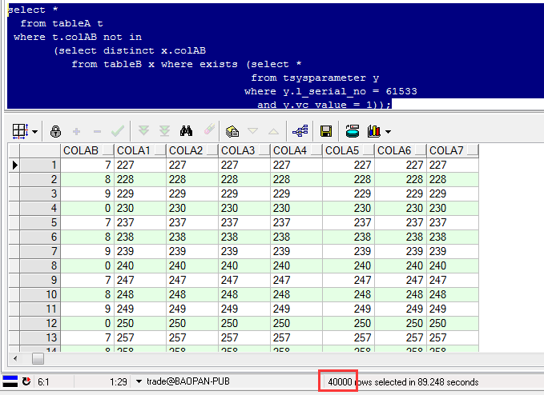

## 测试在SQL中同时判断系统参数的性能

上面提到的需求场景：先判断系统参数，再去根据系统参数判断是否需要关联tableB

以上的方案一、二，分别测试了查询的性能，现在这种场景，测试相同的数据量、相同的数据分布，但是多加一个系统参数的情况，测试其查询性能

测试之前一段时间系统的CPU和内存分布如下

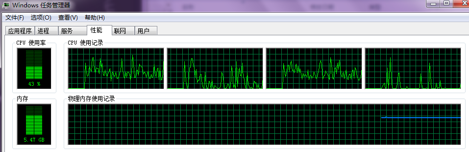

编写程序代码如下

```
procedure TForm1.btnStartTestClick(Sender: TObject);
var
  ConnectString: string;
  Query: TADOQuery;
  Connection: TADOConnection;
  i: Integer;
  StartTime, Time: Cardinal;
begin
  ConnectString := Format(Const_ConnStr, [edtName.Text, edtPasswd.Text, edtDatabase.Text]);
  Query := TADOQuery.Create(nil);
  Connection := TADOConnection.Create(nil);
  Connection.ConnectionString := ConnectString;
  Connection.LoginPrompt := False;
  Connection.Connected := True;
  Query.Connection := Connection;

  StartTime := GetTickCount();
  for i:=1 to 5000 do
  begin
    Query.Close();
    Query.SQL.Clear();
    Query.SQL.Add('select * from tableA t where t.colAB not in (select distinct x.colAB from tableB x where exists (select * from tsysparameter y where y.l_serial_no = 61533 and y.vc_value = 1)) and rownum <= 200');
    Query.ExecSQL();
  end;
  Time := GetTickCount() - StartTime;
  
  Query.Close();
  Query.Free();
  Connection.Close();
  Connection.Free();

  ShowMessage(Format('执行5000次SQL，耗时%d毫秒', [Time]));
end;
```

执行查询5000次耗时43711ms（约43.7s）

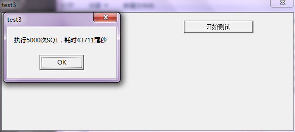

再次执行，5000次查询耗时44.6s

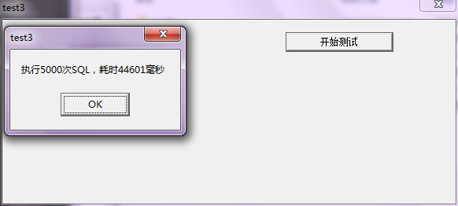

和上面的性能相比，没有多大差别

>真的是表面上看起来这样的吗？

上面这种情况还是多了一个select tsysparameter的SQL逻辑，假设系统参数是不会变化的，那么完全可以用全新的思路实现：

* 提前获取系统参数的值，存放在一个变量中
* 然后在SQL中判断变量值来绝对是否关联tableB

大致的SQL逻辑如下

```
select *
  from tableA t
 where t.colAB not in
       (select distinct x.colAB
          from tableB x where 变量值 = 1)
```

这样至少少了一层每次执行SQL都同时要去加载tsysparameter的逻辑！

这是在Proc这种对SQL格式限制比较严格的语法中，如果是在Delphi中拼接SQL的方式可以这样

```
if 变量值 = 1 then
begin
  sSql := 'select * from tableA t where t.colAB not in (select distinct x.colAB from tableB x) and rownum <=200'
end
else
begin
  sSql := 'select * from tableA t where rownum <=200'
end;
```

这样将在SQL中的判断逻辑移到了代码中，SQL在执行的时候性能会更佳！

## 简单结论

抛去其他可能存在的各种干扰因素，看起来性能差别不大

最终选择第三种方案！一方面SQL更加一致；而且还可以实时判断系统参数；另外可以保证查询过程中tableB的修改会实时在SQL查询结果中得到体现，而不像第一种，一次性加载，如果允许过程中tableB数据变化，完全无法及时更新！

不过上面的测试实在是太肤浅了：

* 没有考虑到数据库的版本的影响
* 没有考虑测试程序机器性能的影响
* 没有考虑数据库服务器性能的影响
* 没有考虑到测试程序和数据库服务器通信的网络部分的影响，假如网络特别不好，所有的测试都被网络条件限制住，SQL本身的性能根本体现不出来！
  * 上面的SQL测试至少包括以下流程：
    * 程序通过网络发送SQL给数据库服务器
    * 数据库服务器解析、执行SQL
    * 将结果通过网络发回给测试程序
  * 所以假如出现极端情况：
    * 一来一回的网络耗时为1000ms
    * 中间三种情况执行sql的分别是1ms、10ms、100ms
    * 真实的性能有10倍、100倍的差距
    * 但是因为上面的测试程序将网络时间包含在内
    * 假如如此情况发生，可能将真实的性能值掩盖
  * 细想一下，发现平时很多时候做性能测试都是很操蛋的
    * 对整个流程中可能影响性能的点都没有梳理清楚，尤其是涉及到网络的
    * 然后就去盲目性能测试、盲目进行性能优化
    * 想想确实操蛋
* 没有仔细看过：约束、索引
* 没有考虑过这个表的数据分布情况，特别是where后面对应这些条件的数据分布
* 没有考虑过表的数据增长情况，一个月、半年、一年后会是什么数据量
* 写完后没有仔细看过执行计划
* 还有更多技术细节没有考虑到，尤其是Oracle执行SQL的底层原理

>以上只是进行的一次对于Oracle的简单的性能测试！在后续会针对数据库性能优化这部分进行深入的研究。将其重要程度放到网络、调试一样的高度！
