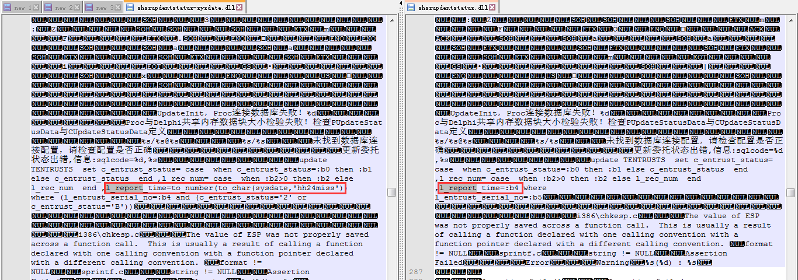

## 背景介绍

在我当前的工作中使用SQL的方式大概有这么几种：

* Delphi下ADO，拼接SQL，执行SQL
* Delphi下ADO，绑定变量
* Visual C++的Proc程序
* Linux下的Proc程序

对应的我也在我的博客里整理了一系列的相关博客

* [《Delphi使用ADO进行数据库编程》](http://www.xumenger.com/delphi-ado-20150825/)
* [《Delphi多线程下的ADO编程》](http://www.xumenger.com/delphi-thread-ado-20151217/)
* [《Delphi使用绑定变量法操作Oracle》](http://www.xumenger.com/z-delphi-oracle-parameter-20160711/)
* [《VC6.0下搭建Proc开发环境》](http://www.xumenger.com/windows-vc-proc-20161014/)
* [《Linux下进行Proc开发》](http://www.xumenger.com/linux-pc-20170516/)

## SQL问题排查

我在[《使用一些特殊的SQL查看Oracle重要信息》](http://www.xumenger.com/oracle-sql-20170309/)整理过如何在Oracle上查看某个进程执行过的SQL，因为当时是出现过这样的场景：

* A版本新上海程序，通过SQL取委托，但将转融通的委托抢上来了
	* 看A版本对应代码中的SQL，确实是做过滤了
	* 但是为什么A版本的dll还是会抢单呢
	* 想通过看程序实际执行的SQL来排查这个问题
* 如果是Delphi的程序来取委托
	* 针对第一种（Delphi拼接SQL）和第二种（Delphi绑定变量）的方式，出现了SQL逻辑的问题，可以通过将SQL语句打印出来的方式进行排查
* 但是这个程序是通过Proc来取委托的
	* Proc程序因为其语法问题，所以没有办法将SQL以日志的方式输出
* 最后经过同事的提醒，想到可以在数据库中查看某个进程执行的SQL

这也就是[《使用一些特殊的SQL查看Oracle重要信息》](http://www.xumenger.com/oracle-sql-20170309/)整理的背景，不管是普通的SQL，还是Proc的SQL，都是可以查看的，只是格式上有些区别，但经过简单的修改都是可以在PLSQL中直接执行来验证SQL逻辑的

## 其他方法

通过查询数据库，可以查看某个进程执行的SQL

后续自己在研究软件调试、逆向分析的时候，初步有接触到可执行文件格式这个领域，所以想到了这样的点：

* 虽然是Proc程序，但是SQL都是写在代码里的
* 源码最终被编译成可执行文件
* 但是具体的SQL还是会在可执行文件里的，应该是在数据段

所以想到了直接使用文本编辑器打开dll、exe程序，是不是可以查看其中的SQL内容

今天正好又遇到了一个SQL的问题，也是Proc程序，直接使用文本编辑器打开，去根据SQL搜索关键字，还真的是可以直接在可执行文件内部查看SQL的内容

## 扩展学习

这里只是简单的讲到这么一个小技巧，背后有以下值得深究的技术领域

* SQL性能优化
* Windows下可执行文件的格式
