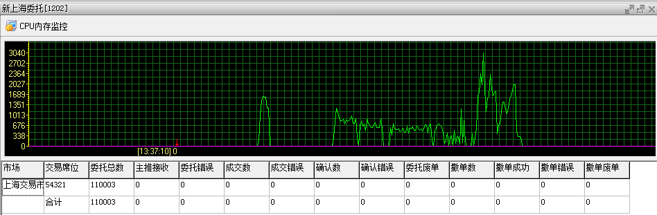
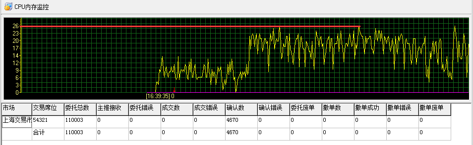
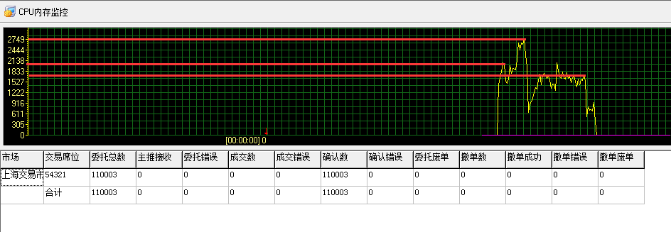
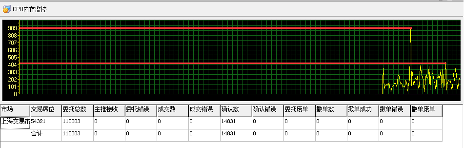
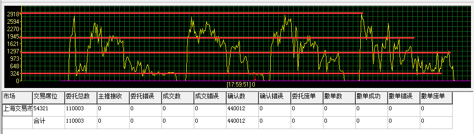
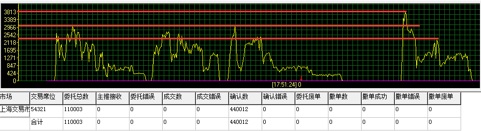
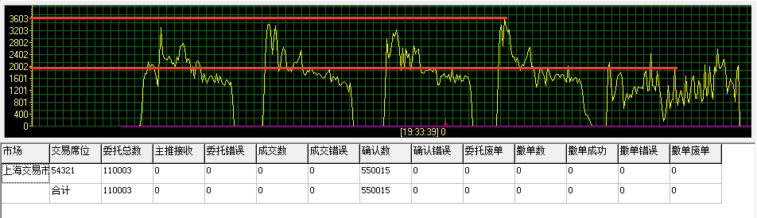
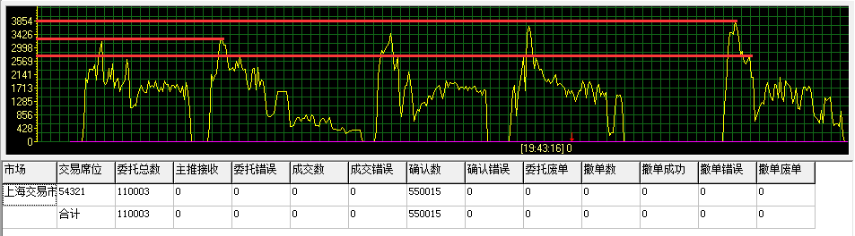
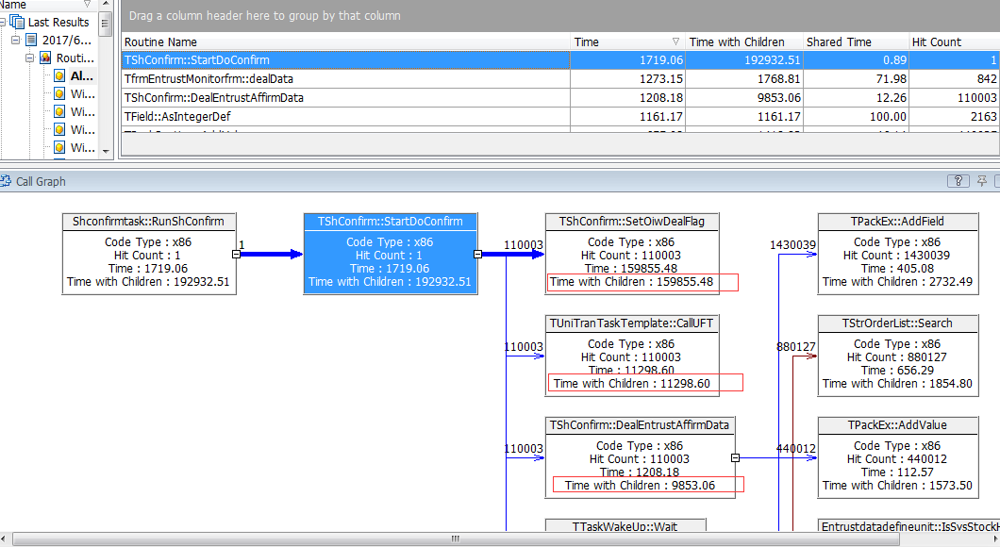
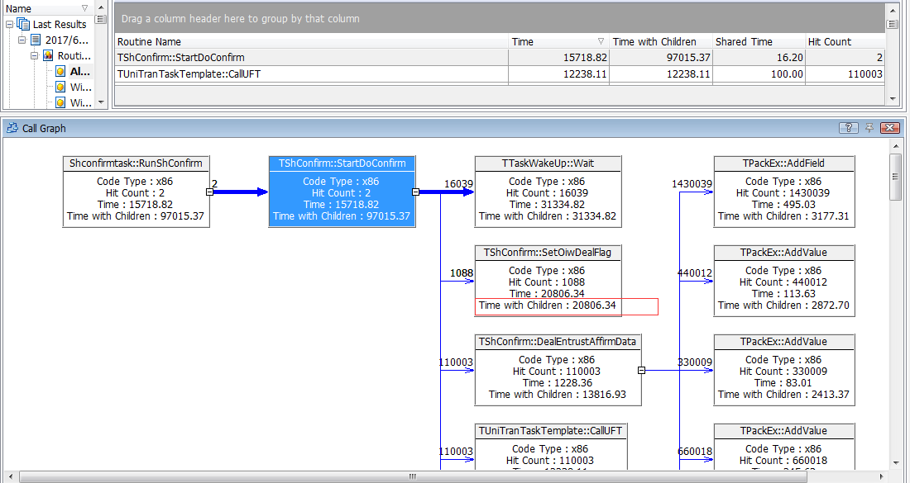

测试新上海的性能。新上海的流程很简单：

* 新上海委托：从Oracle中取委托，写到SQL Server
* 新上海确认/成交：从SQL Server中取回报，更新回Oracle

## 报单性能

先模拟1W笔委托，再模拟10W笔委托，监控界面可以看到其报单性能



然后对这10W笔委托进行确认

## 因为主键问题导致的问题

主要测试调用UFT确认服务情况下报盘的性能！模拟UFT服务直接在原来调用服务的地方返回0，模拟11W条确认来测试性能！分别测试开启日志输出和不开启日志输出情况下的性能

在开启日志级别的情况下，针对11W条记录做确认处理，但是确认处理的很慢，也就20条/s这样



程序内部主要的两个SQL如下两个

```
//从数据库中取出确认数据
select top 200 * from oiw01..ashare_ordwth2 where status1 not in ('A', 'X', 'Y', 'F');

//将处理过的数据进行打标记处理（每次更新单条）
update oiw01..ashare_ordwth2 set status1 = ?? where rec_num = ?? and status1 not in ('X','Y','F');
update oiw01..ashare_ordwth2 set status1 = ?? where rec_num = ?? ;

//批量更新
update oiw01..ashare_ordwth2 set status1 = ??  where rec_num in (??, ??) and status1 not in ('X', 'Y', 'F');
update oiw01..ashare_ordwth2 set status1 = ??  where rec_num in (??, ??) ;
```

程序的逻辑是，A类线程执行select语句从SQL Server取出确认数据放到内存队列，然后执行批量更新语句，将本次取出来的数据更新为待处理；B类线程从队列中取出数据，处理到系统中，然后执行单条更新语句将数据更新为处理完成！

检查一下数据库，发现表的rec_num字段没有添加主键，按照[《How does a relational database work》](http://coding-geek.com/how-databases-work/)里面的讲解，在更新标记的时候，如果rec_num没有索引（主键缺省会建立索引），在10W级别的数据中当然会很慢！

然后为表新增主键（索引），重新测试，根据监控界面，现在性能有明显的提升



## 检查有无索引时的性能对比

为了得到比较真实的数据，在执行这两个SQL的前后分别加日志，对比到底相差到什么程序

没有索引的情况下，运行程序，性能还是只有在20笔/s左右，下面分别是执行select语句和执行update语句的日志输出（日志格式：时间.毫秒[日志级别][线程号]: 日志内容）

```
//执行select语句
165243.214[0][10164]: Select Begin
165243.239[0][10164]: Select End
165244.323[0][10164]: Select Begin
165244.831[0][10164]: Select End
165245.840[0][10164]: Select Begin
165245.912[0][10164]: Select End
165246.565[0][10164]: Select Begin
165246.682[0][10164]: Select End

//执行update语句
165243.239[0][11044]: Set Begin 1
165243.271[0][10164]: Set Begin 7
165243.272[0][5864]: Set Begin 1
165243.500[0][11044]: Set End 1
165243.500[0][11044]: Set Begin 1
165243.583[0][11084]: Set Begin 1
165243.657[0][5864]: Set End 1
165243.657[0][5864]: Set Begin 1
165243.807[0][11044]: Set End 1
165243.808[0][11044]: Set Begin 1
165244.323[0][10164]: Set End 7
165244.432[0][11084]: Set End 1
165244.432[0][11084]: Set Begin 1
165244.531[0][5864]: Set End 1
```

很明显，执行select语句（每次取出200条）的耗时有以下这些情况：25ms、508ms、72ms、127ms等情况，平均也能达到1ms取一笔

再看执行update的情况，`Set Begin 1`是处理确认线程在处理完成后，单条更新为已处理，耗时情况有：261ms、385ms，很显然，这样太慢；`Set Begin 7`是从SQL Server取数据线程在取出200条数据后，批量更新200条记录，按照上面的日志，耗时要1s，也是很慢的

综合起来，读数据线程最多每秒能读200条，因为在批量更新标记的地方是瓶颈；而处理确认线程如果处理耗时为0，但更新每条的标记为100ms这样，所以最多能达到10多条/s，如果开启n条线程，也最多能达到10*n/s，还是太慢

再去看如果加了主键后的性能情况！有点意外，加日志这件事情对性能产生了影响！从原来的2000多/s降到现在的400多/s



先不管日志对性能的影响，去看一下添加了索引后各个SQL的执行耗时情况

```
//取数据SQL
171352.711[0][9716]: Select Begin
171353.248[0][9716]: Select End
171353.391[0][9716]: Select Begin
171353.403[0][9716]: Select End
171353.483[0][9716]: Select Begin
171353.493[0][9716]: Select End
171353.578[0][9716]: Select Begin
171353.590[0][9716]: Select End
171353.673[0][9716]: Select Begin
171353.682[0][9716]: Select End
171353.791[0][9716]: Select Begin
171353.799[0][9716]: Select End
171353.905[0][9716]: Select Begin
171353.917[0][9716]: Select End
171354.005[0][9716]: Select Begin
171354.014[0][9716]: Select End

//更新标记SQL
171353.248[0][11912]: Set Begin 1
171353.249[0][11912]: Set End 1
171353.249[0][11912]: Set Begin 1
171353.249[0][5696]: Set Begin 1
171353.251[0][11912]: Set End 1
171353.251[0][11912]: Set Begin 1
171353.251[0][5696]: Set End 1
171353.251[0][5696]: Set Begin 1
171353.253[0][5696]: Set End 1
171353.254[0][5696]: Set Begin 1
171353.259[0][11912]: Set End 1
171353.259[0][11912]: Set Begin 1
171353.261[0][11912]: Set End 1
171353.261[0][11912]: Set Begin 1
171353.261[0][5696]: Set End 1
171353.261[0][5696]: Set Begin 1
171353.263[0][11912]: Set End 1
171353.263[0][11912]: Set Begin 1
171353.264[0][5696]: Set End 1
171353.265[0][5696]: Set Begin 1
171353.265[0][11912]: Set End 1
...
171353.324[0][9716]: Set Begin 7
...
171353.391[0][9716]: Set End 7
...
171353.472[0][9716]: Set Begin 7
...
171353.483[0][9716]: Set End 7
```

select的性能有提升，按照上面的日志输出，除了第一次执行耗时在537ms，后面的执行一般都是：12ms、10ms

再看update语句，单条执行一般只需要耗时1ms、2ms；批量更新200条耗时，第一次耗时较长，要67ms，后续在10ms左右

所以在添加合适的主键（索引）后，性能有百倍的提升（需要考虑日志输出的影响）！[《How does a relational database work》](http://coding-geek.com/how-databases-work/)中讲到了B+树索引、位图索引、不同的数据分布适用什么索引等。关于数据库调优、索引设置、SQL编写是有很多值得研究和梳理的。这里还只是10W级别的数据，如果处理百万、千万级别的数据明显可以看到数据库设计合理与否对性能的影响是天上地下的

## 继续进行测试

上面看到了索引对性能的影响，另外也看到了日志对性能的影响，下面去掉刚才专门为了查看SQL性能而加的日志，只保留原有的日志，再看一下性能。处理完成后，再将数据库中数据全部更新为未处理，这样程序可以反复有数据处理。不出意外，又提升到2000多/s，又一次证明了日志输出的影响



目前程序中日志是异步输出的：工作线程调用AddLog方法，将日志内容放到内存队列，然后有专门的线程从队列中取出日志写到文件中。所以**既然日志输出影响了工作线程，就说明AddLog（将日志放到队列操作）这个过程很慢，所以这里就涉及到数据结构的影响了，所以接下来又需要对数据结构进行分析了**

现在通过设置日志级别，直接不输出任何的日志，再来看程序的性能，确实有一定幅度的提升







## 分析日志部分的代码

下面是调用AddLog写日志的函数调用顺序

```
//写日志
Flog.AddLog(0, '[2003]Inpara=[%s]', [InPara], '');

//AddLog代码实现
procedure THsWriteLog.AddLog(LogLevel: Integer; StrFormat: string; const Args: array of const;
  MsgType: string; replaceField: string);
var
  msg: PLogMessage;
begin
  if LogLevel > FLogLevel then Exit;
  New(msg);
  msg.MsgType := Trim(MsgType);
  try
    msg.Msg := Format(StrFormat, Args);
  except
    on E: Exception do
    begin
      msg.Msg := '写日志时Format出错,StrFormat=[' + StrFormat + ']';
    end;
  end;
  msg.LogLevel := LogLevel;
  msg.LogTime := Now;
  msg.WCount := 0;
  msg.CurrentThreadID := IntToStr(GetCurrentThreadId);
  msg.replaceField := replaceField;
  LogList.Push(msg);
end;

//加锁队列的Push方法
procedure TMyQueue.Push(pPointer: Pointer);
begin
  EnterCriticalSection(FLock);
  try
    inherited Push(pPointer);
  finally
    LeaveCriticalSection(FLock);
  end;
end;

//队列的Push方法
function TOrderedList.Push(AItem: Pointer): Pointer;
begin
  PushItem(AItem);
  Result := AItem;
end;

//PushItem方法
procedure TQueue.PushItem(AItem: Pointer);
begin
  List.Insert(0, AItem);
end;

//Insert方法
procedure TList.Insert(Index: Integer; Item: Pointer);
begin
  if (Index < 0) or (Index > FCount) then
    Error(@SListIndexError, Index);
  if FCount = FCapacity then
    Grow;
  if Index < FCount then
    System.Move(FList^[Index], FList^[Index + 1],
      (FCount - Index) * SizeOf(Pointer));
  FList^[Index] := Item;
  Inc(FCount);
  if Item <> nil then
    Notify(Item, lnAdded);
end;

```

写日志的地方影响性能主要是这两点：

* 首先申请内存存储日志信息，申请内存是一个稍微耗时的动作
* 放入队列的过程中需要首先加锁，另外其他调用AddLog的线程、写日志线程从队列中取数据也要先加锁，所以这几个线程因为异步写日志的锁会互相影响

其实类似的，从SQL Server中读取确认的线程和处理确认的线程也会互相影响的，因为它们也是通过队列传输数据的，线程1加锁处理的时候，其他线程只能等待这个线程处理完成解锁，所以越多线程共用一个锁相互之间的影响就越大

针对这个问题，可能优化的点是这样的：

* 不要频繁申请释放内存，最好是申请好的堆内存在用完后放到链表中管理，下次从该链表中取，而不用再释放和申请
    * Binary引擎中就是使用循环队列来管理内存的
* 另外就是锁的使用注意事项
    * 一方面是锁的粒度要小，那么加锁-->处理-->解锁的耗时就少，其他线程等待就少
    * 另外就是尽量少的线程共用一个锁，这样一个锁就只能影响更少的线程了

## 进一步优化

进一步的优化过程中发现上面的模拟UFT服务的思路是错误的，直接在程序上行将调用下行接口的地方注释掉，相当于完全把下行注释了！极速服务是快，但是下行解包的处理还是不能省略的

所以合理的模拟UFT服务的方式是，注释我们的下行程序，保留解包的逻辑但是注释掉调用普通服务的地方！

这次因为要解包，所以性能相比于之前就明显降低了！

然后针对这样的程序逻辑进行优化

最终使用ptop、[AQTime](http://www.xumenger.com/delphi-aqtime-20160718/)分析的结果，发现最明显的耗时点（也就是性能瓶颈）在SetOIWDealFlag（将SQL Server中的记录打标记）



所以就应该针对这个点进行优化！

SQL的特点和优化方法：

* 绑定变量法比普通SQL方法快（这个方法对现有程序效果不明显）
* 逐笔打标记修改为批量打标记

结果逐笔更新修改为批量，这次处理时间明显提升了



到目前为止采用这种优化方式是最有效的

## 关于性能、系统的思考

* 找到真正的性能平静点进行优化，否则都是白费功夫
    * 就像上面的瓶颈在SQL Server索引、逐笔更新慢
    * 针对性解决这两个问题性能就有明显提升
    * 如果A点总是耗时10s，B点耗时1ms，那么再怎么针对B调优也没有用
* 针对CPU的优化
    * 针对CPU的优化主要是从汇编执行的角度思考
    * 减少不必要的判断，减少不必要的循环
    * 函数获得想要的结果后及时Exit就赶紧Exit
* 针对内存的优化
    * 主要是内存的管理，不要频繁申请、释放内存
    * 建议对确定使用的内存，事先申请好，持续时候，最后释放
    * 使用循环队列来管理内存，用完先放队列，使用时再从队列取，而不是每次都释放再申请
* 针对网络的优化
    * 协议设计的简单些，保证传输同样的信息使用尽可能少的字节，可以减少对带宽的占用
* 针对磁盘的优化
* 针对数据库的优化
    * 索引、主键
    * 批量处理提交事务，而不是逐条处理
    * 绑定变量法的使用
    * SQL的执行计划的优化处理

>当然还有更多性能优化的策略是我目前所不清楚的！

## 更多思考

很多程序打印的日志信息是有格式的，完全可以使用Python正则表达式去解析数据、然后使用matplotlib绘制图表，将数据可视化！现在日志中有大量的数据，靠人来逐行看这些数据是完全异想天开的，如果能用工具将其可视化将会是很方便的！

这种传统IT的东西，搞来搞去也就是成千最多上万的性能要求，数据量也是极少的，多少有些闭门造车的感觉，确实没啥太大的技术含量

计算机的有前途的未来是：大数据（真正的大数据，至少是上亿的，而不是一个小爬虫爬的那么少的数据量）、真正的高并发、机器学习，这种传统的行业没有啥意思的，对技术人员个人而言也是有发展瓶颈的
