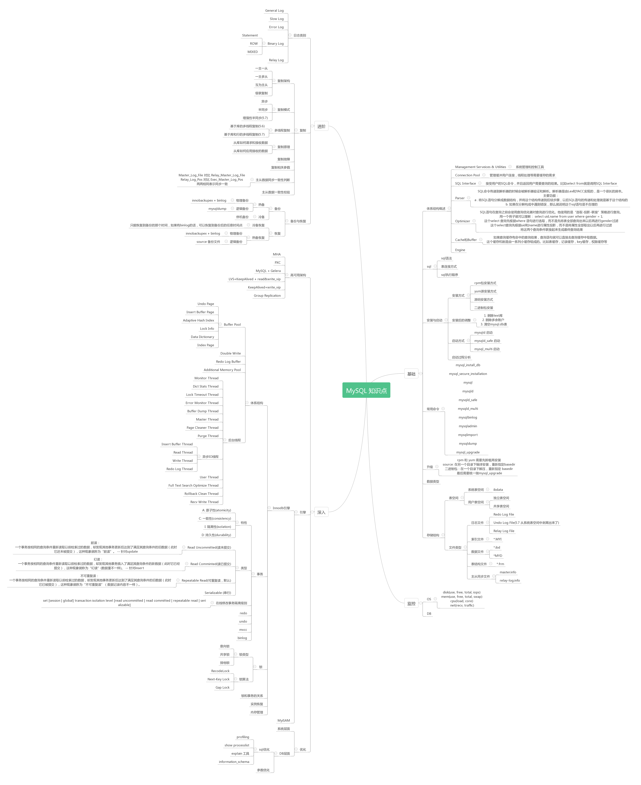

网络上看到[一幅MySQL知识体系的图](https://segmentfault.com/g/1570000010711679/d/1560000010720616)

>但是这张图太大，不方便查看，我这边整理成文字形式。帮助自己对于MySQL有一个总体的了解

# 基础

### 知识体系概述

* Management Serveices & Utilties：系统管理和控制工具
* Connection Pool：管理缓冲用户连接，线程处理等需要缓存的需求
* SQL Interface：接受用户的SQL命令，并且返回用户需要查询的结果。比如select from就是调用SQL Interface
* Parser：SQL命令传递到解析器的时候会被解析器验证和解析
	* 解析器是由Lex和YACC实现的，是一个很长的脚本
	* 功能1：将SQL语句分解成数据结构，并将这个结构传递到后续步骤，以后SQL语句的传递和处理就是基于这个结构的
	* 功能2：如果在分解构成中遇到错误，那么就说明这个SQL语句是不合理的
* Optimizer：SQL语句在查询之前会使用查询优化器对查询进行优化。它使用的是“选取-投影-联接”策略进行查询
	* 用一个例子帮助理解：select uid, name from user where gender=1
	* 这个select查询先根据where语句进行**选取**，而不是先将表全部查询出来后再进行gender过滤
	* 这个select查询先根据uid和name进行属性投影，而不是将属性全部取出以后再进行过滤
	* 将这两个查询条件联接起来生成最终查询结果
* Cache和Buffer：如果查询缓存有命中的查询结果，查询语句就可以直接去查询缓存中取数据
	* 这个缓存机制是由一系列小缓存组成的。比如表缓存、记录缓存、key缓存、权限缓存等
* Engine

### SQL

* SQL语法
* 表连接方式
* SQL执行顺序

### 安装与启动

* 安装方式：
	* rpm包安装方式
	* yum源安装方式
	* 源码安装方式
	* 二进制包安装
* 安装后的调整
	* 删除text库
	* 删除多余账户
	* 情况mysql.db表
* 启动方式
	* mysqld启动
	* mysql\_safe启动
	* mysql\_multi启动
* 启动过程分析

### 常用命令

* mysql\_install\_db
* mysql\_secure\_installation
* mysql
* mysqld
* mysqld\_safe
* mysald\_multi
* mysqlbinlog
* mysqladmin
* mysqlimport
* mysqldump
* mysql\_upgrade

### 升级：

* rpm和yum需先卸载再安装
* source：在另一个目录下编译安装，重新指定basedir
* 二进制包：在一个目录下解压，重新指定basedir
* 最后需要统一做mysql\_upgrade

### 数据类型

### 存储结构

* 表空间
	* 系统表空间：ibdata
	* 用户表空间：
		* 独立表空间
		* 共享表空间
* 文件类型
	* 日志文件
		* Redo Log File
		* Undo Log File（5.7从系统表空间中剥离出来了）
		* Relay Log File
	* 索引文件：\*.MYI
	* 数据文件：
		* \*.ibd
		* \*.MYD
	* 表结构文件：\*.frm
	* 主从同步文件：
		* master.info
		* relay-log.info

# 监控

* OS
	* disk：use、free、total、iops
	* mem：use、free、total、swap
	* cpu：load、core
	* net：recv、traffic
* DB

# 进阶

### 日志类别

* General Log
* Slow Log
* Error Log
* Binary Log
	* Statement
	* ROW
	* MIXED
* Relay Log

### 复制

* 复制架构
	* 一主一从
	* 一主多从
	* 互为主从
	* 级联复制
* 复制模式
	* 异步
	* 半同步
	* 增强性半同步（5.7）
* 多线程复制
	* 基于库的多线程复制（5.6）
	* 基于库和行的多线程复制（5.7）
* 复制原理
	* 从库如何请求和接收数据
	* 从库如何应用接收的数据
* 复制故障
* 复制相关参数
* 主从数据库同步一致性判断
	* Master\_Log\_File对比Relay\_Master\_Log\_file
	* Relay\_|og\_Pos对比Exec\_Master\_Log\_Pos
	* 两两相同表示同步一致
* 主从数据一致性校验

### 备份与恢复

* 备份
	* 热备
		* 物理备份：innobackupex + binlog
		* 逻辑备份：mysaldump
	* 冷备：停机备份
* 恢复
	* 冷备恢复：
		* 只能恢复到备份的那个时间
		* 如果有binlog的话，可以恢复到备份后的任意时间点
	* 热备回复
		* 物理备份：innobackupex + binlog
		* 逻辑备份：source备份文件

# 深入

### 高可用架构

* MHA
* PXC
* MySQL + Gelera
* LVS + KeepAlived + read&write\_vip
* KeepAlived + write\_vip
* Group Replication

### 引擎

* Innodb引擎
	* 体系结构
		* Buffer Pool
			* Undo Page
			* Insert Buffer Page
			* Adaptive Hash Index
			* Lock Info
			* Data Dictionary
			* Index Page
		* Double Write
		* Redo Log Buffer
		* Additional Memory Pool
		* 后台线程
			* Monitor Thread
			* Dict Stats Thread
			* Lock Tomeout Thread
			* Error Monitor Thread
			* Buffer Dump Thread
			* Master Thread
			* Page Cleaner Thread
			* Purge Thread
			* 异步IO线程
				* Insert Buffer Thread
				* Read Thread
				* Write Thread
				* Redo Log Thread
			* User Thread
			* Full Text Search Optimize Thread
			* Rollback Clean Thread
			* Recv Write Thread
	* 事务
		* 特性
			* 原子性（atomicity）
			* 一致性（consistency）
			* 隔离性（isolation）
			* 持久性（durability）
		* 类型
			* Read Uncommitted（读未提交）：一个事务按相同的查询条件重复读取以前检索过的数据，却发现其他事务更新后达到了满足其查询条件的旧数据（此时它还未提交），这种现象被称为“脏读”。--针对update
			* Read Committed（读已提交）：一个事务按相同的查询条件重新读取以前检索过的数据，却发现其他事务插入了满足其查询条件的新数据（此时它已经提交），这个现象称为“幻读”（数据量不一样）。--针对insert
			* Repeatable Read（可重复读，默认）：一个事务按相同的查询条件重新读取以前检索过的数据，却发现其他事务更新后达到了满足其查询条件的旧数据（此时它已被提交），这种现象称为“不可重复读”（数据记录内容不一样）
			* Serializable（串行）
		* 在线修改事务隔离级别：set [session | global] transaction isolation level [read uncommitted | read committed | repeatable read | serializable]
		* redo
		* undo
		* mvcc
		* binlog
	* 锁
		* 锁类型
			* 意向锁
			* 共享锁
			* 排他锁
		* 锁算法
			* RecodeLock
			* Next-Key Lock
			* Gap Lock
	* 锁与事务
	* 实例恢复
	* 内存管理
* MyiSAM

### 优化

* 系统层面
* DB层面
	* SQL优化
		* profiling
		* show processlist
		* explain工具
		* information\_schema
	* 参数优化
