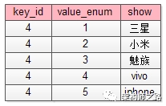
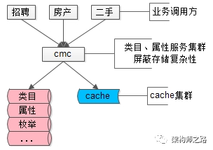
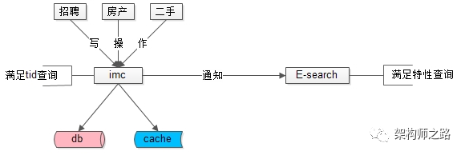
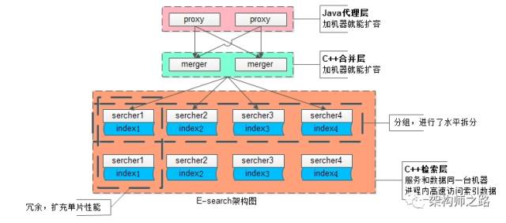
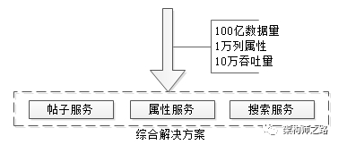

## Tag

version ext 大数据 数据库 百亿 扩展性 索引 

## 背景描述及业务介绍

于version + ext方案，还是有很多朋友质疑“线上不可能这么用”。本篇将讲述一下58同城最核心的数据“帖子”的架构实现技术细节，说明不仅不是“不可能这么做”，而是大数据、可变属性、高吞吐场景下的“常用手段”

**问：什么是数据库扩展的version + ext方案**

>使用ext来承载不同业务需求的个性化属性，使用version来标识ext里各个字段的含义


例如上述user表：

version=0表示ext里是passwd/nick

version=1表示ext里是passwd/nick/age/sex

优点？

* 可以随时动态扩展属性，扩展性好
* 新旧两种数据可以同时存在，兼容性好

不足？

* ext里的字段无法建立索引
* ext里的key值有大量冗余，建议key短一些

**问：什么是58同城最核心的数据？**

58同城是一个信息平台，有很多垂直品类：招聘、房产、二手物品、二手车、黄页等等，每个品类又有很多子品类，不管哪个品类，最核心的数据都是“帖子信息”（业务像一个大论坛？）

**问：帖子信息有什么特点？**

大家去58同城的首页上看看就知道了：

* 每个品类的属性千差万别，招聘帖子和二手帖子属性完全不同，二手手机和二手家电的属性又完全不同，目前恐怕有近万个属性
* 帖子量很大，100亿级别
* 每个属性上都有查询需求（各组合属性上都可能有组合查询需求），招聘要查职位/经验/薪酬范围，二手手机要查颜色/价格/型号，二手要查冰箱/洗衣机/空调
* 查询量很大，每秒几十万级别

如何解决100亿数据量，1万属性，多属性组合查询、10万并发查询的技术难题，是今天要讨论的内容

## 最容易想到的方案

每个公司的发展都是一个从小到大的过程，撇开并发量和数据量不谈，先看看

* 如何实现属性扩展性需求
* 多属性组合查询需求

最开始，可能只有一个招聘品类，那帖子表可能是这么设计的：

```
tiezi(tid, uid, c1, c2, c3)
```

那如何满足各属性之间的组合查询需求呢？最容易想到的就是通过组合索引：

```
index_1(c1,c2) index_2(c2,c3) index_3(c1,c3)
```

随着业务的发展，又新增了一个房产品类，新增了若干个属性，新增了若干组合查询，于是帖子表变成了：

```
tiezi(tid, uid, c1, c2, c3, c10, c11, c12, c13)
```

其中c1、c2、c3是招聘类别属性，c10、c11、c12、c13是房产类别属性，这两块属性一般没有组合查询需求

但为了满足房产类别的查询需求，又要建立了若干组合索引（不敢想有多少个索引能覆盖所有两属性查询、三属性查询）

是不是发现玩不下去了？

## 友商的玩法

新增属性是一种扩展方式，新增表也是一种方式，有友商是这么玩的，按照业务进行垂直拆分：

```
tiezi_zhaopin(tid, uid, c1, c2, c3)
tiezi_fangchan(tid, uid, c10, c11, c12, c13)
```

这些表，这些服务维护在不同的部门，不同的研发同学手里，看上去各业务线灵活性强，这恰恰是悲剧的开始

* tid如何规范？
* 属性如何规范？
* 按照uid来查询怎么办（查询自己发布的所有帖子）？
* 按照时间来查询怎么办（最新发布的帖子）？
* 跨品类查询怎么办（例如首页搜索框）？
* 技术范围的扩展，有的用mongo存储，有的用MySQL存储，有的自研存储
* 重复开发了多少组件
* 维护成本过高
* …………

想想看，电商的商品表，不可能一个类目一个表的

## 58同城的玩法

### 【统一帖子中心服务】

平台型创业型公司，可能有多个品类，例如58同城的招聘房产二手，很多异构数据的存储需求，到底是分还是合？

>无需纠结：基础数据基础服务的统一，无疑是58同城技术路线发展roadmap上最正确的决策之一

如何将不同品类、异构的数据统一存储起来，采用的就是类似version+ext的方式：

```
tiezi(tid, uid, time, title, cate, subcate, xxid, ext)
```

(1)一些通用的字段抽取出来单独存储

(2)通过cate、subcate、xxid等来定义ext是何种含义（和version有点像？）


(3)通过ext来存储不同业务线的个性化需求

例如招聘的帖子

```
ext: {"job":"driver","salary":8000,"location":"bj"}
```

而二手的帖子

```
ext: {"type":"iphone","money":3500"}
```


58同城最核心的帖子数据，100亿的数据量，分256库，异构数据MySQL存储，上层架了一个服务，使用memcached做缓存，就是这样一个简单的架构，一直坚持这么多年。上层的这个服务，就是58同城最核心的统一服务IMC（Information Management Center），请注意这个最核心，是没有之一

解决了海量异构数据的存储问题，遇到的新问题是：

* 每条记录ext内key都需要重复存储，占据了大量的空间，能否压缩存储
* cateid已经不足以描述ext内的内容，品类有层级，深度不确定，ext能够具备自描述性
* 随时可以增加属性，保证扩展性

### 【统一类目属性服务】

每个业务有多少属性，这些属性是什么含义，值的约束等揉不到帖子服务里，怎么办？

58同城的先贤们抽象出一个统一的类目、属性服务，单独来管理这些信息，而帖子库ext字段里json的key，统一由数字来表示，减少存储空间


如上图所示，json的key不再是"salary"、"location"、"money"这样的长字符串了，取而代之的是数字1、2、3、4，这些数字是什么含义、属于哪个子分类、值的校验规则，统一都存储在类目、属性服务里


这个表里对帖子中心服务里ext字段里的数字key进行了解释：

* 1代表job，属于招聘品类下100子分类，其value必须是小于32的[a-z]字符
* 4代表type，属于二手品类下的200子品类，其value必须是short

这样就对原来帖子表exit里的

```
ext : {"1":"drive","2":8000,"3":"bj'}
ext : {"4":"iphone","5":3500}
```

key和value都做了统一约束

除此之外，如果ext里某个key的value不是正则校验的值，而是枚举值时，需要有一个对值进行限定的枚举表来进行校验



这个枚举校验，说明key=4的属性（对应属性表里有二手、手机类型字段），其值不只是要进行“short类型校验”，而是value必须是固定的枚举值

ext : {"4":"iphone","5":3500}这个ext就是不合法的（key=4的value=iphone不合法），合法的应该为ext : {"4":"5","5":3500}

此外，类目属性服务还能记录类目之间的层级关系：

* 一级目录是：招聘、房产、二手……
* 二手下有二级类目：二手家具、二手手机……
* 二手手机下有三级类目：二手iphone、二手小米、二手三星……
* ……



协助解释58同城最核心的帖子数据，描述品类层级关系，保证各类目属性扩展性，保证各属性值合理性校验，就是58同城另一个统一的核心服务CMC（Category Management Center）

多提一句，类目、属性服务像不像电商系统里的SKU扩展服务？

* 品类层级关系，对应电商里的类别层级体系
* 属性扩展，对应电商里各类别商品SKU的属性
* 枚举值校验，对应属性的枚举值，例如颜色：红、黄、蓝

解决了key压缩、key描述、key扩展、value校验、品类层级的问题，还有这样的一个问题没有解决：各品类下帖子的属性各不相同，查询需求各不相同，如何解决100亿数据量、1万属性的查询需求，是58同城面临的新问题

### 【统一检索服务】

数据量很大的时候，不同属性上的查询需求，不可能通过组合索引来满足所有查询需求，怎么办？

>58同城的先贤，从一早就确定了“外置索引，统一检索服务”的技术路线！

* 数据库提供帖子id的正排查询需求
* 所有非“帖子id”的个性化索引需求，统一走外置索引



元数据与索引数据的操作遵循：

* 对帖子进行tid正排查询，直接访问帖子服务
* 对帖子进行修改，帖子服务通过检索服务，同时对索引进行修改
* 对帖子进行复杂查询，通过检索服务满足需求

这个扛起了59同城80%的终端请求（不管是来自PC还是APP，不管是主页、城市页、分类页、列表页、详情页，很可能这个请求最终会是一个检索请求）的服务，就是58同城另一个统一的核心服务E-search，这个搜索引擎的每一行代码都是来自58同城@老崔 @老龚 等先贤们，目前系统维护者，就是“架构师之路”里屡次提到的@龙神

对于这个服务的架构，简单展开说明一下：



为应对100亿级别数据量、几十万级别的吞吐量，业务线各种复杂的复杂检索查询，扩展性是设计重点：

* **统一的Java代理层集群**，其无状态性能够保证增加机器就能扩展系统性能
* **统一的合并层C服务集群**，其无状态性能够保证增加机器就能扩展系统性能
* **搜索内核检索层C服务集群**，服务和索引数据部署在同一机器上，服务启动时可以加载索引数据到内存，请求访问时从内存中load数据，访问速度快
	* 为了满足数据容量的扩展性，索引数据进行了水平切分，增加切分份数，就能够无限扩展性能
	* 为了满足一份数据的性能扩展性，同一份数据进行了冗余，理论上做到增加机器就无限扩展性能

系统时延，100亿级别帖子检索，包含请求分合，拉链求交集，从merger层均可以做到10ms返回

58同城的帖子业务，一致性不是主要矛盾，E-search会定期全量重建索引，以保证及时数据不一致，也不会持续很长的时间

## 总结



文章写了很长，最后做了简单总结，面对100亿数据量，1万列属性，10万吞吐量的业务需求，58同城的经验，是采用了元数据服务、属性服务、搜索服务来解决的
